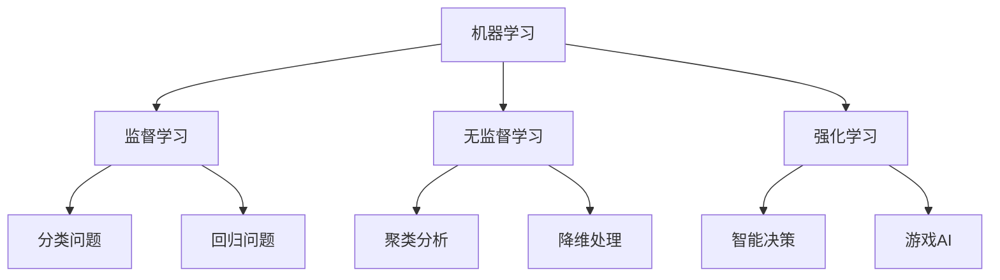

# 🤖 机器学习核心概念

## 📖 本章导读
作为AI测试开发实习生，理解机器学习的基本概念是你工作的基石。本章将用最通俗易懂的方式，带你从零开始理解机器学习的核心思想。

## 🎯 什么是机器学习？

### 大白话解释
**机器学习就是让计算机从数据中学习规律，然后利用学到的规律来预测或决策。**

**类比理解**: 就像教小孩认动物一样：
- 你给小孩看很多猫的图片（数据）
- 小孩从中学习猫的特征（学习规律）
- 以后看到新图片，小孩能认出是不是猫（预测）

### 正式定义
机器学习是一门研究如何让计算机**模拟或实现人类学习行为**的科学，它通过**算法**从**数据**中学习**模式**，然后利用这些模式对新的数据进行**预测**或**决策**。

## 🔄 机器学习三大类型



### 1. 监督学习 (Supervised Learning)
**特点**: 有标签的数据，知道正确答案

**大白话**: 就像有答案的练习题
- 输入: 题目（特征） + 答案（标签）
- 输出: 学会解题的方法

**AI测试开发应用**: 
- 文本分类（判断用户意图）
- 情感分析（正面/负面评价）
- 质量评估（好/坏回答）

### 2. 无监督学习 (Unsupervised Learning)
**特点**: 无标签数据，自己发现规律

**大白话**: 就像没有分类的杂物堆，自己整理归类
- 输入: 只有题目，没有答案
- 输出: 发现数据的内在结构

**AI测试开发应用**:
- 异常检测（发现模型异常输出）
- 用户行为聚类（分析用户群体）
- 数据降维（简化复杂数据）

### 3. 强化学习 (Reinforcement Learning)
**特点**: 通过试错学习，获得奖励

**大白话**: 就像训练宠物，做对给奖励，做错给惩罚
- 输入: 环境状态 + 行动
- 输出: 最优策略

**AI测试开发应用**:
- 对话策略优化
- 推荐系统改进
- 游戏AI测试

## 🧩 机器学习核心概念详解

### 1. 特征 (Features)
**什么是特征**: 描述数据的属性或变量

**大白话**: 就像描述一个人的特征：身高、体重、年龄等

**示例**: 
- 文本数据特征: 词频、句子长度、情感词数量
- 图像数据特征: 颜色、纹理、形状
- 你的工作应用: 测试用例的特征描述

### 2. 标签 (Labels)
**什么是标签**: 我们想要预测的目标值

**大白话**: 问题的答案或结果

**示例**:
- 分类问题: 垃圾邮件/正常邮件（标签）
- 回归问题: 房价（标签）
- 你的工作: 模型回答的质量评分（标签）

### 3. 模型 (Model)
**什么是模型**: 从数据中学到的规律或函数

**大白话**: 学到的"解题公式"或"判断标准"

**示例**:
- 线性模型: y = ax + b（简单规律）
- 神经网络: 复杂的非线性关系
- 你的工作: 评估模型性能的规则

### 4. 训练 (Training)
**什么是训练**: 让模型从数据中学习的过程

**大白话**: 教模型认识规律的过程

**关键步骤**:
1. 准备训练数据
2. 选择算法
3. 调整参数
4. 评估效果

### 5. 预测 (Prediction)
**什么是预测**: 用训练好的模型对新数据进行判断

**大白话**: 用学到的知识解决新问题

**你的工作重点**: 评估预测的准确性和可靠性

## 💡 机器学习在AI测试开发中的重要性

### 为什么你需要懂机器学习？

#### 1. 理解被测对象
- **不了解机器学习的测试工程师**：只能做黑盒测试
- **懂机器学习的测试工程师**：能进行白盒测试，理解模型内部逻辑

#### 2. 设计更好的测试用例
- 知道模型容易在哪些情况下出错
- 能设计针对性的边界测试
- 理解数据偏差对测试结果的影响

#### 3. 开发智能测试工具
- 自动化测试脚本的智能化
- 测试结果的分析和归类
- 异常检测和预警系统

## 🛠️ 实战示例：简单的文本分类

### 场景描述
假设你要测试一个情感分析模型，判断用户评论是正面还是负面。

### 机器学习方法
```python
# 伪代码示例 - 理解思路即可

# 1. 准备训练数据（特征 + 标签）
training_data = [
    ("这个产品很好用", "正面"),
    ("质量太差了", "负面"),
    ("服务态度不错", "正面"),
    # ... 更多数据
]

# 2. 特征提取（将文本转为数字）
def extract_features(text):
    # 提取关键词、情感词等特征
    features = {
        "包含_很好": 1 if "很好" in text else 0,
        "包含_差": 1 if "差" in text else 0,
        "文本长度": len(text)
    }
    return features

# 3. 训练模型（学习规律）
model = train_model(training_data)

# 4. 预测新数据
new_review = "这个产品一般般"
prediction = model.predict(extract_features(new_review))
print(f"预测结果: {prediction}")  # 可能是"中性"
```

### 测试开发角度思考
作为测试工程师，你需要考虑：
- 训练数据的质量如何保证？
- 模型在不同类型文本上的表现？
- 如何设计测试用例覆盖边界情况？

## 🎓 关键知识点总结

### 必须掌握的概念
1. **机器学习三大类型**及其区别
2. **特征工程**的重要性
3. **模型训练**的基本流程
4. **过拟合**和**欠拟合**的概念

### 测试开发特别关注点
1. **数据质量**对模型性能的影响
2. **模型评估指标**的理解和应用
3. **测试集**的构建原则
4. **BadCase**的分析方法

## 🔄 下一步学习建议

1. **深度学习基本原理** - 理解神经网络
2. **LLM评测技术体系** - 直接关联你的工作
3. **PyTorch实战指南** - 掌握工具使用

---
**标签**: #机器学习 #AI测试 #基础概念 #入门指南