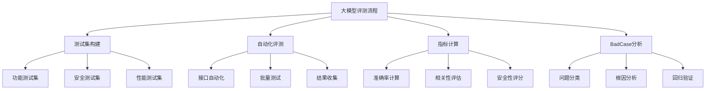

# 🔧 AI测试开发指南

## 📖 本章导读
作为深思考人工智能的AI测试开发实习生，你将专注于大模型评测。本章将系统介绍AI测试开发的核心概念、工作内容和技能要求。

## 🎯 AI测试开发的两大方向详解

### 方向一：大模型评测（你的方向）

#### What - 什么是大模型评测？
**大模型评测**是专门针对大型语言模型(LLM)进行的系统性评估，目的是确保模型在各种场景下的性能、安全性和可靠性。

**大白话理解**: 
- 就像"考试监考老师"，但不是简单判断对错
- 更像是"产品质量检测员"，全面评估模型表现
- 需要设计"考试题目"（测试集）和"评分标准"（评测指标）

#### Why - 为什么需要专门的大模型评测？

**传统软件测试 vs AI模型测试**:

| 对比维度 | 传统软件测试 | AI模型测试 |
|---------|------------|-----------|
| 确定性 | 输入→输出确定 | 输入→输出概率性 |
| 测试用例 | 边界值、等价类 | 语义理解、上下文 |
| 错误类型 | 功能bug、性能问题 | 幻觉、偏见、安全漏洞 |
| 测试方法 | 黑盒/白盒测试 | 多维度综合评估 |

**大模型的特殊挑战**:
1. **幻觉问题**: 模型编造不存在的信息
2. **偏见问题**: 训练数据带来的社会偏见
3. **安全性**: 被恶意利用的风险
4. **一致性**: 相同问题不同回答

#### How - 如何进行大模型评测？



### 方向二：大模型调优/优化

#### What - 什么是大模型调优？
通过技术手段优化模型在特定任务上的表现。

**大白话理解**: 
- 就像"教练训练运动员"，针对特定项目进行专项训练
- 目标是让模型在某个领域表现更好

#### 主要技术方法：
1. **Prompt工程**: 优化输入提示词
2. **Fine-tuning**: 在特定数据上继续训练
3. **RLHF**: 基于人类反馈的强化学习

#### 为什么这个方向不适合现在的你？
- 需要深厚的机器学习理论基础
- 对计算资源要求较高
- 更适合算法工程师而非测试工程师

## 🏢 深思考人工智能的业务特点

### 公司技术栈分析
深思考人工智能专注于：
- **多模态GPT预训练大模型**
- **类脑人工智能核心技术**
- **人机交互技术**

### 对你的工作影响

#### 测试重点领域：
1. **多模态能力测试**
   - 文本+图像理解
   - 跨模态推理
   - 多模态生成

2. **人机交互质量**
   - 对话流畅性
   - 意图理解准确性
   - 响应时效性

3. **类脑特性验证**
   - 推理能力
   - 知识关联
   - 创造性思维

## 🔧 AI测试开发的核心技能要求

### 技术技能栈

```python
# AI测试开发技能金字塔
skills = {
    "基础层": ["Python编程", "Linux基础", "Git版本控制"],
    "核心层": ["机器学习基础", "深度学习原理", "自然语言处理"],
    "工具层": ["PyTorch/TensorFlow", "LangChain", "测试框架"],
    "专业层": ["LLM评测技术", "测试集构建", "自动化评测"],
    "业务层": ["多模态测试", "人机交互评估", "安全测试"]
}
```

### 具体技能详解

#### 1. Python编程能力
**为什么重要**: AI领域的主流编程语言

**需要掌握**:
- 基础语法和数据结构
- 面向对象编程
- 常用库: requests, pandas, numpy
- 异步编程基础

#### 2. 机器学习基础
**为什么重要**: 理解被测对象的工作原理

**需要掌握**:
- 监督/无监督/强化学习概念
- 常见算法原理
- 模型评估指标
- 过拟合/欠拟合

#### 3. 深度学习框架
**为什么重要**: 实际工作中会接触到模型代码

**需要掌握**:
- PyTorch基础使用
- 神经网络基本原理
- 模型加载和推理

#### 4. LangChain应用
**为什么重要**: AI应用开发的主流框架

**需要掌握**:
- Chain的概念和使用
- Prompt模板设计
- 工具调用集成

## 🛠️ 实际工作内容示例

### 日常工作任务

#### 1. 测试集构建
```python
# 示例：构建功能测试集
class FunctionalTestSet:
    def __init__(self):
        self.test_cases = []
    
    def add_question_answer_pair(self, question, expected_answer):
        """添加问答对测试用例"""
        self.test_cases.append({
            "type": "QA",
            "input": question,
            "expected": expected_answer,
            "category": "知识问答"
        })
    
    def add_safety_test(self, malicious_input):
        """添加安全性测试用例"""
        self.test_cases.append({
            "type": "Safety",
            "input": malicious_input,
            "expected": "拒绝回答或安全回应",
            "category": "安全性"
        })
```

#### 2. 自动化评测脚本
```python
# 示例：自动化评测流程
def automated_evaluation(model, test_set):
    """自动化评测函数"""
    results = []
    
    for test_case in test_set:
        # 调用模型接口
        response = model.predict(test_case["input"])
        
        # 计算相似度或准确性
        score = calculate_similarity(response, test_case["expected"])
        
        results.append({
            "test_case": test_case,
            "actual_response": response,
            "score": score,
            "pass": score > threshold
        })
    
    return results
```

#### 3. 核心指标计算
```python
# 示例：指标计算类
class EvaluationMetrics:
    @staticmethod
    def calculate_accuracy(results):
        """计算准确率"""
        passed = sum(1 for r in results if r["pass"])
        return passed / len(results)
    
    @staticmethod
    def calculate_bleu_score(reference, candidate):
        """计算BLEU分数（文本相似度）"""
        # 实现BLEU算法
        pass
    
    @staticmethod
    def safety_score(responses):
        """计算安全性得分"""
        safe_count = sum(1 for r in responses if is_safe(r))
        return safe_count / len(responses)
```

## 🎓 学习路径规划

### 短期目标（1-3个月）
1. **掌握机器学习基础概念**
2. **熟练Python编程和常用库**
3. **理解LLM评测的基本方法**
4. **能够编写简单的测试脚本**

### 中期目标（3-6个月）
1. **深入理解深度学习原理**
2. **掌握PyTorch和LangChain**
3. **能够独立构建测试集**
4. **开发自动化评测工具**

### 长期目标（6个月+）
1. **成为LLM评测专家**
2. **设计企业级评测方案**
3. **带领测试团队**
4. **参与技术决策**

## 💡 重要注意事项

### 技术难点预警
1. **概率性输出的测试挑战**
   - 相同输入可能得到不同输出
   - 需要统计意义上的评估

2. **测试数据的代表性**
   - 如何保证测试集覆盖真实场景
   - 避免测试偏差

3. **评测指标的选择**
   - 不同任务需要不同指标
   - 指标之间的权衡

### 最佳实践建议
1. **从小处着手**: 从简单的功能测试开始
2. **持续学习**: AI技术迭代快，需要不断更新知识
3. **实践导向**: 多动手写代码，少只看理论
4. **文档习惯**: 记录测试过程和发现的问题

## 🔄 下一步行动建议

1. **立即开始**: 学习[[机器学习核心概念]]
2. **工具准备**: 安装Python和必要的库
3. **实践项目**: 尝试编写简单的测试脚本
4. **深入专业**: 学习[[LLM评测技术体系]]

---
**标签**: #AI测试 #LLM评测 #职业发展 #技能要求 #深思考AI