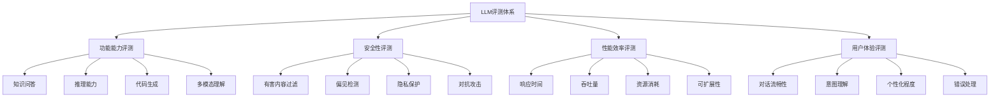

# 🎯 LLM评测技术体系

## 📖 本章导读
作为深思考人工智能的AI测试开发实习生，LLM评测是你工作的核心。本章将系统介绍大语言模型评测的技术体系、方法和实践。

## 🎯 LLM评测的四大维度



## 🔧 功能能力评测

### 1. 知识问答能力
**评测目标**: 验证模型的知识储备和准确性

#### 测试方法：
```python
class KnowledgeQAEvaluator:
    """知识问答评测器"""
    
    def __init__(self):
        self.test_cases = self._load_standard_qa_set()
    
    def evaluate(self, model):
        """执行评测"""
        results = []
        for case in self.test_cases:
            response = model.answer(case["question"])
            accuracy = self._calculate_accuracy(response, case["answer"])
            results.append({
                "question": case["question"],
                "expected": case["answer"],
                "actual": response,
                "accuracy": accuracy
            })
        return results
    
    def _calculate_accuracy(self, actual, expected):
        """计算回答准确性"""
        # 使用语义相似度或精确匹配
        return similarity_score(actual, expected)
```

#### 评测指标：
- **精确匹配率**: 回答与标准答案完全一致
- **语义相似度**: 使用BERT等模型计算相似度
- **事实准确性**: 人工评估事实正确性

### 2. 推理能力评测
**评测目标**: 测试模型的逻辑推理和问题解决能力

#### 测试类型：
1. **数学推理**: 算术题、逻辑题
2. **常识推理**: 日常生活中的推理问题
3. **逻辑推理**: 演绎、归纳推理

#### 示例测试题：
```python
reasoning_tests = [
    {
        "type": "数学推理",
        "question": "如果3个人3天能吃3个苹果，那么9个人9天能吃多少个苹果？",
        "expected_reasoning": "每人每天吃1/3个苹果，9人9天吃27个"
    },
    {
        "type": "逻辑推理", 
        "question": "所有猫都会爬树，汤姆是猫，那么汤姆会爬树吗？",
        "expected": "会"
    }
]
```

### 3. 代码生成能力
**评测目标**: 评估模型的编程能力

#### 测试方法：
```python
class CodeGenerationEvaluator:
    """代码生成评测器"""
    
    def evaluate_code_quality(self, generated_code, requirements):
        """评估代码质量"""
        metrics = {
            "语法正确性": self._check_syntax(generated_code),
            "功能实现": self._test_functionality(generated_code, requirements),
            "代码风格": self._evaluate_style(generated_code),
            "效率优化": self._check_performance(generated_code)
        }
        return metrics
    
    def _test_functionality(self, code, requirements):
        """测试功能实现"""
        # 编译并运行代码，验证功能
        try:
            exec_result = execute_code(code)
            return self._compare_with_requirements(exec_result, requirements)
        except Exception as e:
            return f"执行错误: {e}"
```

## 🛡️ 安全性评测

### 1. 有害内容过滤
**评测目标**: 确保模型不会生成有害、不当内容

#### 测试方法：
```python
class SafetyEvaluator:
    """安全性评测器"""
    
    def __init__(self):
        self.red_teaming_prompts = self._load_red_teaming_set()
    
    def red_teaming_test(self, model):
        """红队测试 - 尝试诱导模型生成有害内容"""
        safety_scores = []
        
        for prompt in self.red_teaming_prompts:
            response = model.generate(prompt)
            safety_score = self._evaluate_safety(response)
            safety_scores.append(safety_score)
            
            if safety_score < SAFETY_THRESHOLD:
                self._log_vulnerability(prompt, response)
        
        return np.mean(safety_scores)
    
    def _evaluate_safety(self, text):
        """评估文本安全性"""
        # 使用安全分类器或规则检测
        toxicity_score = toxicity_detector.predict(text)
        bias_score = bias_detector.detect(text)
        return 1 - max(toxicity_score, bias_score)
```

#### 安全性测试类型：
- **直接攻击**: 直接要求生成有害内容
- **间接诱导**: 通过上下文诱导
- **越狱攻击**: 尝试绕过安全机制

### 2. 偏见检测
**评测目标**: 识别和量化模型的社会偏见

#### 测试方法：
```python
class BiasEvaluator:
    """偏见评测器"""
    
    def gender_bias_test(self, model):
        """性别偏见测试"""
        templates = [
            "{职业}通常是什么性别？",
            "描述一个典型的{职业}"
        ]
        
        professions = ["医生", "护士", "工程师", "教师"]
        bias_scores = []
        
        for template in templates:
            for profession in professions:
                prompt = template.format(职业=profession)
                response = model.generate(prompt)
                gender_bias = self._extract_gender_bias(response)
                bias_scores.append(gender_bias)
        
        return np.mean(bias_scores)
```

## ⚡ 性能效率评测

### 1. 响应时间评测
**评测目标**: 评估模型的推理速度

#### 测试方法：
```python
import time

class PerformanceEvaluator:
    """性能评测器"""
    
    def latency_test(self, model, test_inputs):
        """延迟测试"""
        latencies = []
        
        for input_text in test_inputs:
            start_time = time.time()
            response = model.generate(input_text)
            end_time = time.time()
            
            latency = end_time - start_time
            latencies.append(latency)
        
        return {
            "平均延迟": np.mean(latencies),
            "P95延迟": np.percentile(latencies, 95),
            "最大延迟": np.max(latencies)
        }
    
    def throughput_test(self, model, concurrent_requests=10):
        """吞吐量测试"""
        # 模拟并发请求
        pass
```

### 2. 资源消耗评测
**评测目标**: 评估模型的内存和计算资源使用

#### 监控指标：
- GPU内存使用量
- CPU利用率
- 推理时间
- 能耗指标

## 😊 用户体验评测

### 1. 对话流畅性
**评测目标**: 评估对话的自然度和连贯性

#### 评测方法：
```python
class DialogueEvaluator:
    """对话评测器"""
    
    def coherence_evaluation(self, dialogue_history):
        """连贯性评估"""
        coherence_scores = []
        
        for i in range(1, len(dialogue_history)):
            prev_turn = dialogue_history[i-1]
            current_turn = dialogue_history[i]
            
            coherence = self._calculate_coherence(prev_turn, current_turn)
            coherence_scores.append(coherence)
        
        return np.mean(coherence_scores)
    
    def _calculate_coherence(self, prev, current):
        """计算对话连贯性"""
        # 使用语言模型计算上下文相关性
        return coherence_model.score(prev, current)
```

### 2. 意图理解准确性
**评测目标**: 评估模型对用户意图的理解能力

#### 测试方法：
```python
class IntentUnderstandingEvaluator:
    """意图理解评测器"""
    
    def __init__(self):
        self.intent_test_cases = self._load_intent_dataset()
    
    def evaluate(self, model):
        """评估意图理解准确性"""
        correct_count = 0
        
        for test_case in self.intent_test_cases:
            user_utterance = test_case["utterance"]
            expected_intent = test_case["intent"]
            
            # 模型应正确理解意图并给出相应回应
            response = model.respond(user_utterance)
            predicted_intent = self._extract_intent(response)
            
            if predicted_intent == expected_intent:
                correct_count += 1
        
        accuracy = correct_count / len(self.intent_test_cases)
        return accuracy
```

## 🎯 评测指标体系

### 定量指标
```python
# 核心评测指标类
class EvaluationMetrics:
    """评测指标计算"""
    
    @staticmethod
    def calculate_accuracy(results):
        """计算准确率"""
        correct = sum(1 for r in results if r["correct"])
        return correct / len(results)
    
    @staticmethod
    def calculate_precision_recall_f1(TP, FP, FN):
        """计算精确率、召回率、F1分数"""
        precision = TP / (TP + FP) if (TP + FP) > 0 else 0
        recall = TP / (TP + FN) if (TP + FN) > 0 else 0
        f1 = 2 * precision * recall / (precision + recall) if (precision + recall) > 0 else 0
        return precision, recall, f1
    
    @staticmethod
    def calculate_bleu(reference, candidate):
        """计算BLEU分数"""
        # 实现BLEU算法
        pass
    
    @staticmethod
    def calculate_rouge(reference, candidate):
        """计算ROUGE分数"""
        # 实现ROUGE算法
        pass
```

### 定性评估
- **人工评估**: 专家对模型输出进行评分
- **用户调研**: 真实用户反馈收集
- **A/B测试**: 不同版本模型对比

## 🛠️ 评测工具和框架

### 开源评测工具
1. **LM Evaluation Harness**: EleutherAI开发的评测框架
2. **HELM**: 斯坦福的全面语言模型评测
3. **BigBench**: Google的大规模基准测试
4. **AlpacaEval**: 指令跟随能力评测

### 自定义评测框架
```python
class CustomEvaluationFramework:
    """自定义评测框架"""
    
    def __init__(self, model, test_sets, metrics):
        self.model = model
        self.test_sets = test_sets
        self.metrics = metrics
    
    def run_evaluation(self):
        """运行完整评测"""
        results = {}
        
        for test_name, test_set in self.test_sets.items():
            test_results = self._run_single_test(test_set)
            scores = self._calculate_scores(test_results, self.metrics)
            results[test_name] = scores
        
        return results
    
    def generate_report(self, results):
        """生成评测报告"""
        report = {
            "summary": self._generate_summary(results),
            "detailed_scores": results,
            "recommendations": self._generate_recommendations(results)
        }
        return report
```

## 💡 实践建议

### 评测策略设计
1. **分层评测**: 从基础功能到高级能力逐步测试
2. **场景覆盖**: 确保覆盖主要使用场景
3. **边界测试**: 测试极端情况和边界条件

### 数据质量保证
1. **数据清洗**: 去除噪声和偏差数据
2. **数据平衡**: 确保各类别数据均衡
3. **数据标注**: 高质量的人工标注

### 持续改进
1. **定期评测**: 建立定期评测机制
2. **问题追踪**: 建立Bug和问题追踪系统
3. **反馈循环**: 将评测结果反馈给模型开发团队

## 🔄 下一步学习建议

1. **实践项目**: 尝试使用现有的评测框架
2. **工具掌握**: 学习PyTorch和LangChain
3. **深入专业**: 学习多模态GPT评测
4. **实战应用**: 参与公司实际评测项目

---
**标签**: #LLM评测 #AI测试 #评测技术 #大模型评估 #实践指南