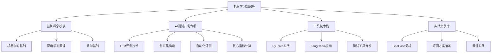

# 🧠 机器学习与AI测试开发知识库

## 📚 知识库结构

## 🎯 学习路径建议

### 阶段一：机器学习基础（1-2周）
- 理解基本概念和数学原理
- 掌握常见算法和模型
- 建立AI思维模式

### 阶段二：AI测试开发专项（2-3周）
- 学习LLM评测技术
- 掌握测试工具开发
- 实践自动化评测

### 阶段三：实战进阶（持续）
- 参与实际项目
- 优化评测方案
- 技术深度挖掘

## 🔗 快速导航

- [[机器学习核心概念]] - 基础理论入门
- [[AI测试开发指南]] - 专项技术学习
- [[LLM评测实践]] - 实战应用指导
- [[工具技术栈]] - 开发环境搭建

---
*本知识库专为AI测试开发实习生设计，聚焦大模型评测方向*