# 🧭 机器学习知识库导航地图 (MOC)

## 📋 目录结构概览

```mermaid
	 graph TD        
	    A[机器学习知识库] --> B[📚 基础理论]
	    A --> C[🔧 AI测试开发]
	    A --> D[⚙️ 工具技术]
	    A --> E[🚀 实战应用]
	    A --> F[🏷️ 标签系统]
	    
	    B --> B1[机器学习基础概念]
	    B --> B2[深度学习原理]
	    B --> B3[数学基础要求]
	    B --> B4[算法模型详解]
	    
	    C --> C1[LLM评测技术体系]
	    C --> C2[测试集构建方法]
	    C --> C3[自动化评测框架]
	    C --> C4[核心指标计算]
	    C --> C5[BadCase分析与回归]                                  
	    
	    D --> D1[PyTorch实战指南]      
	    D --> D2[LangChain应用开发]      
	    D --> D3[测试工具开发]
	    D --> D4[评测平台搭建]
	    
	    E --> E1[深思考AI产品评测]
	    E --> E2[多模态GPT评测]
	    E --> E3[人机交互测试]
	    E --> E4[最佳实践案例]
	    
	    F --> F1[#机器学习]
	    F --> F2[#AI测试]    
	    F --> F3[#LLM评测]    
	    F --> F4[#PyTorch]    
	    F --> F5[#LangChain]
```

## 🎯 核心学习模块  
  

### 1. 基础理论模块
- [[机器学习核心概念]] - 从零开始理解AI
- [[深度学习基本原理]] -  神经网络与反向传播 
- [[机器学习数学基础]] - 必备的数学知识
- [[常见算法模型]] - 监督/无监督/强化学习

### 2. AI测试开发专项
- [[AI测试开发指南]] - 测试工程师的AI转型
- [[LLM评测技术体系]] - 大模型评估方法论
- [[测试集构建实战]] - 高质量数据集的创建
- [[自动化评测框架]] - 效率提升的关键
- [[核心指标计算]] - 量化评估模型性能
- [[BadCase分析与回归]] - 问题定位与解决

### 3. 工具技术栈
- [[PyTorch实战指南]] - 深度学习框架掌握
- [[LangChain应用开发]] - AI应用开发利器                                                  
- [[测试工具开发]] - 自定义评测工具
- [[评测平台搭建]] - 企业级解决方案

### 4. 实战应用案例
- [[深思考AI产品评测]] - 公司实际项目
- [[多模态GPT评测]] - 前沿技术实践
- [[人机交互测试]] - 用户体验评估
- [[最佳实践案例]] - 经验总结分享

## 🔄 学习路径建议

### 新手入门路径（0-3个月）
1. **第一周**: 学习[[机器学习核心概念]]
2. **第二周**: 掌握[[AI测试开发指南]]
3. **第三周**: 实践[[测试集构建实战]]
4. **第四周**: 学习[[PyTorch实战指南]]基础

### 进阶提升路径（3-6个月）
1. **深度学习**: [[深度学习基本原理]]
2. **评测技术**: [[LLM评测技术体系]]
3. **工具开发**: [[测试工具开发]]
4. **实战应用**: [[深思考AI产品评测]]

### 专家成长路径（6个月+）
1. **技术深度**: [[核心指标计算]]高级应用
2. **架构设计**: [[评测平台搭建]]
3. **创新研究**: [[多模态GPT评测]]前沿
4. **团队引领**: [[最佳实践案例]]总结

## 🏷️ 标签系统使用指南

### 核心标签分类
- `#机器学习` - 基础理论相关
- `#AI测试` - 测试开发专项
- `#LLM评测` - 大模型评估
- `#PyTorch` - 深度学习框架                      
- `#LangChain` - AI应用开发        
- `#实战案例` - 项目经验分享
- `#技术难点` - 重点难点解析
- `#最佳实践` - 经验总结

### 标签使用示例
- 学习PyTorch时使用: `#PyTorch #机器学习`  
- 开发评测工具时使用: `#AI测试 #测试工具开发`
- 分析BadCase时使用: `#LLM评测 #技术难点`

## 📈 知识库更新日志

- **2024-12-31**: 知识库初始版本创建
- 持续更新中...

---
**下一步建议**: 从[[机器学习核心概念]]开始你的学习之旅！