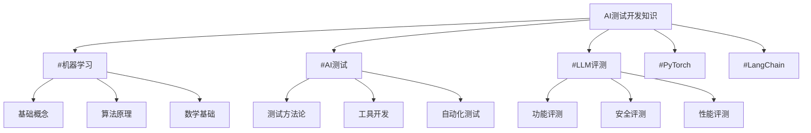
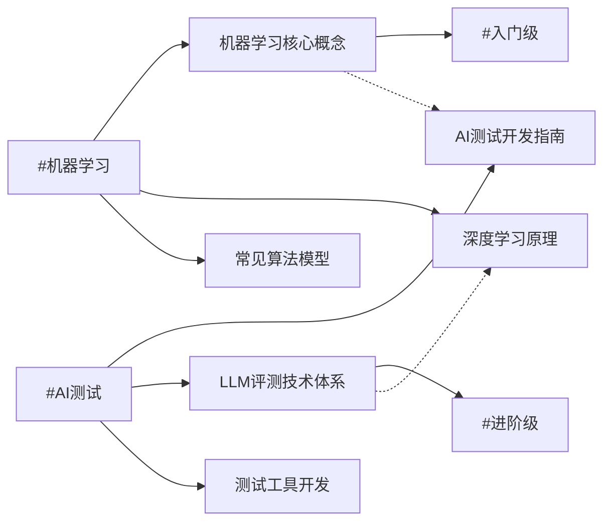

# 🏷️ 标签系统使用指南

## 📖 本章导读
标签系统是Obsidian知识库的核心功能，能够实现知识的智能关联和快速检索。本章将详细介绍如何有效使用标签系统来组织你的机器学习知识库。

## 🎯 标签系统的重要性

### 为什么需要标签系统？

**传统文件夹分类的局限性**:
- 一个文档只能属于一个文件夹
- 难以处理跨领域的知识
- 检索效率低下

**标签系统的优势**:
- 一个文档可以有多个标签
- 实现知识的网状关联
- 支持智能检索和推荐

### 标签系统在AI测试开发中的价值



## 🏷️ 核心标签分类体系

### 1. 技术领域标签

#### 基础理论标签
- `#机器学习` - 机器学习基础概念和原理
- `#深度学习` - 神经网络和深度学习
- `#自然语言处理` - NLP相关技术
- `#计算机视觉` - 图像处理和理解
- `#强化学习` - 强化学习算法和应用

#### 工具技术标签
- `#PyTorch` - PyTorch深度学习框架
- `#TensorFlow` - TensorFlow框架                                                                                                                                                                                                      
- `#LangChain` - LangChain应用开发
- `#HuggingFace` - Transformers库和模型
- `#OpenAI` - OpenAI API和相关技术

#### 测试开发标签
- `#AI测试` - AI测试开发方法论
- `#LLM评测` - 大语言模型评测技术
- `#自动化测试` - 测试自动化框架
- `#测试工具` - 测试工具开发
- `#质量保障` - 质量管理和保障

### 2. 应用场景标签

#### 业务领域标签
- `#多模态AI` - 多模态人工智能应用
- `#人机交互` - 人机交互技术评测
- `#智能客服` - 客服系统测试
- `#内容生成` - 文本/图像生成评测
- `#知识问答` - 问答系统评估

#### 公司特定标签
- `#深思考AI` - 公司特定业务和技术
- `#类脑AI` - 类脑人工智能技术
- `#GPT评测` - GPT模型评测实践
- `#产品测试` - 具体产品测试案例

### 3. 难度级别标签

#### 学习阶段标签
- `#入门级` - 适合初学者的内容
- `#进阶级` - 需要一定基础的内容
- `#专家级` - 高级技术和深度分析
- `#实战案例` - 实际项目经验分享

#### 内容类型标签
- `#概念解析` - 理论概念详细解释
- `#代码示例` - 包含具体代码实现
- `#最佳实践` - 经验总结和最佳实践
- `#问题解决` - 具体问题解决方案
- `#工具使用` - 工具和框架使用指南

## 🔗 标签使用规范

### 标签命名规范

#### 基本原则
1. **简洁明确**: 使用简洁的词语表达核心概念
2. **一致性**: 相同概念使用相同标签
3. **层次性**: 建立标签的层次关系

#### 命名示例
```
# 好的标签命名
#机器学习
#AI测试
#LLM评测
#PyTorch实战

# 避免的标签命名
#machine_learning  # 使用中文
#AI测试开发技术   # 过于具体
#测试              # 过于宽泛
```

### 标签组合使用

#### 多标签组合策略
一个文档通常应该包含2-5个标签，覆盖不同的维度：

**示例**: 一篇关于使用PyTorch进行情感分析模型测试的文章
```yaml
标签:
  - #PyTorch          # 技术工具
  - #AI测试           # 专业领域  
  - #情感分析         # 应用场景
  - #代码示例         # 内容类型
  - #进阶级           # 难度级别
```

#### 标签组合的逻辑
```python
# 标签组合的逻辑模型
class TagCombination:
    """标签组合策略"""
    
    def suggest_tags(self, content_type, topic, difficulty):
        """根据内容特征推荐标签组合"""
        base_tags = []
        
        # 根据主题添加技术标签
        if "PyTorch" in topic:
            base_tags.append("#PyTorch")
        if "测试" in topic:
            base_tags.append("#AI测试")
        
        # 根据内容类型添加标签
        if content_type == "教程":
            base_tags.append("#入门级")
        elif content_type == "实战":
            base_tags.append("#实战案例")
        
        # 添加难度标签
        base_tags.append(f"#{difficulty}级")
        
        return base_tags
```

## 🔍 标签检索技巧

### 基本检索方法

#### 单标签检索
```
# 查找所有PyTorch相关文档
搜索: #PyTorch
```

#### 多标签组合检索
```
# 查找PyTorch相关的测试文档
搜索: #PyTorch #AI测试

# 查找入门级的机器学习教程
搜索: #机器学习 #入门级 #教程
```

#### 排除特定标签
```
# 查找机器学习文档，但排除深度学习
搜索: #机器学习 -#深度学习
```

### 高级检索技巧

#### 标签关系检索
```
# 查找与PyTorch相关的所有标签
搜索: #PyTorch/*

# 查找包含"测试"的标签
搜索: #*测试*
```

#### 时间范围检索
```
# 查找最近30天内的AI测试文档
搜索: #AI测试 after:2024-12-01
```

## 🏗️ 标签系统构建实践

### 1. 初始标签体系设计

#### 核心标签分类
```yaml
技术栈标签:
  - #机器学习
  - #深度学习
  - #PyTorch
  - #LangChain
  - #自然语言处理

测试开发标签:
  - #AI测试
  - #LLM评测
  - #自动化测试
  - #测试工具

业务场景标签:
  - #多模态AI
  - #人机交互
  - #智能客服
  - #深思考AI

难度级别标签:
  - #入门级
  - #进阶级
  - #专家级

内容类型标签:
  - #概念解析
  - #代码示例
  - #最佳实践
  - #实战案例
```

### 2. 标签使用示例

#### 文档头部标签定义
在每个文档的头部明确定义标签：

```markdown
---
tags: 
  - #机器学习
  - #AI测试
  - #入门级
  - #概念解析
---

# 文档标题
文档内容...
```

#### 具体文档标签示例

**示例1: 机器学习基础概念文档**
```yaml
tags:
  - #机器学习
  - #基础概念
  - #入门级
  - #概念解析
```

**示例2: PyTorch模型测试实战**
```yaml
tags:
  - #PyTorch
  - #AI测试
  - #模型测试
  - #实战案例
  - #代码示例
```

**示例3: LLM安全性评测指南**
```yaml
tags:
  - #LLM评测
  - #安全测试
  - #进阶级
  - #最佳实践
  - #深思考AI
```

### 3. 标签维护和管理

#### 定期标签审查
```python
class TagManager:
    """标签管理系统"""
    
    def analyze_tag_usage(self):
        """分析标签使用情况"""
        # 统计每个标签的使用频率
        # 识别使用过少或过多的标签
        # 建议合并或拆分标签
        pass
    
    def suggest_tag_improvements(self):
        """推荐标签改进建议"""
        # 识别标签不一致的情况
        # 推荐更合适的标签组合
        # 发现新的标签需求
        pass
```

#### 标签演化策略
1. **每月审查**: 每月检查标签使用情况
2. **用户反馈**: 根据使用体验调整标签
3. **技术发展**: 随着技术发展增加新标签
4. **业务变化**: 根据业务需求调整标签体系

## 🔄 标签系统与知识关联

### 1. 双向链接与标签的结合

#### 标签驱动的知识发现


#### 智能推荐系统
基于标签实现内容推荐：
- 相关文档推荐
- 学习路径建议
- 知识缺口识别

### 2. 标签与MOC的集成

#### 标签导航页面
创建基于标签的导航页面：

```markdown
# #机器学习 标签导航

## 基础概念
- [[机器学习核心概念]] #入门级 #概念解析
- [[深度学习基本原理]] #进阶级 #概念解析

## 实战应用
- [[PyTorch实战指南]] #进阶级 #代码示例
- [[LLM评测技术体系]] #专家级 #最佳实践

## 相关标签
- 参见: #深度学习 #AI测试 #PyTorch
```

## 💡 最佳实践建议

### 标签使用原则

1. **适度原则**: 每个文档2-5个标签为宜
2. **一致性原则**: 相同概念使用相同标签
3. **层次性原则**: 建立标签的层次关系
4. **实用性原则**: 标签要便于检索和使用

### 常见问题避免

#### 标签泛滥
```yaml
# 避免: 标签过多，失去重点
tags:
  - #机器学习
  - #AI
  - #测试
  - #开发
  - #技术
  - #编程
  - #Python
  # ... 太多无关标签

# 推荐: 精准聚焦
tags:
  - #机器学习
  - #AI测试
  - #PyTorch
  - #实战案例
```

#### 标签不一致
```yaml
# 避免: 相同概念使用不同标签
文档1: #机器学习
文档2: #MachineLearning
文档3: #ML

# 推荐: 统一使用中文标签
文档1: #机器学习
文档2: #机器学习
文档3: #机器学习
```

## 🚀 实施计划

### 第一阶段：基础标签体系（1周）
1. 定义核心标签分类
2. 为现有文档添加标签
3. 建立标签使用规范

### 第二阶段：智能关联（2-3周）
1. 创建标签导航页面
2. 实现标签-based检索
3. 建立知识关联网络

### 第三阶段：优化完善（持续）
1. 定期标签审查和优化
2. 基于使用数据调整标签
3. 扩展标签体系覆盖范围

## 🔍 标签检索示例

### 常用检索场景

#### 学习路径检索
```
# 查找机器学习入门学习路径
搜索: #机器学习 #入门级

# 查找AI测试实战案例
搜索: #AI测试 #实战案例
```

#### 问题解决检索
```
# 查找PyTorch模型测试问题
搜索: #PyTorch #AI测试 #问题解决

# 查找LLM安全性测试方法
搜索: #LLM评测 #安全测试 #最佳实践
```

#### 技术深度检索
```
# 查找机器学习高级主题
搜索: #机器学习 #专家级

# 查找具体的代码实现
搜索: #PyTorch #代码示例
```

---
**标签**: #标签系统 #知识管理 #Obsidian #最佳实践 #AI测试