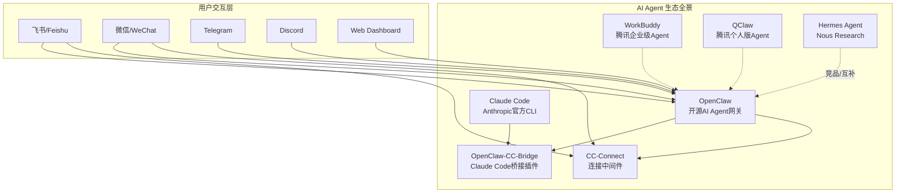
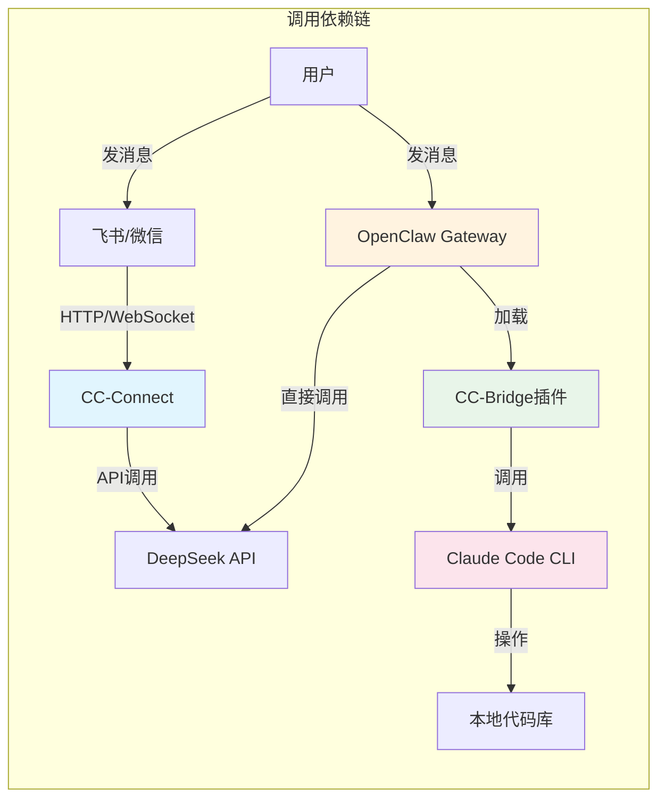
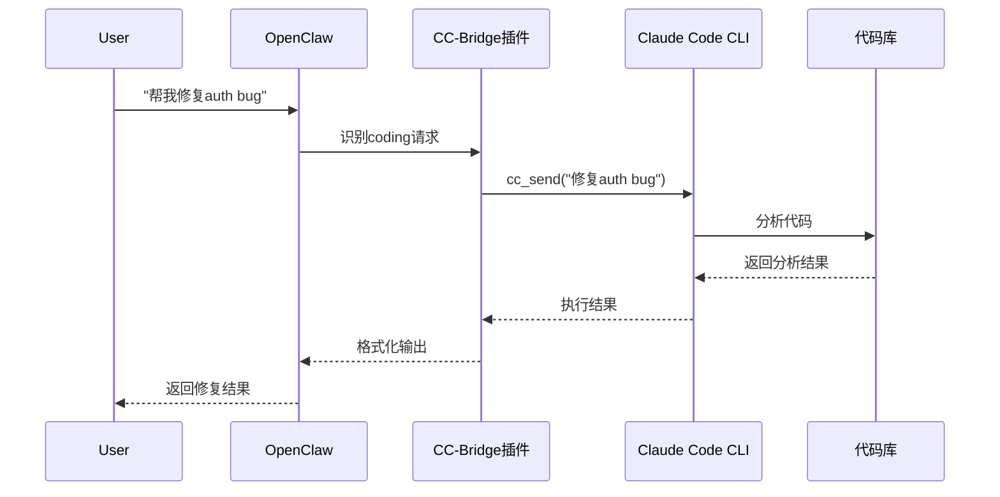
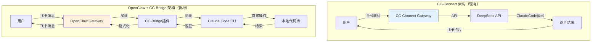
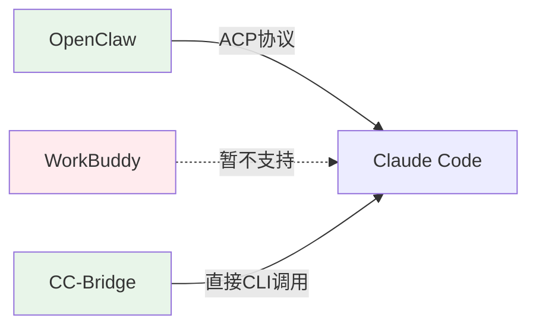
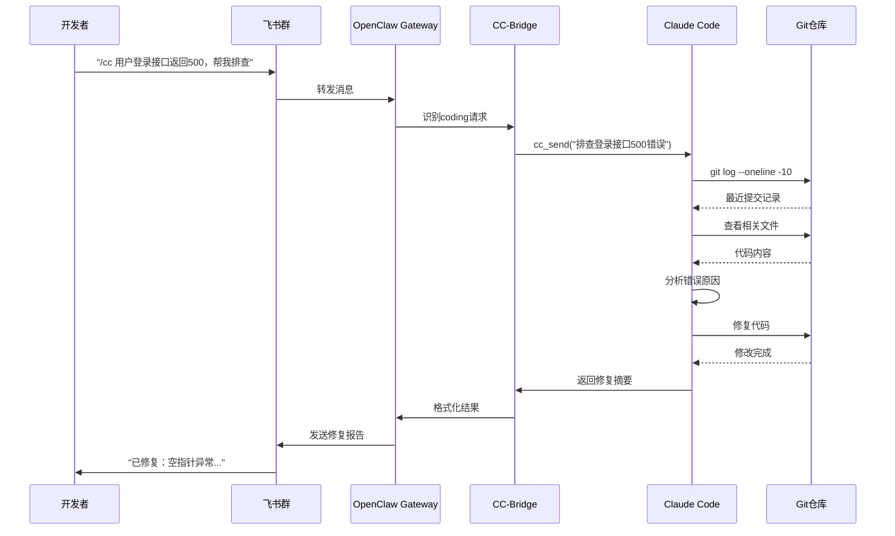

# OpenClaw + CC-Bridge 深度入门指南

## 一、核心概念与产品定位

### 1.1 产品定位总览



### 1.2 各产品详细定位

| 产品 | 英文全称 | 定位 | 开发方 | 核心特点 |
|------|---------|------|--------|----------|
| **OpenClaw** | OpenClaw AI Agent | 开源AI Agent网关/运行时 | Peter Steinberger (现OpenAI) | 本地优先、多平台接入、Skill生态 |
| **CC-Connect** | Connect (中间件) | 多平台AI连接中间件 | 社区/第三方 | 桥接IM平台与AI Agent |
| **CC-Bridge** | openclaw-cc-bridge | OpenClaw的Claude Code插件 | 社区 | 让OpenClaw通过聊天控制Claude Code |
| **Claude Code** | Claude Code CLI | 官方AI编程助手 | Anthropic | 直接操作代码库、Plan/Execute模式 |
| **WorkBuddy** | WorkBuddy | 企业级AI办公助手 | 腾讯云CodeBuddy | 基于OpenClaw、企业微信/飞书集成 |
| **QClaw** | QClaw (小龙虾) | 个人版AI助手 | 腾讯电脑管家 | 微信远程控制电脑 |
| **Hermes** | Hermes Agent | 自进化AI Agent框架 | Nous Research | 持久记忆、技能自学习、GEPA引擎 |

### 1.3 依赖关系图



## 二、安装与配置详情

### 2.1 已完成的安装步骤

#### Step 1: OpenClaw 安装
```bash
# 使用官方一键安装脚本（已执行）
curl -fsSL https://openclaw.ai/install.sh | bash -s -- --no-onboard

# 验证安装
openclaw --version
# 输出: OpenClaw 2026.5.7 (eeef486)
```

**安装位置**: Windows Scoop 管理的 Node.js 全局目录
- 可执行文件: `/mnt/c/Users/hanbin/scoop/apps/nodejs-lts/current/bin/openclaw`
- 版本: 2026.5.7 (最新稳定版)

#### Step 2: CC-Bridge 插件安装
```bash
# 全局安装桥接插件（已执行）
npm install -g openclaw-cc-bridge

# 验证安装
npm list -g openclaw-cc-bridge
# 输出: openclaw-cc-bridge@0.2.0
```

**安装位置**: `/home/hanbin/.hermes/node/lib/node_modules/openclaw-cc-bridge`

#### Step 3: Claude Code CLI 检测
```bash
claude --version
# 输出: 2.1.139 (Claude Code)
```

**状态**: ✅ 已安装且可用

### 2.2 配置文件创建

由于WSL环境权限限制，配置文件创建在项目目录下：

**路径**: `/mnt/c/users/hanbin/main/Core/Vaults/Code-Space/openclaw-config/openclaw.json`

```json
{
  "server": {
    "port": 18789,
    "host": "127.0.0.1"
  },
  "agents": {
    "default": {
      "provider": "deepseek",
      "model": "deepseek-chat",
      "apiKey": "sk-204632e546384c0796afbf44d7c8e232",
      "baseURL": "https://api.deepseek.com/anthropic"
    }
  },
  "channels": {
    "feishu": {
      "enabled": true,
      "appId": "cli_a97594ec2b79dbc1",
      "appSecret": "Ai00Vdtrv2YPF5oUF29FBg1r7LwCEhWZ"
    }
  },
  "plugins": {
    "ccBridge": {
      "enabled": true
    }
  }
}
```

### 2.3 环境变量配置建议

添加到 `~/.bashrc` 或 `~/.zshrc`：

```bash
# OpenClaw 配置
export OPENCLAW_HOME=/mnt/c/users/hanbin/main/Core/Vaults/Code-Space/openclaw-config
export OPENCLAW_CONFIG_PATH=$OPENCLAW_HOME/openclaw.json
export PATH="$HOME/.openclaw/bin:$PATH"

# Claude Code 配置（继承Windows环境）
export CLAUDE_CODE_PATH=/mnt/c/Users/hanbin/scoop/apps/nodejs-lts/current/bin/claude
```

## 三、CC-Bridge 核心功能详解

### 3.1 功能特性

| 特性 | 说明 |
|------|------|
| **Chat-driven Claude Code** | 通过 `/cc` 命令在聊天中发送prompt |
| **Plan/Execute工作流** | `/cc_plan` 创建只读计划，`/cc_execute` 执行 |
| **Agent Tools** | LLM可调用的工具：`cc_send`, `cc_plan`, `cc_execute` |
| **Pending Question处理** | Claude Code的询问自动转发到聊天平台 |
| **多工作区会话** | 每个发送者可独立管理多个workspace |
| **会话持久化** | 多轮对话在插件重启后仍然保留 |
| **超时重试** | Claude Code超时后自动 `--resume` 重试 |

### 3.2 命令速查表

| 命令 | 功能 | 示例 |
|------|------|------|
| `/cc <message>` | 发送prompt给Claude Code | `/cc 修复login.ts的bug` |
| `/cc_plan <message>` | 创建只读执行计划 | `/cc_plan 重构用户认证模块` |
| `/cc_execute [notes]` | 执行待处理的计划 | `/cc_execute 添加错误处理` |
| `/cc_workspace [path]` | 设置/列出工作区 | `/cc_workspace /path/to/project` |
| `/cc_reset` | 重置会话 | `/cc_reset --all` |
| `/cc_status` | 查看会话状态 | `/cc_status` |

**Flags说明**:
- `-m <model>`: 覆盖模型 (sonnet, opus, haiku等)
- `-w <path>`: 指定工作区路径
- `-n`: 强制新建会话（不恢复）

### 3.3 Agent Tools（LLM调用）



## 四、与现有 CC-Connect 的集成关系

### 4.1 架构对比



### 4.2 核心差异

| 维度 | CC-Connect | OpenClaw + CC-Bridge |
|------|-----------|---------------------|
| **交互模式** | 纯对话，AI返回文本建议 | AI直接执行代码操作 |
| **代码执行** | 间接（AI生成代码，用户手动复制） | 直接（AI通过Claude Code修改文件） |
| **Plan模式** | 不支持 | 原生支持 `/cc_plan` + `/cc_execute` |
| **会话管理** | 简单上下文 | 多工作区独立会话，持久化 |
| **平台支持** | 飞书、微信 | 飞书、微信、Telegram、Discord等 |
| **适用场景** | 代码咨询、方案讨论 | 实际编码、重构、Bug修复 |

### 4.3 推荐的使用策略

```mermaid
flowchart TD
    A[用户有编程需求] --> B{需求类型?}
    B -->|咨询/方案讨论| C[使用 CC-Connect]
    B -->|实际编码/重构| D[使用 OpenClaw + CC-Bridge]
    B -->|复杂多步骤任务| E[使用 CC-Bridge Plan模式]

    C --> F[DeepSeek API<br/>返回代码建议]
    D --> G[Claude Code CLI<br/>直接修改代码]
    E --> H[/cc_plan 创建计划<br/>人工Review<br/>/cc_execute 执行]

    style C fill:#e3f2fd
    style D fill:#fff3e0
    style E fill:#e8f5e9
```

## 五、WorkBuddy 与 OpenClaw 的区别

### 5.1 产品关系

**WorkBuddy 不是腾讯的"龙虾"，但基于 OpenClaw 技术栈：**

| 产品 | 关系 | 定位 |
|------|------|------|
| **OpenClaw** | 开源基础框架 | 技术极客、开发者 |
| **QClaw** | 腾讯基于OpenClaw的C端产品 | 个人用户、微信生态 |
| **WorkBuddy** | 腾讯自研企业级Agent | 企业团队、办公场景 |

### 5.2 能否使用 ACP 调用本地 Claude Code？



**答案**:
- **OpenClaw**: ✅ 支持 ACP 协议调用 Claude Code（通过 `openclaw plugins install @openclaw/acpx`）
- **CC-Bridge**: ✅ 直接通过 CLI 调用 Claude Code（更稳定）
- **WorkBuddy**: ❌ 暂不支持直接调用本地 Claude Code

### 5.3 可靠性分析

| 方案 | 可靠性 | 说明 |
|------|--------|------|
| CC-Bridge直接调用 | ⭐⭐⭐⭐⭐ | 直接调用本地CLI，无网络依赖 |
| OpenClaw ACP模式 | ⭐⭐⭐⭐ | 通过ACP协议，需配置正确 |
| WorkBuddy | ⭐⭐⭐ | 云端执行，不直接操作本地代码 |

## 六、企业实战Demo

### 6.1 场景：飞书群聊中修复生产Bug



### 6.2 实际命令流程

```bash
# 1. 在飞书发送
/cc 用户登录接口返回500，帮我排查

# 2. Claude Code 自动执行（等价于）
claude "用户登录接口返回500，帮我排查"

# 3. 如果需要Plan模式
/cc_plan 重构用户认证模块，添加JWT刷新机制

# 4. Review计划后执行
/cc_execute 确认执行，添加异常处理
```

## 七、重要配置与特点

### 7.1 OpenClaw 核心配置

```yaml
# ~/.openclaw/openclaw.yaml (推荐YAML格式)
server:
  port: 18789              # Gateway端口
  host: 127.0.0.1         # 绑定地址

agents:
  default:
    provider: deepseek     # AI提供商
    model: deepseek-chat   # 模型名称
    apiKey: "sk-..."       # API密钥
    baseURL: "https://api.deepseek.com/anthropic"

channels:
  feishu:
    enabled: true
    appId: "cli_..."
    appSecret: "..."
    enableFeishuCard: true   # 卡片消息
    threadIsolation: true    # 线程隔离

plugins:
  ccBridge:
    enabled: true
    maxRetries: 3            # 超时重试次数
    defaultModel: "sonnet"   # 默认模型
```

### 7.2 CC-Bridge 配置选项

| 配置项 | 默认值 | 说明 |
|--------|--------|------|
| `maxRetries` | 3 | Claude Code超时后的最大重试次数 |
| `defaultModel` | "sonnet" | 默认使用的Claude模型 |
| `workspace` | null | 默认工作区路径 |
| `permissionMode` | "default" | 权限模式 (default/plan/execute) |

### 7.3 安全注意事项

⚠️ **重要安全提醒**:
1. **API密钥**: 永远不要将API密钥提交到Git仓库
2. **文件权限**: Claude Code有直接读写文件的权限，谨慎授权
3. **网络访问**: CC-Bridge默认只能访问本地资源
4. **审批模式**: 生产环境建议使用 `--permission-mode plan` 先审后执

## 八、常见问题与解答

### Q1: CC-Connect 和 OpenClaw 可以共存吗？
**A**: ✅ 可以。它们监听不同端口（CC-Connect: 9810/9820，OpenClaw: 18789），互不冲突。

### Q2: 写代码用哪个更好？
**A**: 
- **直接写代码**: OpenClaw + CC-Bridge（直接操作代码库）
- **代码咨询**: CC-Connect（轻量对话）
- **企业办公**: WorkBuddy（文档处理、报表生成）

### Q3: Claude Code的Plan模式是什么？
**A**: Plan模式是Claude Code的安全特性：
1. `/cc_plan` 生成只读计划（不修改文件）
2. 用户Review计划内容
3. `/cc_execute` 确认执行（实际修改文件）

### Q4: 如何让OpenClaw自动识别编程请求？
**A**: CC-Bridge会自动注册 `cc-bridge` skill，当用户描述编程需求时，OpenClaw会自动路由到Claude Code。

## 九、后续操作建议

### 9.1 立即执行

1. **配置环境变量**:
```bash
echo 'export OPENCLAW_HOME=/mnt/c/users/hanbin/main/Core/Vaults/Code-Space/openclaw-config' >> ~/.bashrc
echo 'export OPENCLAW_CONFIG_PATH=$OPENCLAW_HOME/openclaw.json' >> ~/.bashrc
source ~/.bashrc
```

2. **启动OpenClaw Gateway**:
```bash
openclaw gateway --port 18789
```

3. **测试CC-Bridge**:
```bash
# 在飞书或OpenClaw Dashboard发送
/cc --workspace /path/to/project 帮我查看最近的git提交
```

### 9.2 进阶配置

1. **配置飞书机器人**: 使用您提供的 `app_id` 和 `app_secret`
2. **设置工作区**: 为不同项目配置独立工作区
3. **启用ACP插件**: `openclaw plugins install @openclaw/acpx`
4. **配置定时任务**: 使用OpenClaw的cron功能

---

**文档版本**: 2026-05-12
**OpenClaw版本**: 2026.5.7
**CC-Bridge版本**: 0.2.0
**Claude Code版本**: 2.1.139
