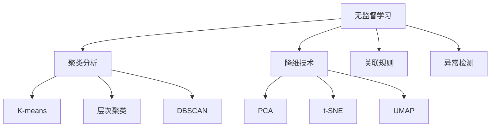

# 无监督学习算法

## 1. 无监督学习概述

**无监督学习（Unsupervised Learning）** 是在没有标签的情况下，从数据中发现隐藏模式或结构的学习方法。

### 大白话理解
就像考古学家研究文物：没有说明书告诉你每个文物的用途，只能通过观察形状、材质等特征，自己分类和总结规律。

## 2. 无监督学习的主要任务



## 3. 聚类算法详解

### 3.1 K-means聚类

**核心思想**：将数据分成K个簇，使簇内数据相似度高，簇间相似度低。

```python
import numpy as np
import matplotlib.pyplot as plt
from sklearn.cluster import KMeans
from sklearn.datasets import make_blobs
from sklearn.metrics import silhouette_score

# 生成示例数据
X, y_true = make_blobs(
    n_samples=300,          # 样本数量
    centers=4,              # 簇中心数量
    cluster_std=0.60,       # 簇的标准差
    random_state=42
)

# 使用K-means聚类
kmeans = KMeans(n_clusters=4, random_state=42)
y_pred = kmeans.fit_predict(X)

# 可视化聚类结果
plt.figure(figsize=(12, 4))

# 真实标签
plt.subplot(1, 3, 1)
plt.scatter(X[:, 0], X[:, 1], c=y_true, cmap='viridis')
plt.title('真实标签')
plt.xlabel('特征1')
plt.ylabel('特征2')

# K-means聚类结果
plt.subplot(1, 3, 2)
plt.scatter(X[:, 0], X[:, 1], c=y_pred, cmap='viridis')
# 绘制簇中心
centers = kmeans.cluster_centers_
plt.scatter(centers[:, 0], centers[:, 1], c='red', marker='x', s=200, linewidth=3)
plt.title('K-means聚类结果')
plt.xlabel('特征1')

# 簇边界可视化
plt.subplot(1, 3, 3)
# 创建网格点
h = 0.02
x_min, x_max = X[:, 0].min() - 1, X[:, 0].max() + 1
y_min, y_max = X[:, 1].min() - 1, X[:, 1].max() + 1
xx, yy = np.meshgrid(np.arange(x_min, x_max, h), np.arange(y_min, y_max, h))

# 预测网格点标签
Z = kmeans.predict(np.c_[xx.ravel(), yy.ravel()])
Z = Z.reshape(xx.shape)

plt.contourf(xx, yy, Z, alpha=0.3, cmap='viridis')
plt.scatter(X[:, 0], X[:, 1], c=y_pred, cmap='viridis')
plt.scatter(centers[:, 0], centers[:, 1], c='red', marker='x', s=200, linewidth=3)
plt.title('簇边界')
plt.xlabel('特征1')

plt.tight_layout()
plt.show()

# 评估聚类效果
silhouette_avg = silhouette_score(X, y_pred)
print(f"轮廓系数: {silhouette_avg:.2f}")
```

### 3.2 如何选择K值？

```python
# 肘部法则（Elbow Method）选择最佳K值
inertia = []
K_range = range(1, 10)

for k in K_range:
    kmeans = KMeans(n_clusters=k, random_state=42)
    kmeans.fit(X)
    inertia.append(kmeans.inertia_)  # 簇内平方和

plt.figure(figsize=(10, 6))
plt.plot(K_range, inertia, 'bo-')
plt.xlabel('K值')
plt.ylabel('簇内平方和')
plt.title('肘部法则 - 选择最佳K值')
plt.grid(True, alpha=0.3)
plt.show()
```

## 4. 降维技术

### 4.1 主成分分析（PCA）

**目的**：将高维数据降到低维，同时保留主要信息。

```python
from sklearn.decomposition import PCA
from sklearn.datasets import load_iris

# 加载鸢尾花数据集
iris = load_iris()
X, y = iris.data, iris.target

# 应用PCA降维
pca = PCA(n_components=2)  # 降到2维
X_pca = pca.fit_transform(X)

print(f"原始数据维度: {X.shape}")
print(f"降维后数据维度: {X_pca.shape}")
print(f"解释方差比例: {pca.explained_variance_ratio_}")
print(f"累计解释方差: {sum(pca.explained_variance_ratio_):.2f}")

# 可视化降维结果
plt.figure(figsize=(10, 6))
scatter = plt.scatter(X_pca[:, 0], X_pca[:, 1], c=y, cmap='viridis')
plt.xlabel('第一主成分')
plt.ylabel('第二主成分')
plt.title('PCA降维可视化')
plt.colorbar(scatter)
plt.grid(True, alpha=0.3)
plt.show()
```

### 4.2 t-SNE降维

**特点**：特别适合高维数据的可视化，能保留局部结构。

```python
from sklearn.manifold import TSNE

# 使用t-SNE降维
tsne = TSNE(n_components=2, random_state=42)
X_tsne = tsne.fit_transform(X)

# 可视化t-SNE结果
plt.figure(figsize=(10, 6))
scatter = plt.scatter(X_tsne[:, 0], X_tsne[:, 1], c=y, cmap='viridis')
plt.xlabel('t-SNE特征1')
plt.ylabel('t-SNE特征2')
plt.title('t-SNE降维可视化')
plt.colorbar(scatter)
plt.grid(True, alpha=0.3)
plt.show()
```

## 5. 异常检测

### 5.1 孤立森林（Isolation Forest）

**原理**：异常点更容易被孤立，通过随机划分快速识别异常。

```python
from sklearn.ensemble import IsolationForest
from sklearn.datasets import make_blobs

# 生成包含异常点的数据
X, _ = make_blobs(n_samples=300, centers=1, cluster_std=0.5, random_state=42)
# 添加一些异常点
X_outliers = np.random.uniform(low=-6, high=6, size=(20, 2))
X = np.vstack([X, X_outliers])

# 使用孤立森林检测异常
iso_forest = IsolationForest(contamination=0.1, random_state=42)
y_pred = iso_forest.fit_predict(X)

# 将预测结果转换为0（正常）和1（异常）
y_pred = np.where(y_pred == 1, 0, 1)

# 可视化结果
plt.figure(figsize=(10, 6))

# 正常点
normal = X[y_pred == 0]
plt.scatter(normal[:, 0], normal[:, 1], c='blue', label='正常点', alpha=0.6)

# 异常点
outliers = X[y_pred == 1]
plt.scatter(outliers[:, 0], outliers[:, 1], c='red', label='异常点', s=100, marker='x')

plt.xlabel('特征1')
plt.ylabel('特征2')
plt.title('异常检测 - 孤立森林')
plt.legend()
plt.grid(True, alpha=0.3)
plt.show()
```

## 6. 算法对比与应用场景

| 算法 | 主要应用 | 优点 | 缺点 | 适用场景 |
|------|----------|------|------|----------|
| K-means | 聚类分析 | 简单、高效、可扩展 | 需要指定K值、对异常值敏感 | 客户分群、图像分割 |
| DBSCAN | 密度聚类 | 无需指定簇数、发现任意形状 | 对参数敏感、高维数据效果差 | 异常检测、空间数据 |
| PCA | 降维 | 保留最大方差、可解释性强 | 线性假设、可能丢失非线性结构 | 数据可视化、特征压缩 |
| t-SNE | 可视化 | 保留局部结构、可视化效果好 | 计算复杂、不能用于新数据 | 高维数据探索 |

## 7. 实战技巧

### 7.1 数据预处理的重要性
```python
from sklearn.preprocessing import StandardScaler

# 数据标准化（对聚类很重要）
scaler = StandardScaler()
X_scaled = scaler.fit_transform(X)

# 标准化后的K-means聚类
kmeans_scaled = KMeans(n_clusters=4, random_state=42)
y_pred_scaled = kmeans_scaled.fit_predict(X_scaled)

# 比较标准化前后的效果
silhouette_original = silhouette_score(X, y_pred)
silhouette_scaled = silhouette_score(X_scaled, y_pred_scaled)

print(f"标准化前轮廓系数: {silhouette_original:.3f}")
print(f"标准化后轮廓系数: {silhouette_scaled:.3f}")
```

### 7.2 多算法组合使用
```python
# PCA + K-means 组合使用
pca_3d = PCA(n_components=3)
X_pca_3d = pca_3d.fit_transform(X)

# 在降维后的空间进行聚类
kmeans_pca = KMeans(n_clusters=4, random_state=42)
y_pred_pca = kmeans_pca.fit_predict(X_pca_3d)

print(f"PCA+K-means轮廓系数: {silhouette_score(X_pca_3d, y_pred_pca):.3f}")
```

## 8. 常见问题解答

### Q: 如何判断聚类结果的好坏？
**A**: 使用内部指标（如轮廓系数、Calinski-Harabasz指数）和外部指标（如果有真实标签，如调整兰德指数）。

### Q: PCA和t-SNE有什么区别？
**A**: PCA是线性降维，目标是保留全局方差；t-SNE是非线性降维，重点是保留局部结构，更适合可视化。

### Q: 无监督学习有什么实际应用？
**A**: 客户细分、异常检测、推荐系统、图像分割、基因表达分析等。

## 9. 进阶学习方向

1. **高斯混合模型**：基于概率的软聚类方法
2. **自编码器**：深度学习的降维技术
3. **谱聚类**：基于图论的聚类方法
4. **关联规则挖掘**：发现数据中的关联关系

---
*下一节：[模型评估与优化](模型评估与优化.md)*