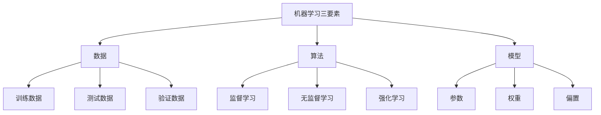

# 机器学习基础概念

## 1. 什么是机器学习？

**机器学习（Machine Learning, ML）** 是人工智能的一个分支，让计算机系统能够从数据中学习和改进，而无需显式编程。

### 大白话解释
想象教小孩认动物：你不是直接告诉他"这是猫，那是狗"，而是给他看很多猫狗图片，让他自己总结规律。机器学习就是让计算机做类似的事情。

## 2. 机器学习的三要素



## 3. 机器学习的主要类型

| 类型 | 定义 | 典型应用 | 大白话理解 |
|------|------|----------|------------|
| 监督学习 | 有标签数据的学习 | 分类、回归 | 老师给答案的学习 |
| 无监督学习 | 无标签数据的学习 | 聚类、降维 | 自己找规律的学习 |
| 强化学习 | 通过奖励机制学习 | 游戏AI、机器人 | 试错学习，有奖有罚 |

## 4. 机器学习工作流程

```python
# 机器学习基础工作流程示例
import pandas as pd
import numpy as np
from sklearn.model_selection import train_test_split
from sklearn.linear_model import LinearRegression
from sklearn.metrics import mean_squared_error

# 1. 数据准备
# 生成示例数据
np.random.seed(42)
X = np.random.rand(100, 1) * 10  # 特征：100个样本，1个特征
# 生成目标值：y = 2*X + 1 + 噪声
y = 2 * X.flatten() + 1 + np.random.randn(100) * 2

# 2. 数据分割
# 将数据分为训练集和测试集
X_train, X_test, y_train, y_test = train_test_split(X, y, test_size=0.2, random_state=42)

# 3. 模型选择与训练
# 创建线性回归模型
model = LinearRegression()
# 训练模型
model.fit(X_train, y_train)

# 4. 模型预测
# 对测试集进行预测
y_pred = model.predict(X_test)

# 5. 模型评估
# 计算均方误差
mse = mean_squared_error(y_test, y_pred)
print(f"模型系数: {model.coef_[0]:.2f}")
print(f"模型截距: {model.intercept_:.2f}")
print(f"测试集均方误差: {mse:.2f}")
```

## 5. 核心概念详解

### 5.1 特征（Feature）
- **定义**：描述数据的属性或变量
- **示例**：房价预测中的面积、位置、楼层等
- **重要性**：好的特征是模型成功的关键

### 5.2 标签（Label）
- **定义**：要预测的目标值
- **示例**：房价预测中的实际房价
- **类型**：分类标签（离散）、回归标签（连续）

### 5.3 训练集/测试集
- **训练集**：用于训练模型的数据（通常70-80%）
- **测试集**：用于评估模型性能的数据（通常20-30%）
- **验证集**：用于调参的中间数据集

## 6. 常见误区与注意事项

### ❌ 常见错误
1. **数据泄露**：测试集信息泄露到训练过程
2. **过拟合**：模型在训练集表现好，测试集差
3. **欠拟合**：模型过于简单，无法捕捉数据规律

### ✅ 最佳实践
1. **数据清洗**：处理缺失值、异常值
2. **特征工程**：创建有意义的特征
3. **交叉验证**：确保模型泛化能力

## 7. 实战技巧

### 数据探索技巧
```python
import matplotlib.pyplot as plt

# 数据分布可视化
plt.figure(figsize=(10, 4))

plt.subplot(1, 2, 1)
plt.scatter(X, y, alpha=0.7)
plt.xlabel('特征X')
plt.ylabel('目标y')
plt.title('数据分布')

plt.subplot(1, 2, 2)
plt.hist(y, bins=20, alpha=0.7)
plt.xlabel('目标值')
plt.ylabel('频次')
plt.title('目标值分布')

plt.tight_layout()
plt.show()
```

## 8. 进阶概念

### 8.1 偏差-方差权衡
- **偏差**：模型预测值与真实值的差异
- **方差**：模型对训练数据变化的敏感度
- **目标**：找到偏差和方差的平衡点

### 8.2 正则化
- **目的**：防止过拟合
- **方法**：L1正则化（Lasso）、L2正则化（Ridge）

## 9. 常见疑问解答

### Q: 机器学习和传统编程有什么区别？
**A**: 传统编程是"输入+规则=输出"，机器学习是"输入+输出=规则"。机器学习让计算机自己从数据中学习规则。

### Q: 为什么需要分割训练集和测试集？
**A**: 测试集就像期末考试，用来检验学习效果。如果只用训练集评估，就像开卷考试，无法反映真实能力。

### Q: 什么是过拟合？如何避免？
**A**: 过拟合就像死记硬背课本，考试遇到新题就不会。避免方法：更多数据、简化模型、正则化、交叉验证。

## 10. 学习资源推荐

- [Scikit-learn官方文档](https://scikit-learn.org/stable/)
- 《机器学习》- 周志华
- Coursera: Machine Learning by Andrew Ng

---
*下一节：[监督学习算法](监督学习算法.md)*