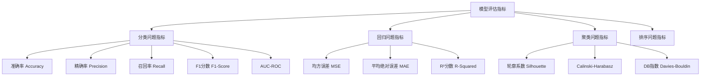

# 模型评估与优化

## 1. 模型评估概述

**模型评估**是机器学习工作流中的关键环节，用于量化模型性能、发现改进方向、确保模型泛化能力。

### 大白话理解
模型评估就像"考试评分"：通过标准化的测试题（测试集）和评分标准（评估指标），判断模型学得好不好，找出需要加强的地方。

## 2. 评估指标体系



## 3. 分类问题评估实战

### 3.1 二分类评估指标

```python
import numpy as np
import pandas as pd
from sklearn.metrics import accuracy_score, precision_score, recall_score, f1_score
from sklearn.metrics import confusion_matrix, classification_report, roc_auc_score
import matplotlib.pyplot as plt
import seaborn as sns

class BinaryClassificationEvaluator:
    """二分类模型评估器"""
    
    def __init__(self, y_true, y_pred, y_prob=None):
        """
        初始化评估器
        
        参数:
            y_true: 真实标签
            y_pred: 预测标签
            y_prob: 预测概率（用于AUC计算）
        """
        self.y_true = y_true
        self.y_pred = y_pred
        self.y_prob = y_prob
    
    def calculate_basic_metrics(self):
        """计算基础评估指标"""
        metrics = {}
        
        # 准确率
        metrics['accuracy'] = accuracy_score(self.y_true, self.y_pred)
        
        # 精确率、召回率、F1分数
        metrics['precision'] = precision_score(self.y_true, self.y_pred, average='binary')
        metrics['recall'] = recall_score(self.y_true, self.y_pred, average='binary')
        metrics['f1_score'] = f1_score(self.y_true, self.y_pred, average='binary')
        
        # AUC-ROC（如果有概率预测）
        if self.y_prob is not None:
            metrics['auc_roc'] = roc_auc_score(self.y_true, self.y_prob)
        
        return metrics
    
    def plot_confusion_matrix(self, title="混淆矩阵"):
        """绘制混淆矩阵"""
        cm = confusion_matrix(self.y_true, self.y_pred)
        
        plt.figure(figsize=(8, 6))
        sns.heatmap(cm, annot=True, fmt='d', cmap='Blues', 
                   xticklabels=['负例', '正例'], 
                   yticklabels=['负例', '正例'])
        plt.title(title)
        plt.ylabel('真实标签')
        plt.xlabel('预测标签')
        plt.show()
        
        return cm
    
    def generate_classification_report(self):
        """生成分类报告"""
        report = classification_report(self.y_true, self.y_pred, 
                                      target_names=['负例', '正例'])
        return report
    
    def comprehensive_evaluation(self):
        """综合评估"""
        print("=== 二分类模型综合评估 ===")
        
        # 基础指标
        metrics = self.calculate_basic_metrics()
        print("\n基础评估指标:")
        for metric, value in metrics.items():
            print(f"{metric}: {value:.4f}")
        
        # 混淆矩阵
        cm = self.plot_confusion_matrix()
        print(f"\n混淆矩阵:\n{cm}")
        
        # 分类报告
        report = self.generate_classification_report()
        print(f"\n详细分类报告:")
        print(report)
        
        return metrics, cm

# 二分类评估示例
def binary_classification_demo():
    """二分类评估演示"""
    
    # 生成示例数据
    np.random.seed(42)
    n_samples = 1000
    
    # 真实标签（70%负例，30%正例）
    y_true = np.random.choice([0, 1], size=n_samples, p=[0.7, 0.3])
    
    # 模拟预测结果（有一定错误率）
    y_pred = y_true.copy()
    
    # 添加一些错误预测
    error_indices = np.random.choice(n_samples, size=150, replace=False)
    y_pred[error_indices] = 1 - y_pred[error_indices]  # 翻转标签
    
    # 模拟概率预测
    y_prob = np.random.uniform(0, 1, n_samples)
    
    # 创建评估器
    evaluator = BinaryClassificationEvaluator(y_true, y_pred, y_prob)
    
    # 执行综合评估
    metrics, cm = evaluator.comprehensive_evaluation()
    
    return metrics, cm

# 运行演示
binary_classification_demo()
```

### 3.2 多分类评估

```python
class MultiClassEvaluator:
    """多分类模型评估器"""
    
    def __init__(self, y_true, y_pred, class_names=None):
        self.y_true = y_true
        self.y_pred = y_pred
        self.class_names = class_names or [f"类别{i}" for i in range(len(np.unique(y_true)))]
    
    def calculate_multi_class_metrics(self):
        """计算多分类评估指标"""
        from sklearn.metrics import precision_score, recall_score, f1_score
        
        metrics = {}
        
        # 宏平均（Macro-average）
        metrics['precision_macro'] = precision_score(self.y_true, self.y_pred, average='macro')
        metrics['recall_macro'] = recall_score(self.y_true, self.y_pred, average='macro')
        metrics['f1_macro'] = f1_score(self.y_true, self.y_pred, average='macro')
        
        # 微平均（Micro-average）
        metrics['precision_micro'] = precision_score(self.y_true, self.y_pred, average='micro')
        metrics['recall_micro'] = recall_score(self.y_true, self.y_pred, average='micro')
        metrics['f1_micro'] = f1_score(self.y_true, self.y_pred, average='micro')
        
        # 加权平均（Weighted-average）
        metrics['precision_weighted'] = precision_score(self.y_true, self.y_pred, average='weighted')
        metrics['recall_weighted'] = recall_score(self.y_true, self.y_pred, average='weighted')
        metrics['f1_weighted'] = f1_score(self.y_true, self.y_pred, average='weighted')
        
        return metrics
    
    def plot_multi_class_confusion_matrix(self):
        """绘制多分类混淆矩阵"""
        cm = confusion_matrix(self.y_true, self.y_pred)
        
        plt.figure(figsize=(10, 8))
        sns.heatmap(cm, annot=True, fmt='d', cmap='Blues',
                   xticklabels=self.class_names,
                   yticklabels=self.class_names)
        plt.title('多分类混淆矩阵')
        plt.ylabel('真实标签')
        plt.xlabel('预测标签')
        plt.xticks(rotation=45)
        plt.yticks(rotation=0)
        plt.tight_layout()
        plt.show()
        
        return cm

# 多分类评估示例
def multi_class_demo():
    """多分类评估演示"""
    
    # 生成示例数据（3分类问题）
    np.random.seed(42)
    n_samples = 500
    
    y_true = np.random.choice([0, 1, 2], size=n_samples, p=[0.4, 0.35, 0.25])
    
    # 模拟预测（有一定错误率）
    y_pred = y_true.copy()
    error_indices = np.random.choice(n_samples, size=100, replace=False)
    for idx in error_indices:
        # 随机错误到其他类别
        wrong_classes = [c for c in [0, 1, 2] if c != y_true[idx]]
        y_pred[idx] = np.random.choice(wrong_classes)
    
    # 创建评估器
    evaluator = MultiClassEvaluator(y_true, y_pred, ['类别A', '类别B', '类别C'])
    
    # 计算指标
    metrics = evaluator.calculate_multi_class_metrics()
    
    print("=== 多分类评估指标 ===")
    for metric, value in metrics.items():
        print(f"{metric}: {value:.4f}")
    
    # 绘制混淆矩阵
    cm = evaluator.plot_multi_class_confusion_matrix()
    
    return metrics, cm

multi_class_demo()
```

## 4. 回归问题评估实战

```python
class RegressionEvaluator:
    """回归模型评估器"""
    
    def __init__(self, y_true, y_pred):
        self.y_true = y_true
        self.y_pred = y_pred
    
    def calculate_regression_metrics(self):
        """计算回归评估指标"""
        from sklearn.metrics import mean_squared_error, mean_absolute_error, r2_score
        
        metrics = {}
        
        # 均方误差（MSE）
        metrics['mse'] = mean_squared_error(self.y_true, self.y_pred)
        
        # 均方根误差（RMSE）
        metrics['rmse'] = np.sqrt(metrics['mse'])
        
        # 平均绝对误差（MAE）
        metrics['mae'] = mean_absolute_error(self.y_true, self.y_pred)
        
        # R²分数
        metrics['r2'] = r2_score(self.y_true, self.y_pred)
        
        # 平均绝对百分比误差（MAPE）
        metrics['mape'] = np.mean(np.abs((self.y_true - self.y_pred) / self.y_true)) * 100
        
        return metrics
    
    def plot_regression_results(self):
        """绘制回归结果可视化"""
        plt.figure(figsize=(12, 4))
        
        # 真实值 vs 预测值散点图
        plt.subplot(1, 3, 1)
        plt.scatter(self.y_true, self.y_pred, alpha=0.6)
        plt.plot([self.y_true.min(), self.y_true.max()], 
                [self.y_true.min(), self.y_true.max()], 'r--', lw=2)
        plt.xlabel('真实值')
        plt.ylabel('预测值')
        plt.title('真实值 vs 预测值')
        
        # 残差图
        residuals = self.y_true - self.y_pred
        plt.subplot(1, 3, 2)
        plt.scatter(self.y_pred, residuals, alpha=0.6)
        plt.axhline(y=0, color='r', linestyle='--')
        plt.xlabel('预测值')
        plt.ylabel('残差')
        plt.title('残差图')
        
        # 误差分布直方图
        plt.subplot(1, 3, 3)
        plt.hist(residuals, bins=30, alpha=0.7, edgecolor='black')
        plt.xlabel('误差')
        plt.ylabel('频次')
        plt.title('误差分布')
        
        plt.tight_layout()
        plt.show()
        
        return residuals

# 回归评估示例
def regression_demo():
    """回归评估演示"""
    
    # 生成示例数据
    np.random.seed(42)
    n_samples = 200
    
    # 真实值：线性关系 + 噪声
    X = np.linspace(0, 10, n_samples)
    y_true = 2 * X + 1 + np.random.normal(0, 1, n_samples)
    
    # 模拟预测（有一定误差）
    y_pred = 1.8 * X + 1.2 + np.random.normal(0, 1.2, n_samples)
    
    # 创建评估器
    evaluator = RegressionEvaluator(y_true, y_pred)
    
    # 计算指标
    metrics = evaluator.calculate_regression_metrics()
    
    print("=== 回归评估指标 ===")
    for metric, value in metrics.items():
        print(f"{metric}: {value:.4f}")
    
    # 可视化结果
    residuals = evaluator.plot_regression_results()
    
    return metrics, residuals

regression_demo()
```

## 5. 交叉验证技术

### 5.1 K折交叉验证

```python
from sklearn.model_selection import cross_val_score, KFold, StratifiedKFold
from sklearn.linear_model import LogisticRegression
from sklearn.datasets import make_classification

class CrossValidationDemo:
    """交叉验证演示"""
    
    def __init__(self):
        # 生成示例数据
        self.X, self.y = make_classification(
            n_samples=1000, n_features=20, n_informative=10,
            n_redundant=5, n_classes=2, random_state=42
        )
    
    def basic_cross_validation(self):
        """基础交叉验证"""
        model = LogisticRegression(random_state=42)
        
        # 5折交叉验证
        cv_scores = cross_val_score(model, self.X, self.y, cv=5, scoring='accuracy')
        
        print("=== 5折交叉验证结果 ===")
        print(f"各折得分: {cv_scores}")
        print(f"平均得分: {cv_scores.mean():.4f} (±{cv_scores.std():.4f})")
        
        return cv_scores
    
    def stratified_kfold(self):
        """分层K折交叉验证"""
        model = LogisticRegression(random_state=42)
        
        # 分层5折交叉验证（保持类别比例）
        skf = StratifiedKFold(n_splits=5, shuffle=True, random_state=42)
        cv_scores = cross_val_score(model, self.X, self.y, cv=skf, scoring='f1')
        
        print("\n=== 分层5折交叉验证结果 ===")
        print(f"各折F1得分: {cv_scores}")
        print(f"平均F1得分: {cv_scores.mean():.4f} (±{cv_scores.std():.4f})")
        
        return cv_scores
    
    def custom_cross_validation(self):
        """自定义交叉验证"""
        model = LogisticRegression(random_state=42)
        
        # 自定义3折交叉验证
        kf = KFold(n_splits=3, shuffle=True, random_state=42)
        
        fold_scores = []
        for fold, (train_idx, test_idx) in enumerate(kf.split(self.X)):
            X_train, X_test = self.X[train_idx], self.X[test_idx]
            y_train, y_test = self.y[train_idx], self.y[test_idx]
            
            # 训练模型
            model.fit(X_train, y_train)
            
            # 评估模型
            score = model.score(X_test, y_test)
            fold_scores.append(score)
            
            print(f"第{fold+1}折 - 准确率: {score:.4f}")
        
        print(f"\n平均准确率: {np.mean(fold_scores):.4f}")
        
        return fold_scores

# 交叉验证演示
cv_demo = CrossValidationDemo()
basic_scores = cv_demo.basic_cross_validation()
stratified_scores = cv_demo.stratified_kfold()
custom_scores = cv_demo.custom_cross_validation()
```

## 6. 模型优化技术

### 6.1 超参数调优

```python
from sklearn.model_selection import GridSearchCV, RandomizedSearchCV
from sklearn.ensemble import RandomForestClassifier

class HyperparameterTuning:
    """超参数调优"""
    
    def __init__(self, X, y):
        self.X = X
        self.y = y
    
    def grid_search_demo(self):
        """网格搜索演示"""
        model = RandomForestClassifier(random_state=42)
        
        # 定义参数网格
        param_grid = {
            'n_estimators': [50, 100, 200],
            'max_depth': [3, 5, 7, None],
            'min_samples_split': [2, 5, 10],
            'min_samples_leaf': [1, 2, 4]
        }
        
        # 网格搜索
        grid_search = GridSearchCV(
            estimator=model,
            param_grid=param_grid,
            cv=3,
            scoring='accuracy',
            n_jobs=-1,
            verbose=1
        )
        
        # 执行搜索
        grid_search.fit(self.X, self.y)
        
        print("=== 网格搜索结果 ===")
        print(f"最佳参数: {grid_search.best_params_}")
        print(f"最佳分数: {grid_search.best_score_:.4f}")
        
        return grid_search
    
    def randomized_search_demo(self):
        """随机搜索演示"""
        model = RandomForestClassifier(random_state=42)
        
        # 定义参数分布
        param_dist = {
            'n_estimators': [50, 100, 200, 300],
            'max_depth': [3, 5, 7, 9, None],
            'min_samples_split': [2, 5, 10, 15],
            'min_samples_leaf': [1, 2, 4, 8],
            'bootstrap': [True, False]
        }
        
        # 随机搜索
        random_search = RandomizedSearchCV(
            estimator=model,
            param_distributions=param_dist,
            n_iter=20,  # 随机尝试20组参数
            cv=3,
            scoring='accuracy',
            n_jobs=-1,
            random_state=42,
            verbose=1
        )
        
        # 执行搜索
        random_search.fit(self.X, self.y)
        
        print("\n=== 随机搜索结果 ===")
        print(f"最佳参数: {random_search.best_params_}")
        print(f"最佳分数: {random_search.best_score_:.4f}")
        
        return random_search

# 超参数调优演示
X, y = make_classification(n_samples=500, n_features=10, random_state=42)
tuning_demo = HyperparameterTuning(X, y)
grid_result = tuning_demo.grid_search_demo()
random_result = tuning_demo.randomized_search_demo()
```

## 7. 测试工程师的模型评估重点

### 7.1 模型稳定性测试

```python
class ModelStabilityTest:
    """模型稳定性测试"""
    
    def __init__(self, model, X, y):
        self.model = model
        self.X = X
        self.y = y
    
    def test_data_perturbation(self, noise_level=0.1, n_trials=10):
        """数据扰动测试"""
        original_score = self.model.score(self.X, self.y)
        
        scores = []
        for i in range(n_trials):
            # 添加随机噪声
            X_noisy = self.X + np.random.normal(0, noise_level, self.X.shape)
            score = self.model.score(X_noisy, self.y)
            scores.append(score)
        
        stability = np.std(scores)  # 标准差越小越稳定
        
        print(f"原始准确率: {original_score:.4f}")
        print(f"扰动后准确率范围: {min(scores):.4f} - {max(scores):.4f}")
        print(f"稳定性（标准差）: {stability:.4f}")
        
        return scores, stability
    
    def test_feature_importance(self):
        """特征重要性测试"""
        if hasattr(self.model, 'feature_importances_'):
            importances = self.model.feature_importances_
            
            # 排序特征重要性
            indices = np.argsort(importances)[::-1]
            
            print("=== 特征重要性排序 ===")
            for i, idx in enumerate(indices[:10]):  # 显示前10个
                print(f"特征 {idx}: {importances[idx]:.4f}")
            
            return importances
        else:
            print("该模型不支持特征重要性")
            return None
    
    def test_prediction_consistency(self, n_repeats=5):
        """预测一致性测试"""
        # 多次预测同一数据，检查结果一致性
        test_sample = self.X[0:1]  # 取第一个样本
        
        predictions = []
        for i in range(n_repeats):
            pred = self.model.predict(test_sample)
            predictions.append(pred[0])
        
        # 检查预测是否一致
        consistent = len(set(predictions)) == 1
        
        print(f"多次预测结果: {predictions}")
        print(f"预测一致性: {'通过' if consistent else '失败'}")
        
        return consistent, predictions

# 稳定性测试演示
from sklearn.ensemble import RandomForestClassifier

X, y = make_classification(n_samples=200, n_features=5, random_state=42)
model = RandomForestClassifier(n_estimators=100, random_state=42)
model.fit(X, y)

stability_test = ModelStabilityTest(model, X, y)
perturbation_scores, stability = stability_test.test_data_perturbation()
importances = stability_test.test_feature_importance()
consistent, predictions = stability_test.test_prediction_consistency()
```

### 7.2 模型部署前测试清单

```python
class ModelDeploymentChecklist:
    """模型部署前测试清单"""
    
    def __init__(self):
        self.checklist = {
            '数据质量': [
                '训练数据清洗完成',
                '缺失值处理妥当',
                '异常值检测处理',
                '特征工程合理'
            ],
            '模型性能': [
                '交叉验证通过',
                '测试集性能达标',
                '过拟合检查完成',
                '基准模型对比'
            ],
            '稳定性': [
                '数据扰动测试通过',
                '特征重要性分析',
                '预测一致性检查',
                '边界情况测试'
            ],
            '可解释性': [
                '模型决策可解释',
                '特征影响分析',
                '错误案例分析',
                '业务理解验证'
            ],
            '部署准备': [
                '模型序列化测试',
                'API接口设计',
                '性能基准测试',
                '监控方案准备'
            ]
        }
    
    def print_checklist(self):
        """打印测试清单"""
        print("=== 模型部署前测试清单 ===")
        
        for category, items in self.checklist.items():
            print(f"\n{category}:")
            for item in items:
                print(f"  ☐ {item}")
    
    def generate_test_report(self, test_results):
        """生成测试报告"""
        print("\n=== 模型测试报告 ===")
        
        for test_name, result in test_results.items():
            status = "✓ 通过" if result['passed'] else "✗ 失败"
            print(f"{test_name}: {status}")
            if 'details' in result:
                print(f"  详情: {result['details']}")

# 测试清单演示
checklist = ModelDeploymentChecklist()
checklist.print_checklist()

# 模拟测试结果
test_results = {
    '数据质量测试': {'passed': True, 'details': '所有数据质量检查通过'},
    '性能基准测试': {'passed': True, 'details': '准确率达到95%以上'},
    '稳定性测试': {'passed': True, 'details': '数据扰动下性能稳定'},
    '部署测试': {'passed': False, 'details': 'API接口还需要优化'}
}

checklist.generate_test_report(test_results)
```

## 8. 测试自动化框架

### 8.1 自动化测试流水线

```python
class MLModelTestPipeline:
    """机器学习模型测试流水线"""
    
    def __init__(self, model, X_train, y_train, X_test, y_test):
        self.model = model
        self.X_train = X_train
        self.y_train = y_train
        self.X_test = X_test
        self.y_test = y_test
        self.test_results = {}
    
    def run_performance_tests(self):
        """运行性能测试"""
        print("正在执行性能测试...")
        
        # 训练模型
        self.model.fit(self.X_train, self.y_train)
        
        # 计算准确率
        train_score = self.model.score(self.X_train, self.y_train)
        test_score = self.model.score(self.X_test, self.y_test)
        
        # 检查过拟合
        overfitting = (train_score - test_score) > 0.1
        
        self.test_results['performance'] = {
            'train_accuracy': train_score,
            'test_accuracy': test_score,
            'overfitting_detected': overfitting,
            'passed': not overfitting and test_score > 0.8
        }
    
    def run_stability_tests(self, noise_level=0.05):
        """运行稳定性测试"""
        print("正在执行稳定性测试...")
        
        # 添加噪声测试
        X_noisy = self.X_test + np.random.normal(0, noise_level, self.X_test.shape)
        noisy_score = self.model.score(X_noisy, self.y_test)
        original_score = self.model.score(self.X_test, self.y_test)
        
        # 稳定性判断
        score_drop = original_score - noisy_score
        stable = score_drop < 0.05
        
        self.test_results['stability'] = {
            'original_score': original_score,
            'noisy_score': noisy_score,
            'score_drop': score_drop,
            'passed': stable
        }
    
    def run_all_tests(self):
        """运行所有测试"""
        print("开始机器学习模型测试流水线...")
        
        self.run_performance_tests()
        self.run_stability_tests()
        
        # 汇总结果
        all_passed = all(result['passed'] for result in self.test_results.values())
        
        print("\n=== 测试结果汇总 ===")
        for test_name, result in self.test_results.items():
            status = "通过" if result['passed'] else "失败"
            print(f"{test_name}: {status}")
        
        print(f"\n总体结果: {'所有测试通过' if all_passed else '有测试失败'}")
        
        return all_passed, self.test_results

# 自动化测试演示
from sklearn.datasets import make_classification
from sklearn.ensemble import RandomForestClassifier
from sklearn.model_selection import train_test_split

# 准备数据
X, y = make_classification(n_samples=1000, n_features=10, random_state=42)
X_train, X_test, y_train, y_test = train_test_split(X, y, test_size=0.2, random_state=42)

# 创建模型
model = RandomForestClassifier(n_estimators=100, random_state=42)

# 运行测试流水线
pipeline = MLModelTestPipeline(model, X_train, y_train, X_test, y_test)
all_passed, results = pipeline.run_all_tests()
```

## 9. 测试工程师的核心技能

### 9.1 技术能力要求
- **评估指标理解**: 熟练掌握各种评估指标的计算和解释
- **测试方法设计**: 能够设计全面的测试方案
- **自动化测试**: 编写自动化测试脚本的能力
- **性能分析**: 模型性能瓶颈识别和优化建议

### 9.2 业务理解要求
- **业务目标对齐**: 确保模型评估与业务目标一致
- **风险识别**: 识别模型部署可能带来的风险
- **可解释性**: 向业务方解释模型决策的能力

### 9.3 质量保证重点
- ** reproducibility**: 确保实验结果可复现
- **文档完整性**: 完整的测试文档和报告
- **持续监控**: 生产环境模型性能监控方案

---
*下一节：[交叉验证技术](交叉验证技术.md)*