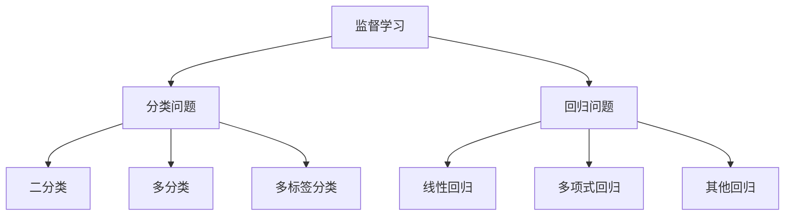

# 监督学习算法

## 1. 监督学习概述

**监督学习（Supervised Learning）** 是机器学习中最常见的学习方式，使用带有标签的数据进行训练，目标是学习输入到输出的映射关系。

### 大白话理解
就像老师批改作业：给你题目（特征）和标准答案（标签），让你学会解题方法，以后遇到新题目就能自己解答。

## 2. 监督学习的主要任务



## 3. 常用监督学习算法

### 3.1 线性回归（Linear Regression）

**适用场景**：预测连续数值
**核心思想**：找到最佳拟合直线

```python
import numpy as np
import matplotlib.pyplot as plt
from sklearn.linear_model import LinearRegression
from sklearn.metrics import mean_squared_error, r2_score

# 生成示例数据
np.random.seed(42)
X = np.random.rand(100, 1) * 10  # 特征数据
# 生成目标值：y = 3x + 2 + 噪声
y = 3 * X.flatten() + 2 + np.random.randn(100) * 1.5

# 创建线性回归模型
model = LinearRegression()

# 训练模型
model.fit(X, y)

# 预测
X_test = np.linspace(0, 10, 100).reshape(-1, 1)
y_pred = model.predict(X_test)

# 评估模型
mse = mean_squared_error(y, model.predict(X))
r2 = r2_score(y, model.predict(X))

print(f"模型系数: {model.coef_[0]:.2f}")
print(f"模型截距: {model.intercept_:.2f}")
print(f"均方误差: {mse:.2f}")
print(f"R²分数: {r2:.2f}")

# 可视化结果
plt.figure(figsize=(10, 6))
plt.scatter(X, y, alpha=0.7, label='实际数据')
plt.plot(X_test, y_pred, color='red', linewidth=2, label='预测直线')
plt.xlabel('特征X')
plt.ylabel('目标y')
plt.title('线性回归示例')
plt.legend()
plt.grid(True, alpha=0.3)
plt.show()
```

### 3.2 逻辑回归（Logistic Regression）

**适用场景**：二分类问题
**核心思想**：使用Sigmoid函数将线性输出映射到概率

```python
from sklearn.linear_model import LogisticRegression
from sklearn.datasets import make_classification
from sklearn.model_selection import train_test_split
from sklearn.metrics import accuracy_score, confusion_matrix
import seaborn as sns

# 生成二分类数据
X, y = make_classification(
    n_samples=1000,           # 样本数量
    n_features=2,             # 特征数量
    n_redundant=0,            # 冗余特征
    n_informative=2,          # 有用特征
    n_clusters_per_class=1,   # 每类簇数
    random_state=42
)

# 分割数据
X_train, X_test, y_train, y_test = train_test_split(X, y, test_size=0.3, random_state=42)

# 创建逻辑回归模型
log_reg = LogisticRegression()

# 训练模型
log_reg.fit(X_train, y_train)

# 预测
# predict方法返回类别预测
# predict_proba方法返回概率预测
y_pred = log_reg.predict(X_test)
y_proba = log_reg.predict_proba(X_test)

# 评估模型
accuracy = accuracy_score(y_test, y_pred)
print(f"准确率: {accuracy:.2f}")

# 混淆矩阵
cm = confusion_matrix(y_test, y_pred)
plt.figure(figsize=(8, 6))
sns.heatmap(cm, annot=True, fmt='d', cmap='Blues')
plt.title('混淆矩阵')
plt.ylabel('真实标签')
plt.xlabel('预测标签')
plt.show()
```

### 3.3 决策树（Decision Tree）

**适用场景**：分类和回归
**核心思想**：通过树形结构进行决策

```python
from sklearn.tree import DecisionTreeClassifier, plot_tree
from sklearn.datasets import load_iris

# 加载鸢尾花数据集
iris = load_iris()
X, y = iris.data, iris.target

# 创建决策树分类器
tree_clf = DecisionTreeClassifier(
    max_depth=3,        # 最大深度，防止过拟合
    random_state=42
)

# 训练模型
tree_clf.fit(X, y)

# 可视化决策树
plt.figure(figsize=(12, 8))
plot_tree(tree_clf, 
          feature_names=iris.feature_names,
          class_names=iris.target_names,
          filled=True)
plt.title('决策树结构')
plt.show()

# 特征重要性分析
feature_importance = tree_clf.feature_importances_
plt.figure(figsize=(10, 6))
plt.barh(iris.feature_names, feature_importance)
plt.title('特征重要性')
plt.xlabel('重要性分数')
plt.tight_layout()
plt.show()
```

## 4. 算法对比与选择

| 算法 | 适用问题 | 优点 | 缺点 | 复杂度 |
|------|----------|------|------|--------|
| 线性回归 | 回归问题 | 简单、可解释性强 | 只能处理线性关系 | O(n) |
| 逻辑回归 | 分类问题 | 概率输出、可解释 | 线性决策边界 | O(n) |
| 决策树 | 分类/回归 | 可解释性强、无需特征缩放 | 容易过拟合 | O(n log n) |
| 支持向量机 | 分类问题 | 高维空间有效、核技巧 | 大规模数据慢 | O(n²) |
| 随机森林 | 分类/回归 | 抗过拟合、高准确率 | 可解释性差 | O(n log n) |

## 5. 模型评估指标

### 5.1 回归问题评估
- **均方误差（MSE）**：预测值与真实值差的平方的平均值
- **平均绝对误差（MAE）**：预测值与真实值差的绝对值的平均值
- **R²分数**：模型解释的方差比例

### 5.2 分类问题评估
- **准确率（Accuracy）**：正确预测的比例
- **精确率（Precision）**：预测为正例中真正为正例的比例
- **召回率（Recall）**：真正为正例中被正确预测的比例
- **F1分数**：精确率和召回率的调和平均

## 6. 实战技巧与最佳实践

### 6.1 特征工程的重要性
```python
from sklearn.preprocessing import StandardScaler, PolynomialFeatures
from sklearn.pipeline import Pipeline

# 创建包含特征工程的管道
pipeline = Pipeline([
    ('scaler', StandardScaler()),           # 特征标准化
    ('poly', PolynomialFeatures(degree=2)), # 多项式特征
    ('model', LinearRegression())           # 线性回归模型
])

# 使用管道进行训练和预测
pipeline.fit(X_train, y_train)
y_pred = pipeline.predict(X_test)
```

### 6.2 超参数调优
```python
from sklearn.model_selection import GridSearchCV

# 定义参数网格
param_grid = {
    'max_depth': [3, 5, 7, 10],
    'min_samples_split': [2, 5, 10],
    'min_samples_leaf': [1, 2, 4]
}

# 网格搜索
grid_search = GridSearchCV(
    DecisionTreeClassifier(),
    param_grid,
    cv=5,                    # 5折交叉验证
    scoring='accuracy'
)

# 执行搜索
grid_search.fit(X_train, y_train)

print(f"最佳参数: {grid_search.best_params_}")
print(f"最佳分数: {grid_search.best_score_:.2f}")
```

## 7. 常见问题与解决方案

### Q: 如何处理类别不平衡问题？
**A**: 使用重采样技术（过采样、欠采样）、调整类别权重、使用合适的评估指标（如F1分数）。

### Q: 特征数量太多怎么办？
**A**: 使用特征选择方法（如递归特征消除）、降维技术（如PCA）、正则化方法。

### Q: 模型过拟合如何解决？
**A**: 增加训练数据、简化模型、使用正则化、早停法、交叉验证。

## 8. 进阶学习方向

1. **集成学习**：组合多个弱学习器（如随机森林、梯度提升）
2. **支持向量机**：处理高维数据的强大分类器
3. **神经网络**：处理复杂非线性关系的深度学习模型

---
*下一节：[无监督学习算法](无监督学习算法.md)*