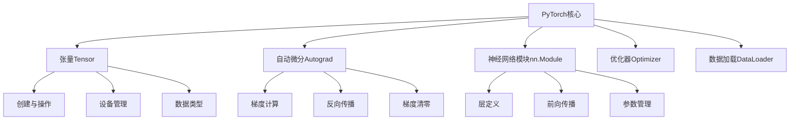

# PyTorch核心概念

## 1. PyTorch概述

**PyTorch** 是一个基于Python的开源机器学习库，由Facebook的AI研究团队开发，广泛应用于学术研究和工业实践。

### 大白话理解
PyTorch就像深度学习的"乐高积木"：提供各种基础组件（张量、神经网络层等），让你可以自由组合搭建复杂的AI模型。

## 2. PyTorch核心组件



## 3. 张量（Tensor）基础

### 3.1 张量创建与操作

**张量**是PyTorch中的基本数据结构，类似于NumPy数组，但支持GPU加速和自动微分。

```python
import torch
import numpy as np

# 1. 张量创建的各种方式
print("=== 张量创建示例 ===")

# 从列表创建
tensor_from_list = torch.tensor([1, 2, 3, 4])
print(f"从列表创建: {tensor_from_list}")

# 从NumPy数组创建
np_array = np.array([1.0, 2.0, 3.0])
tensor_from_np = torch.from_numpy(np_array)
print(f"从NumPy创建: {tensor_from_np}")

# 特殊张量创建
zeros_tensor = torch.zeros(2, 3)        # 全0张量
ones_tensor = torch.ones(2, 3)          # 全1张量  
rand_tensor = torch.rand(2, 3)          # 均匀分布随机数
randn_tensor = torch.randn(2, 3)        # 标准正态分布随机数

print(f"全0张量:\n{zeros_tensor}")
print(f"全1张量:\n{ones_tensor}")
print(f"随机张量:\n{rand_tensor}")

# 2. 张量属性
print("\n=== 张量属性 ===")
print(f"形状: {rand_tensor.shape}")      # 张量形状
print(f"维度: {rand_tensor.dim()}")       # 张量维度
print(f"数据类型: {rand_tensor.dtype}")   # 数据类型
print(f"设备: {rand_tensor.device}")      # 存储设备

# 3. 张量运算
print("\n=== 张量运算 ===")

# 基本数学运算
a = torch.tensor([1.0, 2.0, 3.0])
b = torch.tensor([4.0, 5.0, 6.0])

print(f"a + b = {a + b}")          # 逐元素加法
print(f"a - b = {a - b}")          # 逐元素减法  
print(f"a * b = {a * b}")          # 逐元素乘法
print(f"a / b = {a / b}")          # 逐元素除法
print(f"a @ b = {a @ b}")          # 点积（需要形状匹配）

# 矩阵运算
matrix_a = torch.randn(2, 3)
matrix_b = torch.randn(3, 2)
matrix_mult = torch.matmul(matrix_a, matrix_b)  # 矩阵乘法
print(f"矩阵乘法结果形状: {matrix_mult.shape}")
```

### 3.2 张量形状操作

```python
# 张量形状操作示例
def tensor_shape_operations():
    """张量形状操作演示"""
    
    # 创建示例张量
    original_tensor = torch.arange(12)  # [0, 1, 2, ..., 11]
    print(f"原始张量: {original_tensor}")
    print(f"原始形状: {original_tensor.shape}")
    
    # 改变形状
    reshaped = original_tensor.reshape(3, 4)  # 改变为3x4矩阵
    print(f"\nreshape后形状: {reshaped.shape}")
    print(f"reshape后:\n{reshaped}")
    
    # 转置
    transposed = reshaped.T  # 转置操作
    print(f"\n转置后形状: {transposed.shape}")
    print(f"转置后:\n{transposed}")
    
    # 展平
    flattened = original_tensor.flatten()  # 展平为一维
    print(f"\n展平后: {flattened}")
    
    # 维度扩展
    expanded = original_tensor.unsqueeze(0)  # 在第0维增加维度
    print(f"\n扩展后形状: {expanded.shape}")
    
    # 维度压缩
    squeezed = expanded.squeeze(0)  # 压缩大小为1的维度
    print(f"压缩后形状: {squeezed.shape}")
    
    # 连接操作
    tensor_a = torch.tensor([[1, 2], [3, 4]])
    tensor_b = torch.tensor([[5, 6], [7, 8]])
    
    # 沿行方向连接（增加行数）
    cat_rows = torch.cat([tensor_a, tensor_b], dim=0)
    print(f"\n沿行连接:\n{cat_rows}")
    
    # 沿列方向连接（增加列数）
    cat_cols = torch.cat([tensor_a, tensor_b], dim=1)
    print(f"沿列连接:\n{cat_cols}")

tensor_shape_operations()
```

## 4. 自动微分（Autograd）

### 4.1 梯度计算基础

**自动微分**是PyTorch的核心特性，自动计算张量操作的梯度。

```python
# 自动微分示例
def autograd_demo():
    """自动微分演示"""
    
    # 创建需要计算梯度的张量
    x = torch.tensor(2.0, requires_grad=True)  # 设置requires_grad=True
    w = torch.tensor(3.0, requires_grad=True)
    b = torch.tensor(1.0, requires_grad=True)
    
    print("=== 前向传播过程 ===")
    
    # 前向计算
    y = w * x + b      # y = 3*2 + 1 = 7
    z = y ** 2         # z = 7² = 49
    
    print(f"x = {x.item()}, w = {w.item()}, b = {b.item()}")
    print(f"y = w*x + b = {y.item()}")
    print(f"z = y² = {z.item()}")
    
    # 反向传播（自动计算梯度）
    z.backward()  # 计算z关于所有requires_grad=True的张量的梯度
    
    print("\n=== 梯度计算结果 ===")
    print(f"dz/dx = {x.grad.item()}")  # dz/dx = dz/dy * dy/dx = 2y * w = 2*7*3 = 42
    print(f"dz/dw = {w.grad.item()}")  # dz/dw = dz/dy * dy/dw = 2y * x = 2*7*2 = 28
    print(f"dz/db = {b.grad.item()}")  # dz/db = dz/dy * dy/db = 2y * 1 = 2*7*1 = 14
    
    # 验证手动计算
    manual_dz_dx = 2 * y.item() * w.item()
    print(f"\n手动验证 dz/dx = {manual_dz_dx}")
    print(f"自动计算 dz/dx = {x.grad.item()}")
    print(f"计算结果一致: {abs(manual_dz_dx - x.grad.item()) < 1e-6}")

autograd_demo()
```

### 4.2 梯度管理

```python
# 梯度管理重要操作
def gradient_management():
    """梯度管理演示"""
    
    # 创建需要梯度的张量
    x = torch.tensor([1.0, 2.0, 3.0], requires_grad=True)
    
    # 第一次计算
    y1 = x.sum()
    y1.backward()
    print(f"第一次梯度: {x.grad}")
    
    # 重要：梯度累积问题
    # 如果不清零梯度，会累积
    y2 = (x ** 2).sum()
    y2.backward()
    print(f"第二次梯度（累积）: {x.grad}")
    
    # 正确的做法：梯度清零
    x.grad.zero_()  # 清零梯度
    
    y3 = (x ** 3).sum()
    y3.backward()
    print(f"清零后梯度: {x.grad}")
    
    # 禁用梯度计算
    with torch.no_grad():
        # 在这个块内的操作不会计算梯度
        y4 = x * 2
        print(f"无梯度模式下的操作: {y4}")
        # 尝试访问梯度会报错
        # print(x.grad)  # 这行会报错
    
    # 分离计算图
    x_detached = x.detach()  # 从计算图中分离
    y5 = x_detached * 3
    # y5的计算不会影响x的梯度
    print(f"分离后的张量: {x_detached}")

gradient_management()
```

## 5. 神经网络模块（nn.Module）

### 5.1 自定义神经网络

```python
import torch.nn as nn
import torch.nn.functional as F

class SimpleNet(nn.Module):
    """简单的神经网络示例"""
    
    def __init__(self, input_size, hidden_size, output_size):
        """
        初始化网络层
        
        参数:
            input_size: 输入特征维度
            hidden_size: 隐藏层维度  
            output_size: 输出维度
        """
        super(SimpleNet, self).__init__()
        
        # 定义网络层
        self.fc1 = nn.Linear(input_size, hidden_size)  # 全连接层1
        self.fc2 = nn.Linear(hidden_size, hidden_size) # 全连接层2
        self.fc3 = nn.Linear(hidden_size, output_size) # 输出层
        
        # 激活函数
        self.relu = nn.ReLU()
        self.dropout = nn.Dropout(p=0.5)  # 丢弃层，防止过拟合
    
    def forward(self, x):
        """
        前向传播过程
        
        参数:
            x: 输入张量
        
        返回:
            输出张量
        """
        # 第一层: 线性变换 + ReLU激活
        x = self.fc1(x)
        x = self.relu(x)
        x = self.dropout(x)  # 训练时随机丢弃部分神经元
        
        # 第二层: 线性变换 + ReLU激活
        x = self.fc2(x)
        x = self.relu(x)
        x = self.dropout(x)
        
        # 输出层: 线性变换（无激活函数，适用于回归问题）
        x = self.fc3(x)
        
        return x

# 使用示例
def demonstrate_neural_network():
    """神经网络使用演示"""
    
    # 创建网络实例
    net = SimpleNet(input_size=10, hidden_size=20, output_size=1)
    
    print("=== 网络结构信息 ===")
    print(f"网络参数数量: {sum(p.numel() for p in net.parameters())}")
    
    # 打印网络结构
    print("\n网络层结构:")
    for name, module in net.named_children():
        print(f"{name}: {module}")
    
    # 前向传播测试
    input_data = torch.randn(5, 10)  # 5个样本，每个样本10个特征
    print(f"\n输入数据形状: {input_data.shape}")
    
    output = net(input_data)
    print(f"输出数据形状: {output.shape}")
    
    # 训练模式 vs 评估模式
    print(f"\n训练模式: {net.training}")
    
    net.eval()  # 切换到评估模式
    print(f"评估模式: {not net.training}")
    
    # 在评估模式下，dropout层不会工作
    with torch.no_grad():  # 不计算梯度
        eval_output = net(input_data)
    
    print(f"评估模式输出形状: {eval_output.shape}")

demonstrate_neural_network()
```

## 6. 数据加载与处理

### 6.1 Dataset和DataLoader

```python
from torch.utils.data import Dataset, DataLoader
import pandas as pd

class CustomDataset(Dataset):
    """自定义数据集类"""
    
    def __init__(self, data, labels, transform=None):
        """
        初始化数据集
        
        参数:
            data: 特征数据
            labels: 标签数据
            transform: 数据变换函数
        """
        self.data = data
        self.labels = labels
        self.transform = transform
    
    def __len__(self):
        """返回数据集大小"""
        return len(self.data)
    
    def __getitem__(self, idx):
        """获取单个样本"""
        sample = self.data[idx]
        label = self.labels[idx]
        
        if self.transform:
            sample = self.transform(sample)
        
        return sample, label

# 使用示例
def data_loading_demo():
    """数据加载演示"""
    
    # 创建示例数据
    # 假设有100个样本，每个样本5个特征
    data = torch.randn(100, 5)
    labels = torch.randint(0, 3, (100,))  # 3分类问题
    
    # 创建数据集
    dataset = CustomDataset(data, labels)
    
    # 创建数据加载器
    dataloader = DataLoader(
        dataset,
        batch_size=32,           # 批次大小
        shuffle=True,            # 是否打乱数据
        num_workers=2,           # 数据加载进程数
        drop_last=True           # 是否丢弃最后不完整的批次
    )
    
    print("=== 数据加载器信息 ===")
    print(f"数据集大小: {len(dataset)}")
    print(f"批次数量: {len(dataloader)}")
    print(f"批次大小: {dataloader.batch_size}")
    
    # 遍历数据加载器
    print("\n=== 批次数据示例 ===")
    for batch_idx, (batch_data, batch_labels) in enumerate(dataloader):
        print(f"批次 {batch_idx + 1}:")
        print(f"  数据形状: {batch_data.shape}")
        print(f"  标签形状: {batch_labels.shape}")
        
        if batch_idx == 2:  # 只显示前3个批次
            break

data_loading_demo()
```

## 7. 实战技巧与最佳实践

### 7.1 设备管理
```python
# 设备管理最佳实践
def device_management():
    """设备管理演示"""
    
    # 检查可用设备
    device = torch.device("cuda" if torch.cuda.is_available() else "cpu")
    print(f"使用设备: {device}")
    
    # 如果有GPU，显示GPU信息
    if torch.cuda.is_available():
        print(f"GPU数量: {torch.cuda.device_count()}")
        print(f"当前GPU: {torch.cuda.current_device()}")
        print(f"GPU名称: {torch.cuda.get_device_name()}")
    
    # 张量设备转移
    cpu_tensor = torch.randn(3, 3)
    print(f"CPU张量设备: {cpu_tensor.device}")
    
    if torch.cuda.is_available():
        gpu_tensor = cpu_tensor.to(device)  # 转移到GPU
        print(f"GPU张量设备: {gpu_tensor.device}")
        
        # 转移回CPU
        back_to_cpu = gpu_tensor.cpu()
        print(f"转回CPU设备: {back_to_cpu.device}")

device_management()
```

### 7.2 模型保存与加载
```python
# 模型保存与加载
def model_save_load():
    """模型保存加载演示"""
    
    # 创建简单模型
    model = SimpleNet(10, 20, 1)
    
    # 保存模型
    torch.save(model.state_dict(), 'model_weights.pth')
    print("模型权重已保存")
    
    # 加载模型
    loaded_model = SimpleNet(10, 20, 1)
    loaded_model.load_state_dict(torch.load('model_weights.pth'))
    print("模型权重已加载")
    
    # 保存整个模型（包含结构）
    torch.save(model, 'full_model.pth')
    
    # 加载整个模型
    full_loaded_model = torch.load('full_model.pth')
    print("完整模型已加载")

# model_save_load()
```

## 8. 常见问题解答

### Q: PyTorch和TensorFlow有什么区别？
**A**: PyTorch更Pythonic，动态图设计，调试方便；TensorFlow静态图，生产环境部署成熟。PyTorch在研究中更受欢迎，TensorFlow在企业中应用广泛。

### Q: 什么时候需要设置requires_grad=True？
**A**: 只有需要计算梯度（即需要训练）的参数才需要设置requires_grad=True。推理时应该设置为False以减少内存占用。

### Q: 如何选择优化器？
**A**: Adam适合大多数情况，SGD配合学习率调度在收敛性上可能更好。具体选择需要根据任务和实验确定。

## 9. 进阶学习方向

1. **分布式训练**：学习多GPU、多机训练
2. **混合精度训练**：使用FP16减少内存占用
3. **模型量化**：减小模型大小，提高推理速度
4. **TorchScript**：模型序列化与部署

---
*下一节：[神经网络构建](神经网络构建.md)*