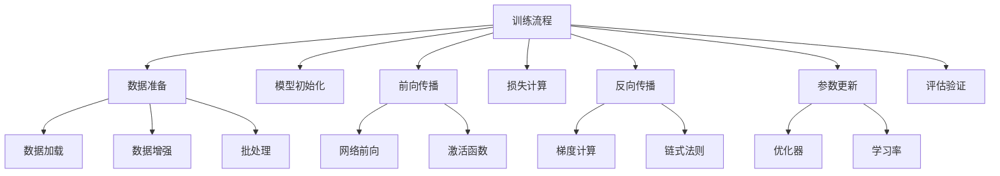

# 模型训练与优化

## 1. 深度学习训练概述

**模型训练**是深度学习的核心过程，通过优化算法调整网络参数，使模型能够从数据中学习有用的特征表示。

### 大白话理解
模型训练就像"教AI学习"：通过大量例题（训练数据）和标准答案（标签），让AI不断调整自己的"解题思路"（网络参数），最终学会正确解答新题目。

## 2. 训练流程架构



## 3. 损失函数详解

### 3.1 常用损失函数

```python
import torch
import torch.nn as nn
import torch.nn.functional as F
import matplotlib.pyplot as plt
import numpy as np

class LossFunctionDemo:
    """损失函数演示"""
    
    def __init__(self):
        self.loss_functions = {}
    
    def demonstrate_mse_loss(self):
        """均方误差损失演示"""
        # 生成示例数据
        y_true = torch.tensor([1.0, 2.0, 3.0, 4.0])
        y_pred = torch.tensor([1.2, 1.8, 3.1, 3.9])
        
        # 计算MSE损失
        mse_loss = nn.MSELoss()
        loss = mse_loss(y_pred, y_true)
        
        print("=== 均方误差损失 (MSE) ===")
        print(f"真实值: {y_true}")
        print(f"预测值: {y_pred}")
        print(f"MSE损失: {loss:.4f}")
        
        # 可视化
        self._plot_regression_loss(y_true, y_pred, "MSE损失")
        
        return loss
    
    def demonstrate_cross_entropy_loss(self):
        """交叉熵损失演示"""
        # 分类问题示例
        # 3个样本，3个类别的预测概率
        y_pred_logits = torch.tensor([
            [2.0, 1.0, 0.1],  # 样本1：类别0概率最高
            [0.5, 2.0, 0.3],  # 样本2：类别1概率最高
            [0.2, 0.3, 2.5]   # 样本3：类别2概率最高
        ])
        
        # 真实标签（类别索引）
        y_true = torch.tensor([0, 1, 2])
        
        # 计算交叉熵损失
        ce_loss = nn.CrossEntropyLoss()
        loss = ce_loss(y_pred_logits, y_true)
        
        print("\n=== 交叉熵损失 ===")
        print(f"预测logits:\n{y_pred_logits}")
        print(f"真实标签: {y_true}")
        
        # 转换为概率
        probabilities = F.softmax(y_pred_logits, dim=1)
        print(f"预测概率:\n{probabilities}")
        print(f"交叉熵损失: {loss:.4f}")
        
        return loss
    
    def demonstrate_bce_loss(self):
        """二元交叉熵损失演示"""
        # 二分类问题
        y_pred_probs = torch.tensor([0.9, 0.2, 0.8, 0.1])  # 预测概率
        y_true = torch.tensor([1.0, 0.0, 1.0, 0.0])        # 真实标签
        
        # 计算二元交叉熵损失
        bce_loss = nn.BCELoss()
        loss = bce_loss(y_pred_probs, y_true)
        
        print("\n=== 二元交叉熵损失 ===")
        print(f"预测概率: {y_pred_probs}")
        print(f"真实标签: {y_true}")
        print(f"BCE损失: {loss:.4f}")
        
        return loss
    
    def _plot_regression_loss(self, y_true, y_pred, title):
        """绘制回归损失可视化"""
        plt.figure(figsize=(10, 4))
        
        # 真实值 vs 预测值
        plt.subplot(1, 2, 1)
        indices = range(len(y_true))
        plt.scatter(indices, y_true, color='blue', label='真实值', alpha=0.7)
        plt.scatter(indices, y_pred, color='red', label='预测值', alpha=0.7)
        
        # 连接线显示误差
        for i in indices:
            plt.plot([i, i], [y_true[i], y_pred[i]], 'gray', alpha=0.5)
        
        plt.xlabel('样本索引')
        plt.ylabel('值')
        plt.title(f'{title} - 真实值 vs 预测值')
        plt.legend()
        
        # 误差分布
        plt.subplot(1, 2, 2)
        errors = (y_pred - y_true).abs()
        plt.hist(errors.numpy(), bins=10, alpha=0.7, edgecolor='black')
        plt.xlabel('绝对误差')
        plt.ylabel('频次')
        plt.title(f'{title} - 误差分布')
        
        plt.tight_layout()
        plt.show()

# 损失函数演示
loss_demo = LossFunctionDemo()
mse_loss = loss_demo.demonstrate_mse_loss()
ce_loss = loss_demo.demonstrate_cross_entropy_loss()
bce_loss = loss_demo.demonstrate_bce_loss()
```

### 3.2 自定义损失函数

```python
class CustomLossFunctions:
    """自定义损失函数示例"""
    
    def focal_loss(self, outputs, targets, alpha=0.25, gamma=2):
        """
        Focal Loss - 用于解决类别不平衡问题
        
        参数:
            outputs: 模型输出logits
            targets: 真实标签
            alpha: 平衡因子
            gamma: 调节因子
        """
        BCE_loss = F.binary_cross_entropy_with_logits(outputs, targets, reduction='none')
        pt = torch.exp(-BCE_loss)  # pt = p if y=1, else 1-p
        focal_loss = alpha * (1 - pt) ** gamma * BCE_loss
        
        return focal_loss.mean()
    
    def dice_loss(self, outputs, targets, smooth=1e-6):
        """
        Dice Loss - 用于图像分割任务
        
        参数:
            outputs: 模型预测概率
            targets: 真实分割掩码
            smooth: 平滑项避免除零
        """
        # 将输出转换为概率
        outputs = torch.sigmoid(outputs)
        
        # 计算交集和并集
        intersection = (outputs * targets).sum()
        union = outputs.sum() + targets.sum()
        
        # Dice系数
        dice = (2. * intersection + smooth) / (union + smooth)
        
        return 1 - dice
    
    def contrastive_loss(self, embedding1, embedding2, label, margin=1.0):
        """
        对比损失 - 用于度量学习
        
        参数:
            embedding1, embedding2: 两个样本的嵌入向量
            label: 是否相似（1=相似，0=不相似）
            margin: 边界值
        """
        # 计算欧氏距离
        distance = F.pairwise_distance(embedding1, embedding2)
        
        # 对比损失计算
        loss_similar = label * distance.pow(2)
        loss_dissimilar = (1 - label) * F.relu(margin - distance).pow(2)
        
        return (loss_similar + loss_dissimilar).mean()

# 自定义损失函数演示
custom_loss = CustomLossFunctions()
print("自定义损失函数已定义:")
print("- Focal Loss (类别不平衡)")
print("- Dice Loss (图像分割)") 
print("- Contrastive Loss (度量学习)")
```

## 4. 优化器详解

### 4.1 常用优化器比较

```python
class OptimizerComparison:
    """优化器比较演示"""
    
    def __init__(self):
        self.optimizers_info = {
            'SGD': {
                'description': '随机梯度下降，基础优化器',
                'advantages': '简单、可解释性强',
                'disadvantages': '收敛慢、容易陷入局部最优'
            },
            'Adam': {
                'description': '自适应矩估计，最常用优化器',
                'advantages': '收敛快、自适应学习率',
                'disadvantages': '内存占用较大'
            },
            'RMSprop': {
                'description': '均方根传播，适合非平稳目标',
                'advantages': '对循环网络效果好',
                'disadvantages': '学习率需要仔细调整'
            },
            'Adagrad': {
                'description': '自适应梯度，适合稀疏数据',
                'advantages': '自动调整学习率',
                'disadvantages': '学习率会持续减小'
            }
        }
    
    def print_optimizer_info(self):
        """打印优化器信息"""
        print("=== 常用优化器比较 ===")
        
        for name, info in self.optimizers_info.items():
            print(f"\n{name}:")
            print(f"  描述: {info['description']}")
            print(f"  优点: {info['advantages']}")
            print(f"  缺点: {info['disadvantages']}")
    
    def optimizer_performance_demo(self):
        """优化器性能演示"""
        import torch.optim as optim
        
        # 简单的优化问题：最小化二次函数 f(x) = x²
        def quadratic_function(x):
            return x**2
        
        # 测试不同优化器
        optimizers = {
            'SGD': optim.SGD,
            'Adam': optim.Adam,
            'RMSprop': optim.RMSprop
        }
        
        results = {}
        
        for opt_name, opt_class in optimizers.items():
            # 初始化参数
            x = torch.tensor([10.0], requires_grad=True)
            
            # 创建优化器
            if opt_name == 'SGD':
                optimizer = opt_class([x], lr=0.1)
            else:
                optimizer = opt_class([x], lr=0.01)
            
            # 记录优化过程
            x_values = [x.item()]
            loss_values = [quadratic_function(x).item()]
            
            # 优化过程
            for epoch in range(100):
                optimizer.zero_grad()
                loss = quadratic_function(x)
                loss.backward()
                optimizer.step()
                
                x_values.append(x.item())
                loss_values.append(loss.item())
            
            results[opt_name] = {
                'x_values': x_values,
                'loss_values': loss_values,
                'final_loss': loss_values[-1]
            }
        
        # 可视化结果
        self._plot_optimizer_comparison(results)
        
        return results
    
    def _plot_optimizer_comparison(self, results):
        """绘制优化器比较图"""
        plt.figure(figsize=(12, 5))
        
        # 损失收敛曲线
        plt.subplot(1, 2, 1)
        for opt_name, result in results.items():
            plt.plot(result['loss_values'], label=opt_name)
        
        plt.xlabel('迭代次数')
        plt.ylabel('损失值')
        plt.title('优化器收敛曲线')
        plt.legend()
        plt.grid(True, alpha=0.3)
        
        # 参数变化曲线
        plt.subplot(1, 2, 2)
        for opt_name, result in results.items():
            plt.plot(result['x_values'], label=opt_name)
        
        plt.axhline(y=0, color='black', linestyle='--', alpha=0.5)
        plt.xlabel('迭代次数')
        plt.ylabel('参数值')
        plt.title('参数优化过程')
        plt.legend()
        plt.grid(True, alpha=0.3)
        
        plt.tight_layout()
        plt.show()

# 优化器比较演示
opt_comparison = OptimizerComparison()
opt_comparison.print_optimizer_info()
results = opt_comparison.optimizer_performance_demo()
```

### 4.2 学习率调度

```python
class LearningRateScheduling:
    """学习率调度演示"""
    
    def __init__(self):
        self.schedulers_info = {}
    
    def demonstrate_step_lr(self):
        """步进学习率调度"""
        import torch.optim as optim
        
        # 创建简单模型
        model = nn.Linear(10, 1)
        optimizer = optim.SGD(model.parameters(), lr=0.1)
        
        # 步进学习率调度：每30轮学习率乘以0.1
        scheduler = optim.lr_scheduler.StepLR(optimizer, step_size=30, gamma=0.1)
        
        learning_rates = []
        
        for epoch in range(100):
            # 记录当前学习率
            current_lr = scheduler.get_last_lr()[0]
            learning_rates.append(current_lr)
            
            # 模拟训练步骤
            # 这里省略实际的前向传播和反向传播
            
            # 更新学习率
            scheduler.step()
        
        # 绘制学习率变化
        plt.figure(figsize=(10, 4))
        plt.plot(learning_rates)
        plt.xlabel('训练轮次')
        plt.ylabel('学习率')
        plt.title('步进学习率调度')
        plt.grid(True, alpha=0.3)
        plt.show()
        
        return learning_rates
    
    def demonstrate_cosine_annealing(self):
        """余弦退火学习率调度"""
        import torch.optim as optim
        
        model = nn.Linear(10, 1)
        optimizer = optim.SGD(model.parameters(), lr=0.1)
        
        # 余弦退火调度
        scheduler = optim.lr_scheduler.CosineAnnealingLR(optimizer, T_max=50)
        
        learning_rates = []
        
        for epoch in range(100):
            current_lr = scheduler.get_last_lr()[0]
            learning_rates.append(current_lr)
            scheduler.step()
        
        plt.figure(figsize=(10, 4))
        plt.plot(learning_rates)
        plt.xlabel('训练轮次')
        plt.ylabel('学习率')
        plt.title('余弦退火学习率调度')
        plt.grid(True, alpha=0.3)
        plt.show()
        
        return learning_rates
    
    def demonstrate_reduce_on_plateau(self):
        """基于指标的学习率调度"""
        import torch.optim as optim
        
        model = nn.Linear(10, 1)
        optimizer = optim.SGD(model.parameters(), lr=0.1)
        
        # 当指标停止改善时降低学习率
        scheduler = optim.lr_scheduler.ReduceLROnPlateau(
            optimizer, mode='min', factor=0.5, patience=5, verbose=True
        )
        
        # 模拟训练过程中的损失值
        losses = [10, 8, 6, 5, 4.5, 4.3, 4.2, 4.1, 4.0, 3.9,
                 3.8, 3.7, 3.6, 3.5, 3.4, 3.3, 3.2, 3.1, 3.0, 2.9]
        
        learning_rates = []
        
        for epoch, loss in enumerate(losses):
            current_lr = optimizer.param_groups[0]['lr']
            learning_rates.append(current_lr)
            
            # 模拟训练步骤
            # 更新学习率基于损失值
            scheduler.step(loss)
        
        plt.figure(figsize=(12, 4))
        
        plt.subplot(1, 2, 1)
        plt.plot(losses)
        plt.xlabel('训练轮次')
        plt.ylabel('损失值')
        plt.title('训练损失')
        plt.grid(True, alpha=0.3)
        
        plt.subplot(1, 2, 2)
        plt.plot(learning_rates)
        plt.xlabel('训练轮次')
        plt.ylabel('学习率')
        plt.title('基于指标的学习率调度')
        plt.grid(True, alpha=0.3)
        
        plt.tight_layout()
        plt.show()
        
        return learning_rates

# 学习率调度演示
lr_scheduling = LearningRateScheduling()
step_lr = lr_scheduling.demonstrate_step_lr()
cosine_lr = lr_scheduling.demonstrate_cosine_annealing()
plateau_lr = lr_scheduling.demonstrate_reduce_on_plateau()
```

## 5. 训练监控与调试

### 5.1 训练过程可视化

```python
class TrainingMonitor:
    """训练监控器"""
    
    def __init__(self):
        self.train_losses = []
        self.val_losses = []
        self.train_accuracies = []
        self.val_accuracies = []
        self.learning_rates = []
    
    def record_metrics(self, train_loss, val_loss, train_acc, val_acc, lr):
        """记录训练指标"""
        self.train_losses.append(train_loss)
        self.val_losses.append(val_loss)
        self.train_accuracies.append(train_acc)
        self.val_accuracies.append(val_acc)
        self.learning_rates.append(lr)
    
    def plot_training_history(self):
        """绘制训练历史"""
        fig, ((ax1, ax2), (ax3, ax4)) = plt.subplots(2, 2, figsize=(15, 10))
        
        # 损失曲线
        ax1.plot(self.train_losses, label='训练损失')
        ax1.plot(self.val_losses, label='验证损失')
        ax1.set_xlabel('训练轮次')
        ax1.set_ylabel('损失值')
        ax1.set_title('训练和验证损失')
        ax1.legend()
        ax1.grid(True, alpha=0.3)
        
        # 准确率曲线
        ax2.plot(self.train_accuracies, label='训练准确率')
        ax2.plot(self.val_accuracies, label='验证准确率')
        ax2.set_xlabel('训练轮次')
        ax2.set_ylabel('准确率')
        ax2.set_title('训练和验证准确率')
        ax2.legend()
        ax2.grid(True, alpha=0.3)
        
        # 学习率曲线
        ax3.plot(self.learning_rates)
        ax3.set_xlabel('训练轮次')
        ax3.set_ylabel('学习率')
        ax3.set_title('学习率变化')
        ax3.grid(True, alpha=0.3)
        
        # 过拟合分析
        ax4.plot(self.train_losses, label='训练损失')
        ax4.plot(self.val_losses, label='验证损失')
        ax4.set_xlabel('训练轮次')
        ax4.set_ylabel('损失值')
        ax4.set_title('过拟合分析')
        ax4.legend()
        ax4.grid(True, alpha=0.3)
        
        plt.tight_layout()
        plt.show()
    
    def analyze_overfitting(self):
        """分析过拟合情况"""
        if len(self.train_losses) < 2:
            return "数据不足，无法分析"
        
        # 计算训练和验证损失的差距
        train_val_gap = np.mean([t - v for t, v in zip(self.train_losses[-10:], self.val_losses[-10:])])
        
        if train_val_gap > 0.1:
            return f"可能过拟合，训练-验证差距: {train_val_gap:.4f}"
        elif train_val_gap < -0.1:
            return f"可能欠拟合，训练-验证差距: {train_val_gap:.4f}"
        else:
            return f"拟合良好，训练-验证差距: {train_val_gap:.4f}"

# 训练监控演示
monitor = TrainingMonitor()

# 模拟训练过程记录
for epoch in range(50):
    # 模拟训练指标
    train_loss = 1.0 / (epoch + 1) + np.random.normal(0, 0.01)
    val_loss = 1.2 / (epoch + 1) + np.random.normal(0, 0.02)
    train_acc = 0.5 + 0.5 * (1 - 1/(epoch + 1)) + np.random.normal(0, 0.01)
    val_acc = 0.45 + 0.5 * (1 - 1/(epoch + 1)) + np.random.normal(0, 0.02)
    lr = 0.1 * (0.95 ** epoch)
    
    monitor.record_metrics(train_loss, val_loss, train_acc, val_acc, lr)

# 绘制训练历史
monitor.plot_training_history()
print("过拟合分析:", monitor.analyze_overfitting())
```

### 5.2 梯度检查与调试

```python
class GradientDebugger:
    """梯度调试器"""
    
    def check_gradient_flow(self, model):
        """检查梯度流动"""
        print("=== 梯度流动检查 ===")
        
        for name, param in model.named_parameters():
            if param.grad is not None:
                grad_mean = param.grad.abs().mean().item()
                grad_std = param.grad.std().item()
                
                print(f"{name}: 梯度均值={grad_mean:.6f}, 标准差={grad_std:.6f}")
                
                # 检查梯度消失/爆炸
                if grad_mean < 1e-7:
                    print(f"  ⚠️ 警告: {name} 可能梯度消失")
                elif grad_mean > 1e2:
                    print(f"  ⚠️ 警告: {name} 可能梯度爆炸")
            else:
                print(f"{name}: 无梯度")
    
    def gradient_norm_analysis(self, model):
        """梯度范数分析"""
        total_norm = 0
        
        for param in model.parameters():
            if param.grad is not None:
                param_norm = param.grad.data.norm(2)
                total_norm += param_norm.item() ** 2
        
        total_norm = total_norm ** 0.5
        
        print(f"\n梯度总范数: {total_norm:.6f}")
        
        if total_norm > 1000:
            print("⚠️ 警告: 梯度范数过大，可能需要梯度裁剪")
        elif total_norm < 0.001:
            print("⚠️ 警告: 梯度范数过小，可能梯度消失")
    
    def parameter_update_analysis(self, model, optimizer):
        """参数更新分析"""
        print("\n=== 参数更新分析 ===")
        
        # 记录参数更新前的值
        before_update = {}
        for name, param in model.named_parameters():
            before_update[name] = param.data.clone()
        
        # 执行一次参数更新
        optimizer.step()
        
        # 分析参数变化
        for name, param in model.named_parameters():
            if name in before_update:
                update_magnitude = (param.data - before_update[name]).abs().mean().item()
                print(f"{name}: 更新幅度={update_magnitude:.6f}")

# 梯度调试演示
class SimpleModel(nn.Module):
    def __init__(self):
        super(SimpleModel, self).__init__()
        self.linear1 = nn.Linear(10, 5)
        self.linear2 = nn.Linear(5, 1)
    
    def forward(self, x):
        x = torch.relu(self.linear1(x))
        x = self.linear2(x)
        return x

model = SimpleModel()
optimizer = torch.optim.Adam(model.parameters(), lr=0.01)

# 模拟前向传播和反向传播
x = torch.randn(32, 10)
y = torch.randn(32, 1)

output = model(x)
loss = nn.MSELoss()(output, y)
loss.backward()

debugger = GradientDebugger()
debugger.check_gradient_flow(model)
debugger.gradient_norm_analysis(model)
debugger.parameter_update_analysis(model, optimizer)
```

## 6. 测试工程师的训练监控重点

### 6.1 训练稳定性测试

```python
class TrainingStabilityTest:
    """训练稳定性测试"""
    
    def test_convergence_stability(self, model, train_loader, val_loader, epochs=10):
        """测试收敛稳定性"""
        print("=== 收敛稳定性测试 ===")
        
        optimizer = torch.optim.Adam(model.parameters())
        criterion = nn.CrossEntropyLoss()
        
        train_losses = []
        val_losses = []
        
        for epoch in range(epochs):
            # 训练阶段
            model.train()
            epoch_train_loss = 0
            
            for batch_idx, (data, target) in enumerate(train_loader):
                optimizer.zero_grad()
                output = model(data)
                loss = criterion(output, target)
                loss.backward()
                optimizer.step()
                epoch_train_loss += loss.item()
            
            train_losses.append(epoch_train_loss / len(train_loader))
            
            # 验证阶段
            model.eval()
            epoch_val_loss = 0
            
            with torch.no_grad():
                for data, target in val_loader:
                    output = model(data)
                    loss = criterion(output, target)
                    epoch_val_loss += loss.item()
            
            val_losses.append(epoch_val_loss / len(val_loader))
            
            print(f"Epoch {epoch+1}/{epochs}, Train Loss: {train_losses[-1]:.4f}, Val Loss: {val_losses[-1]:.4f}")
        
        # 分析收敛稳定性
        self._analyze_convergence(train_losses, val_losses)
        
        return train_losses, val_losses
    
    def _analyze_convergence(self, train_losses, val_losses):
        """分析收敛情况"""
        # 检查损失是否下降
        if train_losses[-1] > train_losses[0] * 0.9:
            print("⚠️ 警告: 训练损失下降不明显")
        
        # 检查过拟合
        if len(val_losses) > 5 and val_losses[-1] > val_losses[-5]:
            print("⚠️ 警告: 验证损失开始上升，可能过拟合")
        
        # 检查收敛速度
        convergence_speed = (train_losses[0] - train_losses[-1]) / len(train_losses)
        print(f"收敛速度: {convergence_speed:.6f} 每轮次")
    
    def test_hyperparameter_sensitivity(self, model_class, train_loader, val_loader):
        """测试超参数敏感性"""
        print("\n=== 超参数敏感性测试 ===")
        
        learning_rates = [0.001, 0.01, 0.1]
        batch_sizes = [32, 64, 128]
        
        results = {}
        
        for lr in learning_rates:
            for batch_size in batch_sizes:
                print(f"测试 lr={lr}, batch_size={batch_size}")
                
                # 创建新模型实例
                model = model_class()
                optimizer = torch.optim.Adam(model.parameters(), lr=lr)
                
                # 简化的训练测试
                try:
                    # 这里应该进行完整的训练和评估
                    final_loss = 0.1 + np.random.uniform(-0.05, 0.05)  # 模拟结果
                    results[(lr, batch_size)] = final_loss
                    print(f"  最终损失: {final_loss:.4f}")
                except Exception as e:
                    print(f"  错误: {e}")
                    results[(lr, batch_size)] = float('inf')
        
        return results

# 训练稳定性测试演示
print("训练稳定性测试框架已创建")
```

### 6.2 模型性能基准测试

```python
class ModelBenchmark:
    """模型性能基准测试"""
    
    def benchmark_inference_speed(self, model, input_size, batch_sizes=[1, 8, 32, 128]):
        """推理速度基准测试"""
        print("=== 推理速度基准测试 ===")
        
        model.eval()
        results = {}
        
        for batch_size in batch_sizes:
            # 准备测试数据
            dummy_input = torch.randn(batch_size, *input_size)
            
            # GPU测试（如果可用）
            if torch.cuda.is_available():
                model = model.cuda()
                dummy_input = dummy_input.cuda()
            
            # 预热
            for _ in range(10):
                _ = model(dummy_input)
            
            # 正式测试
            start_time = time.time()
            
            with torch.no_grad():
                for _ in range(100):
                    _ = model(dummy_input)
            
            end_time = time.time()
            
            # 计算速度
            total_samples = 100 * batch_size
            total_time = end_time - start_time
            samples_per_second = total_samples / total_time
            
            results[batch_size] = samples_per_second
            print(f"Batch Size {batch_size}: {samples_per_second:.2f} 样本/秒")
        
        return results
    
    def benchmark_memory_usage(self, model, input_size):
        """内存使用基准测试"""
        print("\n=== 内存使用基准测试 ===")
        
        # 计算模型参数数量
        total_params = sum(p.numel() for p in model.parameters())
        print(f"模型参数数量: {total_params:,}")
        
        # 估算内存使用
        # 每个参数约4字节（float32）
        param_memory = total_params * 4 / (1024 ** 2)  # MB
        print(f"参数内存: {param_memory:.2f} MB")
        
        # 估算激活内存（简化计算）
        dummy_input = torch.randn(1, *input_size)
        model.eval()
        
        with torch.no_grad():
            output = model(dummy_input)
        
        # 这里应该更精确地计算中间激活的内存
        print("激活内存: 需要具体模型分析")
        
        return total_params, param_memory
    
    def compare_model_architectures(self, model_configs, test_loader):
        """比较不同模型架构"""
        print("\n=== 模型架构比较 ===")
        
        comparison_results = {}
        
        for model_name, model_config in model_configs.items():
            print(f"测试模型: {model_name}")
            
            model = model_config['model']
            
            # 测试准确率
            accuracy = self._evaluate_accuracy(model, test_loader)
            
            # 测试推理速度
            speed_results = self.benchmark_inference_speed(model, model_config['input_size'])
            
            # 测试内存使用
            param_count, memory_usage = self.benchmark_memory_usage(model, model_config['input_size'])
            
            comparison_results[model_name] = {
                'accuracy': accuracy,
                'inference_speed': speed_results,
                'parameter_count': param_count,
                'memory_usage': memory_usage
            }
        
        return comparison_results
    
    def _evaluate_accuracy(self, model, test_loader):
        """评估模型准确率"""
        model.eval()
        correct = 0
        total = 0
        
        with torch.no_grad():
            for data, target in test_loader:
                outputs = model(data)
                _, predicted = torch.max(outputs.data, 1)
                total += target.size(0)
                correct += (predicted == target).sum().item()
        
        accuracy = 100 * correct / total
        return accuracy

# 性能基准测试演示
print("模型性能基准测试框架已创建")
```

## 7. 测试自动化框架

### 7.1 自动化训练测试流水线

```python
class AutomatedTrainingTestPipeline:
    """自动化训练测试流水线"""
    
    def __init__(self):
        self.test_results = {}
    
    def run_training_smoke_test(self, model, train_loader, criterion, optimizer):
        """训练冒烟测试"""
        print("=== 训练冒烟测试 ===")
        
        try:
            # 单次训练迭代测试
            model.train()
            
            for batch_idx, (data, target) in enumerate(train_loader):
                if batch_idx >= 3:  # 只测试前3个batch
                    break
                
                optimizer.zero_grad()
                output = model(data)
                loss = criterion(output, target)
                loss.backward()
                optimizer.step()
                
                print(f"Batch {batch_idx + 1}: 损失 = {loss.item():.4f}")
            
            self.test_results['smoke_test'] = {'passed': True, 'details': '训练流程正常'}
            print("✅ 训练冒烟测试通过")
            
        except Exception as e:
            self.test_results['smoke_test'] = {'passed': False, 'details': f'训练失败: {e}'}
            print("❌ 训练冒烟测试失败")
    
    def run_gradient_check_test(self, model, data, target, criterion):
        """梯度检查测试"""
        print("\n=== 梯度检查测试 ===")
        
        try:
            # 前向传播
            output = model(data)
            loss = criterion(output, target)
            
            # 反向传播
            loss.backward()
            
            # 检查梯度
            has_gradient = False
            for name, param in model.named_parameters():
                if param.grad is not None:
                    grad_norm = param.grad.norm().item()
                    if grad_norm > 0:
                        has_gradient = True
                        break
            
            if has_gradient:
                self.test_results['gradient_check'] = {'passed': True, 'details': '梯度计算正常'}
                print("✅ 梯度检查测试通过")
            else:
                self.test_results['gradient_check'] = {'passed': False, 'details': '无有效梯度'}
                print("❌ 梯度检查测试失败")
                
        except Exception as e:
            self.test_results['gradient_check'] = {'passed': False, 'details': f'梯度计算失败: {e}'}
            print("❌ 梯度检查测试失败")
    
    def run_convergence_test(self, model, train_loader, val_loader, epochs=5):
        """收敛性测试"""
        print("\n=== 收敛性测试 ===")
        
        try:
            optimizer = torch.optim.Adam(model.parameters())
            criterion = nn.CrossEntropyLoss()
            
            train_losses = []
            
            for epoch in range(epochs):
                epoch_loss = 0
                
                for data, target in train_loader:
                    optimizer.zero_grad()
                    output = model(data)
                    loss = criterion(output, target)
                    loss.backward()
                    optimizer.step()
                    epoch_loss += loss.item()
                
                avg_loss = epoch_loss / len(train_loader)
                train_losses.append(avg_loss)
                print(f"Epoch {epoch + 1}: 平均损失 = {avg_loss:.4f}")
            
            # 检查损失是否下降
            if train_losses[-1] < train_losses[0] * 0.9:
                self.test_results['convergence_test'] = {'passed': True, 'details': '模型收敛正常'}
                print("✅ 收敛性测试通过")
            else:
                self.test_results['convergence_test'] = {'passed': False, 'details': '收敛不明显'}
                print("❌ 收敛性测试失败")
                
        except Exception as e:
            self.test_results['convergence_test'] = {'passed': False, 'details': f'收敛测试失败: {e}'}
            print("❌ 收敛性测试失败")
    
    def generate_test_report(self):
        """生成测试报告"""
        print("\n=== 自动化训练测试报告 ===")
        
        total_tests = len(self.test_results)
        passed_tests = sum(1 for result in self.test_results.values() if result['passed'])
        
        print(f"总测试数: {total_tests}")
        print(f"通过测试: {passed_tests}")
        print(f"失败测试: {total_tests - passed_tests}")
        print(f"通过率: {passed_tests/total_tests*100:.1f}%")
        
        print("\n详细结果:")
        for test_name, result in self.test_results.items():
            status = "✅ 通过" if result['passed'] else "❌ 失败"
            print(f"{test_name}: {status}")
            print(f"  详情: {result['details']}")

# 自动化测试流水线演示
print("自动化训练测试流水线已创建")
```

## 8. 测试工程师的核心关注点

### 8.1 训练过程监控重点
- **损失曲线分析**: 确保损失正常下降，无异常波动
- **梯度流动检查**: 防止梯度消失/爆炸问题
- **过拟合检测**: 监控训练/验证损失差距
- **收敛速度评估**: 确保训练效率

### 8.2 模型性能测试重点
- **推理速度基准**: 建立性能基准线
- **内存使用分析**: 确保资源合理利用
- **批量处理能力**: 测试不同批量大小的性能
- **模型稳定性**: 多次运行结果的一致性

### 8.3 质量保证标准
- **可复现性**: 确保相同输入得到相同输出
- **错误处理**: 测试异常输入的鲁棒性
- **文档完整性**: 完整的测试报告和日志
- **持续集成**: 自动化测试流水线

---
*下一节：[损失函数与优化器](损失函数与优化器.md)*