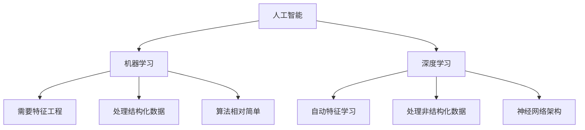

# 深度学习基础

## 1. 深度学习概述

**深度学习（Deep Learning）** 是机器学习的一个分支，使用包含多个处理层的神经网络来学习数据的层次化表示。

### 大白话理解
就像人类大脑的神经网络：简单神经元组成复杂网络，通过层层传递和处理信息，最终完成复杂任务。深度学习就是模拟这种多层神经网络的学习方式。

## 2. 深度学习与机器学习的区别



## 3. 神经网络基本结构

### 3.1 神经元（Neuron）

**神经元**是神经网络的基本单元，模拟生物神经元的工作方式。

```python
import torch
import torch.nn as nn
import matplotlib.pyplot as plt

# 手动实现一个简单的神经元
class SimpleNeuron:
    def __init__(self, input_size):
        # 初始化权重和偏置
        self.weights = torch.randn(input_size)
        self.bias = torch.randn(1)
    
    def forward(self, x):
        # 线性计算: w*x + b
        linear_output = torch.dot(self.weights, x) + self.bias
        # 激活函数: ReLU
        output = torch.relu(linear_output)
        return output

# 测试神经元
neuron = SimpleNeuron(3)
input_data = torch.tensor([1.0, 2.0, 3.0])
output = neuron.forward(input_data)

print(f"输入数据: {input_data}")
print(f"神经元权重: {neuron.weights}")
print(f"神经元偏置: {neuron.bias}")
print(f"神经元输出: {output}")
```

### 3.2 前向传播（Forward Propagation）

**前向传播**是数据从输入层经过隐藏层到输出层的过程。

```python
# 使用PyTorch构建简单神经网络
class SimpleNet(nn.Module):
    def __init__(self, input_size, hidden_size, output_size):
        super(SimpleNet, self).__init__()
        # 定义网络层
        self.fc1 = nn.Linear(input_size, hidden_size)  # 输入层到隐藏层
        self.relu = nn.ReLU()                          # 激活函数
        self.fc2 = nn.Linear(hidden_size, output_size) # 隐藏层到输出层
    
    def forward(self, x):
        # 前向传播过程
        x = self.fc1(x)     # 第一层线性变换
        x = self.relu(x)    # 激活函数
        x = self.fc2(x)     # 第二层线性变换
        return x

# 创建网络实例
net = SimpleNet(input_size=4, hidden_size=10, output_size=3)

# 生成测试数据
x = torch.randn(5, 4)  # 5个样本，每个样本4个特征
print(f"输入数据形状: {x.shape}")

# 前向传播
output = net(x)
print(f"输出数据形状: {output.shape}")
print(f"网络参数数量: {sum(p.numel() for p in net.parameters())}")
```

## 4. 反向传播与梯度下降

### 4.1 反向传播（Backpropagation）

**反向传播**是深度学习训练的核心算法，通过链式法则计算梯度。

```python
# 手动实现反向传播（简化版）
import torch

def manual_backprop():
    # 设置随机种子确保可重复性
    torch.manual_seed(42)
    
    # 创建需要梯度的张量
    x = torch.tensor([2.0], requires_grad=True)
    w = torch.tensor([3.0], requires_grad=True)
    b = torch.tensor([1.0], requires_grad=True)
    
    # 前向传播
    y = w * x + b        # 线性计算
    z = y ** 2           # 非线性变换
    
    print("=== 前向传播过程 ===")
    print(f"x = {x.item()}, w = {w.item()}, b = {b.item()}")
    print(f"y = w*x + b = {y.item()}")
    print(f"z = y² = {z.item()}")
    
    # 反向传播
    z.backward()
    
    print("\n=== 反向传播结果 ===")
    print(f"dz/dx = {x.grad.item()}")  # 链式法则: dz/dx = dz/dy * dy/dx = 2y * w
    print(f"dz/dw = {w.grad.item()}")  # dz/dw = dz/dy * dy/dw = 2y * x
    print(f"dz/db = {b.grad.item()}")  # dz/db = dz/dy * dy/db = 2y * 1

manual_backprop()
```

### 4.2 梯度下降（Gradient Descent）

**梯度下降**是通过迭代调整参数来最小化损失函数的优化算法。

```python
# 梯度下降可视化示例
import numpy as np
import matplotlib.pyplot as plt

def gradient_descent_demo():
    # 定义损失函数: f(x) = x²
    def loss_function(x):
        return x**2
    
    # 定义梯度: f'(x) = 2x
    def gradient(x):
        return 2*x
    
    # 梯度下降参数
    learning_rate = 0.1
    x = 4.0  # 初始点
    iterations = 20
    
    # 记录轨迹
    x_history = [x]
    loss_history = [loss_function(x)]
    
    # 执行梯度下降
    for i in range(iterations):
        grad = gradient(x)
        x = x - learning_rate * grad
        x_history.append(x)
        loss_history.append(loss_function(x))
    
    # 可视化
    x_vals = np.linspace(-5, 5, 100)
    y_vals = loss_function(x_vals)
    
    plt.figure(figsize=(12, 4))
    
    # 损失函数曲线
    plt.subplot(1, 2, 1)
    plt.plot(x_vals, y_vals, 'b-', label='损失函数 f(x) = x²')
    plt.plot(x_history, loss_history, 'ro-', label='梯度下降轨迹')
    plt.xlabel('x')
    plt.ylabel('损失')
    plt.title('梯度下降过程')
    plt.legend()
    plt.grid(True, alpha=0.3)
    
    # 损失值变化
    plt.subplot(1, 2, 2)
    plt.plot(range(len(loss_history)), loss_history, 'go-')
    plt.xlabel('迭代次数')
    plt.ylabel('损失值')
    plt.title('损失值收敛过程')
    plt.grid(True, alpha=0.3)
    
    plt.tight_layout()
    plt.show()
    
    print(f"最终x值: {x:.6f}")
    print(f"最终损失: {loss_function(x):.6f}")

gradient_descent_demo()
```

## 5. 深度学习的关键组件

### 5.1 激活函数（Activation Functions）

| 激活函数 | 公式 | 特点 | 适用场景 |
|----------|------|------|----------|
| Sigmoid | 1/(1+e⁻ˣ) | 输出0-1，容易饱和 | 二分类输出层 |
| Tanh | (eˣ-e⁻ˣ)/(eˣ+e⁻ˣ) | 输出-1到1，零中心化 | 隐藏层 |
| ReLU | max(0,x) | 计算简单，解决梯度消失 | 最常用隐藏层 |
| Leaky ReLU | max(αx,x) | 解决ReLU死亡问题 | 改进的ReLU |

### 5.2 损失函数（Loss Functions）

| 损失函数 | 公式 | 适用问题 | 特点 |
|----------|------|----------|------|
| 均方误差 | (y-ŷ)² | 回归问题 | 对异常值敏感 |
| 交叉熵 | -Σy·log(ŷ) | 分类问题 | 概率分布距离 |
| 二元交叉熵 | -[y·log(ŷ)+(1-y)·log(1-ŷ)] | 二分类 | 逻辑回归专用 |

## 6. 深度学习工作流程

```python
# 完整的深度学习训练流程示例
import torch
import torch.nn as nn
import torch.optim as optim
from torch.utils.data import DataLoader, TensorDataset

class CompleteTrainingPipeline:
    def __init__(self):
        # 设置设备
        self.device = torch.device("cuda" if torch.cuda.is_available() else "cpu")
        print(f"使用设备: {self.device}")
    
    def create_dataset(self):
        """创建模拟数据集"""
        # 生成线性回归数据
        torch.manual_seed(42)
        X = torch.randn(1000, 1)  # 1000个样本，1个特征
        # y = 2x + 1 + 噪声
        y = 2 * X + 1 + torch.randn(1000, 1) * 0.1
        
        # 分割数据集
        train_size = int(0.8 * len(X))
        X_train, X_test = X[:train_size], X[train_size:]
        y_train, y_test = y[:train_size], y[train_size:]
        
        # 创建数据加载器
        train_dataset = TensorDataset(X_train, y_train)
        test_dataset = TensorDataset(X_test, y_test)
        
        train_loader = DataLoader(train_dataset, batch_size=32, shuffle=True)
        test_loader = DataLoader(test_dataset, batch_size=32, shuffle=False)
        
        return train_loader, test_loader
    
    def create_model(self):
        """创建简单神经网络模型"""
        model = nn.Sequential(
            nn.Linear(1, 10),  # 输入层到隐藏层
            nn.ReLU(),        # 激活函数
            nn.Linear(10, 1)   # 隐藏层到输出层
        )
        return model
    
    def train_model(self, model, train_loader, epochs=100):
        """训练模型"""
        model.to(self.device)
        
        # 定义损失函数和优化器
        criterion = nn.MSELoss()  # 均方误差损失
        optimizer = optim.Adam(model.parameters(), lr=0.01)  # Adam优化器
        
        # 记录训练过程
        train_losses = []
        
        for epoch in range(epochs):
            epoch_loss = 0.0
            
            for batch_X, batch_y in train_loader:
                batch_X, batch_y = batch_X.to(self.device), batch_y.to(self.device)
                
                # 前向传播
                outputs = model(batch_X)
                loss = criterion(outputs, batch_y)
                
                # 反向传播
                optimizer.zero_grad()  # 梯度清零
                loss.backward()        # 计算梯度
                optimizer.step()       # 更新参数
                
                epoch_loss += loss.item()
            
            # 记录平均损失
            avg_loss = epoch_loss / len(train_loader)
            train_losses.append(avg_loss)
            
            if (epoch + 1) % 20 == 0:
                print(f"Epoch [{epoch+1}/{epochs}], Loss: {avg_loss:.4f}")
        
        return train_losses
    
    def evaluate_model(self, model, test_loader):
        """评估模型"""
        model.eval()  # 设置为评估模式
        
        test_loss = 0.0
        criterion = nn.MSELoss()
        
        with torch.no_grad():  # 关闭梯度计算
            for X, y in test_loader:
                X, y = X.to(self.device), y.to(self.device)
                outputs = model(X)
                test_loss += criterion(outputs, y).item()
        
        avg_test_loss = test_loss / len(test_loader)
        print(f"测试集损失: {avg_test_loss:.4f}")
        
        return avg_test_loss

# 运行完整流程
pipeline = CompleteTrainingPipeline()
train_loader, test_loader = pipeline.create_dataset()
model = pipeline.create_model()

train_losses = pipeline.train_model(model, train_loader)
test_loss = pipeline.evaluate_model(model, test_loader)

# 可视化训练过程
plt.figure(figsize=(10, 5))
plt.plot(train_losses, 'b-', label='训练损失')
plt.axhline(y=test_loss, color='r', linestyle='--', label='测试损失')
plt.xlabel('训练轮次')
plt.ylabel('损失值')
plt.title('模型训练过程')
plt.legend()
plt.grid(True, alpha=0.3)
plt.show()
```

## 7. 常见问题解答

### Q: 为什么深度学习需要大量数据？
**A**: 深度学习模型参数多，需要大量数据来学习有意义的特征表示，避免过拟合。

### Q: 梯度消失和梯度爆炸是什么？
**A**: 梯度消失是深层网络中梯度越来越小，导致底层参数无法更新；梯度爆炸是梯度越来越大，导致训练不稳定。

### Q: 如何选择网络深度？
**A**: 从浅层网络开始，逐步增加深度，通过验证集性能决定最佳深度。

## 8. 实战技巧

### 8.1 模型初始化
```python
# 正确的权重初始化
def init_weights(m):
    if isinstance(m, nn.Linear):
        # Xavier初始化，适合tanh/sigmoid
        nn.init.xavier_uniform_(m.weight)
        # Kaiming初始化，适合ReLU
        # nn.init.kaiming_uniform_(m.weight)
        if m.bias is not None:
            nn.init.constant_(m.bias, 0)

model.apply(init_weights)
```

### 8.2 学习率调度
```python
# 学习率衰减
scheduler = optim.lr_scheduler.StepLR(optimizer, step_size=30, gamma=0.1)

# 在训练循环中
for epoch in range(epochs):
    # ... 训练步骤
    scheduler.step()  # 更新学习率
```

## 9. 进阶学习方向

1. **卷积神经网络**：处理图像数据的专用网络
2. **循环神经网络**：处理序列数据的网络
3. **注意力机制**：现代Transformer的基础
4. **生成对抗网络**：生成式模型的重要技术

---
*下一节：[PyTorch核心概念](PyTorch核心概念.md)*