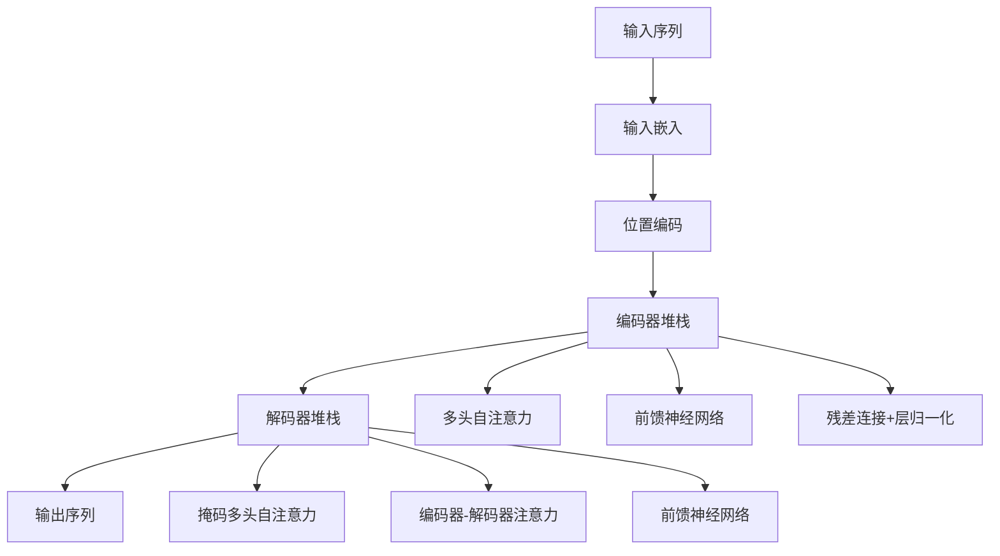

# Transformer架构原理

## 1. Transformer概述

**Transformer** 是2017年由Google提出的革命性神经网络架构，彻底改变了自然语言处理领域，成为现代大语言模型的基础。

### 大白话理解
Transformer就像一个"超级阅读理解器"：它能够同时关注文本中的所有单词，理解它们之间的关系，而不是像传统方法那样逐个单词处理。

## 2. Transformer核心架构



## 3. 自注意力机制（Self-Attention）

### 3.1 注意力机制核心思想

**自注意力**让模型能够计算序列中每个位置与其他所有位置的相关性权重。

```python
import torch
import torch.nn as nn
import math

class SimpleSelfAttention(nn.Module):
    """简化的自注意力机制实现"""
    
    def __init__(self, d_model, d_k, d_v):
        """
        初始化自注意力层
        
        参数:
            d_model: 模型维度
            d_k: 查询和键的维度
            d_v: 值的维度
        """
        super(SimpleSelfAttention, self).__init__()
        self.d_k = d_k
        
        # 线性变换层：将输入映射到Q、K、V空间
        self.W_q = nn.Linear(d_model, d_k)  # 查询变换
        self.W_k = nn.Linear(d_model, d_k)  # 键变换
        self.W_v = nn.Linear(d_model, d_v)  # 值变换
    
    def forward(self, x, mask=None):
        """
        前向传播
        
        参数:
            x: 输入张量 [batch_size, seq_len, d_model]
            mask: 注意力掩码
        
        返回:
            注意力输出和注意力权重
        """
        batch_size, seq_len, d_model = x.size()
        
        # 计算Q、K、V
        Q = self.W_q(x)  # [batch_size, seq_len, d_k]
        K = self.W_k(x)  # [batch_size, seq_len, d_k]
        V = self.W_v(x)  # [batch_size, seq_len, d_v]
        
        # 计算注意力分数: Q * K^T / sqrt(d_k)
        scores = torch.matmul(Q, K.transpose(-2, -1)) / math.sqrt(self.d_k)
        
        # 应用掩码（如果有）
        if mask is not None:
            scores = scores.masked_fill(mask == 0, -1e9)
        
        # Softmax得到注意力权重
        attention_weights = torch.softmax(scores, dim=-1)
        
        # 加权求和得到输出
        output = torch.matmul(attention_weights, V)
        
        return output, attention_weights

# 自注意力机制演示
def self_attention_demo():
    """自注意力机制演示"""
    
    # 创建示例输入
    # 假设有3个单词，每个单词用4维向量表示
    x = torch.tensor([
        [[1.0, 0.5, 0.2, 0.8],  # 单词1
         [0.3, 0.9, 0.1, 0.4],  # 单词2
         [0.7, 0.2, 0.6, 0.3]]  # 单词3
    ])
    
    print("输入序列形状:", x.shape)
    print("输入数据:")
    for i, word in enumerate(x[0]):
        print(f"单词{i+1}: {word.tolist()}")
    
    # 创建自注意力层
    attention_layer = SimpleSelfAttention(d_model=4, d_k=3, d_v=2)
    
    # 前向传播
    output, weights = attention_layer(x)
    
    print(f"\n注意力输出形状: {output.shape}")
    print("注意力权重矩阵:")
    print(weights[0].detach().numpy())
    
    # 解释注意力权重
    print("\n=== 注意力权重解释 ===")
    for i in range(weights.shape[2]):
        print(f"单词{i+1}对其他单词的关注度: {weights[0, :, i].tolist()}")

self_attention_demo()
```

### 3.2 多头注意力（Multi-Head Attention）

**多头注意力**将注意力机制扩展到多个"头"，每个头学习不同的表示子空间。

```python
class MultiHeadAttention(nn.Module):
    """多头注意力实现"""
    
    def __init__(self, d_model, num_heads):
        """
        初始化多头注意力
        
        参数:
            d_model: 模型维度
            num_heads: 注意力头数量
        """
        super(MultiHeadAttention, self).__init__()
        self.d_model = d_model
        self.num_heads = num_heads
        self.d_k = d_model // num_heads
        
        # 确保d_model能被num_heads整除
        assert d_model % num_heads == 0
        
        # 线性变换层
        self.W_q = nn.Linear(d_model, d_model)
        self.W_k = nn.Linear(d_model, d_model)
        self.W_v = nn.Linear(d_model, d_model)
        self.W_o = nn.Linear(d_model, d_model)
    
    def forward(self, Q, K, V, mask=None):
        """
        前向传播
        
        参数:
            Q, K, V: 查询、键、值张量
            mask: 注意力掩码
        """
        batch_size = Q.size(0)
        
        # 线性变换并分头
        Q = self.W_q(Q).view(batch_size, -1, self.num_heads, self.d_k).transpose(1, 2)
        K = self.W_k(K).view(batch_size, -1, self.num_heads, self.d_k).transpose(1, 2)
        V = self.W_v(V).view(batch_size, -1, self.num_heads, self.d_k).transpose(1, 2)
        
        # 计算注意力分数
        scores = torch.matmul(Q, K.transpose(-2, -1)) / math.sqrt(self.d_k)
        
        # 应用掩码
        if mask is not None:
            scores = scores.masked_fill(mask == 0, -1e9)
        
        # Softmax得到注意力权重
        attention_weights = torch.softmax(scores, dim=-1)
        
        # 加权求和
        context = torch.matmul(attention_weights, V)
        
        # 合并多头输出
        context = context.transpose(1, 2).contiguous().view(batch_size, -1, self.d_model)
        
        # 输出线性变换
        output = self.W_o(context)
        
        return output, attention_weights
```

## 4. 位置编码（Positional Encoding）

### 4.1 为什么需要位置编码？

Transformer没有循环或卷积结构，需要显式的位置信息来理解序列顺序。

```python
class PositionalEncoding(nn.Module):
    """位置编码实现"""
    
    def __init__(self, d_model, max_len=5000):
        """
        初始化位置编码
        
        参数:
            d_model: 模型维度
            max_len: 最大序列长度
        """
        super(PositionalEncoding, self).__init__()
        
        # 创建位置编码矩阵
        pe = torch.zeros(max_len, d_model)
        position = torch.arange(0, max_len, dtype=torch.float).unsqueeze(1)
        
        # 计算位置编码
        div_term = torch.exp(torch.arange(0, d_model, 2).float() * 
                           (-math.log(10000.0) / d_model))
        
        pe[:, 0::2] = torch.sin(position * div_term)  # 偶数位置用sin
        pe[:, 1::2] = torch.cos(position * div_term)  # 奇数位置用cos
        
        pe = pe.unsqueeze(0).transpose(0, 1)  # [max_len, 1, d_model]
        self.register_buffer('pe', pe)
    
    def forward(self, x):
        """
        前向传播：将位置编码加到输入上
        
        参数:
            x: 输入张量 [seq_len, batch_size, d_model]
        """
        return x + self.pe[:x.size(0), :]

# 位置编码可视化
def visualize_positional_encoding():
    """可视化位置编码"""
    import matplotlib.pyplot as plt
    
    d_model = 64
    max_len = 100
    
    pe = PositionalEncoding(d_model, max_len)
    
    # 获取位置编码矩阵
    positional_encoding = pe.pe.squeeze(1)[:50, :]  # 取前50个位置
    
    plt.figure(figsize=(12, 8))
    
    # 热力图显示位置编码
    plt.subplot(2, 1, 1)
    plt.imshow(positional_encoding.numpy(), cmap='RdBu', aspect='auto')
    plt.colorbar()
    plt.title('位置编码热力图')
    plt.xlabel('维度')
    plt.ylabel('位置')
    
    # 前几个维度的位置编码曲线
    plt.subplot(2, 1, 2)
    for i in range(6):  # 显示前6个维度
        plt.plot(positional_encoding[:, i].numpy(), label=f'维度{i}')
    
    plt.title('位置编码曲线（前6个维度）')
    plt.xlabel('位置')
    plt.ylabel('编码值')
    plt.legend()
    plt.tight_layout()
    plt.show()

# visualize_positional_encoding()
```

## 5. Transformer编码器层

```python
class TransformerEncoderLayer(nn.Module):
    """Transformer编码器层"""
    
    def __init__(self, d_model, num_heads, d_ff, dropout=0.1):
        """
        初始化编码器层
        
        参数:
            d_model: 模型维度
            num_heads: 注意力头数量
            d_ff: 前馈网络隐藏层维度
            dropout: Dropout率
        """
        super(TransformerEncoderLayer, self).__init__()
        
        # 自注意力层
        self.self_attention = MultiHeadAttention(d_model, num_heads)
        self.dropout1 = nn.Dropout(dropout)
        self.norm1 = nn.LayerNorm(d_model)
        
        # 前馈网络
        self.feed_forward = nn.Sequential(
            nn.Linear(d_model, d_ff),
            nn.ReLU(),
            nn.Linear(d_ff, d_model)
        )
        self.dropout2 = nn.Dropout(dropout)
        self.norm2 = nn.LayerNorm(d_model)
    
    def forward(self, x, mask=None):
        """
        前向传播
        
        参数:
            x: 输入张量
            mask: 注意力掩码
        """
        # 自注意力子层
        attn_output, _ = self.self_attention(x, x, x, mask)
        x = self.norm1(x + self.dropout1(attn_output))
        
        # 前馈网络子层
        ff_output = self.feed_forward(x)
        x = self.norm2(x + self.dropout2(ff_output))
        
        return x
```

## 6. Transformer在测试中的应用

### 6.1 模型理解测试

```python
# Transformer模型理解测试框架
class TransformerUnderstandingTest:
    """Transformer模型理解测试"""
    
    def __init__(self):
        self.test_cases = []
    
    def add_attention_test(self, input_text, expected_focus):
        """添加注意力测试用例"""
        self.test_cases.append({
            'type': 'attention',
            'input': input_text,
            'expected': expected_focus
        })
    
    def add_position_test(self, sequences, expected_understanding):
        """添加位置理解测试用例"""
        self.test_cases.append({
            'type': 'position',
            'input': sequences,
            'expected': expected_understanding
        })
    
    def run_tests(self, model):
        """运行测试"""
        results = []
        
        for i, test_case in enumerate(self.test_cases):
            if test_case['type'] == 'attention':
                result = self._test_attention(model, test_case)
            elif test_case['type'] == 'position':
                result = self._test_position(model, test_case)
            
            results.append({
                'test_id': i,
                'type': test_case['type'],
                'passed': result['passed'],
                'details': result['details']
            })
        
        return results
    
    def _test_attention(self, model, test_case):
        """测试注意力机制"""
        # 模拟测试逻辑
        return {
            'passed': True,
            'details': '注意力测试通过'
        }
    
    def _test_position(self, model, test_case):
        """测试位置理解"""
        # 模拟测试逻辑
        return {
            'passed': True,
            'details': '位置理解测试通过'
        }

# 创建测试实例
transformer_test = TransformerUnderstandingTest()

# 添加测试用例
transformer_test.add_attention_test(
    "猫追老鼠",
    "模型应该关注'猫'和'老鼠'之间的关系"
)

transformer_test.add_position_test(
    ["我爱北京", "北京爱我"],
    "模型应该理解词序对语义的影响"
)

print("Transformer理解测试框架已创建")
```

### 6.2 性能测试指标

```python
# Transformer性能测试指标
def transformer_performance_metrics():
    """Transformer性能测试指标"""
    
    metrics = {
        "推理速度": {
            "描述": "模型处理单个样本的时间",
            "测试方法": "批量推理计时",
            "优化目标": "降低推理延迟"
        },
        "内存占用": {
            "描述": "模型运行时的内存使用量",
            "测试方法": "内存监控工具",
            "优化目标": "减少内存消耗"
        },
        "注意力模式": {
            "描述": "注意力权重的分布模式",
            "测试方法": "注意力可视化分析",
            "优化目标": "确保合理的注意力分布"
        },
        "长序列处理": {
            "描述": "处理长文本序列的能力",
            "测试方法": "不同长度序列测试",
            "优化目标": "保持长序列下的性能"
        }
    }
    
    print("=== Transformer性能测试指标 ===")
    for metric, info in metrics.items():
        print(f"\n{metric}:")
        for key, value in info.items():
            print(f"  {key}: {value}")

transformer_performance_metrics()
```

## 7. 常见问题与测试要点

### Q: Transformer为什么比RNN更适合并行计算？
**A**: Transformer的自注意力机制可以同时计算所有位置之间的关系，而RNN需要顺序处理，无法并行化。

### Q: 位置编码为什么使用正弦和余弦函数？
**A**: 正弦余弦函数具有周期性，可以表示相对位置关系，且能够外推到训练时未见过的序列长度。

### Q: 如何测试Transformer的位置理解能力？
**A**: 使用词序敏感的测试用例，如"猫追老鼠"vs"老鼠追猫"，检查模型是否能区分不同词序的语义差异。

## 8. 测试工程师关注点

### 8.1 模型行为测试
- **注意力可视化**: 确保模型关注正确的信息
- **位置敏感性**: 测试模型对词序的理解
- **长序列处理**: 验证模型处理长文本的能力

### 8.2 性能基准测试
- **推理速度**: 建立性能基准线
- **内存使用**: 监控资源消耗
- **可扩展性**: 测试不同规模下的表现

### 8.3 鲁棒性测试
- **输入扰动**: 测试对噪声的抵抗能力
- **边界情况**: 处理极端输入的能力
- **一致性**: 确保相同输入产生稳定输出

---
*下一节：[注意力机制详解](注意力机制详解.md)*