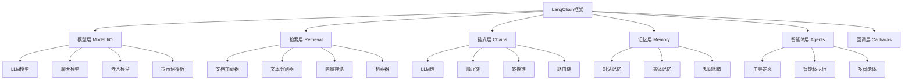

# LangChain框架概述

## 1. LangChain框架介绍

**LangChain** 是一个用于构建大语言模型应用的框架，提供标准化的接口、组件和工具链，简化LLM应用的开发流程。

### 大白话理解
LangChain就像"大模型应用的乐高积木"：提供各种标准化组件，让你可以快速搭建复杂的AI应用，而不用从头造轮子。

## 2. LangChain核心架构



## 3. 核心组件详解

### 3.1 模型层（Model I/O）

**模型层**负责与各种LLM模型的交互，提供统一的接口。

```python
from langchain.llms import OpenAI
from langchain.chat_models import ChatOpenAI
from langchain.prompts import PromptTemplate
from langchain.schema import HumanMessage, SystemMessage

class ModelIODemo:
    """模型层使用演示"""
    
    def __init__(self, openai_api_key):
        self.openai_api_key = openai_api_key
    
    def basic_llm_usage(self):
        """基础LLM使用"""
        # 创建LLM实例
        llm = OpenAI(
            openai_api_key=self.openai_api_key,
            model_name="gpt-3.5-turbo",
            temperature=0.7,
            max_tokens=500
        )
        
        # 直接调用
        response = llm("请用一句话介绍人工智能")
        return response
    
    def chat_model_usage(self):
        """聊天模型使用"""
        # 创建聊天模型
        chat = ChatOpenAI(
            openai_api_key=self.openai_api_key,
            model_name="gpt-3.5-turbo",
            temperature=0.7
        )
        
        # 构建消息
        messages = [
            SystemMessage(content="你是一个专业的AI助手"),
            HumanMessage(content="请介绍机器学习的基本概念")
        ]
        
        # 调用聊天模型
        response = chat(messages)
        return response.content
    
    def prompt_template_usage(self):
        """提示词模板使用"""
        # 创建提示词模板
        template = """你是一个{role}。请用{style}风格回答以下问题：{question}"""
        
        prompt = PromptTemplate(
            input_variables=["role", "style", "question"],
            template=template
        )
        
        # 格式化提示词
        formatted_prompt = prompt.format(
            role="机器学习专家",
            style="通俗易懂",
            question="什么是深度学习？"
        )
        
        return formatted_prompt

# 演示代码（需要真实API密钥）
# demo = ModelIODemo("your_api_key")
# print("基础LLM:", demo.basic_llm_usage())
# print("聊天模型:", demo.chat_model_usage())
# print("提示词模板:", demo.prompt_template_usage())
```

### 3.2 检索层（Retrieval）

**检索层**负责文档的加载、处理和检索，是RAG系统的核心。

```python
from langchain.document_loaders import TextLoader
from langchain.text_splitter import CharacterTextSplitter
from langchain.embeddings import OpenAIEmbeddings
from langchain.vectorstores import FAISS

class RetrievalDemo:
    """检索层使用演示"""
    
    def __init__(self, openai_api_key):
        self.embeddings = OpenAIEmbeddings(openai_api_key=openai_api_key)
    
    def document_processing_pipeline(self, file_path):
        """文档处理流水线"""
        # 1. 文档加载
        loader = TextLoader(file_path)
        documents = loader.load()
        
        print(f"加载文档: {len(documents)}个")
        
        # 2. 文本分割
        text_splitter = CharacterTextSplitter(
            chunk_size=1000,
            chunk_overlap=200
        )
        chunks = text_splitter.split_documents(documents)
        
        print(f"分割后块数: {len(chunks)}")
        
        # 3. 创建向量存储
        vector_store = FAISS.from_documents(chunks, self.embeddings)
        
        return vector_store
    
    def semantic_search(self, vector_store, query, k=3):
        """语义搜索"""
        # 检索相似文档
        similar_docs = vector_store.similarity_search(query, k=k)
        
        print(f"\n查询: {query}")
        print(f"找到 {len(similar_docs)} 个相关文档:")
        
        for i, doc in enumerate(similar_docs):
            print(f"\n文档 {i+1}:")
            print(f"内容: {doc.page_content[:200]}...")
            print(f"元数据: {doc.metadata}")
        
        return similar_docs
```

## 4. 链式层（Chains）实战

### 4.1 基础链式操作

```python
from langchain.chains import LLMChain, SimpleSequentialChain
from langchain.prompts import PromptTemplate

class ChainsDemo:
    """链式层使用演示"""
    
    def __init__(self, llm):
        self.llm = llm
    
    def simple_chain_demo(self):
        """简单链式演示"""
        # 创建提示词模板
        prompt = PromptTemplate(
            input_variables=["topic"],
            template="请用三段话介绍{topic}。"
        )
        
        # 创建LLM链
        chain = LLMChain(llm=self.llm, prompt=prompt)
        
        # 执行链
        result = chain.run("人工智能")
        return result
    
    def sequential_chain_demo(self):
        """顺序链演示"""
        # 第一个链：生成主题
        prompt1 = PromptTemplate(
            input_variables=["domain"],
            template="请为{domain}领域生成3个有趣的研究主题。"
        )
        chain1 = LLMChain(llm=self.llm, prompt=prompt1, output_key="topics")
        
        # 第二个链：详细说明
        prompt2 = PromptTemplate(
            input_variables=["topics"],
            template="请为以下主题提供详细说明：{topics}"
        )
        chain2 = LLMChain(llm=self.llm, prompt=prompt2, output_key="descriptions")
        
        # 创建顺序链
        overall_chain = SimpleSequentialChain(
            chains=[chain1, chain2],
            verbose=True
        )
        
        # 执行顺序链
        result = overall_chain.run("机器学习")
        return result
    
    def conditional_chain_demo(self):
        """条件链演示"""
        # 创建多个提示词模板
        technical_prompt = PromptTemplate(
            input_variables=["question"],
            template="作为技术专家，请详细解答：{question}"
        )
        
        simple_prompt = PromptTemplate(
            input_variables=["question"],
            template="请用通俗语言简单回答：{question}"
        )
        
        # 根据问题复杂度选择不同的链
        def route_question(question):
            if len(question) > 50:  # 简单判断
                return "simple"
            else:
                return "technical"
        
        # 创建路由链（简化版）
        def conditional_chain(question):
            route = route_question(question)
            
            if route == "technical":
                chain = LLMChain(llm=self.llm, prompt=technical_prompt)
            else:
                chain = LLMChain(llm=self.llm, prompt=simple_prompt)
            
            return chain.run(question)
        
        return conditional_chain
```

## 5. 智能体层（Agents）实战

### 5.1 工具定义与使用

```python
from langchain.agents import Tool, AgentType, initialize_agent
from langchain.tools import BaseTool

class CustomToolsDemo:
    """自定义工具演示"""
    
    def __init__(self, llm):
        self.llm = llm
    
    def create_calculator_tool(self):
        """创建计算器工具"""
        
        class CalculatorTool(BaseTool):
            name = "计算器"
            description = "用于执行数学计算，输入数学表达式"
            
            def _run(self, expression: str) -> str:
                """执行计算"""
                try:
                    # 简单的表达式计算（实际中应该更安全）
                    result = eval(expression)
                    return f"计算结果: {expression} = {result}"
                except Exception as e:
                    return f"计算错误: {e}"
            
            def _arun(self, expression: str):
                """异步版本"""
                raise NotImplementedError("此工具不支持异步")
        
        return CalculatorTool()
    
    def create_search_tool(self):
        """创建搜索工具（模拟）"""
        
        class SearchTool(BaseTool):
            name = "网络搜索"
            description = "用于搜索网络信息，输入搜索关键词"
            
            def _run(self, query: str) -> str:
                """模拟搜索"""
                # 实际中应该调用真实的搜索API
                return f"搜索 '{query}' 的结果: [模拟搜索结果]"
            
            def _arun(self, query: str):
                raise NotImplementedError("此工具不支持异步")
        
        return SearchTool()
    
    def create_agent_with_tools(self):
        """创建带工具的智能体"""
        # 创建工具列表
        tools = [
            self.create_calculator_tool(),
            self.create_search_tool()
        ]
        
        # 初始化智能体
        agent = initialize_agent(
            tools=tools,
            llm=self.llm,
            agent=AgentType.ZERO_SHOT_REACT_DESCRIPTION,
            verbose=True
        )
        
        return agent
    
    def agent_demo(self):
        """智能体演示"""
        agent = self.create_agent_with_tools()
        
        # 测试问题
        test_questions = [
            "计算一下 125 * 38 等于多少？",
            "搜索人工智能的最新发展"
        ]
        
        results = []
        for question in test_questions:
            print(f"\n问题: {question}")
            try:
                result = agent.run(question)
                results.append(result)
                print(f"回答: {result}")
            except Exception as e:
                print(f"错误: {e}")
        
        return results
```

## 6. 记忆层（Memory）实战

### 6.1 对话记忆管理

```python
from langchain.memory import ConversationBufferMemory, ConversationSummaryMemory

class MemoryDemo:
    """记忆层使用演示"""
    
    def __init__(self, llm):
        self.llm = llm
    
    def buffer_memory_demo(self):
        """缓冲区记忆演示"""
        # 创建对话缓冲区记忆
        memory = ConversationBufferMemory(
            memory_key="chat_history",
            return_messages=True
        )
        
        # 模拟多轮对话
        conversations = [
            ("用户", "你好，我是张三"),
            ("AI", "你好张三，很高兴认识你！"),
            ("用户", "我喜欢机器学习和人工智能"),
            ("AI", "那真是太棒了！这些领域有很多有趣的发展。")
        ]
        
        for role, content in conversations:
            if role == "用户":
                memory.chat_memory.add_user_message(content)
            else:
                memory.chat_memory.add_ai_message(content)
        
        # 查看记忆内容
        print("对话记忆:")
        for i, message in enumerate(memory.chat_memory.messages):
            role = "用户" if i % 2 == 0 else "AI"
            print(f"{role}: {message.content}")
        
        return memory
    
    def summary_memory_demo(self):
        """摘要记忆演示"""
        # 创建对话摘要记忆
        memory = ConversationSummaryMemory(
            llm=self.llm,
            memory_key="chat_history"
        )
        
        # 模拟长对话
        long_conversation = [
            "用户: 我想学习Python编程",
            "AI: 很好的选择！Python是入门编程的绝佳语言",
            "用户: 我应该从哪里开始学习？",
            "AI: 建议从基础语法开始，然后学习数据结构和算法",
            "用户: 有什么推荐的学习资源吗？",
            "AI: 可以看看官方文档、在线教程和编程练习平台"
        ]
        
        for message in long_conversation:
            if message.startswith("用户:"):
                memory.save_context(
                    {"input": message[4:]},
                    {"output": ""}
                )
            else:
                # 这里简化处理，实际应该更复杂
                pass
        
        # 获取记忆摘要
        summary = memory.load_memory_variables({})
        print("对话摘要:", summary)
        
        return memory
```

## 7. LangChain测试实战

### 7.1 组件单元测试

```python
import unittest
from unittest.mock import Mock, patch

class LangChainUnitTests(unittest.TestCase):
    """LangChain组件单元测试"""
    
    def test_prompt_template(self):
        """测试提示词模板"""
        from langchain.prompts import PromptTemplate
        
        template = "你好，{name}！今天是{day}。"
        prompt = PromptTemplate(
            input_variables=["name", "day"],
            template=template
        )
        
        # 测试模板格式化
        result = prompt.format(name="张三", day="星期一")
        expected = "你好，张三！今天是星期一。"
        self.assertEqual(result, expected)
    
    def test_chain_execution(self):
        """测试链执行"""
        # 模拟LLM
        mock_llm = Mock()
        mock_llm.return_value = "这是一个测试回答"
        
        from langchain.chains import LLMChain
        from langchain.prompts import PromptTemplate
        
        prompt = PromptTemplate(
            input_variables=["question"],
            template="回答：{question}"
        )
        
        chain = LLMChain(llm=mock_llm, prompt=prompt)
        result = chain.run("测试问题")
        
        self.assertEqual(result, "这是一个测试回答")
        mock_llm.assert_called_once()
    
    def test_memory_functionality(self):
        """测试记忆功能"""
        from langchain.memory import ConversationBufferMemory
        
        memory = ConversationBufferMemory()
        
        # 添加对话
        memory.save_context({"input": "你好"}, {"output": "你好！"})
        memory.save_context({"input": "你叫什么"}, {"output": "我是AI助手"})
        
        # 验证记忆内容
        history = memory.load_memory_variables({})
        self.assertIn("你好", history["history"])
        self.assertIn("AI助手", history["history"])

# 运行测试
if __name__ == "__main__":
    unittest.main()
```

### 7.2 集成测试框架

```python
class LangChainIntegrationTest:
    """LangChain集成测试框架"""
    
    def __init__(self):
        self.test_cases = []
    
    def add_chain_test(self, chain_config, input_data, expected_output):
        """添加链测试用例"""
        self.test_cases.append({
            'type': 'chain',
            'config': chain_config,
            'input': input_data,
            'expected': expected_output
        })
    
    def add_agent_test(self, agent_config, tasks, expected_behavior):
        """添加智能体测试用例"""
        self.test_cases.append({
            'type': 'agent',
            'config': agent_config,
            'tasks': tasks,
            'expected': expected_behavior
        })
    
    def run_integration_tests(self):
        """运行集成测试"""
        results = []
        
        for test_case in self.test_cases:
            if test_case['type'] == 'chain':
                result = self._test_chain_integration(test_case)
            elif test_case['type'] == 'agent':
                result = self._test_agent_integration(test_case)
            
            results.append(result)
        
        return results
    
    def _test_chain_integration(self, test_case):
        """测试链集成"""
        # 实现链集成测试逻辑
        return {
            'test_type': 'chain',
            'passed': True,
            'details': '链集成测试通过'
        }
    
    def _test_agent_integration(self, test_case):
        """测试智能体集成"""
        # 实现智能体集成测试逻辑
        return {
            'test_type': 'agent',
            'passed': True,
            'details': '智能体集成测试通过'
        }

# 创建集成测试实例
integration_test = LangChainIntegrationTest()

# 添加测试用例
integration_test.add_chain_test(
    {"chain_type": "sequential", "components": ["prompt", "llm"]},
    {"input": "测试输入"},
    {"output_contains": "测试"}
)

print("LangChain集成测试框架已创建")
```

## 8. 性能测试与优化

### 8.1 性能基准测试

```python
import time
import psutil
import threading

class PerformanceBenchmark:
    """LangChain性能基准测试"""
    
    def __init__(self):
        self.metrics = {}
    
    def measure_response_time(self, chain, test_inputs, iterations=10):
        """测量响应时间"""
        times = []
        
        for i in range(iterations):
            start_time = time.time()
            
            for test_input in test_inputs:
                chain.run(test_input)
            
            end_time = time.time()
            times.append(end_time - start_time)
        
        avg_time = sum(times) / len(times)
        self.metrics['response_time'] = {
            'average': avg_time,
            'min': min(times),
            'max': max(times)
        }
        
        return self.metrics['response_time']
    
    def measure_memory_usage(self, chain, test_input):
        """测量内存使用"""
        process = psutil.Process()
        
        # 测量前内存
        memory_before = process.memory_info().rss / 1024 / 1024  # MB
        
        # 执行操作
        chain.run(test_input)
        
        # 测量后内存
        memory_after = process.memory_info().rss / 1024 / 1024  # MB
        
        memory_increase = memory_after - memory_before
        self.metrics['memory_usage'] = {
            'before': memory_before,
            'after': memory_after,
            'increase': memory_increase
        }
        
        return self.metrics['memory_usage']
    
    def run_concurrent_tests(self, chain, test_input, num_threads=5):
        """运行并发测试"""
        results = []
        
        def worker():
            start_time = time.time()
            chain.run(test_input)
            end_time = time.time()
            results.append(end_time - start_time)
        
        threads = []
        for i in range(num_threads):
            thread = threading.Thread(target=worker)
            threads.append(thread)
            thread.start()
        
        for thread in threads:
            thread.join()
        
        self.metrics['concurrent_performance'] = {
            'average_time': sum(results) / len(results),
            'total_time': max(results),
            'throughput': len(results) / max(results) if max(results) > 0 else 0
        }
        
        return self.metrics['concurrent_performance']

# 性能测试演示
benchmark = PerformanceBenchmark()
print("性能基准测试框架已创建")
```

## 9. 测试工程师关注点

### 9.1 功能测试重点
- **组件兼容性**: 确保各层组件正确协同工作
- **错误处理**: 测试异常输入和边界情况
- **配置验证**: 验证不同配置下的行为一致性

### 9.2 性能测试指标
- **响应时间**: 建立性能基准线
- **资源使用**: 监控内存和CPU消耗
- **并发能力**: 测试多用户同时访问的性能

### 9.3 安全测试要点
- **输入验证**: 防止恶意输入攻击
- **数据隐私**: 确保用户数据安全
- **API安全**: 保护API密钥和访问权限

---
*下一节：[Memory机制](Memory机制.md)*