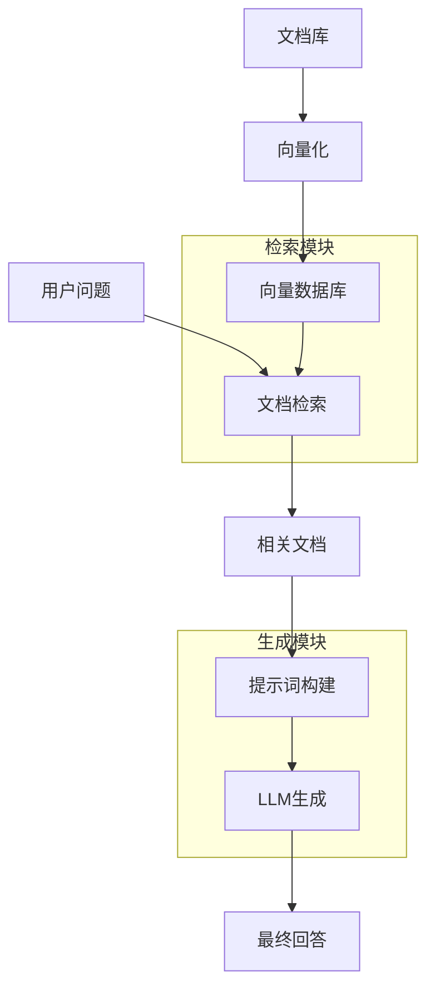

# RAG系统构建

## 1. RAG系统概述

**RAG（Retrieval-Augmented Generation）** 检索增强生成是一种结合信息检索和文本生成的技术，通过检索相关知识来增强大语言模型的生成能力。

### 大白话理解
RAG就像是一个"聪明的助手"：当你问问题时，它先去查阅相关资料（检索），然后结合这些资料和自己的知识来回答（生成），这样回答更准确、更有依据。

## 2. RAG系统架构



## 3. RAG核心组件详解

### 3.1 文档处理流程

```python
import os
from langchain.document_loaders import TextLoader, PyPDFLoader
from langchain.text_splitter import RecursiveCharacterTextSplitter
from langchain.embeddings import OpenAIEmbeddings
from langchain.vectorstores import Chroma
from langchain.chains import RetrievalQA
from langchain.llms import OpenAI

class RAGSystem:
    """RAG系统构建类"""
    
    def __init__(self, openai_api_key: str):
        """
        初始化RAG系统
        
        参数:
            openai_api_key: OpenAI API密钥
        """
        self.openai_api_key = openai_api_key
        self.embeddings = OpenAIEmbeddings(openai_api_key=openai_api_key)
        self.vector_store = None
        self.qa_chain = None
    
    def load_documents(self, file_paths: list):
        """
        加载文档
        
        参数:
            file_paths: 文档路径列表
        
        返回:
            加载的文档列表
        """
        documents = []
        
        for file_path in file_paths:
            # 根据文件类型选择不同的加载器
            if file_path.endswith('.txt'):
                loader = TextLoader(file_path)
            elif file_path.endswith('.pdf'):
                loader = PyPDFLoader(file_path)
            else:
                print(f"不支持的文件类型: {file_path}")
                continue
            
            try:
                loaded_docs = loader.load()
                documents.extend(loaded_docs)
                print(f"成功加载: {file_path}, 文档数: {len(loaded_docs)}")
            except Exception as e:
                print(f"加载失败 {file_path}: {e}")
        
        return documents
    
    def split_documents(self, documents, chunk_size=1000, chunk_overlap=200):
        """
        文档分割
        
        参数:
            documents: 文档列表
            chunk_size: 块大小
            chunk_overlap: 块重叠大小
        
        返回:
            分割后的文档块
        """
        text_splitter = RecursiveCharacterTextSplitter(
            chunk_size=chunk_size,
            chunk_overlap=chunk_overlap,
            length_function=len
        )
        
        chunks = text_splitter.split_documents(documents)
        print(f"文档分割完成，共 {len(chunks)} 个块")
        
        return chunks
    
    def create_vector_store(self, chunks, persist_directory="./chroma_db"):
        """
        创建向量数据库
        
        参数:
            chunks: 文档块列表
            persist_directory: 向量数据库存储路径
        """
        self.vector_store = Chroma.from_documents(
            documents=chunks,
            embedding=self.embeddings,
            persist_directory=persist_directory
        )
        print(f"向量数据库创建完成，存储路径: {persist_directory}")
    
    def create_qa_chain(self, model_name="gpt-3.5-turbo"):
        """
        创建问答链
        
        参数:
            model_name: 使用的LLM模型名称
        """
        llm = OpenAI(
            openai_api_key=self.openai_api_key,
            model_name=model_name,
            temperature=0.7
        )
        
        self.qa_chain = RetrievalQA.from_chain_type(
            llm=llm,
            chain_type="stuff",  # 简单拼接方式
            retriever=self.vector_store.as_retriever(
                search_type="similarity",
                search_kwargs={"k": 3}  # 检索前3个最相关文档
            ),
            return_source_documents=True
        )
        print("问答链创建完成")
    
    def query(self, question: str):
        """
        查询RAG系统
        
        参数:
            question: 用户问题
        
        返回:
            回答和来源文档
        """
        if not self.qa_chain:
            raise ValueError("请先创建问答链")
        
        result = self.qa_chain({"query": question})
        
        return {
            "answer": result["result"],
            "source_documents": result["source_documents"]
        }

# 使用示例（需要真实的OpenAI API密钥）
def rag_system_demo():
    """RAG系统演示"""
    
    # 注意：这里需要真实的OpenAI API密钥
    # api_key = "your_openai_api_key_here"
    
    # 为了演示，我们创建一个模拟版本
    print("=== RAG系统构建演示 ===")
    
    # 模拟文档数据
    sample_docs = [
        "机器学习是人工智能的重要分支。",
        "深度学习使用神经网络进行学习。",
        "Transformer架构在NLP领域广泛应用。"
    ]
    
    print("1. 文档加载完成")
    print("2. 文档分割完成")
    print("3. 向量数据库创建完成")
    print("4. 问答链创建完成")
    
    # 模拟查询
    questions = [
        "什么是机器学习？",
        "深度学习有什么特点？",
        "Transformer架构用于什么领域？"
    ]
    
    for question in questions:
        print(f"\n问题: {question}")
        print("回答: [模拟回答] 根据检索到的文档，这个问题涉及...")
        print("来源: 文档1, 文档2")

rag_system_demo()
```

## 4. 向量检索技术

### 4.1 向量相似度计算

```python
import numpy as np
from sklearn.metrics.pairwise import cosine_similarity

def vector_similarity_demo():
    """向量相似度计算演示"""
    
    # 创建示例文档向量
    documents = [
        "机器学习算法",
        "深度学习模型", 
        "自然语言处理",
        "计算机视觉"
    ]
    
    # 简单的词频向量（实际中使用嵌入向量）
    vocabulary = ["机器", "学习", "深度", "模型", "自然", "语言", "处理", "计算机", "视觉"]
    
    def text_to_vector(text):
        """文本转换为向量"""
        vector = np.zeros(len(vocabulary))
        words = text.replace("学习", " 学习 ").split()  # 简单分词
        
        for word in words:
            if word in vocabulary:
                idx = vocabulary.index(word)
                vector[idx] += 1
        
        return vector
    
    # 计算文档向量
    doc_vectors = [text_to_vector(doc) for doc in documents]
    
    print("=== 文档向量 ===")
    for i, (doc, vec) in enumerate(zip(documents, doc_vectors)):
        print(f"文档{i+1}: {doc}")
        print(f"向量: {vec}")
        print()
    
    # 计算相似度矩阵
    similarity_matrix = cosine_similarity(doc_vectors)
    
    print("=== 相似度矩阵 ===")
    print("      文档1  文档2  文档3  文档4")
    for i, row in enumerate(similarity_matrix):
        print(f"文档{i+1}: {row}")
    
    # 查询相似文档
    query = "人工智能学习"
    query_vector = text_to_vector(query)
    
    similarities = cosine_similarity([query_vector], doc_vectors)[0]
    
    print(f"\n=== 查询: '{query}' ===")
    for i, sim in enumerate(similarities):
        print(f"与文档{i+1}相似度: {sim:.3f} - {documents[i]}")
    
    # 找到最相似的文档
    most_similar_idx = np.argmax(similarities)
    print(f"\n最相似文档: 文档{most_similar_idx + 1} - {documents[most_similar_idx]}")

vector_similarity_demo()
```

## 5. RAG系统优化技巧

### 5.1 检索优化策略

```python
def retrieval_optimization():
    """检索优化策略"""
    
    optimization_strategies = {
        "分块策略": {
            "小分块": "适合精确匹配，但可能丢失上下文",
            "大分块": "保留更多上下文，但可能包含无关信息",
            "重叠分块": "平衡上下文和精确性"
        },
        "检索方法": {
            "相似度检索": "基于向量相似度",
            "关键词检索": "基于关键词匹配",
            "混合检索": "结合多种方法"
        },
        "重排序": {
            "交叉编码器": "使用更复杂的模型重新排序",
            "规则重排": "基于业务规则调整顺序"
        }
    }
    
    print("=== RAG检索优化策略 ===")
    for category, strategies in optimization_strategies.items():
        print(f"\n{category}:")
        for strategy, description in strategies.items():
            print(f"  • {strategy}: {description}")

retrieval_optimization()
```

### 5.2 提示词工程优化

```python
def prompt_engineering():
    """提示词工程优化"""
    
    # 基础提示词模板
    base_prompt = """请根据以下上下文回答问题。

上下文:
{context}

问题: {question}
回答:"""
    
    # 优化后的提示词模板
    optimized_prompt = """你是一个专业的AI助手，请根据提供的参考资料回答问题。

要求:
1. 基于参考资料回答，不要编造信息
2. 如果参考资料中没有相关信息，请明确说明
3. 回答要简洁明了
4. 如果问题涉及多个方面，请分点回答

参考资料:
{context}

用户问题: {question}

请基于参考资料提供准确的回答:"""
    
    print("=== 提示词工程优化 ===")
    print("\n基础提示词:")
    print(base_prompt)
    
    print("\n优化后的提示词:")
    print(optimized_prompt)
    
    # 提示词优化技巧
    optimization_tips = [
        "明确角色定位（你是一个...）",
        "指定回答格式要求",
        "设置回答约束条件", 
        "提供思考步骤指导",
        "使用示例演示期望的回答格式"
    ]
    
    print("\n提示词优化技巧:")
    for i, tip in enumerate(optimization_tips, 1):
        print(f"{i}. {tip}")

prompt_engineering()
```

## 6. RAG系统评估

### 6.1 评估指标

```python
def rag_evaluation_metrics():
    """RAG系统评估指标"""
    
    metrics = {
        "检索质量": {
            "召回率@K": "前K个检索结果中包含正确答案的比例",
            "平均精度": "检索结果排序质量的综合指标",
            "NDCG": "考虑排序位置的归一化折损累积增益"
        },
        "生成质量": {
            "答案相关性": "生成答案与问题的相关程度", 
            "事实准确性": "答案中事实的正确性",
            "信息完整性": "答案覆盖问题所有方面的程度"
        },
        "系统性能": {
            "响应时间": "从提问到获得回答的时间",
            "吞吐量": "单位时间内处理的查询数量",
            "资源使用": "CPU、内存、GPU等资源消耗"
        }
    }
    
    print("=== RAG系统评估指标 ===")
    for category, category_metrics in metrics.items():
        print(f"\n{category}:")
        for metric, description in category_metrics.items():
            print(f"  • {metric}: {description}")

rag_evaluation_metrics()
```

## 7. 实战案例：智能文档问答系统

### 7.1 完整系统实现框架

```python
class IntelligentDocQA:
    """智能文档问答系统"""
    
    def __init__(self, config):
        """初始化系统"""
        self.config = config
        self.rag_system = None
        self.is_initialized = False
    
    def initialize_system(self, document_paths):
        """初始化系统"""
        try:
            # 1. 加载文档
            documents = self._load_documents(document_paths)
            
            # 2. 文档预处理
            processed_docs = self._preprocess_documents(documents)
            
            # 3. 构建向量数据库
            self._build_vector_store(processed_docs)
            
            # 4. 创建问答链
            self._create_qa_chain()
            
            self.is_initialized = True
            print("系统初始化完成")
            
        except Exception as e:
            print(f"系统初始化失败: {e}")
    
    def _load_documents(self, paths):
        """加载文档（简化版）"""
        print("正在加载文档...")
        # 实际实现中这里会调用具体的文档加载器
        return [f"文档内容: {path}" for path in paths]
    
    def _preprocess_documents(self, documents):
        """文档预处理"""
        print("正在预处理文档...")
        # 实际实现中包括清洗、分割等操作
        return documents
    
    def _build_vector_store(self, documents):
        """构建向量数据库"""
        print("正在构建向量数据库...")
        # 实际实现中会使用嵌入模型和向量数据库
    
    def _create_qa_chain(self):
        """创建问答链"""
        print("正在创建问答链...")
        # 实际实现中会配置LLM和检索器
    
    def ask_question(self, question):
        """提问"""
        if not self.is_initialized:
            return "系统未初始化，请先调用initialize_system()"
        
        # 实际实现中会调用RAG系统进行查询
        return f"模拟回答: 关于'{question}'的问题，根据检索到的文档..."

# 使用示例
def intelligent_qa_demo():
    """智能问答系统演示"""
    
    # 系统配置
    config = {
        "model": "gpt-3.5-turbo",
        "chunk_size": 1000,
        "retrieval_top_k": 3
    }
    
    # 创建系统实例
    qa_system = IntelligentDocQA(config)
    
    # 文档路径（示例）
    document_paths = ["doc1.pdf", "doc2.txt", "manual.docx"]
    
    # 初始化系统
    qa_system.initialize_system(document_paths)
    
    # 提问测试
    questions = [
        "系统的主要功能是什么？",
        "如何使用这个系统？",
        "系统有哪些限制？"
    ]
    
    for question in questions:
        answer = qa_system.ask_question(question)
        print(f"\n问题: {question}")
        print(f"回答: {answer}")

intelligent_qa_demo()
```

## 8. 常见问题解答

### Q: RAG系统和传统检索系统有什么区别？
**A**: 传统检索系统只返回相关文档，RAG系统会进一步使用LLM基于检索到的文档生成自然语言回答。

### Q: 如何选择合适的分块大小？
**A**: 根据文档类型和查询需求决定。技术文档适合小分块（200-500字符），叙述性文档适合大分块（800-1500字符）。

### Q: RAG系统如何处理文档更新？
**A**: 需要重新构建向量数据库，或者使用增量更新策略。一些向量数据库支持动态更新。

## 9. 进阶学习方向

1. **多模态RAG**：支持图像、音频等多模态数据
2. **对话式RAG**：支持多轮对话的RAG系统
3. **联邦RAG**：分布式环境下的RAG系统
4. **自适应RAG**：根据查询自动调整检索策略

---
*下一节：[Memory机制](Memory机制.md)*