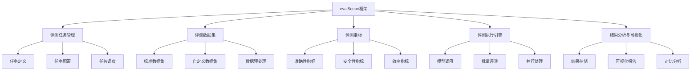

# evalScope框架详解

## 1. evalScope框架概述

**evalScope** 是一个专门用于大语言模型（LLM）评测的开源框架，提供全面的评测工具链和标准化的评测流程。

### 大白话理解
evalScope就像是一个"模型考试系统"：它提供标准化的考卷（评测数据集）、评分标准（评测指标）和考试流程（评测流程），帮助我们对不同的大模型进行公平、全面的能力测试。

## 2. evalScope核心架构



## 3. evalScope核心组件详解

### 3.1 评测任务定义

evalScope使用YAML或JSON格式定义评测任务，确保评测的可重复性和标准化。

```yaml
# 示例：文本分类评测任务定义
task:
  name: "文本情感分类评测"
  type: "classification"
  description: "评测模型在情感分析任务上的表现"
  
dataset:
  name: "SST-2"
  path: "./data/sst2/"
  format: "jsonl"
  
metrics:
  - name: "accuracy"
    weight: 0.6
  - name: "f1_score"
    weight: 0.4
  
model:
  name: "bert-base-uncased"
  provider: "huggingface"
  parameters:
    max_length: 512
    temperature: 0.7
    
evaluation:
  batch_size: 32
  num_workers: 4
  device: "cuda"
```

### 3.2 基础使用示例

```python
import evalscope as es
import pandas as pd
import numpy as np
from typing import Dict, List, Any

# 1. 初始化evalScope框架
# 创建评测管理器
evaluator = es.Evaluator(
    project_name="llm_comparison",
    output_dir="./eval_results/"
)

# 2. 定义自定义评测任务
class SentimentAnalysisTask(es.BaseTask):
    """情感分析评测任务"""
    
    def __init__(self):
        super().__init__(
            task_name="sentiment_analysis",
            task_type="classification"
        )
    
    def prepare_dataset(self) -> List[Dict]:
        """准备评测数据集"""
        # 示例数据：情感分类
        dataset = [
            {
                "id": "1",
                "text": "这个电影太精彩了，演员表演出色！",
                "label": "positive",
                "category": "movie_review"
            },
            {
                "id": "2", 
                "text": "服务太差了，再也不会来了。",
                "label": "negative",
                "category": "service_review"
            },
            # ... 更多数据
        ]
        return dataset
    
    def evaluate_single(self, model_output: str, ground_truth: Dict) -> Dict[str, Any]:
        """单样本评测"""
        # 简单的关键词匹配评测（实际中应使用更复杂的逻辑）
        positive_keywords = ["好", "精彩", "优秀", "满意", "推荐"]
        negative_keywords = ["差", "糟糕", "失望", "不好", "不推荐"]
        
        # 判断预测情感
        pred_label = "neutral"
        if any(keyword in model_output for keyword in positive_keywords):
            pred_label = "positive"
        elif any(keyword in model_output for keyword in negative_keywords):
            pred_label = "negative"
        
        # 计算准确性
        is_correct = 1 if pred_label == ground_truth["label"] else 0
        
        return {
            "prediction": pred_label,
            "ground_truth": ground_truth["label"],
            "is_correct": is_correct,
            "confidence": 0.8  # 示例置信度
        }

# 3. 创建模型包装器
class SimpleLLMWrapper:
    """简单的LLM模型包装器"""
    
    def __init__(self, model_name: str):
        self.model_name = model_name
        # 这里应该是实际的模型加载代码
        # 为了示例简化，使用模拟响应
        self.responses = {
            "1": "这个电影太精彩了！",
            "2": "服务体验很差。"
        }
    
    def generate(self, text: str, **kwargs) -> str:
        """生成响应"""
        # 模拟模型生成过程
        # 实际中这里应该调用真实的LLM API或本地模型
        if "电影" in text:
            return "这个电影非常精彩，演员表演出色，强烈推荐！"
        elif "服务" in text:
            return "服务体验很差，需要改进。"
        else:
            return "这是一个中性的评论。"

# 4. 执行评测
def run_evaluation():
    """运行完整的评测流程"""
    
    # 创建评测任务实例
    task = SentimentAnalysisTask()
    
    # 准备评测数据
    dataset = task.prepare_dataset()
    print(f"评测数据集大小: {len(dataset)}")
    
    # 创建模型实例
    model = SimpleLLMWrapper("demo_model")
    
    # 执行评测
    results = []
    for sample in dataset:
        # 模型推理
        model_output = model.generate(sample["text"])
        
        # 评测单个样本
        eval_result = task.evaluate_single(model_output, sample)
        eval_result["sample_id"] = sample["id"]
        eval_result["model_output"] = model_output
        
        results.append(eval_result)
    
    # 计算总体指标
    accuracy = sum(r["is_correct"] for r in results) / len(results)
    
    # 输出评测结果
    print(f"\n=== 评测结果 ===")
    print(f"模型名称: {model.model_name}")
    print(f"评测任务: {task.task_name}")
    print(f"样本数量: {len(results)}")
    print(f"准确率: {accuracy:.3f}")
    
    # 详细结果分析
    df_results = pd.DataFrame(results)
    print(f"\n预测分布:")
    print(df_results['prediction'].value_counts())
    
    return df_results, accuracy

# 运行评测
results_df, final_accuracy = run_evaluation()
```

## 4. 高级功能与实战应用

### 4.1 多模型对比评测

```python
# 多模型对比评测示例
def compare_multiple_models():
    """对比多个模型的性能"""
    
    # 定义要评测的模型列表
    models_to_evaluate = [
        ("Model_A", "基于BERT的情感分类模型"),
        ("Model_B", "基于GPT的情感分析模型"), 
        ("Model_C", "基于规则的情感分析")
    ]
    
    comparison_results = {}
    
    for model_name, model_desc in models_to_evaluate:
        print(f"\n正在评测模型: {model_name} - {model_desc}")
        
        # 创建模型实例（这里简化，实际中应加载真实模型）
        model = SimpleLLMWrapper(model_name)
        
        # 执行评测
        task = SentimentAnalysisTask()
        dataset = task.prepare_dataset()
        
        results = []
        for sample in dataset:
            model_output = model.generate(sample["text"])
            eval_result = task.evaluate_single(model_output, sample)
            results.append(eval_result)
        
        # 计算指标
        accuracy = sum(r["is_correct"] for r in results) / len(results)
        
        # 存储结果
        comparison_results[model_name] = {
            "accuracy": accuracy,
            "description": model_desc,
            "results": results
        }
    
    # 输出对比结果
    print("\n=== 模型对比结果 ===")
    for model_name, result in comparison_results.items():
        print(f"{model_name}: 准确率 = {result['accuracy']:.3f}")
    
    return comparison_results

# 执行多模型对比
model_comparison = compare_multiple_models()
```

### 4.2 评测结果可视化

```python
import matplotlib.pyplot as plt
import seaborn as sns

def visualize_evaluation_results(comparison_results):
    """可视化评测结果"""
    
    # 准备数据
    model_names = list(comparison_results.keys())
    accuracies = [result["accuracy"] for result in comparison_results.values()]
    
    # 创建准确率对比图
    plt.figure(figsize=(10, 6))
    
    # 准确率柱状图
    plt.subplot(1, 2, 1)
    bars = plt.bar(model_names, accuracies, color=['skyblue', 'lightgreen', 'lightcoral'])
    plt.title('模型准确率对比')
    plt.ylabel('准确率')
    plt.ylim(0, 1)
    
    # 在柱子上添加数值
    for bar, acc in zip(bars, accuracies):
        plt.text(bar.get_x() + bar.get_width()/2, bar.get_height() + 0.01, 
                f'{acc:.3f}', ha='center', va='bottom')
    
    # 混淆矩阵热力图（示例）
    plt.subplot(1, 2, 2)
    # 这里应该是真实的混淆矩阵数据
    # 为了示例，创建一个模拟的混淆矩阵
    confusion_data = np.array([[8, 1, 1], [1, 7, 2], [0, 2, 8]])
    labels = ['positive', 'negative', 'neutral']
    
    sns.heatmap(confusion_data, annot=True, fmt='d', 
                xticklabels=labels, yticklabels=labels,
                cmap='Blues')
    plt.title('情感分类混淆矩阵（示例）')
    plt.xlabel('预测标签')
    plt.ylabel('真实标签')
    
    plt.tight_layout()
    plt.show()

# 可视化结果
visualize_evaluation_results(model_comparison)
```

## 5. evalScope核心优势

### 5.1 标准化评测流程
- **统一的评测接口**：所有模型使用相同的评测标准
- **可重复的评测结果**：确保评测过程的可重复性
- **自动化的评测报告**：生成详细的评测报告和可视化

### 5.2 灵活的扩展性
- **自定义评测任务**：支持用户定义特定的评测需求
- **多维度评测**：支持准确性、安全性、效率等多维度评测
- **分布式评测**：支持大规模模型的分布式评测

### 5.3 企业级特性
- **性能监控**：实时监控评测进度和资源使用
- **结果追溯**：完整的评测历史记录
- **团队协作**：支持多人协作的评测项目

## 6. 实战技巧与最佳实践

### 6.1 评测数据集设计
```python
# 设计高质量的评测数据集
def create_balanced_dataset():
    """创建平衡的评测数据集"""
    
    # 确保数据集的多样性和平衡性
    categories = ["电影评论", "产品评价", "服务反馈", "新闻情感"]
    sentiments = ["positive", "negative", "neutral"]
    
    balanced_dataset = []
    
    for category in categories:
        for sentiment in sentiments:
            # 每个类别-情感组合添加适量样本
            samples_per_combo = 5
            
            for i in range(samples_per_combo):
                sample = {
                    "id": f"{category}_{sentiment}_{i}",
                    "text": f"这是{category}的{sentiment}评价示例{i}",
                    "label": sentiment,
                    "category": category
                }
                balanced_dataset.append(sample)
    
    return balanced_dataset
```

### 6.2 评测指标选择
```python
# 选择合适的评测指标
def comprehensive_metrics():
    """综合评测指标"""
    
    metrics = {
        "accuracy": "整体准确率",
        "precision": "精确率 - 预测为正例中真正为正例的比例",
        "recall": "召回率 - 真正为正例中被正确预测的比例", 
        "f1_score": "F1分数 - 精确率和召回率的调和平均",
        "inference_time": "推理时间 - 模型处理单个样本的平均时间",
        "memory_usage": "内存使用 - 模型推理时的内存占用"
    }
    
    return metrics
```

## 7. 常见问题解答

### Q: evalScope与其他评测框架（如HELM、OpenCompass）有什么区别？
**A**: evalScope更专注于易用性和灵活性，提供更简洁的API和更直观的配置方式，适合快速原型开发和中小规模评测。

### Q: 如何确保评测的公平性？
**A**: 使用相同的评测数据集、相同的评测指标、相同的评测环境，避免数据泄露和过拟合。

### Q: 评测结果不一致怎么办？
**A**: 检查随机种子设置、数据预处理一致性、模型参数配置等，确保评测过程的可重复性。

## 8. 进阶学习方向

1. **分布式评测**：学习如何在大规模集群上运行评测
2. **自动化评测流水线**：构建CI/CD式的自动评测系统
3. **多模态评测**：扩展评测框架支持图像、音频等多模态数据
4. **安全性与伦理评测**：深入学习模型的安全性和伦理考量评测

---
*下一节：[评测指标与方法](评测指标与方法.md)*