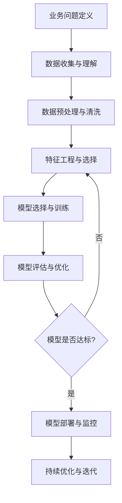

# 机器学习核心概念

## 1. 机器学习本质理解

### 1.1 什么是机器学习？
**机器学习（Machine Learning, ML）** 是人工智能的一个分支，通过算法让计算机从数据中学习模式，从而能够对新数据进行预测或决策，而无需显式编程。

**大白话解释：** 就像教孩子识别动物，给孩子看很多猫、狗的图片，孩子就能学会区分不同的动物，而不需要你告诉他"猫有尖耳朵、狗有长尾巴"这样的具体规则。

### 1.2 机器学习与传统编程的区别

| 特性 | 传统编程 | 机器学习 |
|------|----------|----------|
| **输入** | 规则 + 数据 | 数据 + 答案 |
| **输出** | 答案 | 规则 |
| **核心思想** | 人定义规则 | 机器从数据中学习规则 |
| **适用场景** | 规则明确的问题 | 规则复杂或未知的问题 |

**举例说明：**
- **传统编程**：写一个判断邮件是否为垃圾邮件的规则（如包含"免费"、"赚钱"等关键词）
- **机器学习**：给模型看大量已标记的垃圾邮件和正常邮件，让模型自己学习判断规则

## 2. 机器学习三大类型

### 2.1 监督学习（Supervised Learning）

**定义：** 使用带有标签的数据集进行训练，模型学习输入特征与输出标签之间的映射关系。

**核心特点：**
- 数据有明确的标签（答案）
- 目标是学习从输入到输出的映射函数
- 主要用于预测和分类任务

**常见算法：**
- **分类算法**：逻辑回归、决策树、随机森林、支持向量机
- **回归算法**：线性回归、多项式回归、岭回归

**企业实战场景：**
- 信用评分（预测用户违约概率）
- 客户流失预测（判断客户是否会流失）
- 产品推荐（预测用户可能喜欢的商品）

### 2.2 无监督学习（Unsupervised Learning）

**定义：** 使用无标签的数据集进行训练，模型自动发现数据中的内在结构和模式。

**核心特点：**
- 数据没有明确的标签
- 目标是发现数据的内在结构
- 主要用于聚类和降维

**常见算法：**
- **聚类算法**：K-Means、DBSCAN、层次聚类
- **降维算法**：PCA（主成分分析）、t-SNE
- **关联规则**：Apriori算法

**企业实战场景：**
- 客户分群（将客户分成不同群体）
- 异常检测（发现异常交易或行为）
- 市场细分（识别不同的市场细分）

### 2.3 强化学习（Reinforcement Learning）

**定义：** 智能体通过与环境交互，通过试错学习最优行为策略，以获得最大累积奖励。

**核心特点：**
- 通过试错学习
- 关注长期累积奖励
- 需要与环境持续交互

**常见算法：**
- **值函数方法**：Q-Learning、SARSA
- **策略梯度方法**：REINFORCE、Actor-Critic
- **深度强化学习**：DQN、PPO、A3C

**企业实战场景：**
- 游戏AI（如AlphaGo）
- 机器人控制（如机械臂控制）
- 资源调度（如云计算资源分配）

## 3. 机器学习工作流程详解



### 3.1 业务问题定义
**关键问题：**
- 要解决什么业务问题？
- 如何将业务问题转化为机器学习问题？
- 成功的标准是什么？

**举例：** 电商平台想要提高用户购买转化率
- **业务问题**：提高购买转化率
- **机器学习问题**：预测用户购买概率
- **成功标准**：模型准确率 > 85%

### 3.2 数据收集与理解
**数据来源：**
- 内部数据库
- 第三方数据
- 公开数据集

**数据理解要点：**
- 数据质量评估
- 数据分布分析
- 缺失值处理策略

### 3.3 数据预处理与清洗
**常见处理步骤：**
- 缺失值处理
- 异常值检测与处理
- 数据标准化/归一化
- 类别变量编码

### 3.4 特征工程与选择
**特征工程技巧：**
- 特征变换（对数变换、多项式变换）
- 特征组合（交叉特征）
- 时间特征提取
- 文本特征提取

### 3.5 模型选择与训练
**选择依据：**
- 问题类型（分类/回归/聚类）
- 数据规模
- 计算资源
- 可解释性要求

### 3.6 模型评估与优化
**评估指标：**
- 分类任务：准确率、精确率、召回率、F1分数
- 回归任务：MSE、MAE、R²
- 聚类任务：轮廓系数、Calinski-Harabasz指数

## 4. 关键概念深度解析

### 4.1 过拟合与欠拟合

#### 过拟合（Overfitting）
**定义：** 模型在训练集上表现很好，但在测试集上表现很差。

**大白话解释：** 就像学生死记硬背考题答案，考试时遇到新题目就不会做了。

**识别方法：**
- 训练集准确率远高于测试集
- 学习曲线显示训练误差持续下降，验证误差先降后升

**解决方法：**
- 增加训练数据量
- 简化模型复杂度
- 使用正则化技术
- 早停法（Early Stopping）

#### 欠拟合（Underfitting）
**定义：** 模型在训练集和测试集上表现都很差。

**大白话解释：** 就像学生没有认真学习，考试时什么题目都不会做。

**识别方法：**
- 训练集和测试集准确率都很低
- 学习曲线显示训练误差和验证误差都很高

**解决方法：**
- 增加模型复杂度
- 改进特征工程
- 减少正则化强度
- 增加训练轮数

### 4.2 偏差-方差权衡

**偏差（Bias）：** 模型预测值与真实值的差异，反映模型的拟合能力。

**方差（Variance）：** 模型预测值的波动程度，反映模型的稳定性。

**权衡关系：**
- **高偏差低方差**：欠拟合，模型过于简单
- **低偏差高方差**：过拟合，模型过于复杂
- **理想状态**：低偏差低方差

### 4.3 交叉验证

**目的：** 更准确地评估模型性能，减少数据划分的随机性影响。

**K折交叉验证流程：**
1. 将数据集随机分成K份
2. 每次用K-1份作为训练集，1份作为验证集
3. 重复K次，每次使用不同的验证集
4. 计算K次验证结果的平均值作为最终评估指标

**优势：**
- 充分利用有限数据
- 减少评估结果的方差
- 更可靠的模型性能估计

## 5. 机器学习在企业测试中的应用

### 5.1 AI测试中的机器学习应用

#### 测试用例生成
**应用场景：** 使用机器学习自动生成测试用例

**技术实现：**
- 基于历史测试数据训练模型
- 模型学习测试用例的模式
- 自动生成新的测试用例

**优势：**
- 提高测试覆盖率
- 减少人工编写测试用例的工作量
- 发现人工难以发现的边界情况

#### 缺陷预测
**应用场景：** 预测代码中可能存在的缺陷

**技术实现：**
- 收集代码度量指标（如圈复杂度、代码行数等）
- 训练分类模型预测缺陷概率
- 重点关注高缺陷概率的代码模块

**优势：**
- 提前发现潜在缺陷
- 优化测试资源分配
- 提高软件质量

### 5.2 大模型评测中的机器学习技术

#### 评测指标计算
**应用场景：** 计算大模型的各种评测指标

**常用指标：**
- **BLEU分数**：机器翻译质量评估
- **ROUGE分数**：文本摘要质量评估
- **Perplexity**：语言模型困惑度评估

#### 评测数据生成
**应用场景：** 自动生成评测数据集

**技术实现：**
- 使用模板方法生成测试问题
- 基于规则或机器学习方法生成多样化测试数据
- 确保测试数据的覆盖率和多样性

## 6. 实战Demo：信用评分模型

### 6.1 业务背景
银行需要评估客户的信用风险，决定是否批准贷款申请。

### 6.2 数据准备
```python
import pandas as pd
import numpy as np
from sklearn.model_selection import train_test_split
from sklearn.preprocessing import StandardScaler
from sklearn.ensemble import RandomForestClassifier
from sklearn.metrics import classification_report, confusion_matrix

# 加载数据集（模拟数据）
# 在实际项目中，这里会从数据库或文件中读取真实数据
def load_credit_data():
    """
    加载信用评分数据集
    
    返回:
        DataFrame: 包含客户信息和信用标签的数据集
    """
    # 模拟生成1000个样本
    np.random.seed(42)
    n_samples = 1000
    
    # 生成特征数据
    age = np.random.randint(18, 70, n_samples)  # 年龄
    income = np.random.normal(50000, 20000, n_samples)  # 收入
    debt_ratio = np.random.uniform(0, 1, n_samples)  # 负债比率
    credit_history = np.random.randint(0, 10, n_samples)  # 信用历史长度（年）
    
    # 生成标签（0: 信用差, 1: 信用好）
    # 基于特征计算信用得分，然后设定阈值
    credit_score = (age * 0.1 + income * 0.0001 + 
                   (1 - debt_ratio) * 30 + credit_history * 5)
    labels = (credit_score > 50).astype(int)
    
    # 创建DataFrame
    data = pd.DataFrame({
        'age': age,
        'income': income,
        'debt_ratio': debt_ratio,
        'credit_history': credit_history,
        'credit_label': labels
    })
    
    return data

# 加载数据
credit_data = load_credit_data()
print("数据集基本信息:")
print(f"数据形状: {credit_data.shape}")
print(f"信用好客户比例: {credit_data['credit_label'].mean():.2%}")
print("\n前5行数据:")
print(credit_data.head())
```

### 6.3 数据预处理
```python
# 数据预处理函数
def preprocess_data(data):
    """
    数据预处理：特征工程和数据清洗
    
    参数:
        data: 原始数据集
        
    返回:
        X: 处理后的特征
        y: 标签
    """
    # 复制数据，避免修改原始数据
    df = data.copy()
    
    # 特征工程：创建新特征
    df['income_age_ratio'] = df['income'] / df['age']  # 收入年龄比
    df['debt_burden'] = df['debt_ratio'] * df['income']  # 债务负担
    
    # 选择特征列
    feature_columns = ['age', 'income', 'debt_ratio', 'credit_history', 
                      'income_age_ratio', 'debt_burden']
    
    X = df[feature_columns]
    y = df['credit_label']
    
    return X, y

# 数据预处理
X, y = preprocess_data(credit_data)

# 数据标准化
scaler = StandardScaler()
X_scaled = scaler.fit_transform(X)

# 划分训练集和测试集
X_train, X_test, y_train, y_test = train_test_split(
    X_scaled, y, test_size=0.2, random_state=42, stratify=y
)

print("数据预处理完成:")
print(f"训练集大小: {X_train.shape}")
print(f"测试集大小: {X_test.shape}")
print(f"训练集中信用好客户比例: {y_train.mean():.2%}")
print(f"测试集中信用好客户比例: {y_test.mean():.2%}")
```

### 6.4 模型训练与评估
```python
# 模型训练
def train_credit_model(X_train, y_train):
    """
    训练信用评分模型
    
    参数:
        X_train: 训练特征
        y_train: 训练标签
        
    返回:
        model: 训练好的模型
    """
    # 使用随机森林算法
    model = RandomForestClassifier(
        n_estimators=100,      # 树的数量
        max_depth=10,           # 最大深度
        random_state=42,        # 随机种子
        class_weight='balanced' # 处理类别不平衡
    )
    
    # 训练模型
    model.fit(X_train, y_train)
    
    return model

# 模型评估
def evaluate_model(model, X_test, y_test):
    """
    评估模型性能
    
    参数:
        model: 训练好的模型
        X_test: 测试特征
        y_test: 测试标签
    """
    # 预测
    y_pred = model.predict(X_test)
    y_pred_proba = model.predict_proba(X_test)
    
    # 计算评估指标
    print("=== 模型评估结果 ===")
    print("分类报告:")
    print(classification_report(y_test, y_pred))
    
    print("\n混淆矩阵:")
    print(confusion_matrix(y_test, y_pred))
    
    # 特征重要性
    print("\n特征重要性排序:")
    feature_importance = pd.DataFrame({
        'feature': X.columns,
        'importance': model.feature_importances_
    }).sort_values('importance', ascending=False)
    
    print(feature_importance)

# 训练和评估模型
model = train_credit_model(X_train, y_train)
evaluate_model(model, X_test, y_test)
```

### 6.5 模型应用
```python
# 新客户信用评估
def predict_credit_risk(model, scaler, customer_data):
    """
    预测新客户的信用风险
    
    参数:
        model: 训练好的模型
        scaler: 数据标准化器
        customer_data: 新客户数据字典
        
    返回:
        dict: 预测结果
    """
    # 创建特征DataFrame
    df = pd.DataFrame([customer_data])
    
    # 特征工程（与训练时一致）
    df['income_age_ratio'] = df['income'] / df['age']
    df['debt_burden'] = df['debt_ratio'] * df['income']
    
    # 选择特征列
    feature_columns = ['age', 'income', 'debt_ratio', 'credit_history', 
                      'income_age_ratio', 'debt_burden']
    
    X_new = df[feature_columns]
    
    # 数据标准化
    X_new_scaled = scaler.transform(X_new)
    
    # 预测
    prediction = model.predict(X_new_scaled)[0]
    probability = model.predict_proba(X_new_scaled)[0]
    
    return {
        'credit_risk': '低风险' if prediction == 1 else '高风险',
        'good_credit_probability': probability[1],
        'bad_credit_probability': probability[0]
    }

# 测试新客户预测
new_customer = {
    'age': 35,
    'income': 60000,
    'debt_ratio': 0.3,
    'credit_history': 7
}

result = predict_credit_risk(model, scaler, new_customer)
print("\n=== 新客户信用评估 ===")
print(f"客户信息: {new_customer}")
print(f"信用风险: {result['credit_risk']}")
print(f"好信用概率: {result['good_credit_probability']:.2%}")
print(f"坏信用概率: {result['bad_credit_probability']:.2%}")
```

## 7. 常见问题与解答

### Q1: 机器学习模型在测试中容易出现的典型问题有哪些？
**A1:** 常见问题包括：
- **数据泄露**：测试数据在训练过程中被使用
- **过拟合**：模型在测试集上表现差
- **特征工程不当**：特征选择或处理不合理
- **类别不平衡**：某些类别样本过少
- **模型漂移**：数据分布随时间变化

### Q2: 如何选择合适的机器学习算法？
**A2:** 选择依据：
- **数据规模**：小数据用简单模型，大数据用复杂模型
- **问题类型**：分类、回归、聚类选择对应算法
- **可解释性要求**：业务需要可解释性时选择决策树等
- **计算资源**：资源有限时选择轻量级算法

### Q3: 机器学习模型部署后如何监控和维护？
**A3:** 监控要点：
- **性能监控**：定期评估模型准确率等指标
- **数据漂移检测**：监控输入数据分布变化
- **概念漂移检测**：监控业务逻辑变化
- **定期重训练**：使用新数据定期更新模型

## 8. 进阶学习建议

### 8.1 推荐学习路径
1. **基础巩固**：熟练掌握Scikit-learn库的使用
2. **算法深入**：理解各种算法的数学原理
3. **工程实践**：学习模型部署和监控
4. **领域专精**：专注于AI测试或大模型评测方向

### 8.2 实战项目建议
- **Kaggle竞赛**：参与泰坦尼克号生存预测等入门竞赛
- **开源项目**：贡献机器学习相关开源项目
- **个人项目**：构建完整的机器学习应用 pipeline

---

**参考资料：**
[^1]: [Scikit-learn官方文档](https://scikit-learn.org/stable/documentation.html)
[^2]: [《机器学习实战》](https://book.douban.com/subject/24703171/)
[^3]: [吴恩达机器学习课程](https://www.coursera.org/learn/machine-learning)