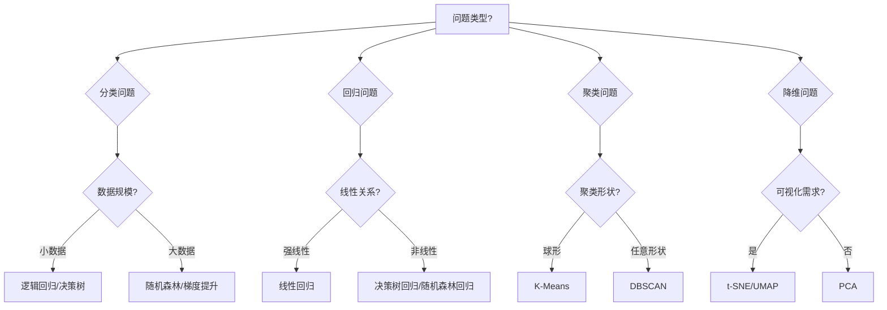

# 机器学习算法实战

## 1. 算法选择策略

### 1.1 根据问题类型选择算法

| 问题类型 | 推荐算法 | 适用场景 | 关键考虑因素 |
|----------|----------|----------|--------------|
| **分类问题** | 逻辑回归、决策树、随机森林、SVM | 垃圾邮件检测、图像分类、信用评分 | 数据规模、特征数量、可解释性要求 |
| **回归问题** | 线性回归、决策树回归、随机森林回归 | 房价预测、销量预测、股票预测 | 数据线性关系、异常值影响 |
| **聚类问题** | K-Means、DBSCAN、层次聚类 | 客户分群、异常检测、市场细分 | 数据分布、聚类数量、噪声容忍度 |
| **降维问题** | PCA、t-SNE、UMAP | 数据可视化、特征压缩、噪声过滤 | 数据维度、可视化需求、计算资源 |

### 1.2 算法选择决策树



## 2. 核心算法深度解析

### 2.1 逻辑回归（Logistic Regression）

#### 算法原理
**逻辑回归** 虽然名字中有"回归"，但实际上是一种分类算法。它通过Sigmoid函数将线性回归的输出映射到0-1之间，表示样本属于正类的概率。

**数学公式：**
```
P(y=1|x) = 1 / (1 + e^(-z))
其中 z = w₀ + w₁x₁ + w₂x₂ + ... + wₙxₙ
```

**大白话解释：** 就像用温度计测量温度，逻辑回归不是直接告诉你"热"或"冷"，而是告诉你"热"的概率是多少。

#### 实战Demo：乳腺癌预测
```python
import numpy as np
import pandas as pd
from sklearn.datasets import load_breast_cancer
from sklearn.model_selection import train_test_split
from sklearn.linear_model import LogisticRegression
from sklearn.preprocessing import StandardScaler
from sklearn.metrics import classification_report, roc_auc_score, confusion_matrix
import matplotlib.pyplot as plt
import seaborn as sns

# 加载乳腺癌数据集
def load_breast_cancer_data():
    """
    加载乳腺癌数据集并进行初步探索
    
    返回:
        X: 特征数据
        y: 标签数据
        feature_names: 特征名称
    """
    # 加载数据集
    data = load_breast_cancer()
    X = data.data
    y = data.target
    feature_names = data.feature_names
    
    print("=== 乳腺癌数据集信息 ===")
    print(f"样本数量: {X.shape[0]}")
    print(f"特征数量: {X.shape[1]}")
    print(f"标签分布: 良性({np.sum(y==0)}), 恶性({np.sum(y==1)})")
    print(f"特征名称示例: {feature_names[:5]}")
    
    return X, y, feature_names

# 数据预处理
def preprocess_breast_data(X, y):
    """
    数据预处理：标准化和划分数据集
    
    参数:
        X: 特征数据
        y: 标签数据
        
    返回:
        X_train_scaled: 标准化后的训练特征
        X_test_scaled: 标准化后的测试特征
        y_train: 训练标签
        y_test: 测试标签
        scaler: 标准化器
    """
    # 划分训练集和测试集
    X_train, X_test, y_train, y_test = train_test_split(
        X, y, test_size=0.2, random_state=42, stratify=y
    )
    
    # 数据标准化
    scaler = StandardScaler()
    X_train_scaled = scaler.fit_transform(X_train)
    X_test_scaled = scaler.transform(X_test)
    
    print("=== 数据预处理结果 ===")
    print(f"训练集大小: {X_train_scaled.shape}")
    print(f"测试集大小: {X_test_scaled.shape}")
    print(f"训练集标签分布: 良性({np.sum(y_train==0)}), 恶性({np.sum(y_train==1)})")
    
    return X_train_scaled, X_test_scaled, y_train, y_test, scaler

# 逻辑回归模型训练与评估
def train_logistic_model(X_train, X_test, y_train, y_test):
    """
    训练逻辑回归模型并进行全面评估
    
    参数:
        X_train: 训练特征
        X_test: 测试特征
        y_train: 训练标签
        y_test: 测试标签
        
    返回:
        model: 训练好的模型
        evaluation_results: 评估结果字典
    """
    # 创建逻辑回归模型
    model = LogisticRegression(
        penalty='l2',           # L2正则化
        C=1.0,                 # 正则化强度倒数
        solver='liblinear',     # 优化算法
        random_state=42,        # 随机种子
        max_iter=1000          # 最大迭代次数
    )
    
    # 训练模型
    model.fit(X_train, y_train)
    
    # 预测
    y_pred = model.predict(X_test)
    y_pred_proba = model.predict_proba(X_test)[:, 1]  # 正类概率
    
    # 计算评估指标
    evaluation_results = {
        'accuracy': model.score(X_test, y_test),
        'roc_auc': roc_auc_score(y_test, y_pred_proba),
        'classification_report': classification_report(y_test, y_pred),
        'confusion_matrix': confusion_matrix(y_test, y_pred)
    }
    
    return model, evaluation_results

# 可视化评估结果
def visualize_evaluation(evaluation_results, feature_names, model):
    """
    可视化模型评估结果和特征重要性
    
    参数:
        evaluation_results: 评估结果字典
        feature_names: 特征名称
        model: 训练好的模型
    """
    # 创建子图
    fig, axes = plt.subplots(2, 2, figsize=(15, 12))
    
    # 1. 混淆矩阵热力图
    cm = evaluation_results['confusion_matrix']
    sns.heatmap(cm, annot=True, fmt='d', cmap='Blues', ax=axes[0, 0])
    axes[0, 0].set_title('混淆矩阵')
    axes[0, 0].set_xlabel('预测标签')
    axes[0, 0].set_ylabel('真实标签')
    
    # 2. 特征重要性条形图
    feature_importance = pd.DataFrame({
        'feature': feature_names,
        'importance': np.abs(model.coef_[0])
    }).sort_values('importance', ascending=False).head(10)
    
    axes[0, 1].barh(feature_importance['feature'], feature_importance['importance'])
    axes[0, 1].set_title('Top 10 特征重要性')
    axes[0, 1].set_xlabel('特征重要性（系数绝对值）')
    
    # 3. 模型性能指标
    metrics = ['准确率', 'AUC分数']
    values = [evaluation_results['accuracy'], evaluation_results['roc_auc']]
    axes[1, 0].bar(metrics, values, color=['skyblue', 'lightcoral'])
    axes[1, 0].set_title('模型性能指标')
    axes[1, 0].set_ylim(0, 1)
    
    # 4. 系数分布直方图
    axes[1, 1].hist(model.coef_[0], bins=20, alpha=0.7, color='lightgreen')
    axes[1, 1].set_title('模型系数分布')
    axes[1, 1].set_xlabel('系数值')
    axes[1, 1].set_ylabel('频数')
    
    plt.tight_layout()
    plt.show()

# 主函数
def main():
    """主函数：执行完整的逻辑回归流程"""
    # 1. 加载数据
    X, y, feature_names = load_breast_cancer_data()
    
    # 2. 数据预处理
    X_train_scaled, X_test_scaled, y_train, y_test, scaler = preprocess_breast_data(X, y)
    
    # 3. 训练模型
    model, evaluation_results = train_logistic_model(X_train_scaled, X_test_scaled, y_train, y_test)
    
    # 4. 输出评估结果
    print("\n=== 模型评估结果 ===")
    print(f"准确率: {evaluation_results['accuracy']:.4f}")
    print(f"AUC分数: {evaluation_results['roc_auc']:.4f}")
    print("\n分类报告:")
    print(evaluation_results['classification_report'])
    
    # 5. 可视化结果
    visualize_evaluation(evaluation_results, feature_names, model)
    
    return model, scaler, evaluation_results

# 执行主函数
if __name__ == "__main__":
    model, scaler, results = main()
```

#### 算法优缺点分析

**优点：**
- ✅ 计算效率高，适合大规模数据
- ✅ 输出概率值，便于业务解释
- ✅ 可解释性强，系数代表特征重要性
- ✅ 对线性可分数据效果很好

**缺点：**
- ❌ 对非线性数据效果有限
- ❌ 对多重共线性敏感
- ❌ 需要特征工程处理非线性关系

### 2.2 决策树（Decision Tree）

#### 算法原理
**决策树** 通过树形结构进行决策，每个内部节点表示一个特征测试，每个分支表示测试结果，每个叶节点表示一个类别标签。

**核心概念：**
- **信息增益（Information Gain）**：选择分裂特征的标准
- **基尼不纯度（Gini Impurity）**：衡量数据不纯度的指标
- **熵（Entropy）**：衡量系统混乱程度的指标

**大白话解释：** 就像医生诊断病情，先问症状A，根据回答再问症状B，一步步缩小范围直到确诊。

#### 实战Demo：鸢尾花分类
```python
from sklearn.datasets import load_iris
from sklearn.tree import DecisionTreeClassifier, export_text, plot_tree
from sklearn.metrics import accuracy_score
import matplotlib.pyplot as plt

def iris_decision_tree_demo():
    """鸢尾花分类决策树实战演示"""
    
    # 加载鸢尾花数据集
    iris = load_iris()
    X, y = iris.data, iris.target
    feature_names = iris.feature_names
    target_names = iris.target_names
    
    print("=== 鸢尾花数据集信息 ===")
    print(f"特征: {feature_names}")
    print(f"类别: {target_names}")
    print(f"数据形状: {X.shape}")
    
    # 划分训练测试集
    X_train, X_test, y_train, y_test = train_test_split(
        X, y, test_size=0.2, random_state=42
    )
    
    # 创建决策树模型
    dt_model = DecisionTreeClassifier(
        criterion='gini',      # 分裂标准：基尼不纯度
        max_depth=3,          # 最大深度，防止过拟合
        min_samples_split=2,  # 内部节点再划分所需最小样本数
        min_samples_leaf=1,   # 叶节点最少样本数
        random_state=42
    )
    
    # 训练模型
    dt_model.fit(X_train, y_train)
    
    # 预测和评估
    y_pred = dt_model.predict(X_test)
    accuracy = accuracy_score(y_test, y_pred)
    
    print(f"\n决策树准确率: {accuracy:.4f}")
    
    # 可视化决策树
    plt.figure(figsize=(15, 10))
    plot_tree(dt_model, 
              feature_names=feature_names,
              class_names=target_names,
              filled=True,
              rounded=True)
    plt.title("鸢尾花分类决策树")
    plt.show()
    
    # 输出决策规则
    tree_rules = export_text(dt_model, feature_names=feature_names)
    print("\n=== 决策规则 ===")
    print(tree_rules)
    
    return dt_model

# 执行决策树演示
iris_decision_tree_demo()
```

### 2.3 随机森林（Random Forest）

#### 算法原理
**随机森林** 是决策树的集成方法，通过构建多棵决策树并综合它们的预测结果来提高模型的准确性和稳定性。

**核心思想：**
- **Bootstrap抽样**：每棵树使用不同的训练子集
- **特征随机选择**：每棵树分裂时随机选择部分特征
- **投票机制**：多棵树投票决定最终结果

**大白话解释：** 就像多个专家会诊，每个专家从不同角度分析问题，最后综合大家的意见做出诊断。

#### 实战Demo：房价预测
```python
from sklearn.ensemble import RandomForestRegressor
from sklearn.datasets import fetch_california_housing
from sklearn.metrics import mean_squared_error, r2_score
import numpy as np

def california_housing_rf_demo():
    """加州房价预测随机森林实战演示"""
    
    # 加载加州房价数据集
    housing = fetch_california_housing()
    X, y = housing.data, housing.target
    feature_names = housing.feature_names
    
    print("=== 加州房价数据集信息 ===")
    print(f"特征: {feature_names}")
    print(f"数据形状: {X.shape}")
    print(f"房价范围: ${y.min():.0f} - ${y.max():.0f}")
    
    # 划分训练测试集
    X_train, X_test, y_train, y_test = train_test_split(
        X, y, test_size=0.2, random_state=42
    )
    
    # 创建随机森林回归模型
    rf_model = RandomForestRegressor(
        n_estimators=100,      # 树的数量
        max_depth=10,          # 最大深度
        min_samples_split=5,   # 内部节点再划分所需最小样本数
        min_samples_leaf=2,    # 叶节点最少样本数
        random_state=42,
        n_jobs=-1             # 使用所有CPU核心
    )
    
    # 训练模型
    rf_model.fit(X_train, y_train)
    
    # 预测
    y_pred = rf_model.predict(X_test)
    
    # 评估指标
    mse = mean_squared_error(y_test, y_pred)
    rmse = np.sqrt(mse)
    r2 = r2_score(y_test, y_pred)
    
    print(f"\n=== 模型评估结果 ===")
    print(f"均方误差 (MSE): {mse:.4f}")
    print(f"均方根误差 (RMSE): {rmse:.4f}")
    print(f"R² 分数: {r2:.4f}")
    
    # 特征重要性分析
    feature_importance = pd.DataFrame({
        'feature': feature_names,
        'importance': rf_model.feature_importances_
    }).sort_values('importance', ascending=False)
    
    print("\n=== 特征重要性排序 ===")
    print(feature_importance)
    
    # 可视化特征重要性
    plt.figure(figsize=(10, 6))
    plt.barh(feature_importance['feature'], feature_importance['importance'])
    plt.title('随机森林特征重要性')
    plt.xlabel('重要性')
    plt.tight_layout()
    plt.show()
    
    # 预测值与真实值对比
    plt.figure(figsize=(10, 6))
    plt.scatter(y_test, y_pred, alpha=0.6)
    plt.plot([y_test.min(), y_test.max()], [y_test.min(), y_test.max()], 'r--', lw=2)
    plt.xlabel('真实房价')
    plt.ylabel('预测房价')
    plt.title('预测值与真实值对比')
    plt.show()
    
    return rf_model, feature_importance

# 执行随机森林演示
rf_model, feature_importance = california_housing_rf_demo()
```

## 3. 算法调优技巧

### 3.1 超参数调优方法

#### 网格搜索（Grid Search）
```python
from sklearn.model_selection import GridSearchCV

def grid_search_demo():
    """网格搜索超参数调优演示"""
    
    # 加载数据
    X, y = load_breast_cancer(return_X_y=True)
    X_train, X_test, y_train, y_test = train_test_split(X, y, test_size=0.2, random_state=42)
    
    # 定义参数网格
    param_grid = {
        'C': [0.1, 1, 10, 100],           # 正则化强度
        'penalty': ['l1', 'l2'],          # 正则化类型
        'solver': ['liblinear', 'saga']   # 优化算法
    }
    
    # 创建网格搜索对象
    grid_search = GridSearchCV(
        LogisticRegression(max_iter=1000, random_state=42),
        param_grid,
        cv=5,                    # 5折交叉验证
        scoring='accuracy',      # 评估指标
        n_jobs=-1               # 使用所有CPU核心
    )
    
    # 执行网格搜索
    grid_search.fit(X_train, y_train)
    
    # 输出最佳参数和分数
    print("最佳参数:", grid_search.best_params_)
    print("最佳交叉验证分数:", grid_search.best_score_)
    
    # 使用最佳模型进行预测
    best_model = grid_search.best_estimator_
    test_accuracy = best_model.score(X_test, y_test)
    print("测试集准确率:", test_accuracy)
    
    return best_model, grid_search

# 执行网格搜索
best_model, grid_search = grid_search_demo()
```

#### 随机搜索（Random Search）
```python
from sklearn.model_selection import RandomizedSearchCV
from scipy.stats import uniform, randint

def random_search_demo():
    """随机搜索超参数调优演示"""
    
    # 定义参数分布
    param_dist = {
        'n_estimators': randint(50, 200),      # 树的数量
        'max_depth': randint(3, 20),           # 最大深度
        'min_samples_split': randint(2, 10),   # 内部节点最小样本数
        'min_samples_leaf': randint(1, 5)      # 叶节点最小样本数
    }
    
    # 创建随机搜索对象
    random_search = RandomizedSearchCV(
        RandomForestRegressor(random_state=42),
        param_dist,
        n_iter=20,              # 随机采样次数
        cv=5,                   # 5折交叉验证
        scoring='r2',           # 评估指标
        random_state=42,
        n_jobs=-1
    )
    
    # 加载数据
    housing = fetch_california_housing()
    X, y = housing.data, housing.target
    X_train, X_test, y_train, y_test = train_test_split(X, y, test_size=0.2, random_state=42)
    
    # 执行随机搜索
    random_search.fit(X_train, y_train)
    
    # 输出结果
    print("最佳参数:", random_search.best_params_)
    print("最佳交叉验证分数:", random_search.best_score_)
    
    return random_search.best_estimator_

# 执行随机搜索
best_rf_model = random_search_demo()
```

## 4. 模型评估与验证

### 4.1 交叉验证策略

#### K折交叉验证
```python
from sklearn.model_selection import cross_val_score, StratifiedKFold

def cross_validation_demo():
    """交叉验证演示"""
    
    # 加载数据
    X, y = load_breast_cancer(return_X_y=True)
    
    # 创建模型
    model = LogisticRegression(random_state=42)
    
    # 5折交叉验证
    cv_scores = cross_val_score(model, X, y, cv=5, scoring='accuracy')
    
    print("=== 5折交叉验证结果 ===")
    print(f"各折分数: {cv_scores}")
    print(f"平均分数: {cv_scores.mean():.4f} (±{cv_scores.std():.4f})")
    
    # 分层K折交叉验证（处理类别不平衡）
    skf = StratifiedKFold(n_splits=5, shuffle=True, random_state=42)
    stratified_scores = cross_val_score(model, X, y, cv=skf, scoring='accuracy')
    
    print(f"\n分层交叉验证平均分数: {stratified_scores.mean():.4f} (±{stratified_scores.std():.4f})")
    
    return cv_scores, stratified_scores

# 执行交叉验证
cv_scores, stratified_scores = cross_validation_demo()
```

### 4.2 学习曲线分析
```python
from sklearn.model_selection import learning_curve

def learning_curve_demo():
    """学习曲线分析演示"""
    
    # 加载数据
    X, y = load_breast_cancer(return_X_y=True)
    
    # 创建模型
    model = LogisticRegression(random_state=42)
    
    # 计算学习曲线
    train_sizes, train_scores, test_scores = learning_curve(
        model, X, y, cv=5, scoring='accuracy',
        train_sizes=np.linspace(0.1, 1.0, 10)
    )
    
    # 计算平均值和标准差
    train_scores_mean = np.mean(train_scores, axis=1)
    train_scores_std = np.std(train_scores, axis=1)
    test_scores_mean = np.mean(test_scores, axis=1)
    test_scores_std = np.std(test_scores, axis=1)
    
    # 绘制学习曲线
    plt.figure(figsize=(10, 6))
    plt.plot(train_sizes, train_scores_mean, 'o-', color='r', label='训练分数')
    plt.plot(train_sizes, test_scores_mean, 'o-', color='g', label='验证分数')
    
    # 添加标准差区域
    plt.fill_between(train_sizes, train_scores_mean - train_scores_std,
                     train_scores_mean + train_scores_std, alpha=0.1, color='r')
    plt.fill_between(train_sizes, test_scores_mean - test_scores_std,
                     test_scores_mean + test_scores_std, alpha=0.1, color='g')
    
    plt.xlabel('训练样本数')
    plt.ylabel('准确率')
    plt.title('学习曲线')
    plt.legend()
    plt.grid(True)
    plt.show()
    
    # 分析过拟合/欠拟合
    final_train_score = train_scores_mean[-1]
    final_test_score = test_scores_mean[-1]
    gap = final_train_score - final_test_score
    
    print(f"最终训练分数: {final_train_score:.4f}")
    print(f"最终验证分数: {final_test_score:.4f}")
    print(f"训练-验证差距: {gap:.4f}")
    
    if gap > 0.1:
        print("⚠️ 可能存在过拟合")
    elif final_test_score < 0.7:
        print("⚠️ 可能存在欠拟合")
    else:
        print("✅ 模型拟合良好")

# 执行学习曲线分析
learning_curve_demo()
```

## 5. 企业级实战技巧

### 5.1 特征工程最佳实践

#### 数值特征处理
```python
def numerical_feature_engineering(X):
    """数值特征工程处理"""
    
    # 1. 缺失值处理
    from sklearn.impute import SimpleImputer
    imputer = SimpleImputer(strategy='median')
    X_imputed = imputer.fit_transform(X)
    
    # 2. 异常值处理（使用IQR方法）
    def remove_outliers_iqr(X, factor=1.5):
        """使用IQR方法移除异常值"""
        Q1 = np.percentile(X, 25, axis=0)
        Q3 = np.percentile(X, 75, axis=0)
        IQR = Q3 - Q1
        lower_bound = Q1 - factor * IQR
        upper_bound = Q3 + factor * IQR
        
        # 创建掩码，标记非异常值
        mask = ((X >= lower_bound) & (X <= upper_bound)).all(axis=1)
        return X[mask], mask
    
    # 3. 特征变换
    from sklearn.preprocessing import PowerTransformer
    transformer = PowerTransformer(method='yeo-johnson')
    X_transformed = transformer.fit_transform(X_imputed)
    
    return X_transformed
```

#### 类别特征编码
```python
def categorical_feature_engineering(X_categorical):
    """类别特征工程处理"""
    
    # 1. 独热编码（One-Hot Encoding）
    from sklearn.preprocessing import OneHotEncoder
    ohe = OneHotEncoder(sparse=False, handle_unknown='ignore')
    X_ohe = ohe.fit_transform(X_categorical)
    
    # 2. 目标编码（Target Encoding）
    def target_encode(X, y, smoothing=10):
        """目标编码实现"""
        # 计算每个类别的目标均值
        target_mean = y.mean()
        
        # 对每个类别进行编码
        encoded_values = []
        for col in X.T:
            # 计算每个类别的统计量
            stats = y.groupby(col).agg(['count', 'mean'])
            
            # 应用平滑
            smooth = (stats['count'] * stats['mean'] + smoothing * target_mean) / (stats['count'] + smoothing)
            
            # 映射回原始数据
            encoded_col = col.map(smooth).fillna(target_mean)
            encoded_values.append(encoded_col.values)
        
        return np.column_stack(encoded_values)
    
    return X_ohe
```

### 5.2 模型部署考虑因素

#### 模型持久化
```python
import joblib
import pickle

def model_persistence_demo(model, scaler, file_path='model.pkl'):
    """模型持久化演示"""
    
    # 方法1: 使用joblib（推荐用于scikit-learn模型）
    joblib.dump({'model': model, 'scaler': scaler}, file_path)
    
    # 加载模型
    loaded_data = joblib.load(file_path)
    loaded_model = loaded_data['model']
    loaded_scaler = loaded_data['scaler']
    
    print("✅ 模型保存和加载成功")
    
    # 方法2: 使用pickle
    with open('model_pickle.pkl', 'wb') as f:
        pickle.dump({'model': model, 'scaler': scaler}, f)
    
    return loaded_model, loaded_scaler
```

## 6. 常见问题与解决方案

### Q1: 如何处理类别不平衡问题？
**解决方案：**
- **重采样技术**：过采样（SMOTE）、欠采样
- **调整类别权重**：class_weight参数
- **使用合适的评估指标**：F1分数、AUC-ROC
- **集成方法**：EasyEnsemble、BalanceCascade

### Q2: 如何选择特征选择方法？
**选择策略：**
- **过滤式**：相关系数、卡方检验（计算快，独立于模型）
- **包裹式**：递归特征消除（效果更好，计算成本高）
- **嵌入式**：L1正则化、树模型特征重要性（平衡效果和效率）

### Q3: 如何解释模型预测结果？
**解释方法：**
- **特征重要性**：树模型、线性模型系数
- **局部解释**：LIME、SHAP值
- **全局解释**：部分依赖图、累积局部效应

---

**参考资料：**
[^1]: [Scikit-learn算法选择指南](https://scikit-learn.org/stable/tutorial/machine_learning_map/index.html)
[^2]: [《Python机器学习实战》](https://book.douban.com/subject/27009845/)
[^3]: [机器学习算法比较研究](https://arxiv.org/abs/1708.05070)