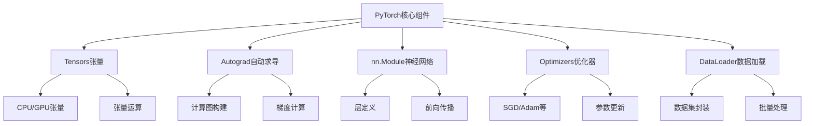

# PyTorch基础实战

## 1. PyTorch核心概念

### 1.1 PyTorch设计哲学

**PyTorch** 是一个基于Torch的Python开源机器学习库，由Facebook的AI研究团队开发。其核心设计哲学是：

- **动态计算图（Dynamic Computational Graph）**：运行时构建计算图，灵活性强
- **Pythonic风格**：与Python生态无缝集成，易于学习和使用
- **GPU加速**：原生支持CUDA，高效利用GPU计算资源
- **自动求导**：内置自动微分系统，简化梯度计算

**大白话解释：** PyTorch就像乐高积木，你可以边搭边想，随时调整结构，而不需要像TensorFlow那样先画好完整的图纸再搭建。

### 1.2 PyTorch核心组件



## 2. 张量操作基础

### 2.1 张量创建与基本操作

#### 张量创建方法
```python
import torch
import numpy as np

def tensor_creation_demo():
    """张量创建方法演示"""
    
    print("=== 张量创建方法 ===")
    
    # 1. 从Python列表创建
    tensor1 = torch.tensor([1, 2, 3, 4])
    print(f"从列表创建: {tensor1}")
    
    # 2. 从NumPy数组创建
    np_array = np.array([5, 6, 7, 8])
    tensor2 = torch.from_numpy(np_array)
    print(f"从NumPy创建: {tensor2}")
    
    # 3. 特殊张量创建
    zeros_tensor = torch.zeros(2, 3)        # 全零张量
    ones_tensor = torch.ones(3, 2)          # 全一张量
    rand_tensor = torch.rand(2, 2)          # 均匀分布随机数
    randn_tensor = torch.randn(2, 2)        # 标准正态分布随机数
    
    print(f"全零张量:\n{zeros_tensor}")
    print(f"全一张量:\n{ones_tensor}")
    print(f"均匀随机张量:\n{rand_tensor}")
    print(f"正态随机张量:\n{randn_tensor}")
    
    # 4. 类似形状创建
    similar_tensor = torch.randn_like(zeros_tensor)  # 与zeros_tensor形状相同的随机张量
    print(f"类似形状创建:\n{similar_tensor}")

# 执行张量创建演示
tensor_creation_demo()
```

#### 张量属性与方法
```python
def tensor_properties_demo():
    """张量属性与方法演示"""
    
    # 创建示例张量
    tensor = torch.randn(3, 4, 5)  # 3维张量: 3个4x5的矩阵
    
    print("=== 张量属性 ===")
    print(f"张量形状: {tensor.shape}")
    print(f"张量维度: {tensor.dim()}")
    print(f"张量大小: {tensor.size()}")
    print(f"数据类型: {tensor.dtype}")
    print(f"设备位置: {tensor.device}")
    print(f"是否要求梯度: {tensor.requires_grad}")
    
    # 张量变形操作
    print("\n=== 张量变形 ===")
    reshaped = tensor.reshape(2, 6, 5)      # 改变形状
    flattened = tensor.flatten()            # 展平为一维
    transposed = tensor.transpose(0, 1)     # 转置维度
    squeezed = tensor.squeeze()             # 去除大小为1的维度
    
    print(f"变形后形状: {reshaped.shape}")
    print(f"展平后形状: {flattened.shape}")
    print(f"转置后形状: {transposed.shape}")
    print(f"压缩后形状: {squeezed.shape}")
    
    # 数学运算
    print("\n=== 数学运算 ===")
    a = torch.tensor([1.0, 2.0, 3.0])
    b = torch.tensor([4.0, 5.0, 6.0])
    
    print(f"加法: {a + b}")
    print(f"减法: {a - b}")
    print(f"乘法: {a * b}")
    print(f"除法: {a / b}")
    print(f"矩阵乘法: {torch.matmul(a.unsqueeze(0), b.unsqueeze(1))}")

# 执行张量属性演示
tensor_properties_demo()
```

### 2.2 GPU加速与设备管理

```python
def gpu_operations_demo():
    """GPU操作演示"""
    
    print("=== GPU设备检测 ===")
    
    # 检查CUDA是否可用
    if torch.cuda.is_available():
        device = torch.device("cuda")
        print("✅ CUDA可用，使用GPU加速")
        print(f"GPU设备数量: {torch.cuda.device_count()}")
        print(f"当前GPU: {torch.cuda.get_device_name(0)}")
    else:
        device = torch.device("cpu")
        print("❌ CUDA不可用，使用CPU")
    
    # 创建张量并移动到设备
    cpu_tensor = torch.randn(1000, 1000)
    gpu_tensor = cpu_tensor.to(device)  # 移动到GPU
    
    print(f"CPU张量设备: {cpu_tensor.device}")
    print(f"GPU张量设备: {gpu_tensor.device}")
    
    # 性能对比
    import time
    
    def benchmark_operation(device_name, tensor):
        """基准测试函数"""
        start_time = time.time()
        
        # 执行矩阵乘法（计算密集型操作）
        result = torch.matmul(tensor, tensor.T)
        
        end_time = time.time()
        elapsed = end_time - start_time
        print(f"{device_name} 计算时间: {elapsed:.4f}秒")
        return elapsed
    
    # CPU性能测试
    cpu_time = benchmark_operation("CPU", cpu_tensor)
    
    # GPU性能测试（如果有GPU）
    if torch.cuda.is_available():
        gpu_time = benchmark_operation("GPU", gpu_tensor)
        speedup = cpu_time / gpu_time
        print(f"GPU加速比: {speedup:.2f}x")

# 执行GPU操作演示
gpu_operations_demo()
```

## 3. 自动求导系统

### 3.1 Autograd机制详解

**Autograd** 是PyTorch的自动微分引擎，能够自动计算张量运算的梯度。

#### 基本Autograd操作
```python
def autograd_basics_demo():
    """Autograd基础演示"""
    
    print("=== Autograd基础 ===")
    
    # 创建需要梯度的张量
    x = torch.tensor(2.0, requires_grad=True)
    w = torch.tensor(3.0, requires_grad=True)
    b = torch.tensor(1.0, requires_grad=True)
    
    print(f"输入张量: x={x}, w={w}, b={b}")
    print(f"是否需要梯度: x={x.requires_grad}, w={w.requires_grad}, b={b.requires_grad}")
    
    # 前向传播计算
    y = w * x + b  # y = 3*2 + 1 = 7
    print(f"前向传播结果: y = {y}")
    
    # 反向传播计算梯度
    y.backward()  # 计算dy/dx, dy/dw, dy/db
    
    print("\n梯度计算结果:")
    print(f"dy/dx = {x.grad}")  # 应该为3.0 (dy/dx = w)
    print(f"dy/dw = {w.grad}")  # 应该为2.0 (dy/dw = x)
    print(f"dy/db = {b.grad}")  # 应该为1.0 (dy/db = 1)
    
    # 验证梯度正确性
    assert torch.allclose(x.grad, torch.tensor(3.0))
    assert torch.allclose(w.grad, torch.tensor(2.0))
    assert torch.allclose(b.grad, torch.tensor(1.0))
    print("✅ 梯度计算正确")

# 执行Autograd基础演示
autograd_basics_demo()
```

#### 复杂计算图的梯度计算
```python
def complex_autograd_demo():
    """复杂计算图的Autograd演示"""
    
    print("=== 复杂计算图Autograd ===")
    
    # 创建需要梯度的张量
    x = torch.tensor([1.0, 2.0, 3.0], requires_grad=True)
    
    # 复杂的前向传播计算
    y = x ** 2 + 2 * x + 1          # 二次函数
    z = torch.sin(y) + torch.log(y)  # 三角函数 + 对数
    w = z.sum()                      # 求和
    
    print(f"输入: x = {x}")
    print(f"中间结果: y = {y}")
    print(f"中间结果: z = {z}")
    print(f"最终结果: w = {w}")
    
    # 反向传播
    w.backward()
    
    print(f"\n梯度: dw/dx = {x.grad}")
    
    # 手动验证梯度（使用链式法则）
    manual_grad = torch.zeros_like(x)
    for i in range(len(x)):
        # dy/dx = 2x + 2
        dy_dx = 2 * x[i] + 2
        # dz/dy = cos(y) + 1/y
        dz_dy = torch.cos(y[i]) + 1 / y[i]
        # dw/dz = 1 (因为w是z的和)
        dw_dz = 1
        # 链式法则: dw/dx = dw/dz * dz/dy * dy/dx
        manual_grad[i] = dw_dz * dz_dy * dy_dx
    
    print(f"手动计算梯度: {manual_grad}")
    print(f"梯度一致性: {torch.allclose(x.grad, manual_grad)}")

# 执行复杂Autograd演示
complex_autograd_demo()
```

### 3.2 梯度控制与内存管理

#### 梯度控制方法
```python
def gradient_control_demo():
    """梯度控制演示"""
    
    print("=== 梯度控制 ===")
    
    # 1. 禁用梯度计算（推理阶段）
    x = torch.tensor([1.0, 2.0], requires_grad=True)
    
    with torch.no_grad():  # 在这个上下文内不计算梯度
        y = x * 2
        print(f"no_grad模式: y.requires_grad = {y.requires_grad}")
    
    # 2. 手动设置requires_grad
    x.requires_grad_(False)  # 禁用梯度
    print(f"手动禁用梯度: x.requires_grad = {x.requires_grad}")
    
    # 3. 分离张量（detach）
    x = torch.tensor([1.0, 2.0], requires_grad=True)
    y = x * 2
    z = y.detach()  # 分离y，z不参与梯度计算
    w = z * 3
    
    w.backward(torch.ones_like(w))
    print(f"分离后梯度: x.grad = {x.grad}")  # 只有y参与梯度计算
    
    # 4. 梯度清零（训练循环中重要）
    x = torch.tensor(1.0, requires_grad=True)
    
    # 第一次反向传播
    y1 = x ** 2
    y1.backward()
    print(f"第一次梯度: {x.grad}")
    
    # 不清零直接第二次反向传播（梯度会累积）
    y2 = x ** 3
    y2.backward()
    print(f"累积梯度: {x.grad}")
    
    # 清零后重新计算
    x.grad.zero_()
    y3 = x ** 4
    y3.backward()
    print(f"清零后梯度: {x.grad}")

# 执行梯度控制演示
gradient_control_demo()
```

## 4. 神经网络模块实战

### 4.1 自定义神经网络层

#### 基础层实现
```python
import torch.nn as nn
import torch.nn.functional as F

class CustomLinear(nn.Module):
    """
    自定义线性层实现
    
    功能: 实现 y = xW^T + b
    参数: in_features(输入特征数), out_features(输出特征数)
    """
    def __init__(self, in_features, out_features):
        super(CustomLinear, self).__init__()
        
        # 初始化权重和偏置
        self.weight = nn.Parameter(torch.randn(out_features, in_features))
        self.bias = nn.Parameter(torch.randn(out_features))
        
        # Xavier初始化（更好的训练稳定性）
        nn.init.xavier_uniform_(self.weight)
        nn.init.zeros_(self.bias)
    
    def forward(self, x):
        """前向传播计算"""
        # x: (batch_size, in_features)
        # weight: (out_features, in_features)
        # bias: (out_features)
        
        # 矩阵乘法: x * W^T + b
        output = torch.matmul(x, self.weight.T) + self.bias
        return output

class CustomReLU(nn.Module):
    """自定义ReLU激活层"""
    def __init__(self):
        super(CustomReLU, self).__init__()
    
    def forward(self, x):
        return torch.maximum(torch.tensor(0.0), x)  # ReLU: max(0, x)

# 测试自定义层
def test_custom_layers():
    """测试自定义层功能"""
    
    print("=== 自定义层测试 ===")
    
    # 创建自定义层实例
    linear_layer = CustomLinear(in_features=10, out_features=5)
    relu_layer = CustomReLU()
    
    # 测试输入
    batch_size = 4
    x = torch.randn(batch_size, 10)
    
    # 前向传播
    linear_output = linear_layer(x)
    relu_output = relu_layer(linear_output)
    
    print(f"输入形状: {x.shape}")
    print(f"线性层输出形状: {linear_output.shape}")
    print(f"ReLU层输出形状: {relu_output.shape}")
    print(f"ReLU输出范围: [{relu_output.min():.3f}, {relu_output.max():.3f}]")
    
    # 参数统计
    total_params = sum(p.numel() for p in linear_layer.parameters())
    print(f"线性层参数数量: {total_params}")
    print(f"权重形状: {linear_layer.weight.shape}")
    print(f"偏置形状: {linear_layer.bias.shape}")

# 执行自定义层测试
test_custom_layers()
```

#### 复杂网络架构实现
```python
class AdvancedCNN(nn.Module):
    """
    高级CNN架构实现
    
    特点:
    - 残差连接（Residual Connections）
    - 批量归一化（Batch Normalization）
    - Dropout正则化
    - 自适应池化
    """
    def __init__(self, num_classes=10, dropout_rate=0.3):
        super(AdvancedCNN, self).__init__()
        
        # 特征提取部分
        self.feature_extractor = nn.Sequential(
            # 第一个卷积块
            nn.Conv2d(3, 64, kernel_size=3, padding=1),
            nn.BatchNorm2d(64),
            nn.ReLU(inplace=True),
            nn.Conv2d(64, 64, kernel_size=3, padding=1),
            nn.BatchNorm2d(64),
            nn.ReLU(inplace=True),
            nn.MaxPool2d(kernel_size=2, stride=2),
            nn.Dropout2d(dropout_rate),
            
            # 第二个卷积块（带残差连接）
            nn.Conv2d(64, 128, kernel_size=3, padding=1),
            nn.BatchNorm2d(128),
            nn.ReLU(inplace=True),
            nn.Conv2d(128, 128, kernel_size=3, padding=1),
            nn.BatchNorm2d(128),
            nn.ReLU(inplace=True),
            nn.MaxPool2d(kernel_size=2, stride=2),
            nn.Dropout2d(dropout_rate),
            
            # 第三个卷积块
            nn.Conv2d(128, 256, kernel_size=3, padding=1),
            nn.BatchNorm2d(256),
            nn.ReLU(inplace=True),
            nn.Conv2d(256, 256, kernel_size=3, padding=1),
            nn.BatchNorm2d(256),
            nn.ReLU(inplace=True),
            nn.AdaptiveAvgPool2d((4, 4))  # 自适应池化到4x4
        )
        
        # 分类器部分
        self.classifier = nn.Sequential(
            nn.Dropout(dropout_rate),
            nn.Linear(256 * 4 * 4, 512),
            nn.BatchNorm1d(512),
            nn.ReLU(inplace=True),
            nn.Dropout(dropout_rate),
            nn.Linear(512, num_classes)
        )
    
    def forward(self, x):
        # 特征提取
        features = self.feature_extractor(x)
        
        # 展平
        features = features.view(features.size(0), -1)
        
        # 分类
        output = self.classifier(features)
        
        return output

# 测试高级CNN
def test_advanced_cnn():
    """测试高级CNN架构"""
    
    print("=== 高级CNN测试 ===")
    
    # 创建模型实例
    model = AdvancedCNN(num_classes=10)
    
    # 测试输入（模拟CIFAR-10图像）
    batch_size, channels, height, width = 8, 3, 32, 32
    x = torch.randn(batch_size, channels, height, width)
    
    # 前向传播
    output = model(x)
    
    print(f"输入形状: {x.shape}")
    print(f"输出形状: {output.shape}")
    print(f"输出示例: {output[0][:5]}")  # 显示前5个类别的logits
    
    # 模型参数统计
    total_params = sum(p.numel() for p in model.parameters())
    trainable_params = sum(p.numel() for p in model.parameters() if p.requires_grad)
    
    print(f"总参数数量: {total_params:,}")
    print(f"可训练参数数量: {trainable_params:,}")
    
    # 模型结构可视化
    print("\n模型结构:")
    print(model)

# 执行高级CNN测试
test_advanced_cnn()
```

### 4.2 损失函数与优化器

#### 常用损失函数实现
```python
def loss_functions_demo():
    """损失函数演示"""
    
    print("=== 常用损失函数 ===")
    
    # 模拟数据
    batch_size, num_classes = 4, 3
    y_pred = torch.randn(batch_size, num_classes)  # 模型预测（logits）
    y_true = torch.tensor([0, 2, 1, 0])           # 真实标签
    
    print(f"预测值形状: {y_pred.shape}")
    print(f"真实标签: {y_true}")
    
    # 1. 交叉熵损失（分类任务）
    criterion_ce = nn.CrossEntropyLoss()
    loss_ce = criterion_ce(y_pred, y_true)
    print(f"交叉熵损失: {loss_ce:.4f}")
    
    # 2. 均方误差损失（回归任务）
    y_pred_reg = torch.randn(batch_size, 1)
    y_true_reg = torch.randn(batch_size, 1)
    
    criterion_mse = nn.MSELoss()
    loss_mse = criterion_mse(y_pred_reg, y_true_reg)
    print(f"均方误差损失: {loss_mse:.4f}")
    
    # 3. 二元交叉熵损失（二分类）
    y_pred_binary = torch.sigmoid(torch.randn(batch_size, 1))  # 概率值
    y_true_binary = torch.randint(0, 2, (batch_size, 1)).float()
    
    criterion_bce = nn.BCELoss()
    loss_bce = criterion_bce(y_pred_binary, y_true_binary)
    print(f"二元交叉熵损失: {loss_bce:.4f}")
    
    # 4. 自定义损失函数
    class FocalLoss(nn.Module):
        """Focal Loss（用于处理类别不平衡）"""
        def __init__(self, alpha=1, gamma=2):
            super(FocalLoss, self).__init__()
            self.alpha = alpha
            self.gamma = gamma
        
        def forward(self, inputs, targets):
            # 计算交叉熵
            ce_loss = F.cross_entropy(inputs, targets, reduction='none')
            
            # 计算概率
            pt = torch.exp(-ce_loss)
            
            # Focal Loss公式
            focal_loss = self.alpha * (1 - pt) ** self.gamma * ce_loss
            
            return focal_loss.mean()
    
    # 测试Focal Loss
    focal_criterion = FocalLoss()
    loss_focal = focal_criterion(y_pred, y_true)
    print(f"Focal Loss: {loss_focal:.4f}")

# 执行损失函数演示
loss_functions_demo()
```

#### 优化器配置与使用
```python
def optimizers_demo():
    """优化器演示"""
    
    print("=== 优化器配置 ===")
    
    # 创建简单模型
    model = nn.Sequential(
        nn.Linear(10, 5),
        nn.ReLU(),
        nn.Linear(5, 1)
    )
    
    # 1. SGD优化器
    optimizer_sgd = torch.optim.SGD(
        model.parameters(),
        lr=0.01,           # 学习率
        momentum=0.9,      # 动量
        weight_decay=1e-4  # L2正则化
    )
    
    # 2. Adam优化器
    optimizer_adam = torch.optim.Adam(
        model.parameters(),
        lr=0.001,          # 学习率
        betas=(0.9, 0.999), # 动量参数
        weight_decay=1e-4  # L2正则化
    )
    
    # 3. 学习率调度器
    scheduler = torch.optim.lr_scheduler.StepLR(
        optimizer_adam,
        step_size=10,      # 每10个epoch调整一次
        gamma=0.1          # 学习率乘以0.1
    )
    
    print("优化器配置完成")
    print(f"SGD参数组数: {len(optimizer_sgd.param_groups)}")
    print(f"Adam参数组数: {len(optimizer_adam.param_groups)}")
    
    # 模拟训练循环
    def simulate_training():
        """模拟训练过程"""
        
        # 模拟数据
        x = torch.randn(100, 10)
        y = torch.randn(100, 1)
        
        # 使用Adam优化器训练
        model.train()
        
        for epoch in range(5):
            # 前向传播
            y_pred = model(x)
            loss = F.mse_loss(y_pred, y)
            
            # 反向传播
            optimizer_adam.zero_grad()  # 梯度清零
            loss.backward()             # 计算梯度
            optimizer_adam.step()       # 更新参数
            
            # 学习率调整
            scheduler.step()
            
            current_lr = scheduler.get_last_lr()[0]
            print(f"Epoch {epoch+1}: Loss = {loss.item():.4f}, LR = {current_lr:.6f}")
    
    # 执行模拟训练
    simulate_training()

# 执行优化器演示
optimizers_demo()
```

## 5. 数据加载与预处理

### 5.1 自定义数据集类

```python
from torch.utils.data import Dataset, DataLoader
import os
from PIL import Image

class CustomImageDataset(Dataset):
    """
    自定义图像数据集类
    
    功能: 加载图像数据，支持数据增强和预处理
    """
    def __init__(self, image_dir, label_file, transform=None):
        """
        初始化数据集
        
        参数:
            image_dir: 图像目录路径
            label_file: 标签文件路径
            transform: 数据增强变换
        """
        self.image_dir = image_dir
        self.transform = transform
        
        # 加载标签数据
        self.image_paths = []
        self.labels = []
        
        with open(label_file, 'r') as f:
            for line in f:
                image_name, label = line.strip().split(',')
                self.image_paths.append(os.path.join(image_dir, image_name))
                self.labels.append(int(label))
    
    def __len__(self):
        """返回数据集大小"""
        return len(self.image_paths)
    
    def __getitem__(self, idx):
        """获取单个样本"""
        # 加载图像
        image_path = self.image_paths[idx]
        image = Image.open(image_path).convert('RGB')  # 确保RGB格式
        
        # 获取标签
        label = self.labels[idx]
        
        # 数据增强/预处理
        if self.transform:
            image = self.transform(image)
        
        return image, label

# 数据增强变换
from torchvision import transforms

def create_transforms():
    """创建训练和测试的数据变换"""
    
    # 训练数据增强
    train_transform = transforms.Compose([
        transforms.RandomResizedCrop(224),      # 随机裁剪并调整大小
        transforms.RandomHorizontalFlip(0.5),   # 随机水平翻转
        transforms.RandomRotation(10),          # 随机旋转
        transforms.ColorJitter(0.2, 0.2, 0.2), # 颜色抖动
        transforms.ToTensor(),                  # 转换为张量
        transforms.Normalize(                   # 标准化
            mean=[0.485, 0.456, 0.406],
            std=[0.229, 0.224, 0.225]
        )
    ])
    
    # 测试数据变换（无数据增强）
    test_transform = transforms.Compose([
        transforms.Resize(256),                 # 调整大小
        transforms.CenterCrop(224),             # 中心裁剪
        transforms.ToTensor(),
        transforms.Normalize(
            mean=[0.485, 0.456, 0.406],
            std=[0.229, 0.224, 0.225]
        )
    ])
    
    return train_transform, test_transform

# 数据加载器使用示例
def dataloader_demo():
    """数据加载器演示"""
    
    print("=== 数据加载器演示 ===")
    
    # 创建模拟数据集（实际使用时替换为真实路径）
    class MockDataset(Dataset):
        def __init__(self, size=100):
            self.data = torch.randn(size, 3, 32, 32)
            self.labels = torch.randint(0, 10, (size,))
        
        def __len__(self):
            return len(self.data)
        
        def __getitem__(self, idx):
            return self.data[idx], self.labels[idx]
    
    # 创建数据集
    dataset = MockDataset(100)
    
    # 创建数据加载器
    dataloader = DataLoader(
        dataset,
        batch_size=16,          # 批量大小
        shuffle=True,           # 是否打乱数据
        num_workers=2,          # 数据加载进程数
        pin_memory=True         # 锁页内存（加速GPU传输）
    )
    
    # 遍历数据加载器
    for batch_idx, (data, labels) in enumerate(dataloader):
        print(f"批次 {batch_idx + 1}:")
        print(f"  数据形状: {data.shape}")
        print(f"  标签形状: {labels.shape}")
        print(f"  标签示例: {labels[:5]}")
        
        if batch_idx == 2:  # 只显示前3个批次
            break

# 执行数据加载器演示
dataloader_demo()
```

## 6. 完整训练流程实战

### 6.1 模型训练模板

```python
def complete_training_pipeline():
    """完整训练流程演示"""
    
    print("=== 完整训练流程 ===")
    
    # 设置设备
    device = torch.device("cuda" if torch.cuda.is_available() else "cpu")
    print(f"使用设备: {device}")
    
    # 1. 数据准备（使用模拟数据）
    class SimpleDataset(Dataset):
        def __init__(self, size=1000):
            self.data = torch.randn(size, 10)
            self.labels = (self.data.sum(dim=1) > 0).long()  # 简单二分类
        
        def __len__(self):
            return len(self.data)
        
        def __getitem__(self, idx):
            return self.data[idx], self.labels[idx]
    
    # 划分训练集和测试集
    dataset = SimpleDataset(1000)
    train_size = int(0.8 * len(dataset))
    test_size = len(dataset) - train_size
    train_dataset, test_dataset = torch.utils.data.random_split(
        dataset, [train_size, test_size]
    )
    
    # 创建数据加载器
    train_loader = DataLoader(train_dataset, batch_size=32, shuffle=True)
    test_loader = DataLoader(test_dataset, batch_size=32, shuffle=False)
    
    # 2. 模型定义
    class SimpleModel(nn.Module):
        def __init__(self, input_size, hidden_size, output_size):
            super(SimpleModel, self).__init__()
            self.network = nn.Sequential(
                nn.Linear(input_size, hidden_size),
                nn.ReLU(),
                nn.Dropout(0.2),
                nn.Linear(hidden_size, output_size)
            )
        
        def forward(self, x):
            return self.network(x)
    
    model = SimpleModel(input_size=10, hidden_size=64, output_size=2)
    model = model.to(device)
    
    # 3. 损失函数和优化器
    criterion = nn.CrossEntropyLoss()
    optimizer = torch.optim.Adam(model.parameters(), lr=0.001)
    
    # 4. 训练循环
    num_epochs = 10
    train_losses = []
    test_accuracies = []
    
    for epoch in range(num_epochs):
        # 训练模式
        model.train()
        epoch_loss = 0.0
        
        for batch_idx, (data, labels) in enumerate(train_loader):
            # 移动到设备
            data, labels = data.to(device), labels.to(device)
            
            # 前向传播
            outputs = model(data)
            loss = criterion(outputs, labels)
            
            # 反向传播
            optimizer.zero_grad()
            loss.backward()
            optimizer.step()
            
            epoch_loss += loss.item()
        
        # 计算平均训练损失
        avg_loss = epoch_loss / len(train_loader)
        train_losses.append(avg_loss)
        
        # 评估模式
        model.eval()
        correct = 0
        total = 0
        
        with torch.no_grad():
            for data, labels in test_loader:
                data, labels = data.to(device), labels.to(device)
                outputs = model(data)
                _, predicted = torch.max(outputs.data, 1)
                total += labels.size(0)
                correct += (predicted == labels).sum().item()
        
        accuracy = 100 * correct / total
        test_accuracies.append(accuracy)
        
        print(f"Epoch [{epoch+1}/{num_epochs}], "
              f"Loss: {avg_loss:.4f}, Accuracy: {accuracy:.2f}%")
    
    # 5. 结果可视化
    plt.figure(figsize=(12, 4))
    
    # 损失曲线
    plt.subplot(1, 2, 1)
    plt.plot(train_losses, 'b-', label='Training Loss')
    plt.xlabel('Epoch')
    plt.ylabel('Loss')
    plt.title('Training Loss')
    plt.legend()
    plt.grid(True)
    
    # 准确率曲线
    plt.subplot(1, 2, 2)
    plt.plot(test_accuracies, 'r-', label='Test Accuracy')
    plt.xlabel('Epoch')
    plt.ylabel('Accuracy (%)')
    plt.title('Test Accuracy')
    plt.legend()
    plt.grid(True)
    
    plt.tight_layout()
    plt.show()
    
    print("✅ 训练完成!")

# 执行完整训练流程
complete_training_pipeline()
```

## 7. 模型保存与加载

### 7.1 模型持久化方法

```python
def model_persistence_demo():
    """模型保存与加载演示"""
    
    print("=== 模型持久化 ===")
    
    # 创建简单模型
    model = nn.Sequential(
        nn.Linear(10, 5),
        nn.ReLU(),
        nn.Linear(5, 2)
    )
    
    # 模拟训练（更新参数）
    optimizer = torch.optim.Adam(model.parameters())
    for _ in range(10):
        x = torch.randn(32, 10)
        y = torch.randint(0, 2, (32,))
        
        optimizer.zero_grad()
        output = model(x)
        loss = F.cross_entropy(output, y)
        loss.backward()
        optimizer.step()
    
    # 1. 保存整个模型
    torch.save(model, 'complete_model.pth')
    print("✅ 完整模型保存成功")
    
    # 加载整个模型
    loaded_model = torch.load('complete_model.pth')
    print("✅ 完整模型加载成功")
    
    # 2. 保存模型状态字典（推荐）
    torch.save({
        'model_state_dict': model.state_dict(),
        'optimizer_state_dict': optimizer.state_dict(),
        'epoch': 10,
        'loss': loss.item()
    }, 'checkpoint.pth')
    print("✅ 检查点保存成功")
    
    # 加载检查点
    checkpoint = torch.load('checkpoint.pth')
    
    # 创建新模型并加载状态
    new_model = nn.Sequential(
        nn.Linear(10, 5),
        nn.ReLU(),
        nn.Linear(5, 2)
    )
    new_model.load_state_dict(checkpoint['model_state_dict'])
    
    print("✅ 检查点加载成功")
    print(f"训练轮数: {checkpoint['epoch']}")
    print(f"最后损失: {checkpoint['loss']:.4f}")
    
    # 3. 模型导出为ONNX格式（用于部署）
    def export_to_onnx():
        """导出为ONNX格式"""
        # 创建示例输入
        dummy_input = torch.randn(1, 10)
        
        # 导出模型
        torch.onnx.export(
            model,
            dummy_input,
            'model.onnx',
            input_names=['input'],
            output_names=['output'],
            dynamic_axes={
                'input': {0: 'batch_size'},
                'output': {0: 'batch_size'}
            }
        )
        print("✅ ONNX模型导出成功")
    
    # 执行ONNX导出
    export_to_onnx()
    
    # 清理临时文件
    import os
    for file in ['complete_model.pth', 'checkpoint.pth', 'model.onnx']:
        if os.path.exists(file):
            os.remove(file)
            print(f"🗑️ 清理临时文件: {file}")

# 执行模型持久化演示
model_persistence_demo()
```

## 8. 企业级最佳实践

### 8.1 代码组织与模块化

#### 项目结构建议
```
project/
├── models/           # 模型定义
│   ├── __init__.py
│   ├── cnn.py       # CNN模型
│   ├── rnn.py       # RNN模型
│   └── transformer.py
├── data/            # 数据加载
│   ├── __init__.py
│   ├── datasets.py  # 数据集类
│   └── transforms.py # 数据增强
├── utils/           # 工具函数
│   ├── __init__.py
│   ├── metrics.py   # 评估指标
│   └── visualization.py
├── config/          # 配置文件
│   └── config.yaml
├── train.py         # 训练脚本
├── evaluate.py      # 评估脚本
└── requirements.txt
```

### 8.2 性能优化技巧

#### 内存优化
```python
def memory_optimization_tips():
    """内存优化技巧"""
    
    print("=== 内存优化技巧 ===")
    
    # 1. 使用混合精度训练
    from torch.cuda.amp import autocast, GradScaler
    
    scaler = GradScaler()
    
    def mixed_precision_training():
        """混合精度训练示例"""
        model = nn.Linear(10, 1).cuda()
        optimizer = torch.optim.Adam(model.parameters())
        
        for epoch in range(5):
            x = torch.randn(32, 10).cuda()
            y = torch.randn(32, 1).cuda()
            
            optimizer.zero_grad()
            
            # 使用自动混合精度
            with autocast():
                output = model(x)
                loss = F.mse_loss(output, y)
            
            # 缩放损失并反向传播
            scaler.scale(loss).backward()
            scaler.step(optimizer)
            scaler.update()
        
        print("✅ 混合精度训练完成")
    
    # 2. 梯度累积（模拟大batch size）
    def gradient_accumulation():
        """梯度累积示例"""
        model = nn.Linear(10, 1)
        optimizer = torch.optim.Adam(model.parameters())
        
        accumulation_steps = 4  # 累积4个batch
        
        for i, (x, y) in enumerate(dataloader):
            output = model(x)
            loss = F.mse_loss(output, y)
            
            # 缩放损失（除以累积步数）
            loss = loss / accumulation_steps
            loss.backward()
            
            # 每accumulation_steps步更新一次参数
            if (i + 1) % accumulation_steps == 0:
                optimizer.step()
                optimizer.zero_grad()
        
        print("✅ 梯度累积训练完成")
    
    # 3. 模型剪枝（减少参数）
    def model_pruning():
        """模型剪枝示例"""
        model = nn.Sequential(
            nn.Linear(100, 50),
            nn.ReLU(),
            nn.Linear(50, 10)
        )
        
        # 随机剪枝（将20%的权重设为0）
        for module in model.modules():
            if isinstance(module, nn.Linear):
                prune.random_unstructured(module, name="weight", amount=0.2)
        
        print("✅ 模型剪枝完成")
    
    print("内存优化技巧演示完成")

# 执行内存优化演示
memory_optimization_tips()
```

---

**参考资料：**
[^1]: [PyTorch官方文档](https://pytorch.org/docs/stable/index.html)
[^2]: [PyTorch教程](https://pytorch.org/tutorials/)
[^3]: [《深度学习框架PyTorch：入门与实践》](https://book.douban.com/subject/27665114/)