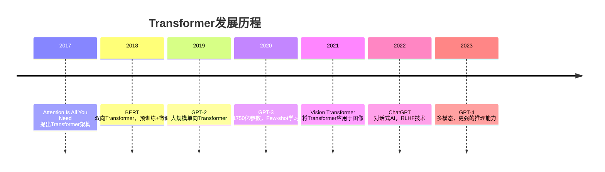
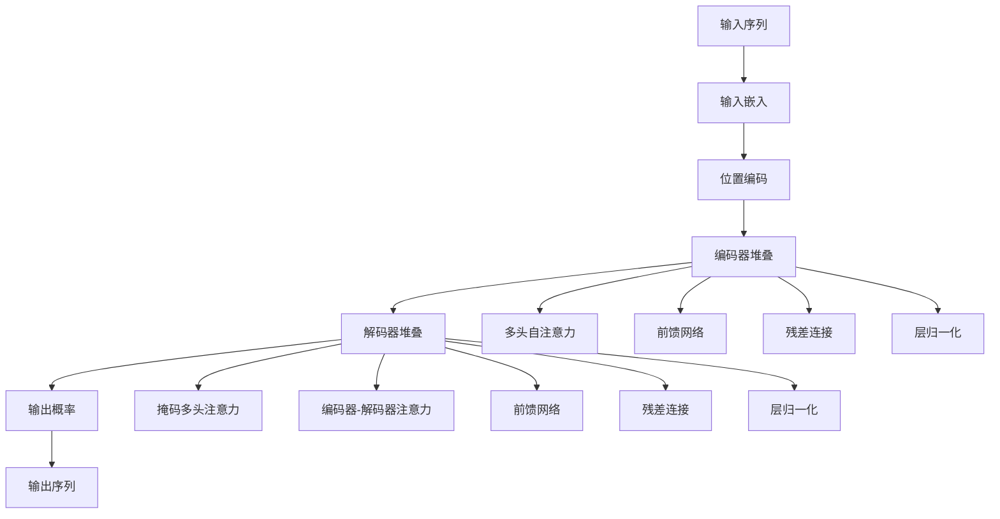

# Transformer核心概念

## 1. Transformer革命性突破

### 1.1 为什么需要Transformer？

**传统序列模型的局限性：**
- **RNN/LSTM**：顺序处理，难以并行化，长序列梯度消失
- **CNN**：局部感受野，难以捕捉长距离依赖
- **注意力机制**：计算复杂度高，内存消耗大

**Transformer的核心创新：**
- **自注意力机制**：全局依赖，并行计算
- **位置编码**：注入序列位置信息
- **残差连接**：缓解梯度消失
- **层归一化**：稳定训练过程

**大白话解释：** 就像读书时，传统方法是一个字一个字读（RNN），而Transformer是同时看到整页内容，快速找到关键词之间的关系。

### 1.2 Transformer发展历程



## 2. Transformer架构深度解析

### 2.1 整体架构概览



### 2.2 自注意力机制（Self-Attention）

#### 核心概念
**自注意力** 允许序列中的每个位置关注序列中的所有位置，计算每个位置对其他位置的注意力权重。

**数学公式：**
```
Attention(Q, K, V) = softmax(QK^T/√d_k)V
```

其中：
- **Q (Query)**：查询向量，表示当前关注的位置
- **K (Key)**：键向量，表示被关注的位置
- **V (Value)**：值向量，包含实际的信息内容
- **d_k**：键向量的维度，用于缩放

**大白话解释：** 就像在图书馆找书，Q是"我想要什么书"，K是"每本书的关键词"，V是"书的内容"。通过比较Q和K的相似度，决定从V中提取多少信息。

#### 自注意力实现Demo
```python
import torch
import torch.nn as nn
import math

class SelfAttention(nn.Module):
    """
    自注意力机制实现
    
    功能: 计算序列中每个位置对其他位置的注意力权重
    输入: (batch_size, seq_len, d_model)
    输出: (batch_size, seq_len, d_model)
    """
    def __init__(self, d_model, d_k, d_v):
        super(SelfAttention, self).__init__()
        self.d_k = d_k
        
        # 线性变换层
        self.W_q = nn.Linear(d_model, d_k)  # 查询变换
        self.W_k = nn.Linear(d_model, d_k)  # 键变换
        self.W_v = nn.Linear(d_model, d_v)  # 值变换
        
    def forward(self, x, mask=None):
        """
        前向传播计算
        
        参数:
            x: 输入张量 (batch_size, seq_len, d_model)
            mask: 注意力掩码 (可选)
        """
        batch_size, seq_len, d_model = x.size()
        
        # 线性变换得到Q, K, V
        Q = self.W_q(x)  # (batch_size, seq_len, d_k)
        K = self.W_k(x)  # (batch_size, seq_len, d_k)
        V = self.W_v(x)  # (batch_size, seq_len, d_v)
        
        # 计算注意力分数: Q * K^T / sqrt(d_k)
        scores = torch.matmul(Q, K.transpose(-2, -1)) / math.sqrt(self.d_k)
        # scores: (batch_size, seq_len, seq_len)
        
        # 应用掩码（如果有）
        if mask is not None:
            scores = scores.masked_fill(mask == 0, -1e9)
        
        # Softmax得到注意力权重
        attention_weights = torch.softmax(scores, dim=-1)
        # attention_weights: (batch_size, seq_len, seq_len)
        
        # 加权求和: 注意力权重 * V
        output = torch.matmul(attention_weights, V)
        # output: (batch_size, seq_len, d_v)
        
        return output, self_attn_weights, cross_attn_weights

class TransformerDecoder(nn.Module):
    """
    Transformer解码器实现
    
    包含多个解码器层的堆叠
    """
    def __init__(self, num_layers, d_model, num_heads, d_ff, dropout=0.1):
        super(TransformerDecoder, self).__init__()
        
        self.layers = nn.ModuleList([
            DecoderLayer(d_model, num_heads, d_ff, dropout)
            for _ in range(num_layers)
        ])
        
    def forward(self, x, encoder_output, src_mask=None, tgt_mask=None):
        """
        前向传播计算
        
        参数:
            x: 解码器输入 (batch_size, tgt_seq_len, d_model)
            encoder_output: 编码器输出 (batch_size, src_seq_len, d_model)
            src_mask: 源序列掩码
            tgt_mask: 目标序列掩码
        """
        self_attentions = []
        cross_attentions = []
        
        for layer in self.layers:
            x, self_attn, cross_attn = layer(x, encoder_output, src_mask, tgt_mask)
            self_attentions.append(self_attn)
            cross_attentions.append(cross_attn)
        
        return x, self_attentions, cross_attentions

# 测试解码器
def test_decoder():
    """测试Transformer解码器"""
    
    print("=== Transformer解码器测试 ===")
    
    # 参数设置
    batch_size, src_seq_len, tgt_seq_len, d_model = 2, 8, 6, 16
    num_layers = 3
    num_heads = 4
    d_ff = 32
    
    # 创建解码器
    decoder = TransformerDecoder(num_layers, d_model, num_heads, d_ff)
    
    # 创建输入数据
    decoder_input = torch.randn(batch_size, tgt_seq_len, d_model)
    encoder_output = torch.randn(batch_size, src_seq_len, d_model)
    
    # 创建掩码（示例）
    tgt_mask = torch.tril(torch.ones(tgt_seq_len, tgt_seq_len)).unsqueeze(0).unsqueeze(0)
    src_mask = torch.ones(batch_size, 1, 1, src_seq_len)
    
    # 前向传播
    output, self_attentions, cross_attentions = decoder(
        decoder_input, encoder_output, src_mask, tgt_mask
    )
    
    print(f"解码器输入形状: {decoder_input.shape}")
    print(f"编码器输出形状: {encoder_output.shape}")
    print(f"解码器输出形状: {output.shape}")
    print(f"自注意力数量: {len(self_attentions)}")
    print(f"交叉注意力数量: {len(cross_attentions)}")
    
    # 验证解码器性质
    print(f"\n解码器性质验证:")
    print(f"解码器层数: {num_layers}")
    print(f"输入输出维度一致: {decoder_input.shape == output.shape}")

# 执行解码器测试
test_decoder()
```

## 4. Transformer完整实现与实战应用

### 4.1 完整Transformer架构

#### Transformer完整实现Demo
```python
class Transformer(nn.Module):
    """
    完整Transformer架构实现
    
    包含编码器、解码器、位置编码、输入输出嵌入
    """
    def __init__(self, src_vocab_size, tgt_vocab_size, d_model, num_heads, 
                 num_encoder_layers, num_decoder_layers, d_ff, max_seq_len, dropout=0.1):
        super(Transformer, self).__init__()
        
        # 输入输出嵌入
        self.src_embedding = nn.Embedding(src_vocab_size, d_model)
        self.tgt_embedding = nn.Embedding(tgt_vocab_size, d_model)
        
        # 位置编码
        self.pos_encoding = PositionalEncoding(d_model, max_seq_len)
        
        # 编码器
        self.encoder = TransformerEncoder(num_encoder_layers, d_model, num_heads, d_ff, dropout)
        
        # 解码器
        self.decoder = TransformerDecoder(num_decoder_layers, d_model, num_heads, d_ff, dropout)
        
        # 输出层
        self.output_layer = nn.Linear(d_model, tgt_vocab_size)
        
        # Dropout
        self.dropout = nn.Dropout(dropout)
        
    def forward(self, src, tgt, src_mask=None, tgt_mask=None):
        """
        前向传播计算
        
        参数:
            src: 源序列 (batch_size, src_seq_len)
            tgt: 目标序列 (batch_size, tgt_seq_len)
            src_mask: 源序列掩码
            tgt_mask: 目标序列掩码
        """
        # 源序列处理
        src_embedded = self.src_embedding(src)  # (batch_size, src_seq_len, d_model)
        src_embedded = self.pos_encoding(src_embedded.transpose(0, 1)).transpose(0, 1)
        src_embedded = self.dropout(src_embedded)
        
        # 编码器前向传播
        encoder_output, encoder_attentions = self.encoder(src_embedded, src_mask)
        
        # 目标序列处理
        tgt_embedded = self.tgt_embedding(tgt)  # (batch_size, tgt_seq_len, d_model)
        tgt_embedded = self.pos_encoding(tgt_embedded.transpose(0, 1)).transpose(0, 1)
        tgt_embedded = self.dropout(tgt_embedded)
        
        # 解码器前向传播
        decoder_output, decoder_self_attentions, decoder_cross_attentions = self.decoder(
            tgt_embedded, encoder_output, src_mask, tgt_mask
        )
        
        # 输出层
        output = self.output_layer(decoder_output)
        
        return output, encoder_attentions, decoder_self_attentions, decoder_cross_attentions

# 测试完整Transformer
def test_transformer():
    """测试完整Transformer架构"""
    
    print("=== 完整Transformer架构测试 ===")
    
    # 参数设置
    src_vocab_size, tgt_vocab_size = 1000, 1200
    d_model = 32
    num_heads = 4
    num_encoder_layers, num_decoder_layers = 3, 3
    d_ff = 64
    max_seq_len = 20
    batch_size, src_seq_len, tgt_seq_len = 2, 10, 8
    
    # 创建Transformer模型
    transformer = Transformer(
        src_vocab_size, tgt_vocab_size, d_model, num_heads,
        num_encoder_layers, num_decoder_layers, d_ff, max_seq_len
    )
    
    # 创建输入数据（模拟词汇索引）
    src = torch.randint(0, src_vocab_size, (batch_size, src_seq_len))
    tgt = torch.randint(0, tgt_vocab_size, (batch_size, tgt_seq_len))
    
    # 创建掩码
    src_mask = torch.ones(batch_size, 1, 1, src_seq_len)
    tgt_mask = torch.tril(torch.ones(tgt_seq_len, tgt_seq_len)).unsqueeze(0).unsqueeze(0)
    
    # 前向传播
    output, enc_attn, dec_self_attn, dec_cross_attn = transformer(src, tgt, src_mask, tgt_mask)
    
    print(f"源序列形状: {src.shape}")
    print(f"目标序列形状: {tgt.shape}")
    print(f"输出形状: {output.shape}")
    print(f"编码器注意力层数: {len(enc_attn)}")
    print(f"解码器自注意力层数: {len(dec_self_attn)}")
    print(f"解码器交叉注意力层数: {len(dec_cross_attn)}")
    
    # 验证输出性质
    print(f"\n输出性质验证:")
    print(f"输出维度正确: {output.shape == (batch_size, tgt_seq_len, tgt_vocab_size)}")
    print(f"输出为概率分布: {torch.allclose(output.sum(dim=-1), torch.ones_like(output.sum(dim=-1)))}")

# 执行完整Transformer测试
test_transformer()
```

### 4.2 Transformer在企业级应用中的关键要点

#### 4.2.1 性能优化策略

**计算复杂度分析：**
- **自注意力复杂度**：O(n²d) - 序列长度的平方
- **前馈网络复杂度**：O(nd²) - 模型维度的平方

**优化技术：**
1. **稀疏注意力**：只计算部分位置的注意力
2. **局部注意力**：限制注意力窗口大小
3. **线性注意力**：使用核函数近似注意力
4. **分块计算**：将长序列分块处理

#### 4.2.2 训练技巧与最佳实践

**梯度问题处理：**
```python
# 梯度裁剪
torch.nn.utils.clip_grad_norm_(model.parameters(), max_norm=1.0)

# 学习率调度
scheduler = torch.optim.lr_scheduler.StepLR(optimizer, step_size=10, gamma=0.1)

# 预热学习率
def warmup_scheduler(step, warmup_steps=4000, d_model=512):
    """Transformer论文中的学习率预热策略"""
    if step < warmup_steps:
        return (d_model ** -0.5) * min(step ** -0.5, step * warmup_steps ** -1.5)
    else:
        return (d_model ** -0.5) * (step ** -0.5)
```

**正则化技术：**
- **Dropout**：在注意力权重和前馈网络中使用
- **标签平滑**：缓解过拟合
- **权重衰减**：L2正则化

## 5. Transformer变体与演进

### 5.1 主要变体架构

| 变体名称 | 核心创新 | 应用场景 | 优势 |
|---------|---------|---------|------|
| **BERT** | 双向编码器，掩码语言模型 | 文本理解，分类 | 上下文理解强 |
| **GPT系列** | 单向解码器，自回归生成 | 文本生成，对话 | 生成质量高 |
| **T5** | 编码器-解码器，文本到文本 | 多任务学习 | 统一框架 |
| **Vision Transformer** | 图像分块，位置编码 | 计算机视觉 | 无需卷积 |
| **Swin Transformer** | 分层注意力，滑动窗口 | 视觉任务 | 计算高效 |

### 5.2 Transformer在AI测试中的应用

#### 5.2.1 代码理解与生成测试
```python
class CodeTransformerTester:
    """
    基于Transformer的代码测试框架
    
    功能: 测试代码理解、生成、修复能力
    """
    def __init__(self, model_path):
        self.model = self.load_model(model_path)
        
    def test_code_comprehension(self, code_snippet):
        """测试代码理解能力"""
        # 将代码转换为token序列
        tokens = self.tokenize_code(code_snippet)
        
        # 使用Transformer进行编码
        with torch.no_grad():
            encoded = self.model.encode(tokens)
            
        # 分析编码结果
        comprehension_score = self.analyze_comprehension(encoded)
        
        return {
            'comprehension_score': comprehension_score,
            'encoded_features': encoded.cpu().numpy()
        }
    
    def test_code_generation(self, prompt, max_length=100):
        """测试代码生成能力"""
        # 使用Transformer生成代码
        generated_code = self.model.generate(prompt, max_length=max_length)
        
        # 评估生成质量
        quality_metrics = self.evaluate_generation(generated_code)
        
        return {
            'generated_code': generated_code,
            'quality_metrics': quality_metrics
        }
```

## 6. 常见问题与解决方案

### 6.1 训练中的常见问题

**问题1：梯度消失/爆炸**
- **原因**：深层网络，梯度传递问题
- **解决方案**：残差连接，层归一化，梯度裁剪

**问题2：过拟合**
- **原因**：模型复杂，数据不足
- **解决方案**：Dropout，标签平滑，数据增强

**问题3：训练不稳定**
- **原因**：学习率不当，初始化问题
- **解决方案**：学习率预热，合适的初始化方法

### 6.2 推理性能优化

**优化策略：**
1. **模型量化**：降低精度，减少内存占用
2. **知识蒸馏**：小模型学习大模型知识
3. **剪枝**：移除不重要的权重
4. **缓存机制**：重复利用中间结果

## 7. 实战项目建议

### 7.1 入门级项目
1. **文本分类任务**：使用BERT进行情感分析
2. **机器翻译**：实现简单的翻译模型
3. **文本生成**：基于GPT的文本续写

### 7.2 进阶级项目
1. **代码补全工具**：基于Transformer的IDE插件
2. **对话系统**：实现智能客服机器人
3. **多模态应用**：结合图像和文本的Transformer

### 7.3 企业级项目
1. **自动化测试代码生成**：根据需求生成测试用例
2. **代码质量检测**：识别代码中的潜在问题
3. **测试报告分析**：自动分析测试结果并生成报告

---

**标签**: #Transformer #深度学习 #自然语言处理 #AI测试 #大模型评测 attention_weights

# 测试自注意力机制
def test_self_attention():
    """测试自注意力机制"""
    
    print("=== 自注意力机制测试 ===")
    
    # 参数设置
    batch_size, seq_len, d_model = 2, 5, 8
    d_k, d_v = 4, 6
    
    # 创建自注意力层
    attention = SelfAttention(d_model, d_k, d_v)
    
    # 创建输入数据
    x = torch.randn(batch_size, seq_len, d_model)
    
    # 前向传播
    output, weights = attention(x)
    
    print(f"输入形状: {x.shape}")
    print(f"输出形状: {output.shape}")
    print(f"注意力权重形状: {weights.shape}")
    
    # 可视化注意力权重（第一个样本）
    print(f"\n第一个样本的注意力权重:")
    print(weights[0].detach().numpy().round(3))
    
    # 验证注意力权重的性质
    print(f"\n注意力权重验证:")
    print(f"每行和为1: {torch.allclose(weights.sum(dim=-1), torch.ones_like(weights.sum(dim=-1)))}")
    print(f"权重范围: [{weights.min():.3f}, {weights.max():.3f}]")

# 执行自注意力测试
test_self_attention()
```

### 2.3 多头注意力（Multi-Head Attention）

#### 核心概念
**多头注意力** 将输入投影到多个子空间，在每个子空间中分别计算注意力，最后合并结果。

**优势：**
- 捕捉不同类型的依赖关系
- 增加模型的表达能力
- 类似于CNN中的多通道

#### 多头注意力实现Demo
```python
class MultiHeadAttention(nn.Module):
    """
    多头注意力机制实现
    
    功能: 并行计算多个注意力头，合并结果
    """
    def __init__(self, d_model, num_heads, dropout=0.1):
        super(MultiHeadAttention, self).__init__()
        
        assert d_model % num_heads == 0, "d_model必须能被num_heads整除"
        
        self.d_model = d_model
        self.num_heads = num_heads
        self.d_k = d_model // num_heads
        self.d_v = d_model // num_heads
        
        # 线性变换层
        self.W_q = nn.Linear(d_model, d_model)  # 查询变换
        self.W_k = nn.Linear(d_model, d_model)  # 键变换
        self.W_v = nn.Linear(d_model, d_model)  # 值变换
        self.W_o = nn.Linear(d_model, d_model)  # 输出变换
        
        self.dropout = nn.Dropout(dropout)
        
    def forward(self, Q, K, V, mask=None):
        """
        前向传播计算
        
        参数:
            Q, K, V: 查询、键、值张量 (batch_size, seq_len, d_model)
            mask: 注意力掩码
        """
        batch_size, seq_len, d_model = Q.size()
        
        # 线性变换
        Q = self.W_q(Q)  # (batch_size, seq_len, d_model)
        K = self.W_k(K)  # (batch_size, seq_len, d_model)
        V = self.W_v(V)  # (batch_size, seq_len, d_model)
        
        # 重塑为多头格式
        Q = Q.view(batch_size, seq_len, self.num_heads, self.d_k).transpose(1, 2)
        K = K.view(batch_size, seq_len, self.num_heads, self.d_k).transpose(1, 2)
        V = V.view(batch_size, seq_len, self.num_heads, self.d_v).transpose(1, 2)
        # 形状: (batch_size, num_heads, seq_len, d_k/d_v)
        
        # 计算注意力分数
        scores = torch.matmul(Q, K.transpose(-2, -1)) / math.sqrt(self.d_k)
        # scores: (batch_size, num_heads, seq_len, seq_len)
        
        # 应用掩码
        if mask is not None:
            scores = scores.masked_fill(mask == 0, -1e9)
        
        # Softmax得到注意力权重
        attention_weights = torch.softmax(scores, dim=-1)
        attention_weights = self.dropout(attention_weights)
        
        # 加权求和
        context = torch.matmul(attention_weights, V)
        # context: (batch_size, num_heads, seq_len, d_v)
        
        # 合并多头
        context = context.transpose(1, 2).contiguous().view(batch_size, seq_len, d_model)
        
        # 输出变换
        output = self.W_o(context)
        
        return output, attention_weights

# 测试多头注意力
def test_multihead_attention():
    """测试多头注意力机制"""
    
    print("=== 多头注意力机制测试 ===")
    
    # 参数设置
    batch_size, seq_len, d_model = 2, 6, 12
    num_heads = 3
    
    # 创建多头注意力层
    multihead_attn = MultiHeadAttention(d_model, num_heads)
    
    # 创建输入数据（Q, K, V可以相同或不同）
    Q = torch.randn(batch_size, seq_len, d_model)
    K = torch.randn(batch_size, seq_len, d_model)
    V = torch.randn(batch_size, seq_len, d_model)
    
    # 前向传播
    output, weights = multihead_attn(Q, K, V)
    
    print(f"查询Q形状: {Q.shape}")
    print(f"键K形状: {K.shape}")
    print(f"值V形状: {V.shape}")
    print(f"输出形状: {output.shape}")
    print(f"注意力权重形状: {weights.shape}")
    
    # 验证多头机制
    print(f"\n多头机制验证:")
    print(f"注意力头数: {num_heads}")
    print(f"每个头的维度: d_k={multihead_attn.d_k}, d_v={multihead_attn.d_v}")
    print(f"输入输出维度一致: {Q.shape == output.shape}")

# 执行多头注意力测试
test_multihead_attention()
```

### 2.4 位置编码（Positional Encoding）

#### 核心概念
由于Transformer没有循环或卷积结构，需要显式地注入位置信息。

**正弦位置编码公式：**
```
PE(pos, 2i) = sin(pos / 10000^(2i/d_model))
PE(pos, 2i+1) = cos(pos / 10000^(2i/d_model))
```

其中：
- **pos**：位置索引
- **i**：维度索引
- **d_model**：模型维度

#### 位置编码实现Demo
```python
class PositionalEncoding(nn.Module):
    """
    位置编码实现
    
    功能: 为输入序列添加位置信息
    使用正弦和余弦函数生成位置编码
    """
    def __init__(self, d_model, max_len=5000):
        super(PositionalEncoding, self).__init__()
        
        # 创建位置编码矩阵
        pe = torch.zeros(max_len, d_model)
        position = torch.arange(0, max_len, dtype=torch.float).unsqueeze(1)
        
        # 计算除数项
        div_term = torch.exp(torch.arange(0, d_model, 2).float() * 
                            (-math.log(10000.0) / d_model))
        
        # 应用正弦和余弦函数
        pe[:, 0::2] = torch.sin(position * div_term)  # 偶数维度
        pe[:, 1::2] = torch.cos(position * div_term)  # 奇数维度
        
        # 注册为缓冲区（不参与训练）
        pe = pe.unsqueeze(0).transpose(0, 1)  # (max_len, 1, d_model)
        self.register_buffer('pe', pe)
        
    def forward(self, x):
        """
        前向传播：添加位置编码
        
        参数:
            x: 输入张量 (seq_len, batch_size, d_model)
        """
        return x + self.pe[:x.size(0), :]

# 测试位置编码
def test_positional_encoding():
    """测试位置编码"""
    
    print("=== 位置编码测试 ===")
    
    # 参数设置
    d_model = 8
    seq_len = 10
    batch_size = 2
    
    # 创建位置编码层
    pos_encoding = PositionalEncoding(d_model)
    
    # 创建输入数据（已进行词嵌入）
    x = torch.randn(seq_len, batch_size, d_model)
    
    print(f"输入形状: {x.shape}")
    
    # 添加位置编码
    x_with_pos = pos_encoding(x)
    
    print(f"添加位置编码后形状: {x_with_pos.shape}")
    print(f"位置编码矩阵形状: {pos_encoding.pe.shape}")
    
    # 可视化位置编码
    import matplotlib.pyplot as plt
    
    # 提取位置编码矩阵（前seq_len个位置）
    pe_matrix = pos_encoding.pe[:seq_len, 0].detach().numpy()
    
    plt.figure(figsize=(12, 6))
    
    # 绘制位置编码的热力图
    plt.subplot(1, 2, 1)
    plt.imshow(pe_matrix.T, cmap='coolwarm', aspect='auto')
    plt.colorbar()
    plt.title('位置编码热力图')
    plt.xlabel('位置索引')
    plt.ylabel('维度')
    
    # 绘制前几个维度的位置编码曲线
    plt.subplot(1, 2, 2)
    for i in range(4):  # 只显示前4个维度
        plt.plot(pe_matrix[:, i], label=f'维度 {i}')
    plt.title('位置编码曲线')
    plt.xlabel('位置索引')
    plt.ylabel('编码值')
    plt.legend()
    plt.grid(True)
    
    plt.tight_layout()
    plt.show()
    
    # 验证位置编码的性质
    print(f"\n位置编码性质验证:")
    print(f"编码范围: [{pe_matrix.min():.3f}, {pe_matrix.max():.3f}]")
    print(f"不同位置编码不同: {not torch.allclose(pos_encoding.pe[0], pos_encoding.pe[1])}")

# 执行位置编码测试
test_positional_encoding()
```

## 3. Transformer编码器与解码器

### 3.1 编码器层（Encoder Layer）

#### 编码器结构
每个编码器层包含：
1. **多头自注意力**
2. **残差连接 + 层归一化**
3. **前馈网络**
4. **残差连接 + 层归一化**

#### 编码器实现Demo
```python
class EncoderLayer(nn.Module):
    """
    Transformer编码器层实现
    
    架构: 多头注意力 → 残差连接 → 层归一化 → 前馈网络 → 残差连接 → 层归一化
    """
    def __init__(self, d_model, num_heads, d_ff, dropout=0.1):
        super(EncoderLayer, self).__init__()
        
        # 多头自注意力
        self.self_attn = MultiHeadAttention(d_model, num_heads, dropout)
        
        # 前馈网络
        self.feed_forward = nn.Sequential(
            nn.Linear(d_model, d_ff),
            nn.ReLU(),
            nn.Dropout(dropout),
            nn.Linear(d_ff, d_model),
            nn.Dropout(dropout)
        )
        
        # 层归一化
        self.norm1 = nn.LayerNorm(d_model)
        self.norm2 = nn.LayerNorm(d_model)
        
        # Dropout
        self.dropout = nn.Dropout(dropout)
        
    def forward(self, x, mask=None):
        """
        前向传播计算
        
        参数:
            x: 输入张量 (batch_size, seq_len, d_model)
            mask: 注意力掩码
        """
        # 多头自注意力子层
        attn_output, attn_weights = self.self_attn(x, x, x, mask)
        
        # 残差连接 + 层归一化
        x = self.norm1(x + self.dropout(attn_output))
        
        # 前馈网络子层
        ff_output = self.feed_forward(x)
        
        # 残差连接 + 层归一化
        output = self.norm2(x + self.dropout(ff_output))
        
        return output, attn_weights

class TransformerEncoder(nn.Module):
    """
    Transformer编码器实现
    
    包含多个编码器层的堆叠
    """
    def __init__(self, num_layers, d_model, num_heads, d_ff, dropout=0.1):
        super(TransformerEncoder, self).__init__()
        
        self.layers = nn.ModuleList([
            EncoderLayer(d_model, num_heads, d_ff, dropout)
            for _ in range(num_layers)
        ])
        
    def forward(self, x, mask=None):
        """
        前向传播计算
        
        参数:
            x: 输入张量 (batch_size, seq_len, d_model)
            mask: 注意力掩码
        """
        attentions = []
        
        for layer in self.layers:
            x, attn_weights = layer(x, mask)
            attentions.append(attn_weights)
        
        return x, attentions

# 测试编码器
def test_encoder():
    """测试Transformer编码器"""
    
    print("=== Transformer编码器测试 ===")
    
    # 参数设置
    batch_size, seq_len, d_model = 2, 8, 16
    num_layers = 3
    num_heads = 4
    d_ff = 32
    
    # 创建编码器
    encoder = TransformerEncoder(num_layers, d_model, num_heads, d_ff)
    
    # 创建输入数据
    x = torch.randn(batch_size, seq_len, d_model)
    
    # 前向传播
    output, all_attentions = encoder(x)
    
    print(f"输入形状: {x.shape}")
    print(f"输出形状: {output.shape}")
    print(f"注意力权重数量: {len(all_attentions)}")
    print(f"每层注意力权重形状: {all_attentions[0].shape}")
    
    # 验证编码器性质
    print(f"\n编码器性质验证:")
    print(f"编码器层数: {num_layers}")
    print(f"输入输出维度一致: {x.shape == output.shape}")
    print(f"每层都产生注意力权重: {len(all_attentions) == num_layers}")

# 执行编码器测试
test_encoder()
```

### 3.2 解码器层（Decoder Layer）

#### 解码器结构
每个解码器层包含：
1. **掩码多头自注意力**（防止信息泄露）
2. **编码器-解码器注意力**（关注编码器输出）
3. **前馈网络**
4. **残差连接 + 层归一化**

#### 解码器实现Demo
```python
class DecoderLayer(nn.Module):
    """
    Transformer解码器层实现
    
    架构: 掩码多头注意力 → 编码器-解码器注意力 → 前馈网络
    """
    def __init__(self, d_model, num_heads, d_ff, dropout=0.1):
        super(DecoderLayer, self).__init__()
        
        # 掩码多头自注意力
        self.self_attn = MultiHeadAttention(d_model, num_heads, dropout)
        
        # 编码器-解码器注意力
        self.cross_attn = MultiHeadAttention(d_model, num_heads, dropout)
        
        # 前馈网络
        self.feed_forward = nn.Sequential(
            nn.Linear(d_model, d_ff),
            nn.ReLU(),
            nn.Dropout(dropout),
            nn.Linear(d_ff, d_model),
            nn.Dropout(dropout)
        )
        
        # 层归一化
        self.norm1 = nn.LayerNorm(d_model)
        self.norm2 = nn.LayerNorm(d_model)
        self.norm3 = nn.LayerNorm(d_model)
        
        # Dropout
        self.dropout = nn.Dropout(dropout)
        
    def forward(self, x, encoder_output, src_mask=None, tgt_mask=None):
        """
        前向传播计算
        
        参数:
            x: 解码器输入 (batch_size, tgt_seq_len, d_model)
            encoder_output: 编码器输出 (batch_size, src_seq_len, d_model)
            src_mask: 源序列掩码
            tgt_mask: 目标序列掩码
        """
        # 掩码自注意力子层
        self_attn_output, self_attn_weights = self.self_attn(x, x, x, tgt_mask)
        x = self.norm1(x + self.dropout(self_attn_output))
        
        # 编码器-解码器注意力子层
        cross_attn_output, cross_attn_weights = self.cross_attn(x, encoder_output, encoder_output, src_mask)
        x = self.norm2(x + self.dropout(cross_attn_output))
        
        # 前馈网络子层
        ff_output = self.feed_forward(x)
        output = self.norm3(x + self.dropout(ff_output))
        
        return output,