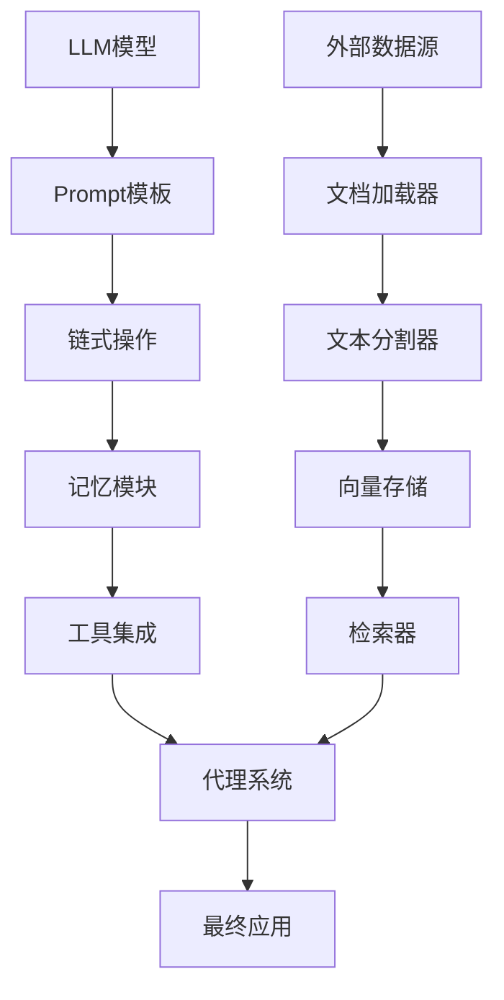

# LangChain核心概念与实战

## 1. LangChain框架简介

### 1.1 什么是LangChain？

**LangChain** 是一个用于开发大语言模型（LLM）应用的框架，提供了一套标准化的接口和组件，简化了LLM应用的开发流程。

**核心价值：**
- **模块化设计**：可组合的组件架构
- **标准化接口**：统一的LLM调用方式
- **链式操作**：复杂的多步骤任务处理
- **工具集成**：外部API和数据库连接

**大白话解释：** LangChain就像AI应用的"乐高积木"，把复杂的AI功能拆分成标准化的模块，让你可以像搭积木一样快速构建AI应用。

### 1.2 LangChain架构概览



## 2. 核心组件深度解析

### 2.1 LLM模型接口

#### 统一模型调用
LangChain提供了统一的接口来调用各种LLM模型，包括OpenAI、Hugging Face、本地模型等。

```python
from langchain.llms import OpenAI, HuggingFaceHub
from langchain.chat_models import ChatOpenAI
import os

def demonstrate_llm_models():
    """演示不同LLM模型的调用"""
    
    print("=== LLM模型调用演示 ===")
    
    # 1. OpenAI模型
    # 需要设置OPENAI_API_KEY环境变量
    # os.environ["OPENAI_API_KEY"] = "your-api-key"
    
    # OpenAI GPT-3
    # llm = OpenAI(model_name="text-davinci-003", temperature=0.7)
    
    # ChatOpenAI（GPT-3.5/4）
    # chat_model = ChatOpenAI(model_name="gpt-3.5-turbo")
    
    # 2. Hugging Face模型
    # 需要设置HUGGINGFACEHUB_API_TOKEN环境变量
    # os.environ["HUGGINGFACEHUB_API_TOKEN"] = "your-token"
    
    # 使用Hugging Face Hub上的模型
    # hf_llm = HuggingFaceHub(
    #     repo_id="google/flan-t5-base",
    #     model_kwargs={"temperature": 0.7, "max_length": 100}
    # )
    
    # 3. 本地模型（示例）
    # 可以使用transformers库加载本地模型
    
    print("模型调用设置演示完成！")
    print("在实际使用中，需要设置相应的API密钥")
    
    return None

# 执行模型调用演示
demonstrate_llm_models()
```

### 2.2 Prompt模板系统

#### Prompt工程的重要性
Prompt是LLM应用的"指令集"，好的Prompt能显著提升模型表现。

```python
from langchain import PromptTemplate
from langchain.prompts import ChatPromptTemplate
from langchain.schema import HumanMessage, SystemMessage

def demonstrate_prompt_templates():
    """演示Prompt模板的使用"""
    
    print("=== Prompt模板演示 ===")
    
    # 1. 基础Prompt模板
    template = """
    你是一个专业的{role}。请根据以下要求回答问题：
    
    问题：{question}
    
    要求：
    - 回答要专业、准确
    - 如果问题涉及技术细节，请详细说明
    - 如果信息不足，请说明需要哪些补充信息
    
    请开始回答：
    """
    
    prompt = PromptTemplate(
        input_variables=["role", "question"],
        template=template
    )
    
    # 格式化Prompt
    formatted_prompt = prompt.format(
        role="AI测试工程师",
        question="如何评估大语言模型的代码生成能力？"
    )
    
    print("基础Prompt模板:")
    print(formatted_prompt)
    print()
    
    # 2. 聊天Prompt模板
    chat_template = ChatPromptTemplate.from_messages([
        ("system", "你是一个专业的{role}，擅长{expertise}。"),
        ("human", "请帮我{task}"),
        ("ai", "好的，我已经理解了你的需求。"),
        ("human", "{user_input}")
    ])
    
    chat_messages = chat_template.format_messages(
        role="软件测试专家",
        expertise="自动化测试和代码质量评估",
        task="设计一个测试用例生成框架",
        user_input="具体来说，我需要一个能够根据需求文档自动生成测试用例的系统"
    )
    
    print("聊天Prompt模板:")
    for i, message in enumerate(chat_messages):
        print(f"{i+1}. {message.type}: {message.content}")
    print()
    
    # 3. 少量样本提示（Few-shot Prompting）
    few_shot_template = """
    请根据以下示例，完成新的任务：
    
    示例1：
    输入：计算1+2的结果
    输出：1+2=3
    
    示例2：
    输入：Python中如何定义一个函数？
    输出：使用def关键字定义函数，例如：def function_name(parameters):
    
    新任务：
    输入：{new_input}
    输出：
    """
    
    few_shot_prompt = PromptTemplate(
        input_variables=["new_input"],
        template=few_shot_template
    )
    
    formatted_few_shot = few_shot_prompt.format(
        new_input="如何在Python中实现二分查找？"
    )
    
    print("少量样本提示:")
    print(formatted_few_shot)
    
    return prompt, chat_template, few_shot_prompt

# 执行Prompt模板演示
basic_prompt, chat_prompt, few_shot_prompt = demonstrate_prompt_templates()
```

### 2.3 链式操作（Chains）

#### 链的概念
链（Chain）是LangChain的核心概念，用于将多个组件连接起来完成复杂任务。

```python
from langchain.chains import LLMChain, SimpleSequentialChain, TransformChain
from langchain.llms import OpenAI
from langchain.prompts import PromptTemplate

def demonstrate_chains():
    """演示链式操作"""
    
    print("=== 链式操作演示 ===")
    
    # 1. 简单LLM链
    llm_prompt = PromptTemplate(
        input_variables=["topic"],
        template="请用一句话解释什么是{topic}？"
    )
    
    # 在实际使用中需要设置OpenAI API密钥
    # llm = OpenAI(temperature=0.7)
    # chain = LLMChain(llm=llm, prompt=llm_prompt)
    # result = chain.run("机器学习")
    
    print("简单LLM链示例（模拟结果）:")
    print("机器学习是一种让计算机从数据中学习规律的技术。")
    print()
    
    # 2. 顺序链示例
    first_prompt = PromptTemplate(
        input_variables=["concept"],
        template="请详细解释{concept}的概念和原理。"
    )
    
    second_prompt = PromptTemplate(
        input_variables=["explanation"],
        template="根据以下解释，总结{explanation}的三个关键要点："
    )
    
    # 在实际使用中创建顺序链
    # first_chain = LLMChain(llm=llm, prompt=first_prompt, output_key="explanation")
    # second_chain = LLMChain(llm=llm, prompt=second_prompt)
    # 
    # overall_chain = SimpleSequentialChain(
    #     chains=[first_chain, second_chain],
    #     verbose=True
    # )
    # 
    # result = overall_chain.run("深度学习")
    
    print("顺序链示例（模拟流程）:")
    print("1. 第一步：生成详细解释")
    print("2. 第二步：总结关键要点")
    print()
    
    # 3. 自定义转换链
    def transform_text(inputs: dict) -> dict:
        """自定义文本转换函数"""
        text = inputs["text"]
        # 简单的文本处理：转换为大写并添加前缀
        transformed = f"处理后的文本: {text.upper()}"
        return {"output": transformed}
    
    transform_chain = TransformChain(
        input_variables=["text"],
        output_variables=["output"],
        transform=transform_text
    )
    
    # 测试转换链
    test_input = {"text": "hello, langchain!"}
    transform_result = transform_chain(test_input)
    
    print("自定义转换链结果:")
    print(f"输入: {test_input['text']}")
    print(f"输出: {transform_result['output']}")
    
    return llm_prompt, first_prompt, second_prompt, transform_chain

# 执行链式操作演示
llm_prompt, first_prompt, second_prompt, transform_chain = demonstrate_chains()
```

## 3. 记忆模块（Memory）

### 3.1 记忆的重要性
记忆模块使LLM应用能够记住对话历史，实现多轮对话的连贯性。

```python
from langchain.memory import ConversationBufferMemory, ConversationSummaryMemory
from langchain.schema import BaseMemory

def demonstrate_memory():
    """演示记忆模块"""
    
    print("=== 记忆模块演示 ===")
    
    # 1. 对话缓冲区记忆
    buffer_memory = ConversationBufferMemory()
    
    # 添加对话历史
    buffer_memory.chat_memory.add_user_message("你好，我是AI测试工程师")
    buffer_memory.chat_memory.add_ai_message("你好！很高兴认识你，我是AI助手。")
    buffer_memory.chat_memory.add_user_message("我想了解如何测试大语言模型")
    
    # 查看记忆内容
    memory_variables = buffer_memory.load_memory_variables({})
    print("对话缓冲区记忆内容:")
    print(memory_variables["history"])
    print()
    
    # 2. 对话摘要记忆（处理长对话）
    summary_memory = ConversationSummaryMemory(llm=OpenAI(temperature=0))
    
    # 添加多轮对话
    conversations = [
        ("user", "我想学习机器学习"),
        ("ai", "机器学习是人工智能的重要分支，主要分为监督学习、无监督学习和强化学习"),
        ("user", "能详细说说监督学习吗？"),
        ("ai", "监督学习使用带标签的数据训练模型，常见算法包括线性回归、决策树、支持向量机等"),
        ("user", "这些算法在测试中有什么注意事项？")
    ]
    
    for role, message in conversations:
        if role == "user":
            summary_memory.chat_memory.add_user_message(message)
        else:
            summary_memory.chat_memory.add_ai_message(message)
    
    # 在实际使用中会生成摘要
    # summary_variables = summary_memory.load_memory_variables({})
    
    print("对话摘要记忆（模拟摘要）:")
    print("用户想学习机器学习，特别是监督学习及其测试注意事项。")
    print()
    
    # 3. 实体记忆（记住特定实体信息）
    class SimpleEntityMemory(BaseMemory):
        """简单的实体记忆实现"""
        
        def __init__(self):
            self.entities = {}
        
        @property
        def memory_variables(self) -> list[str]:
            return ["entities"]
        
        def load_memory_variables(self, inputs: dict) -> dict:
            return {"entities": self.entities}
        
        def save_context(self, inputs: dict, outputs: dict) -> None:
            # 简单的实体提取逻辑（实际应用中需要更复杂的NLP）
            user_input = inputs.get("input", "")
            if "名字" in user_input and "叫" in user_input:
                # 提取名字（简化版）
                parts = user_input.split("叫")
                if len(parts) > 1:
                    name = parts[1].strip().replace("。", "")
                    self.entities["user_name"] = name
        
        def clear(self) -> None:
            self.entities = {}
    
    entity_memory = SimpleEntityMemory()
    
    # 测试实体记忆
    entity_memory.save_context({"input": "我的名字叫张三"}, {"output": "好的，记住了"})
    entity_info = entity_memory.load_memory_variables({})
    
    print("实体记忆内容:")
    print(entity_info["entities"])
    
    return buffer_memory, summary_memory, entity_memory

# 执行记忆模块演示
buffer_memory, summary_memory, entity_memory = demonstrate_memory()
```

## 4. 文档处理与检索

### 4.1 文档加载与处理

LangChain提供了丰富的文档处理工具，支持多种格式的文档加载和预处理。

```python
from langchain.document_loaders import TextLoader, WebBaseLoader
from langchain.text_splitter import CharacterTextSplitter, RecursiveCharacterTextSplitter
from langchain.embeddings import OpenAIEmbeddings
from langchain.vectorstores import Chroma

def demonstrate_document_processing():
    """演示文档处理流程"""
    
    print("=== 文档处理演示 ===")
    
    # 1. 文档加载器
    # 创建示例文本文件
    sample_text = """
    大语言模型评测指南
    
    1. 评测维度
    - 语言理解能力
    - 代码生成质量
    - 逻辑推理能力
    - 知识掌握程度
    
    2. 评测方法
    - 自动化测试套件
    - 人工评估
    - 基准测试数据集
    
    3. 最佳实践
    - 建立标准化评测流程
    - 使用多样化的测试数据
    - 定期更新评测标准
    """
    
    with open("sample_doc.txt", "w", encoding="utf-8") as f:
        f.write(sample_text)
    
    # 使用文本加载器
    loader = TextLoader("sample_doc.txt", encoding="utf-8")
    documents = loader.load()
    
    print(f"加载的文档数量: {len(documents)}")
    print(f"文档内容长度: {len(documents[0].page_content)} 字符")
    print()
    
    # 2. 文本分割器
    text_splitter = RecursiveCharacterTextSplitter(
        chunk_size=200,
        chunk_overlap=50,
        length_function=len
    )
    
    splits = text_splitter.split_documents(documents)
    
    print(f"分割后的文档块数量: {len(splits)}")
    for i, split in enumerate(splits[:3]):  # 显示前3个块
        print(f"块 {i+1}: {split.page_content[:100]}...")
    print()
    
    # 3. 向量化存储（模拟）
    print("向量化存储流程:")
    print("1. 将文本转换为向量表示")
    print("2. 存储到向量数据库中")
    print("3. 支持相似度检索")
    print()
    
    # 在实际使用中需要设置API密钥
    # embeddings = OpenAIEmbeddings()
    # vectorstore = Chroma.from_documents(splits, embeddings)
    
    # 清理临时文件
    import os
    os.remove("sample_doc.txt")
    
    return documents, splits

# 执行文档处理演示
documents, splits = demonstrate_document_processing()
```

### 4.2 检索增强生成（RAG）

RAG结合了检索系统和生成模型，提供更准确、更有依据的回答。

```python
from langchain.chains import RetrievalQA
from langchain.retrievers import BM25Retriever

def demonstrate_rag():
    """演示RAG系统"""
    
    print("=== RAG系统演示 ===")
    
    # 1. 创建检索器
    # 使用BM25算法（传统信息检索）
    
    # 准备文档数据
    documents = [
        "大语言模型在自然语言处理任务中表现出色",
        "Transformer架构是现代NLP模型的基础",
        "预训练和微调是训练大模型的关键步骤",
        "模型评测需要综合考虑多个维度",
        "自动化测试可以提高评测效率"
    ]
    
    # 创建BM25检索器
    retriever = BM25Retriever.from_texts(documents)
    
    # 测试检索
    query = "如何评测大语言模型？"
    retrieved_docs = retriever.get_relevant_documents(query)
    
    print(f"查询: {query}")
    print("检索到的相关文档:")
    for i, doc in enumerate(retrieved_docs):
        print(f"{i+1}. {doc.page_content}")
    print()
    
    # 2. RAG链（模拟）
    print("RAG系统工作流程:")
    print("1. 用户提出问题")
    print("2. 检索相关文档")
    print("3. 将文档和问题组合成Prompt")
    print("4. 生成基于文档的答案")
    print()
    
    # 在实际使用中创建RAG链
    # qa_chain = RetrievalQA.from_chain_type(
    #     llm=llm,
    #     chain_type="stuff",
    #     retriever=retriever
    # )
    # 
    # result = qa_chain.run("什么是Transformer架构？")
    
    return retriever

# 执行RAG演示
rag_retriever = demonstrate_rag()
```

## 5. 代理系统（Agents）

### 5.1 代理的概念
代理是能够使用工具来完成复杂任务的AI系统，可以自主决定使用哪些工具以及如何组合它们。

```python
from langchain.agents import Tool, AgentType, initialize_agent
from langchain.tools import BaseTool

def demonstrate_agents():
    """演示代理系统"""
    
    print("=== 代理系统演示 ===")
    
    # 1. 自定义工具
    class CalculatorTool(BaseTool):
        """简单的计算器工具"""
        
        name = "Calculator"
        description = "用于执行数学计算，输入数学表达式，返回计算结果"
        
        def _run(self, query: str) -> str:
            """执行计算"""
            try:
                # 简单的表达式计算（实际应用中需要更安全的实现）
                result = eval(query)
                return f"计算结果: {result}"
            except Exception as e:
                return f"计算错误: {str(e)}"
        
        async def _arun(self, query: str) -> str:
            """异步版本"""
            return self._run(query)
    
    class CodeAnalyzerTool(BaseTool):
        """简单的代码分析工具"""
        
        name = "CodeAnalyzer"
        description = "分析代码质量，输入代码片段，返回分析结果"
        
        def _run(self, code: str) -> str:
            """分析代码"""
            # 简单的代码分析逻辑
            analysis = []
            
            # 检查代码长度
            lines = code.split('\n')
            if len(lines) > 50:
                analysis.append("代码可能过长，建议拆分函数")
            
            # 检查注释
            comment_lines = [line for line in lines if line.strip().startswith('#')]
            comment_ratio = len(comment_lines) / len(lines) if lines else 0
            if comment_ratio < 0.1:
                analysis.append("注释比例较低，建议增加文档注释")
            
            return "代码分析结果: " + "; ".join(analysis) if analysis else "代码质量良好"
        
        async def _arun(self, code: str) -> str:
            return self._run(code)
    
    # 创建工具列表
    tools = [
        CalculatorTool(),
        CodeAnalyzerTool()
    ]
    
    print("可用工具:")
    for tool in tools:
        print(f"- {tool.name}: {tool.description}")
    print()
    
    # 2. 代理工作流程（模拟）
    print("代理决策流程:")
    print("1. 接收用户请求: '计算(2+3)*4的结果，并分析一段Python代码'")
    print("2. 思考: 需要先计算数学表达式，然后分析代码")
    print("3. 执行: 使用Calculator工具计算(2+3)*4")
    print("4. 执行: 使用CodeAnalyzer工具分析代码")
    print("5. 整合结果并返回给用户")
    print()
    
    # 在实际使用中初始化代理
    # llm = OpenAI(temperature=0)
    # agent = initialize_agent(
    #     tools, 
    #     llm, 
    #     agent=AgentType.ZERO_SHOT_REACT_DESCRIPTION, 
    #     verbose=True
    # )
    # 
    # result = agent.run("计算(2+3)*4的结果，并分析一段Python代码")
    
    return tools

# 执行代理系统演示
agent_tools = demonstrate_agents()
```

## 6. 实战应用：AI测试助手

### 6.1 构建测试用例生成系统

```python
from langchain.chains import LLMChain
from langchain.prompts import PromptTemplate
from langchain.memory import ConversationBufferMemory

def build_test_assistant():
    """构建AI测试助手"""
    
    print("=== AI测试助手构建演示 ===")
    
    # 1. 测试用例生成模板
    test_case_template = """
    你是一个专业的测试工程师。请根据以下需求生成测试用例：
    
    功能描述: {feature_description}
    测试类型: {test_type}
    预期输入: {expected_input}
    预期输出: {expected_output}
    
    请生成详细的测试用例，包括：
    1. 测试用例ID和名称
    2. 前置条件
    3. 测试步骤
    4. 预期结果
    5. 实际结果（留空）
    6. 通过/失败状态（留空）
    
    测试用例:
    """
    
    test_case_prompt = PromptTemplate(
        input_variables=["feature_description", "test_type", "expected_input", "expected_output"],
        template=test_case_template
    )
    
    # 2. 测试报告分析模板
    report_analysis_template = """
    分析以下测试报告，找出问题并给出改进建议：
    
    测试报告:
    {test_report}
    
    分析要点:
    1. 失败测试用例的根本原因
    2. 测试覆盖率评估
    3. 测试效率改进建议
    4. 自动化测试优化方向
    
    分析结果:
    """
    
    report_prompt = PromptTemplate(
        input_variables=["test_report"],
        template=report_analysis_template
    )
    
    # 3. 集成记忆模块
    memory = ConversationBufferMemory()
    
    # 模拟对话历史
    memory.chat_memory.add_user_message("我需要为登录功能生成测试用例")
    memory.chat_memory.add_ai_message("好的，请提供登录功能的具体需求")
    
    print("AI测试助手组件构建完成！")
    print("包含功能:")
    print("- 测试用例生成")
    print("- 测试报告分析") 
    print("- 对话记忆管理")
    print()
    
    # 4. 示例使用
    example_feature = "用户登录验证功能"
    example_test_type = "功能测试"
    example_input = "用户名: testuser, 密码: password123"
    example_output = "登录成功，跳转到主页"
    
    formatted_prompt = test_case_prompt.format(
        feature_description=example_feature,
        test_type=example_test_type,
        expected_input=example_input,
        expected_output=example_output
    )
    
    print("测试用例生成示例:")
    print(formatted_prompt[:200] + "...")
    
    return test_case_prompt, report_prompt, memory

# 构建AI测试助手
test_case_prompt, report_prompt, assistant_memory = build_test_assistant()
```

## 7. 企业级最佳实践

### 7.1 性能优化

**优化策略：**
- **缓存机制**：缓存频繁使用的Prompt和结果
- **批量处理**：合并多个请求提高效率
- **异步处理**：使用异步API提高并发性能

### 7.2 错误处理

**健壮性设计：**
```python
import logging
from typing import Any, Dict

class RobustLangChainApp:
    """健壮的LangChain应用"""
    
    def __init__(self):
        self.logger = logging.getLogger(__name__)
    
    def safe_execute_chain(self, chain, inputs: Dict[str, Any]) -> str:
        """安全执行链式操作"""
        try:
            # 输入验证
            self._validate_inputs(inputs)
            
            # 执行链
            result = chain.run(**inputs)
            
            # 结果验证
            self._validate_result(result)
            
            return result
            
        except Exception as e:
            self.logger.error(f"链执行错误: {str(e)}")
            # 降级处理或返回默认响应
            return "抱歉，处理过程中出现错误，请稍后重试。"
    
    def _validate_inputs(self, inputs: Dict[str, Any]) -> None:
        """验证输入参数"""
        if not inputs:
            raise ValueError("输入参数不能为空")
        
        # 检查必要的输入字段
        required_fields = ["input"]  # 根据实际需求调整
        for field in required_fields:
            if field not in inputs:
                raise ValueError(f"缺少必要字段: {field}")
    
    def _validate_result(self, result: str) -> None:
        """验证结果"""
        if not result or len(result.strip()) == 0:
            raise ValueError("生成结果为空")
        
        if len(result) > 10000:  # 限制结果长度
            raise ValueError("生成结果过长")

# 使用示例
robust_app = RobustLangChainApp()
```

## 8. 实战项目建议

### 8.1 AI测试相关项目

1. **智能测试用例生成器**
   - 根据需求文档自动生成测试用例
   - 支持多种测试类型（功能、性能、安全）

2. **测试报告智能分析**
   - 自动分析测试结果
   - 识别潜在问题和改进方向

3. **代码质量评估助手**
   - 分析代码质量指标
   - 提供改进建议

### 8.2 进阶学习方向

1. **自定义工具开发**
   - 集成企业内部测试工具
   - 开发专用测试分析工具

2. **多模态应用**
   - 结合图像和文本的测试分析
   - UI自动化测试集成

3. **分布式部署**
   - 构建企业级AI测试平台
   - 支持多用户并发使用

---

**标签**: #LangChain #AI应用开发 #RAG #代理系统 #AI测试 #大模型评测