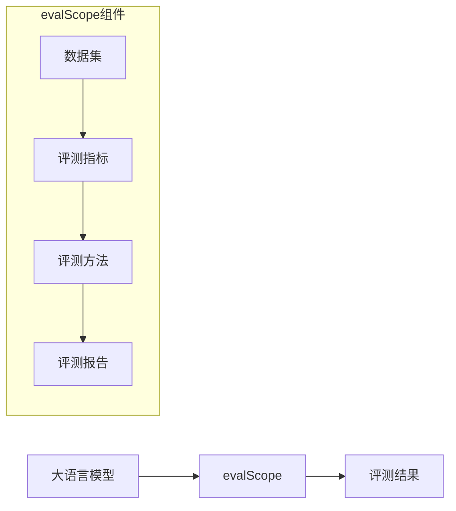

# evalScope核心概念

## 1. evalScope定义
evalScope是一个用于评测大语言模型的框架，提供了一系列工具和组件，能够帮助开发者快速评测大语言模型的性能。

**大白话解释：** 就像一个评测工具，能够帮助你评测大语言模型的性能，如准确性、流畅性、一致性等。

## 2. evalScope架构

## 3. evalScope核心组件

### 3.1 数据集(Dataset)
数据集是evalScope的核心，包含了各种用于评测大语言模型的数据集，如MMLU、GSM8K、HumanEval等。

**常见数据集类型：**
- **MMLU：** 多任务语言理解数据集，包含了57个任务
- **GSM8K：** 小学数学数据集，包含了8000个数学问题
- **HumanEval：** 代码生成数据集，包含了164个编程问题
- **TruthfulQA：** 真实性数据集，包含了817个问题

### 3.2 评测指标(Evaluation Metric)
评测指标是用于评测大语言模型性能的指标，如准确性、流畅性、一致性等。

**常见评测指标类型：**
- **准确性：** 模型回答的准确性
- **流畅性：** 模型生成文本的流畅性
- **一致性：** 模型回答的一致性
- **多样性：** 模型生成文本的多样性
- **效率：** 模型生成文本的速度

### 3.3 评测方法(Evaluation Method)
评测方法是用于评测大语言模型性能的方法，如零样本学习、少样本学习、微调等。

**常见评测方法类型：**
- **零样本学习：** 不提供任何示例，直接评测模型
- **少样本学习：** 提供少量示例，评测模型
- **微调：** 使用数据集对模型进行微调，然后评测模型
- **对比评测：** 对比多个模型的性能

### 3.4 评测报告(Evaluation Report)
评测报告是用于展示评测结果的报告，包含了各种图表和统计信息。

**常见评测报告类型：**
- **文本报告：** 文本形式的评测报告
- **图表报告：** 图表形式的评测报告
- **可视化报告：** 可视化形式的评测报告

## 4. evalScope工作流程

**大白话解释：** 就像一个评测流程，先选择数据集，再选择评测指标，然后选择评测方法，评测大语言模型，最后生成评测报告。

## 5. evalScope与其他评测框架的区别

| 维度 | evalScope | 其他评测框架 |
|------|----------|----------|
| **功能** | 评测大语言模型的性能 | 评测大语言模型的性能 |
| **灵活性** | 非常灵活，能够组合各种组件 | 相对固定 |
| **扩展性** | 能够扩展评测指标和评测方法 | 有限 |
| **易用性** | 提供了一系列工具和组件，能够帮助开发者快速评测大语言模型 | 相对复杂 |
| **生态系统** | 拥有丰富的生态系统，支持各种数据集和评测指标 | 有限 |

## 6. 常见问题解答

### 6.1 evalScope有什么优势？
- **灵活性：** 能够组合各种组件，构建复杂的评测流程
- **扩展性：** 能够扩展评测指标和评测方法
- **易用性：** 提供了一系列工具和组件，能够帮助开发者快速评测大语言模型
- **生态系统：** 拥有丰富的生态系统，支持各种数据集和评测指标

### 6.2 如何选择合适的数据集？
- **根据任务类型：** 语言理解任务选择MMLU，数学任务选择GSM8K，代码生成任务选择HumanEval
- **根据数据集大小：** 小数据集速度更快，性能稍差；大数据集速度更慢，性能更好
- **根据数据集质量：** 高质量数据集能够提供更准确的评测结果

### 6.3 如何选择合适的评测指标？
- **根据任务类型：** 语言理解任务选择准确性，文本生成任务选择流畅性和多样性
- **根据评测目标：** 评测模型的准确性选择准确性指标，评测模型的流畅性选择流畅性指标
- **根据评测方法：** 零样本学习选择零样本准确性，少样本学习选择少样本准确性

### 6.4 如何选择合适的评测方法？
- **根据任务类型：** 语言理解任务选择零样本学习或少样本学习，代码生成任务选择微调
- **根据数据集大小：** 小数据集选择零样本学习或少样本学习，大数据集选择微调
- **根据评测目标：** 评测模型的通用性能选择零样本学习，评测模型的特定性能选择微调

### 6.5 如何优化评测性能？
- **使用缓存：** 缓存大语言模型的响应，减少API调用次数
- **使用批量处理：** 批量处理多个请求，提高效率
- **使用轻量级模型：** 使用轻量级模型，如gpt-3.5-turbo，提高速度
- **使用异步调用：** 使用异步调用，提高并发性能

[^1]: [evalScope官方文档](https://evalscope.readthedocs.io/)
[^2]: [evalScope GitHub仓库](https://github.com/evalscope/evalscope)
[^3]: [大语言模型评测指南](https://arxiv.org/abs/2306.04757)