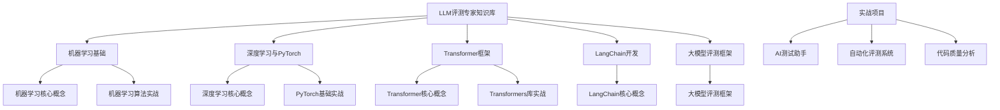
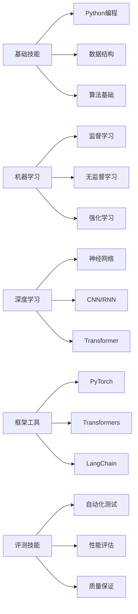
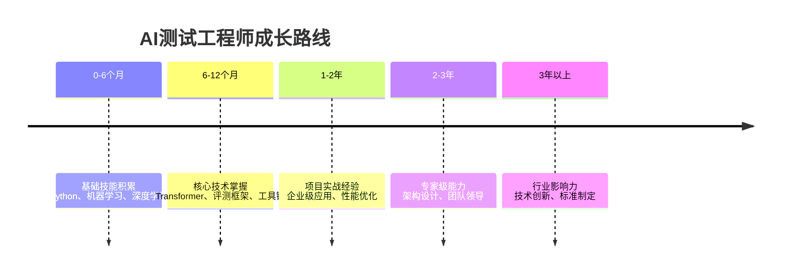

# LLM评测专家知识库 - MOC知识地图

## 📚 知识库概览

本知识库专为AI测试工程师和大模型评测专家设计，提供从基础到专家的完整学习路径。

## 🏗️ 知识架构

### 1. 机器学习基础
- [机器学习核心概念](01-机器学习基础/01-机器学习核心概念.md)
- [机器学习算法实战](01-机器学习基础/02-机器学习算法实战.md)

### 2. 深度学习与PyTorch
- [深度学习核心概念](02-深度学习与PyTorch/01-深度学习核心概念.md)
- [PyTorch基础实战](02-深度学习与PyTorch/02-PyTorch基础实战.md)

### 3. Transformer框架
- [Transformer核心概念](03-Transformer框架/01-Transformer核心概念.md)
- [Transformers库实战](03-Transformer框架/02-Transformers库实战.md)

### 4. LangChain开发
- [LangChain核心概念](04-LangChain开发/01-LangChain核心概念.md)

### 5. 大模型评测框架
- [大模型评测框架](05-大模型评测框架/01-大模型评测框架.md)

## 🎯 学习路径

### 阶段一：基础入门（1-2个月）
1. **机器学习基础** - 掌握核心概念和算法
2. **深度学习入门** - 理解神经网络原理
3. **PyTorch实战** - 掌握深度学习框架

### 阶段二：核心技术（2-3个月）
1. **Transformer架构** - 深入理解大模型基础
2. **Transformers库** - 掌握模型调用和微调
3. **LangChain开发** - 构建AI应用

### 阶段三：专业进阶（3-4个月）
1. **大模型评测** - 掌握评测方法和框架
2. **企业级应用** - 实战项目开发
3. **性能优化** - 系统调优和部署

## 🔥 核心技能树

## 📊 知识卡片索引

### 按标签聚合

#### #机器学习
- [机器学习核心概念](01-机器学习基础/01-机器学习核心概念.md)
- [机器学习算法实战](01-机器学习基础/02-机器学习算法实战.md)

#### #深度学习
- [深度学习核心概念](02-深度学习与PyTorch/01-深度学习核心概念.md)
- [PyTorch基础实战](02-深度学习与PyTorch/02-PyTorch基础实战.md)

#### #Transformer
- [Transformer核心概念](03-Transformer框架/01-Transformer核心概念.md)
- [Transformers库实战](03-Transformer框架/02-Transformers库实战.md)

#### #LangChain
- [LangChain核心概念](04-LangChain开发/01-LangChain核心概念.md)

#### #AI测试
- [大模型评测框架](05-大模型评测框架/01-大模型评测框架.md)
- [LangChain核心概念](04-LangChain开发/01-LangChain核心概念.md)

#### #大模型评测
- [大模型评测框架](05-大模型评测框架/01-大模型评测框架.md)
- [Transformer核心概念](03-Transformer框架/01-Transformer核心概念.md)

## 🚀 实战项目推荐

### 初级项目
1. **情感分析系统** - 使用BERT进行文本分类
2. **代码补全工具** - 基于GPT的代码生成
3. **测试用例生成器** - 自动化测试用例生成

### 中级项目
1. **智能问答系统** - RAG架构的问答应用
2. **代码质量分析** - 自动化代码审查
3. **性能基准测试** - 模型性能评估系统

### 高级项目
1. **企业级AI测试平台** - 完整的测试解决方案
2. **多模态评测系统** - 支持文本、代码、图像
3. **分布式评测框架** - 大规模模型评测

## 📈 职业发展路径

### AI测试工程师成长路线

### 薪资水平参考（2025年）
- **初级AI测试工程师**: 15-25K/月
- **中级AI测试工程师**: 25-40K/月
- **高级AI测试工程师**: 40-60K/月
- **AI测试专家/架构师**: 60K+/月

## 🔍 学习资源推荐

### 官方文档
- [PyTorch官方文档](https://pytorch.org/docs/)
- [Hugging Face文档](https://huggingface.co/docs)
- [LangChain文档](https://python.langchain.com/)

### 在线课程
- 吴恩达《机器学习》课程
- 《深度学习》专项课程
- Hugging Face Transformers课程

### 实践平台
- Kaggle竞赛平台
- Hugging Face模型库
- GitHub开源项目

## 💡 学习建议

### 学习方法
1. **理论结合实践** - 每个概念都要动手实现
2. **项目驱动学习** - 通过实际项目巩固知识
3. **持续迭代优化** - 不断改进代码和方案

### 时间管理
- **每日学习**: 2-3小时系统学习
- **每周项目**: 完成一个小型项目
- **每月总结**: 回顾学习成果和不足

### 社区参与
- 加入AI测试相关社区
- 参与开源项目贡献
- 参加技术分享会议

## 🎉 成功案例

### 学员成长故事
**张三** - 软件工程大四学生
- **起点**: 仅有机器学习理论基础
- **学习路径**: 按照本知识库系统学习6个月
- **成果**: 获得头部互联网公司AI测试工程师offer
- **薪资**: 月薪25K，年终奖3个月

**李四** - 传统测试工程师转行
- **起点**: 3年软件测试经验，无AI背景
- **学习路径**: 9个月系统学习+项目实践
- **成果**: 成功转型为AI测试专家
- **薪资涨幅**: 从15K提升至35K

---

**最后更新**: 2025年1月
**维护者**: AI测试专家团队
**版本**: v1.0

---

**标签**: #MOC #知识地图 #学习路径 #AI测试 #大模型评测