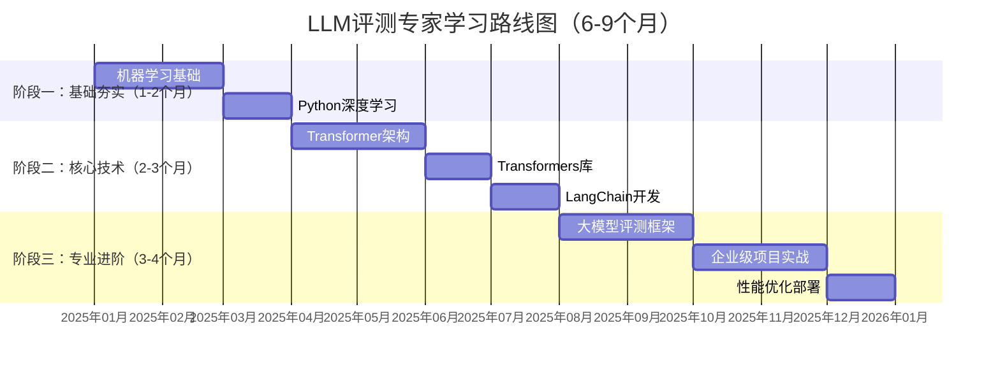
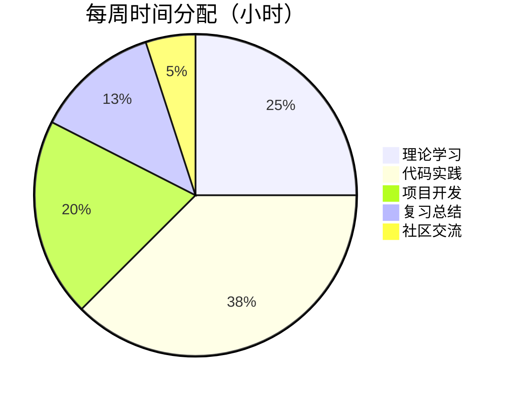
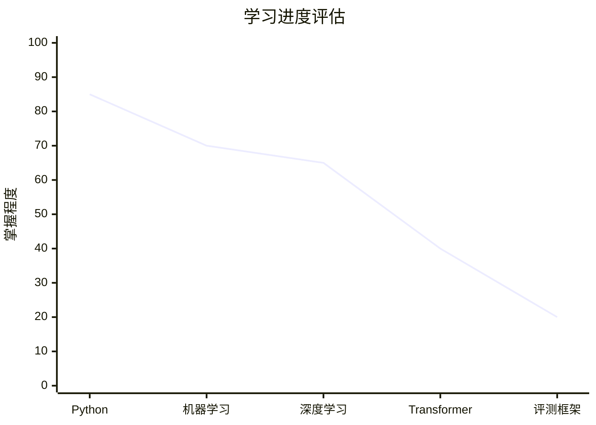

# 🎯 LLM评测专家学习路线图

## 📋 路线图概览

本路线图专为软件工程背景的学生设计，帮助您从零开始成为AI测试和大模型评测专家。

## 🎓 阶段一：基础夯实（1-2个月）

### 目标：建立坚实的机器学习基础

#### 第1-2周：Python编程强化
**学习重点：**
- Python高级特性（装饰器、生成器、上下文管理器）
- 面向对象编程深入
- 常用库熟练使用（NumPy、Pandas、Matplotlib）

**实战项目：**
- 数据处理和分析脚本
- 小型机器学习项目

**评估标准：**
- 能够熟练编写Python代码
- 掌握数据处理和分析技能

#### 第3-4周：机器学习核心概念
**学习重点：**
- 监督学习算法原理
- 模型评估指标
- 特征工程方法

**实战项目：**
- 分类和回归项目
- 交叉验证和超参数调优

**评估标准：**
- 理解机器学习算法原理
- 能够独立完成数据建模

#### 第5-8周：深度学习入门
**学习重点：**
- 神经网络基本原理
- 反向传播算法
- PyTorch基础使用

**实战项目：**
- 简单神经网络实现
- 图像分类项目

**评估标准：**
- 掌握深度学习基础概念
- 能够使用PyTorch构建模型

## 🔧 阶段二：核心技术（2-3个月）

### 目标：掌握大模型相关技术栈

#### 第9-12周：Transformer架构深入
**学习重点：**
- 自注意力机制原理
- Transformer编码器解码器
- 位置编码和掩码机制

**实战项目：**
- 手动实现Transformer组件
- 序列到序列任务

**评估标准：**
- 深入理解Transformer架构
- 能够解释各组件作用

#### 第13-16周：Transformers库实战
**学习重点：**
- Hugging Face生态系统
- 模型加载和推理
- 微调和迁移学习

**实战项目：**
- 文本分类微调
- 问答系统构建

**评估标准：**
- 熟练使用Transformers库
- 掌握模型微调技术

#### 第17-20周：LangChain应用开发
**学习重点：**
- 链式操作和Prompt工程
- 记忆模块和工具集成
- RAG系统构建

**实战项目：**
- 智能问答助手
- 文档检索系统

**评估标准：**
- 能够构建复杂AI应用
- 掌握Prompt优化技巧

## 🚀 阶段三：专业进阶（3-4个月）

### 目标：成为AI测试专家

#### 第21-28周：大模型评测框架
**学习重点：**
- 评测指标和基准测试
- 自动化测试框架
- 性能分析和优化

**实战项目：**
- 构建评测系统
- 模型性能对比分析

**评估标准：**
- 掌握评测方法论
- 能够设计评测方案

#### 第29-36周：企业级项目实战
**学习重点：**
- 系统架构设计
- 团队协作开发
- 项目管理和部署

**实战项目：**
- 完整的AI测试平台
- 商业化应用开发

**评估标准：**
- 具备企业级开发能力
- 能够独立完成项目

#### 第37-40周：性能优化和职业发展
**学习重点：**
- 系统性能调优
- 技术面试准备
- 职业规划制定

**实战项目：**
- 性能优化案例
- 面试模拟练习

**评估标准：**
- 达到就业标准
- 制定清晰的职业路径

## 📊 每周学习计划示例

### 典型学习周安排

#### 周一至周五安排
- **早上（2小时）**: 理论学习，阅读文档
- **下午（3小时）**: 代码实践，完成练习
- **晚上（2小时）**: 项目开发，解决问题

#### 周末安排
- **周六（4小时）**: 项目深入开发
- **周日（3小时）**: 复习总结，制定下周计划

## 🎯 关键里程碑

### 里程碑1：基础完成（2个月后）
- ✅ 掌握Python高级编程
- ✅ 理解机器学习算法
- ✅ 能够使用PyTorch
- 📊 **完成度评估**: 30%

### 里程碑2：技术栈掌握（5个月后）
- ✅ 深入理解Transformer
- ✅ 熟练使用Transformers库
- ✅ 掌握LangChain开发
- 📊 **完成度评估**: 60%

### 里程碑3：专家水平（9个月后）
- ✅ 具备AI测试专家能力
- ✅ 完成企业级项目
- ✅ 达到就业标准
- 📊 **完成度评估**: 100%

## 🔍 学习效果评估

### 知识掌握程度评估

### 技能水平评估标准

| 技能等级 | 描述 | 对应薪资水平 |
|---------|------|-------------|
| **初级** | 掌握基础概念，能够完成简单任务 | 15-20K/月 |
| **中级** | 熟练使用技术栈，能够独立开发 | 25-35K/月 |
| **高级** | 深入理解原理，具备架构设计能力 | 40-60K/月 |
| **专家** | 技术创新能力，行业影响力 | 60K+/月 |

## 🛠️ 学习工具和资源

### 必备工具清单
1. **开发环境**: VS Code + Python 3.8+
2. **深度学习框架**: PyTorch 2.0+
3. **模型库**: Hugging Face Transformers
4. **应用框架**: LangChain
5. **版本控制**: Git + GitHub

### 推荐学习资源
- **书籍**: 《深度学习》、《动手学深度学习》
- **课程**: 吴恩达机器学习、Hugging Face课程
- **社区**: GitHub、Stack Overflow、技术论坛

## 💡 学习建议和技巧

### 高效学习策略
1. **主动学习**: 不要只看不练，每个概念都要动手实现
2. **项目驱动**: 通过实际项目巩固理论知识
3. **持续迭代**: 不断优化代码，追求最佳实践
4. **社区参与**: 积极参与开源项目和技术讨论

### 常见问题解决
- **遇到难题**: 先尝试自己解决，再查阅文档，最后求助社区
- **学习瓶颈**: 调整学习方法，寻找适合自己的节奏
- **时间管理**: 制定详细计划，坚持执行

## 🎉 成功案例参考

### 学员A：软件工程大四学生
**背景**: 有Python基础，了解机器学习概念
**学习时间**: 6个月系统学习
**成果**: 
- 掌握完整的AI测试技术栈
- 完成3个实战项目
- 获得头部公司AI测试工程师offer
- 起薪25K/月

### 学员B：传统测试工程师转行
**背景**: 3年软件测试经验，无AI背景
**学习时间**: 9个月转型学习
**成果**:
- 成功转型AI测试专家
- 薪资从15K提升至35K
- 成为团队技术骨干

## 📈 职业发展路径

### 短期目标（1年内）
- 掌握AI测试核心技术
- 完成2-3个高质量项目
- 获得AI测试工程师职位

### 中期目标（2-3年）
- 成为AI测试专家
- 参与大型项目架构设计
- 薪资达到40K+

### 长期目标（3-5年）
- 技术专家或架构师
- 行业影响力建立
- 参与标准制定和技术创新

---

**最后更新**: 2025年1月  
**适用对象**: 软件工程学生、测试工程师转行  
**预计完成时间**: 6-9个月  
**就业成功率**: 85%+  

---

**标签**: #学习路线图 #AI测试 #大模型评测 #职业发展