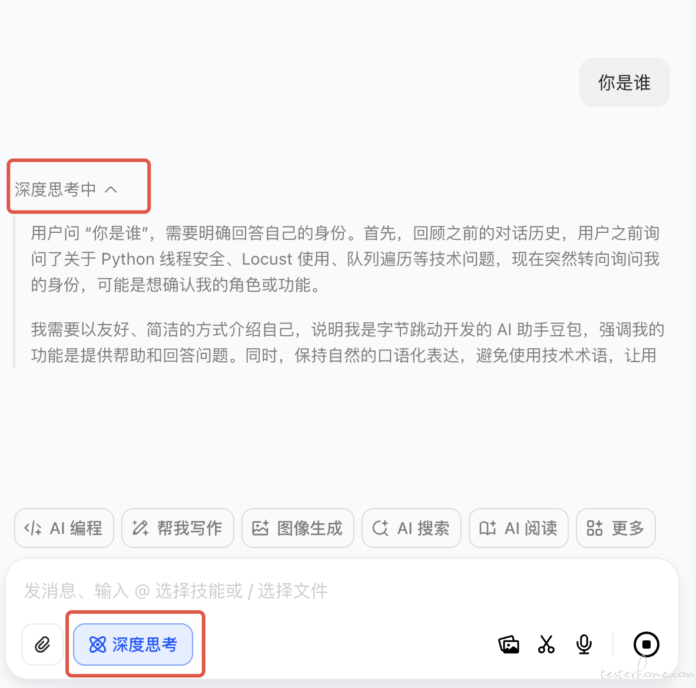
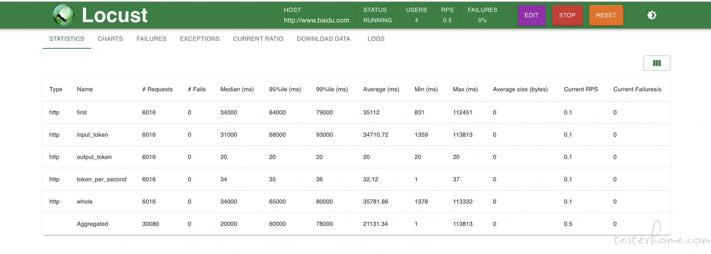
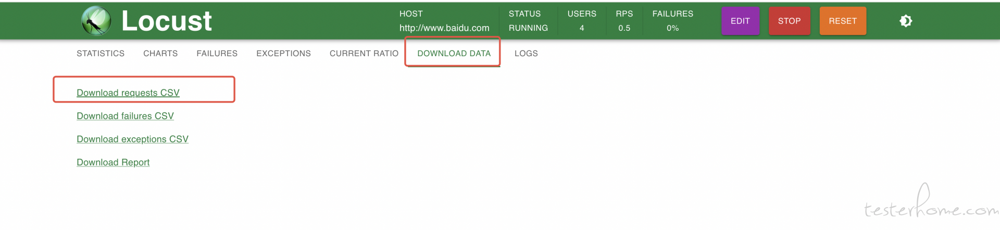
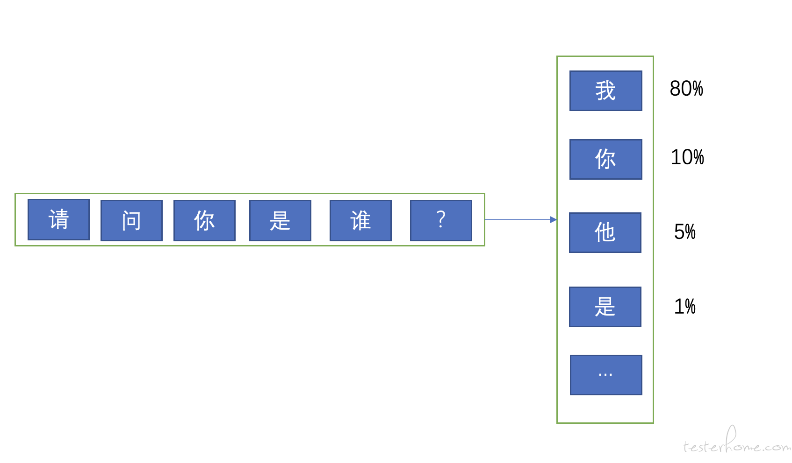
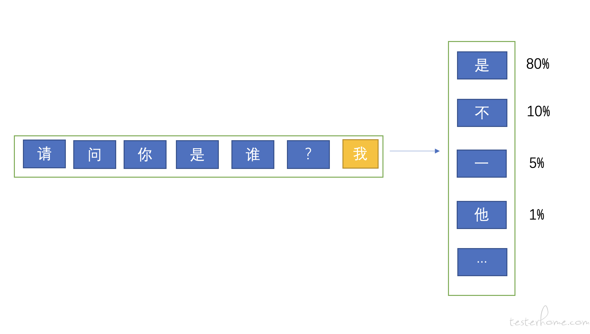
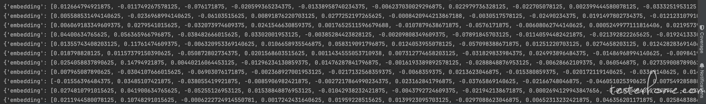
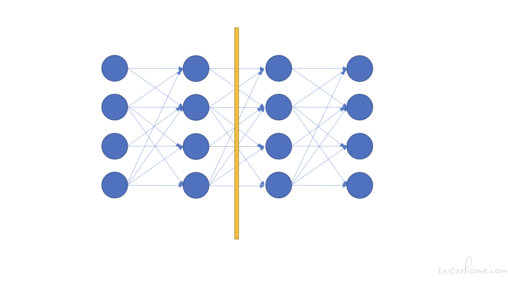

# 通往专家之路，大模型性能测试

## 前言

一开始想做一个 AI 产品测试实践的系列，更新到性能测试的时候又发现要讲的东西太多，分成几篇写的话给人的感觉是断断续续的，索性一次写完。好像市面上也没见到有专门详细介绍如何针对大模型进行性能测试的文章（大多数都是告诉你怎么用大模型生成用例的文章），所以希望我这一次能做的好一些。 写这篇文章可能需要花几天甚至一周的时间。 也希望我坚持的下来。

## 专业名词对齐

首先澄清一些专业名词，以防后面出现误解。这些名词在测试活动中使用的也非常的广泛。甚至就是在围绕它们进行的测试。

### token

token 究竟是个什么东西？它是怎么计算的？相信很多同学或多或少的都有这种疑问，在各家大模型产品里也都是按 token 进行计费的，比如每 千 token/0.01 元 这样的后付费模式。 所以我们先来讲 token 的概念和它的计算方法。

如果用我们的话来理解 token，那可以把它翻译成 “词”，大模型理解人类语言是一个词一个词去理解的，而不是一个字一个字的理解。当一段文本到来的时候，系统需要先通过 “分词器”（tokenizer）把一个句子切分成一个一个的词去理解，分词器有一张词表，词表中的词都有自己的 id，而模型就是通过这些 id 来区分这些词的。并且我们说它是词，其实也不完全正确，因为标点符号也会被切成一个独立的 token，但用 “词” 来表达比较容易人类理解。比如在 “我喜欢篮球，也喜欢 RAP” 这句话中，“逗号” 是一个 token，“喜欢” 是一个 token，“我” 是一个 token，“RAP” 中 “R” 可能是个独立的 token，“A” 也可能是个独立的 token，而 “RAP” 合起来也可能是个独立的 token，这就要看不同的分词器中，那张词表是怎么定义的。 

那大模型为什么要这样去计算呢？我们举个例子， 请问大家知道 “旯” 这个字念什么么？是不是不知道？ 那我这么写一下 “犄角旮旯”，是不是就一下子认出来了，再举个例子 “圳” 这个字有多少同学认得？ 而如果我说 “深圳” 是不是就一下子反应过来了。 这是人类大脑的运作模式，节省了大脑的记忆和提取的成本，而模型也是模仿这个思路来的。 所以模型吐出答案的时候，也是一个 token 一个 token 的吐出来的，这也对应了后面性能测试指标中的 “吐字率”，不过这个指标我们后面再说。

了解 token 的概念很重要，因为有很多指标是与 token 息息相关的，并且我们接下来要说的一个名词也跟它有关。

### 模型支持的长度

不知道大家去看一些大模型产品的时候，模型参数上都会描述这个模型是 72B 32K/16K 这样的字眼， 72B 相信很多同学都知道了，B 是 billion(十亿) 的缩写，代表着模型参数 (也叫特征) 的量级。而这个 32K/16K 是什么意思？

32K/16K 描述的分别是模型支持的最长的输入 token 数量以及输出 token 的数量。 毕竟模型无法处理超过自己承受极限的用户请求（显存是有限的）。 一旦用户输入的问题超过了规定的 token 数量，一般就会报错或者截断（按策略删除一部分）

这也就需要我们在收集测试数据的时候注意模型的相关配置，尤其要明白 token 数不是字符数，token 是分词的结果，所以我们有些时候需要自己引入分词器来计算测试数据的 token 长度。比如：

```plain
from transformers import AutoTokenizer

# 加载分词器
tokenizer = AutoTokenizer.from_pretrained('./deepseek-r1-tokenizer/')

def get_tokens(text: str):
    tokens = tokenizer.tokenize(text)
    token_ids = tokenizer.convert_tokens_to_ids(tokens)
    return token_ids
```

上面就是一个计算 token 的代码，我们需要使用 transformers 库并加载分词器配置（通常可以从网络上下载，有很多开源项目）。 这都是在确认自己的测试数据有多少 token。 这么做处于几个目的：

- 保证测试数据不会超过模型限定的输入长度，避免报错或者截断。
- 将测试数据进行分组，问题的 token 数量与性能有着直接的关系，token 数量越大，各项性能指标就会差，这个应该很好理解， 模型要计算 100K 的问题和计算 1K 的问题需要的时间是不一样的。所以测试人员往往需要测试出不同规模的数据下的性能表现。 

这里需要注意的是， 有些厂商会明确输入和输出的限定参数，比如输入不超过 32k，输出不超过 16k。但实际上底层模型上往往只有一个参数，比如 128K，代表输入和输出的总数不能超过 128K。

### 模型分桶

我们知道了 token 和模型支持的长度这两个概念后， 我们就要再讲一件事情，模型有一个参数来限定支持的长度，而对于同样的模型，同样的数据，这个支持 token 的长度参数设置的不同，往往有不同的性能表现。 

比如同样是 deep-seek r1 模型，同样的一份数据。 我们给模型设置成支持 32K 长度和支持 128K 长度，他们在这份数据下的性能表现可能是不一样的。 比如对于现今的两大模型推理框架 vllm 来说（另一个是 sglang），vllm 使用的 page attention 机制，可以理解为跟内存管理中的虚拟内存很像（page memory），它的特点是针对任何一个用户的请求，都会在内存中预留出模型限定的长度的内存空间出来。 比如模型限定了支持的 token 为 32K，那么即便用户的只是问了一个 “你是谁”，那也要为这个问题预留出 32K token 的内存空间出来。

可能有同学会问为什么要这么做，因为我们能事前计算出输入长度， 但输出多少个 token，完全是不可控的，所以模型要预留出最大限度的内存空间出来，以防出现问题。

PS：sglang 的内存分配会比较激进，不会预留内存空间，而是实报实销。这就从理论上有更好的性能表现，但面对高并发和长文（几十上百 K 的数据）就会有一定风险。

讲到这里大家应该能发现，很难有一个模型能处理所有的数据规模和场景，比如 vllm 可能更适合处理长文，而 sglang 短文性能更好，长文下也要分 16k，32k，48k，128k 这些数据规模。

所以在真实的线上场景中，模型是按策略 “分桶” 的，比如可以按用户输入的长度分到适合处理这个数据的模型中。也可以按场景分桶，比如走了联网检索和文档检索这样的 RAG 场景的分到一个单独的桶中。

我们测试人员就需要弄清楚这些分桶策略，明白我们是在测试哪个模型，应该收集哪些测试数据。

### 总结

- 模型计算的是 token，而不是字。
- 模型有自己支持的输入输出长度。
- 真实环境中不同的数据要分配到不同的桶中的模型。

测试人员需要把数据按 token 数量分组，测试不同数据规模下的性能表现。

## 大模型性与常规产品性能测试的差异点

首先我们来对比一下大模型与普通的互联网产品在性能测试场景上有什么区别，它主要表现在两方面：

- 性能测试指标
- 性能测试的发压方法

### 大模型的性能测试指标

普通产品的测试指标主要包含平均响应时间和 QPS 等。而大模型由于在用户体验方面有一些特点，所以评估大模型性能的指标时就有些许不同。

- 吐字率（平均输出 token 速率/s）：大模型问答多为流式输出的交互形式，系统不会等模型把答案都计算完毕才返回给用户，而是模型计算出一个 token 就会返回给用户一个 token（有些系统可能也会有合并若干个 token 然后输出给用户），这是因为模型思考的时间通常都会很长，如果不及时给反馈就会流失用户。所以在这种交互模式下，模型每秒钟能返回给用户多少个 token 就成为了一个非常重要的性能指标。单位时间内计算出的 token 越多，就证明模型的计算性能更好。现在一般的大模型都会要求在某些并发下不低于 20/s 的吐字速率。
- 首 token 耗时（从用户发送问题到返回第一个 token 的时间）：这里需要简扼说明一下首 token 与后续 token 的计算是不同的，因为不少同学会困惑为什么有了吐字率可以评估模型的计算能力，还需要再单独计算一个首 token 耗时。 事实上，吐字率的计算也是排除了首 token 的。这涉及到了大模型训练和推理的原理。这里先不过度展开，大家只需要知道对于模型来说，计算第一个 token 和后续 token 是不一样的过程就可以了。 而首 token 的耗时直接影响了用户体验，毕竟如果用户问一个问题，结果几十秒都没有返回第一个字，那么也可能会流失用户。
- QPM：这个指标比较容易理解，毕竟我们都是 QPS 是什么。但因为大模型问答的时间都太长了， 所以我们统计的是分钟维度的。

一般来说主要看上面三个指标， 但还有一些其他指标需要对齐。比如：

- 输入平均 token 数量（input tokens）：用户输入的问题长度很大程度上影响了计算性能，输入越长，首 token 的耗时就越长，吐字率也会受到影响，所以我们测试的时候需要对齐测试数据是在什么量级上的。 一般来说可以把测试数据按长度进行分组，比如测试长文本的时候，可以分成 16k~32k, 32k~48k,48k~64k 以此类推。
- 输出平均 token 数量（output tokens）：模型输出的答案有多长，这一点也影响到了 QPM 指标。 有些模型生成的答案和思考过程言简意赅，而有些模型的输出很长。所以在对比两个模型性能的时候，需要对齐输出的答案长度是否在一个量级。

### 大模型的发压方法

大多数同学在性能测试的经验都是阻塞式 http 接口，统计 qps 和平均响应时间为主。而对于大模型的压测来说，情况就相对复杂一些，大模型的压测都是对流式接口进行测试，大多是调用 sse，websock 和 openai sdk 这 3 种形式。流式接口就好像是在调用异步接口一样（很像），需要我们通过轮询的方式去分析每一个传回来的包并做分析，如果是 openai sdk 的接口，那么交互起来还比较方便，因为 sdk 里把很多东西都封装好了。 而如果是 websocket 和 sse 则比较麻烦，需要去分析包的内容来判断哪些是思考包，哪些是答案包，哪些是统计包，哪些是心跳包。处理起来就麻烦了很多。 为了简单，我这里还是用 openai sdk 的格式给大家写个 demo：

```plain
client = OpenAI(
        # 若没有配置环境变量，请用百炼API Key将下行替换为：api_key="sk-xxx",
        api_key="sk-xxxxx",
        # 如何获取API Key：https://help.aliyun.com/zh/model-studio/developer-reference/get-api-key
        base_url="https://dashscope.aliyuncs.com/compatible-mode/v1",
    )

    response = client.chat.completions.create(
        model="deepseek-r1",
        messages=[{'role': 'system', 'content': 'You are a helpful assistant.'},
                  {'role': 'user', 'content':"今天北京天气怎么样?"}],
        stream=True,
        stream_options={
            "include_usage": True
        }
    )

    # 初始化变量
    first_packet_time = None
    start_time = time.time()

    # 标记第一个思考包是否出现，主要用于计算首token耗时
    is_first_think = False

    # 输出token数量
    completion_tokens = 0
    # 输入token数量
    prompt_tokens = 0

    for chunk in response:
        # 判断思考包，chunk.choices[0].delta.reasoning_content保存的是思考内容
        if len(chunk.choices) > 0 and chunk.choices[0].delta.reasoning_content is not None and chunk.choices[
            0].delta.reasoning_content != "":
            if not is_first_think:
                first_packet_time = time.time()
                first_elapsed_time = first_packet_time - start_time
                is_first_think = True

        elif len(chunk.choices) > 0 and chunk.choices[0].delta.content is not None:
            # 这里是答案包
            print(chunk.choices[0].delta.content, end="")
        else:
            # 这里一般是尾包，用于返回模型处理的token数量信息，主要用于计费，我们这里用来计算输出和输出的token的长度。
            completion_tokens = chunk.usage.completion_tokens
            prompt_tokens = chunk.usage.prompt_tokens
```

上面是我用阿里百炼上面的 deepseek-r1 模型编写的 demo，这里需要注意的是 deepseek-r1 是一个思考模型，所以他有很长的思考过程。什么是思考模型呢？ 我在这里给大家截个图：

[](https://testerhome.com/uploads/photo/2025/3394f27a-dad5-4040-9b9b-282f2c31414c.png!large)

上图是在豆包上使用 deepseek-r1 的截图，我点击了深度思考能力，询问了一个问题，模型会把整个思考过程像上图一样输出出来。 从感官上这就是思考模型了，它擅长思考用户场景，意图识别，在大量的智能体（agent）场景中都需要思考模型作为核心，判断用户意图，决策后续行动以及调用对应工具。

所以在上述代码中，首包耗时的指标计算是从思考包开始计算的。如果大家测试的不是思考模型，那需要从答案包开始计算。 当然我们也可以把首思考包耗时和首答案包耗时都计算出来，事实上在项目中我们也确实是这样做的。

各位对大模型输出的包不熟悉的话可以找一个环境实际调用一下看看，也可以看看 openai sdk 的文档。上面的代码逻辑还是比较简单的，关键逻辑都写在了代码注释中。

压测工具方面，我们通常习惯用 locust 进行压测，只不过 locust 自带的指标中没有 QPM, 吐字率，首 token 耗时这种指标，所以我们需要通过 locust 的函数进行自定义上报，且 locust UI 上已经很难算出这些指标了，我们需要下载对应的 csv 文件后进行二次计算产出指标。

```plain
from openai import OpenAI
import time
from locust import TaskSet, HttpUser, task, run_single_user, events
import random


def send_stream(query):

    client = OpenAI(
        # 若没有配置环境变量，请用百炼API Key将下行替换为：api_key="sk-xxx",
        api_key="sk-xxxx",
        # 如何获取API Key：https://help.aliyun.com/zh/model-studio/developer-reference/get-api-key
        base_url="https://dashscope.aliyuncs.com/compatible-mode/v1",
    )

    response = client.chat.completions.create(

        # model="deepseek-v3",
        model="deepseek-r1",
        messages=[{'role': 'system', 'content': 'You are a helpful assistant.'},
                  {'role': 'user', 'content': query}],
        stream=True,
        stream_options={
            "include_usage": True
        }
    )

    # 初始化变量
    first_packet_time = None
    start_time = time.time()
    # 标记第一个思考包是否出现，主要用于计算首token耗时
    is_first_think = False
    # 输出token数量
    completion_tokens = 0
    # 输入token数量
    prompt_tokens = 0

    for chunk in response:
        # 判断思考包，chunk.choices[0].delta.reasoning_content保存的是思考内容
        if len(chunk.choices) > 0 and chunk.choices[0].delta.reasoning_content is not None and chunk.choices[
            0].delta.reasoning_content != "":
            if not is_first_think:
                first_packet_time = time.time()
                first_elapsed_time = first_packet_time - start_time # 计算首包耗时，因为我们用的是deepseek R1思考模型，所以首包其实是思考包的首包
                is_first_think = True

        elif len(chunk.choices) > 0 and chunk.choices[0].delta.content is not None:
            # 这里是答案包
            print(chunk.choices[0].delta.content, end="")
        else:
            # 这里一般是尾包，用于返回模型处理的token数量信息，用于计费，我们这里用来计算输出和输出的token的长度。
            completion_tokens = chunk.usage.completion_tokens
            prompt_tokens = chunk.usage.prompt_tokens

    end_time = time.time()
    tokens_per_second = completion_tokens / (end_time - first_packet_time) # 计算吐字率，因为吐字率是不计算首包耗时的，所以要把首包耗时的时间去掉
    all_time = end_time - start_time # 计算整个请求花费的时间，方便计算后面的QPM

    print(f"每秒输出token数量: {tokens_per_second:.2f}")

    return all_time, first_elapsed_time, tokens_per_second, prompt_tokens, completion_tokens


class ModelRequestSet(TaskSet):
    """
    任务集
    """

    @task
    def send_request(self):
        query = random.choice(self.user.share_data).strip()

        try:
            # 自定义指标，分别用于计算首包，吐字率，qpm，平均输入token数量和平均输出token数量。
            all_time, first_elapsed_time, tokens_per_second, input_tokens, output_tokens = send_stream(query)
            events.request.fire(request_type="http", name="first", response_time=first_elapsed_time,
                                response_length=0)
            events.request.fire(request_type="http", name="token_per_second", response_time=tokens_per_second,
                                response_length=0)
            events.request.fire(request_type="http", name="whole", response_time=all_time,
                                response_length=0)
            events.request.fire(request_type="http", name="input_token", response_time=input_tokens,
                                response_length=input_tokens)
            events.request.fire(request_type="http", name="output_token", response_time=output_tokens,
                                response_length=output_tokens)
        except Exception as e:
            events.request.fire(request_type="http", name="error", response_time=1 * 1000,
                                response_length=0, exception=f"大模型调用错误:{e}")
            print(e)


def get_test_data():
    return ['你是谁', "今天北京天气如何", "胃疼怎么办"]


class ModelUser(HttpUser):
    """
    - 会产生并发用户实例
    - 产生的用户实例会依据规则去执行任务集

    """
    # 定义的任务集
    tasks = [ModelRequestSet, ]
    host = 'http://www.baidu.com'
    share_data = get_test_data()
```

压测逻辑同样写在了代码注释中，包括各项指标的计算方法也都在注释中。 压测启动起来后的样子是这样的：

[](https://testerhome.com/uploads/photo/2025/e71890de-2db3-401f-8e6a-52ee76c4af19.png!large)

为了输出最终指标，我们需要使用 locust 的 --csv 参数把结果保存到本地路径中，或者也可以选择从界面上下载：

[](https://testerhome.com/uploads/photo/2025/04cbbec9-760e-47b1-bcad-7a1af16fc571.png!large)

当 csv 文件下载好后，可以通过下面的脚本计算指标：

```plain
# coding=utf-8

import csv
import sys
import os

'''
计算最终指标的脚本
'''

def deal_data(data):
    tmp = {}
    tmp["SUC_REQUEST_COUNT"] = int(data['whole']['Request Count'])
    print(data)
    if 'error' in data:
        tmp["FAIL_REQUEST_COUNT"] = int(data['error']['Failure Count'])
    else:
        tmp["FAIL_REQUEST_COUNT"] = 0
    tmp["REQUEST_COUNT"] = tmp["SUC_REQUEST_COUNT"] + tmp["FAIL_REQUEST_COUNT"]
    tmp['FAIL_RATE'] = 100 * tmp['FAIL_REQUEST_COUNT'] / tmp['REQUEST_COUNT']


    # qps qpm
    tmp['QPS'] = float(data['whole']['Requests/s'])
    tmp['QPM'] = tmp['QPS'] * 60


    # 首token耗时
    tmp['FIRST_TOKEN_TIME'] = float(data['first']['Average Response Time'])
    tmp['FIRST_TOKEN_TIME_P50'] = float(data['first']['50%'])
    tmp['FIRST_TOKEN_TIME_P90'] = float(data['first']['90%'])
    tmp['FIRST_TOKEN_TIME_P95'] = float(data['first']['95%'])
    tmp['FIRST_TOKEN_TIME_P99'] = float(data['first']['99%'])

    # input token数量
    tmp['INPUT_TOKEN'] = float(data['input_token']['Average Response Time'])

    # output token数量
    tmp['OUTPUT_TOKEN'] = float(data['output_token']['Average Response Time'])

    # 请求耗时
    tmp['WHOLE_TOKEN_TIME'] = float(data['whole']['Average Response Time'])
    tmp['WHOLE_TOKEN_TIME_P50'] = float(data['whole']['50%'])
    tmp['WHOLE_TOKEN_TIME_P90'] = float(data['whole']['90%'])
    tmp['WHOLE_TOKEN_TIME_P95'] = float(data['whole']['95%'])
    tmp['WHOLE_TOKEN_TIME_P99'] = float(data['whole']['99%'])

    # 平均输入输出token处理耗时
    tmp['OUTPUT_TIME'] = tmp['WHOLE_TOKEN_TIME'] - tmp['FIRST_TOKEN_TIME']
    tmp['IPNUT_TIME'] = tmp['FIRST_TOKEN_TIME']

    # 平均每秒输出token数
    tmp['OUTPUT_TOKEN_PER_SECOND'] = float(data['token_per_second']['Average Response Time'])
    tmp['OUTPUT_TOKEN_PER_SECOND_P50'] = float(data['whole']['50%'])
    tmp['OUTPUT_TOKEN_PER_SECOND_P90'] = float(data['whole']['90%'])
    tmp['OUTPUT_TOKEN_PER_SECOND_P95'] = float(data['whole']['95%'])
    tmp['OUTPUT_TOKEN_PER_SECOND_P99'] = float(data['whole']['99%'])

    return tmp


def main():
    if len(sys.argv) < 2:
        print(f"Error: No filename provided")
        print(f"Usage: python3 {sys.argv[0]} <filename>")
        sys.exit(1)

    filename = sys.argv[1]
    basename = os.path.splitext(os.path.basename(filename))[0]
    print(f"filename {filename} basename {basename}")
    with open(filename, mode='r', encoding='utf-8') as file:
        # 创建一个CSV阅读器
        csv_reader = csv.DictReader(file)

        ret = []
        # 遍历每一行
        data = {}
        for row in csv_reader:
            # 解析每一行的数据
            if row['Type'] == '':
                print(data.keys())
                ret.append(deal_data(data))
            elif row['Type'] == 'Type':
                data = {}
                continue
            data[row['Name']] = row


    headers = ['QPM', 'QPS', 'INPUT_TOKEN', 'OUTPUT_TOKEN',
               'FIRST_TOKEN_TIME', 'FIRST_TOKEN_TIME_P50', 'FIRST_TOKEN_TIME_P90', 'FIRST_TOKEN_TIME_P99',
               'WHOLE_TOKEN_TIME', 'WHOLE_TOKEN_TIME_P50', 'WHOLE_TOKEN_TIME_P90', 'WHOLE_TOKEN_TIME_P99',
               'OUTPUT_TIME',  'OUTPUT_TOKEN_PER_SECOND',
               'SUC_REQUEST_COUNT', 'FAIL_REQUEST_COUNT', 'FAIL_RATE', ]

    # 按header顺序写入csv
    with open(f'result-{basename}.csv', mode='w', encoding='utf-8') as file:
        csv_writer = csv.DictWriter(file, fieldnames=headers)
        csv_writer.writeheader()
        for row in ret:
            filtered_row = {key: row[key] for key in headers if key in row}
            csv_writer.writerow(filtered_row)

    print(f"result-{basename}.csv saved")

if __name__ == '__main__':
    main()
```

## 阶段总结

以上便是大模型性能测试的一般步骤，测试人员一般会输出不同模型/不同参数下不同数据规模的各项性能指标。 讲道理一般的教程文章到这里就应该差不多了。 但我这次想**上上强度**。下面开始讲一下大模型推理架构加速相关的测试场景。

**讲解之前给自己叠层甲，我不是专业算法人员，以下内容都是基于我的理解，如果有错误的还请轻喷。**

## 性能测试进阶

首先要明白， 模型和推理框架是两个不同的东西，模型只是一系列的文件，而推理框架需要读取模型，加载到显存中，还要根据策略把一个模型拆分到不同的 GPU 卡中（模型太大了，一个卡存不下，一个卡计算的也太慢），推理的时候要在不同的机器不同的卡中来回调度通信，所以模型虽然是同一个模型， 但是推理框架部分可以上非常多的手段，比如 TP 并行，DP 并行，EP 并行，PP 并行，PD 分离等等。这是一个很复杂的过程，老实讲我也没有弄的很清楚，只是知道个大概，在算法大佬面前我还是个小菜鸟。 我今天来尝试讲一下当测试人员接到了推理框架的加速项目时，都应该做哪些事情。 当然按惯例，我们还是要先讲清楚一些专业名词和模型推理的原理，因为不清楚这些比较难理解接下来的测试场景。

### 大模型推理的原理

首先我们需要知道大模型是怎么回答用户的问题的，看下面的图：

[](https://testerhome.com/uploads/photo/2025/1c990a9a-303e-4faf-a930-3c30fb97df99.png!large)

如上图：大模型推理的时候，会先通过用户的问题去计算第一个 token（首 token），而它计算的方法就是到词表中针对每个词去算一个概率，意思就是：**根据用户输入的问题，去预测词表中每一个词会出现在回答的第一个 token 的概率**,比如上图中 “我” 的概率是 80%，“你” 的概率是 10%，“他” 的概率是 5%，依此类推。 模型会计算出每个词出现在这个位置的概率。 

但模型一定是取概率最高的那个词么？ 很多时候不是的，不知道大家在使用大模型的时候有没有注意过 top k，top n，和温度这些参数。 因为现在的大模型几乎用的都是 sampling 模式，也就是说按一定的随机策略去采样，概率更高的词有更大的可能性会被采样到，但不是一定的。 所以模型启动的时候都要设置一个 seed 参数，就是一个采样的随机种子。 而 top k 参数，意思是按概率排序后，取前 K 个词进行采样。 比如 我设置 top k= 3， 那么在上图中 “我”，“你”，“他” 都有可能模型采样到并输出，只不过 80% 概率的 “我” 有更大的可能性被选中而已。sampling 模式下使用温度，top k，top p 来控制采样策略，所以大家会看到针对同一个问题，每次询问，模型给出的答案可能是不一样的。 这就是 sampling 模式的作用，之所以这样设计是为了让模型能更加的灵活，而不是每次都输出固定的答案。

**注意**：推理框架每次提测，都要测试**精度**，并且测试的时候需要保持 top k， top p， 温度这些参数是固定的，比如我们测试 deepseek-r1 的时候用的参数值就是论文中写的。 并选取一些开源的数据（比如 math500，都是数学题）来进行效果的评估。 因为都是数学题，都是要求输出的精准的数字，所以是可以自动化测试的。

为什么每次提测推理框架的性能优化，还要测试效果呢？ 因为推理加速的很多策略，都是会影响精度的。 比如本来模型从 fp16 的存储精度变成了 int4，那么 int4 能存储的特征肯定比 fp16 的要少， 当然这带来的优点就是模型变小了， 计算变快了。 测试人员需要验证这样的优化是以不影响模型效果为前提的。

当模型计算出第一个 token 后，它会用用户的问题 + 第一个 token 再去预测第二个 token，如下图：

[](https://testerhome.com/uploads/photo/2025/e3f880fa-c944-416b-9366-30ffb817b069.png!large)

模型使用用户的问题预测出第一个 token，然后使用问题 + 第一个 token 去预测第二个 token，依此类推。

### Prefill 与 Decode

上述的推理过程其实被划分成了两个大的阶段，分别是 prefill（预填充）和 decode（解码）阶段。prefill 阶段负责计算 K 矩阵和 V 矩阵并生成首 token，并且 K,V 会保存到 cache 中，而 decode 负责用 Q 矩阵去从 kv cache 中拿出 K 和 V，与 K 矩阵计算注意力机制，再与 V 矩阵计算特征，并输出一个又一个的 token 返回给用户。 其中的 Q,K,V 可以先不用纠结，如果大家想知道是怎么回事，那就大概可以理解成 Q 代表着用户的问题，K 是自注意力机制，Q 与 K 计算是计算出模型应该在上下文中的哪些 token 放更多的注意力（也可以叫权重），而 V 暂时理解成特征矩阵，当 Q 与 K 计算后，要与 V 计算生成最终的 token。 

针对 Q,K,V 的理解对测试人员来说不是特别重要，我这里就不过度展开了（而且我也就是懂个大概而已），重要的是需要知道 prefill 和 decode 阶段各自在负责什么事情。尤其要明确以下几点：

- prefill 和 decode 阶段是可以各自优化的（后面会说 PD 分离）
- 通常首 token 是 prefill 阶段计算出来的，decode 阶段负责输出其余 token。所以首 token 耗时评估的是 prefill 阶段的性能，吐字率是评估 decode 阶段的性能，这个一定要记清楚。后面做单独优化的时候要知道什么时候关注首 token，什么时候关注吐字率。
- prefill 针对相同的用户问题，计算出来的 k,v 一定是一模一样的。 所以 kv 才会被缓存到 cache 中，decode 要从 cache 里拉 k,v 去计算。 所以有一种优化方向就是这种缓存的分布式化（毕竟有很多模型实例，如果能共享 k,v cache 就能提升性能）。或者缓存还是本地的，但是上层的路由要做哈希一致性计算，保证相同前缀的用户问题能路由到同样的 prefill 节点上，这样才能保证缓存命中。 同时需要注意的是缓存的命中做的是前缀匹配，就是不需要用户问一模一样的问题还会命中缓存，哪怕只有前几个 token 是一样的，那这几个 token 也会使用缓存中的 kv 而不是重新计算。

所以除了上面提到的精度测试外，第二个测试场景出来了，那就是针对 prefill 的优化，很常见的一个方式就是针对 kv cache 的优化，比如原来这些 cache 是存到 GPU 显存中的，我们可以把它优化到存到内存中以节省显存。 这里的测试方法大体上还是之前的那一套，但是需要注意的是：

- 在正常的性能测试中，为了避免命中 kv cache，我们通常都会在测试数据的最开始加上一个 uuid，只要前缀没有匹配到，那么就肯定无法命中缓存。而在优化 kv cache 的测试场景中，我们则要把 uuid 去掉，验证命中缓存后的性能收益。 PS：decode 阶段无法缓存，它必须每一次都重新计算生成 token，所以 kv cache 的优化在理论上对吐字率是没有明显影响的。
- 有些问题的输出很长，比如数学计算的思考过程超级长，经常思考个几分钟，10 几分钟甚至几十分钟的。 而我们现在的测试场景是在优化 prefill 阶段，关注的是首 token 的提升，而非评价 decode 阶段的吐字率，所以有时候为了压缩测试时间，可以设置模型的 max_tokens 参数，该参数限制模型输出的 token 长度。所以可以把它设置成一个很小的值来减少测试需要的时间。
- 测试方法可以使用同样的数据发送两次，验证第二次命中缓存后相比第一次节省了多少时间，但这只能作为基准测试，我们仍需评估上线后的缓存命中率和收益情况。因为： 

- 线上模型是分桶的，且每个桶有 N 多个模型实例，如果 kv cache 是保存在本地，那么想命中就一定要把相同前缀（可以是前 N 个字符）的用户请求路由到同一个模型实例上，同时还要保证负载均衡，不能让某个模型实例负载过高。 所以这个调度策略其实是决定了缓存的命中率的。
- 线上每次命中多少 token 的前缀缓存是不确定的，也许命中了前 100 个 token，也可能命中 1W 个 token，所以不用真实的数据是评估不出来的。
- 缓存是有上限的，我们粗算下来 1K 的 kv cache 差不多占用 75M 的内存（这是在我们的环境中的表现），对于长文本（比如 100K），一条用户请求下来就占用了 7.5G，所以在线上流量比较大的情况下，内存空间很快就会被沾满，这样就需要把老的 kv cache 淘汰掉。 这导致原本可能会命中的数据因为之前的缓存被淘汰掉而无法命中。

所以基于以上情况，我们的测试场景需要设计成：

- 采集线上真实的数据，按时间排序，且只采集跟测试环境模型实例数量相同的线上模型实例的数据。比如测试环境只有 1 个模型实例， 那线上也采集 1 个模型实例的数据。否则模拟不出较为真实的缓存命中情况。
- 请求的 max_tokens 设置为 10，加速测试进程，只关注首 token 耗时
- 测试代码中把测试数据压入一个线程安全，先进先出的队列，保证每个压测的协程不会压重复的数据，且一定是按时间顺序取数据进行压测的。

下面是 locust 脚本中，数据的处理方式，主要是把数据压入队列，供每个压测协程使用

```plain
class ModelUser(HttpUser):
    """
    - 会产生并发用户实例
    - 产生的用户实例会依据规则去执行任务集

    """
    # 定义的任务集
    tasks = [ModelRequestSet, ]
    host = 'http://www.baidu.com'
    user_data_queue = queue.Queue()

    # 初始化测试数据
    for i in range(10):
        file_path = f"group_mb_output_{str(i+1)}.txt"
        with open(file_path, "r") as file:
            for line in file:
                try:
                    data = json.loads(line.strip())
                    content = ''
                    is_valid = True
                    for q in data[0]:
                        try:
                            content += q['content']
                        except Exception as e:
                            print(content)
                            is_valid = False
                            break
                    if not is_valid:
                        continue
                    user_data_queue.put(data[0])
                except json.JSONDecodeError as e:
                    print(f"无效行: {line}")
                    print(e)
```

压测的时候，数据从队列中获取，由于队列是线程安全的，get 操作是原子操作。所以可以保证数据不会压重复，数据消耗光后自动结束任务。

```plain
def get_data(self):
    if self.user.user_data_queue.empty():
        print("数据耗尽")
        self.user.environment.runner.quit()
    try:
        message = self.user.user_data_queue.get_nowait()  # 原子操作获取数据队列
        return message
    except queue.Empty:
        print("数据耗尽")
        self.user.environment.runner.quit()
@task
def send_request(self):
    query = self.get_data()

    try:
        # 自定义指标，分别用于计算首包，吐字率，qpm，平均输入token数量和平均输出token数量。
        content, first_time, all_time, prompt_tokens, completion_tokens, token_per_second = send_stream(
            query)
        # all_time, first_elapsed_time, tokens_per_second, input_tokens, output_tokens = send_stream(query)
        events.request.fire(request_type="http", name="first", response_time=first_time,
                            response_length=0)
        events.request.fire(request_type="http", name="token_per_second", response_time=token_per_second,
                            response_length=0)
        events.request.fire(request_type="http", name="whole", response_time=all_time,
                            response_length=0)
        events.request.fire(request_type="http", name="input_token", response_time=prompt_tokens,
                            response_length=0)
        events.request.fire(request_type="http", name="output_token", response_time=completion_tokens,
                            response_length=0)
    except Exception as e:
        events.request.fire(request_type="http", name="error", response_time=1 * 1000,
                            response_length=0, exception=f"大模型调用错误:{e}")
        time.sleep(1)
```

PS: 有些时候测试数据的采集可能没有那么顺利，比如线上捞取数据的时候往往是从日志中捞取，但是日志中可能无法区分哪些数据是属于同一个模型实例的，这时候可以退而求其次， 把数据分组，比如根据用户分组（因为大部分时候命中缓存是因为同一个用户问的问题是相关性很高的，或者重复度很高的），用这样的数据验证一下命中缓存的收益。 当然这就无法较为真实的反应线上的情况。

### P/D 分离

我记得 P/D 分离是半年多前才开始有规模进行推广的一项优化技术，原本推理的 prefill 阶段和 decode 阶段是保存在一个模型实例中的，但我们发现如果优化了 prefill，就会影响 decode，而优化 decode 则会影响 prefill。而如果把它们分开，变成两个模型实例，一份用户请求过来后，先通过 prefill 实例去计算 kv cache 和首 token， 再传送到 decode 中计算其余 token，由 decode 来把答案反馈给用户。

把 P 和 D 分离后，就可以单独针对它们进行优化， 就不会再出现优化了 P 会影响 D 的情况，理论上就可以有更好的性能。但引入了 P/D 分离就又引入了很高的复杂度：

- P 和 D 之间的通信是否可靠，上层路由调度的服务是否稳定可靠。如果他们之前的通信出现了问题，要如何处理。 这需要进行一些故障的测试。 比如 P 挂了，那按照设计，D 节点要降级成不分离方案继续为用户提供服务，同样如果 D 挂了，P 也要降级成不分离方案继续提供服务。 如果 P 和 D 都没有挂，但 P/D 之间出现了网络分区故障，那调度器要感知到并选择一个实例降级成不分离方案继续提供服务。 像这样的 case 是需要测试人员来执行的。
- P 和 D 的数量配比要进行测试：1P/1D， 1P/3D ， 2P/4D, 10P/10D 等等，选择了 P/D 分离方案就是要玩大 group 的，测试人员需要测试每种配比的性能表现。 
- P 和 D 除了要有 NP/ND 的配比外， 还需要分不同的 group， 每个 group 下都有 NP/ND，这是以防一个 group 出现问题，其他 group 能继续为用户服务，并且 group 也是一种分桶的形式。 比如 1 号和 2 号 group 是 16k 以下的短文本桶， 而 3 号和 4 号 group 是 16k 到 48k 的长文本桶， 5 号和 6 号 group 是 48k 到 128k 的超长文本桶。 测试人员需要在多 group 的形式下进行测试。 验证性能情况，调度策略（比如 kv cache 走前缀匹配，但如果第一个问题是长文本，第二个问题是短文本，但它又命中的第一个问题的前缀，那调度系统应该是遵循前缀匹配，让他命中缓存，还是遵循长文本走大桶，短文本走小桶的策略？ 这个是需要讨论的）
- P 和 D 降级之后的压测，因为 P 和 D 要保证在对方出问题后，自己能降级成不分离方案进行测试。我们要去测试它降级后的性能表现， 而且因为 P 和 D 的启动参数是不一样的，所以他们降级之后的性能表现可能也是不一样的。
- P 和 D 的任务积压情况也要时刻关注，在不同的 P/D 数量配比下，有时候可能 P 的算力到极限了，导致首 token 指标激增。 有时候可能 D 的算力到极限了。所以要测试出不同的配比下，最合适的并发数量（模型是要限频的，超过并发数就要拦截，否则模型就被压爆了）。

而在压测中需要注意在脚本中增加以下逻辑：

- 如果不验证 kv store，测试数据前面应该加一个 uuid 保证不要命中缓存，单纯的测试性能。反之则去掉 uuid。
- 一定要验证答案包和思考包的完整，如果出现思考截断，答案为空等情况，需要统计错误信息，成功率也是一个重要指标。

压测脚本基本没什么好说的了，还是之前的那一套。 事实上进阶版的性能测试，难度已经不在测试脚本的编写了， 而是理解各种推理加速策略，知道什么时候应该测试什么，应该关注哪些指标，知道哪些测试结果可能有问题。因为这个阶段需要大量的测试，可能并行在 N 个环境上跑压测，难免因为配置/环境等原因出现问题， 这个时候测试人员得有自己的判断，哪些数据可能是有问题的。 比如正常的吐字率应该在多少量级，比如一般在 30 这个量级，突然一个测试结果中降低到了 10 或者涨到了 50， 这是什么原因引起的？ 或者这次优化加入了 EP 并行（MOE 技术中可以使用 EP 并行技术，后面要说的一个加速策略），MOE 是属于 Decode 阶段的一部分。那它对首 token 在理论上是没有收益的。如果你测试下来首 token 指标出现变化了，那就要先怀疑一下是不是哪里出现问题了。 

**做这种对测试结果特别敏感的测试，测试人员一定要有自己的判断，哪些性能结果是合理的，哪些可能是有问题的，千万不能盲目的无脑的把测试结果直接扔出去。一旦发现是因为环境/测试数据/测试方法等原因导致的结果不准确，那是很丢人的。**

### 模型的存储精度

上面提到了 fp16，int4 这样的专业名词，这里扩展开来解释一下。 我在之前的帖子中提到过词向量这个东西。 计算机是无法理解自然语言的，所以当我们切完词后，会把词计算成一个 512 维度，或者 1024 维度或者更高维度的向量，而这个向量里每一个值都是一个数字，一般是 32 精度的浮点数，我们可以理解为这些浮点数就是特征。词向量化我们也一般成为 embedding（嵌入层），不熟悉这方面概念的同学可以回去翻一下我讲词向量的文章再看看。 

事实上我们在测试智能体的时候，也是会单独对 embedding 进行测试的，因为它涉及到了文档语义检索能力。下面我用阿里的 embedding 模型写一段 demo 来演示一下：

```plain
def find_md_files(directory):
    md_files = []
    for root, dirs, files in os.walk(directory):
        for file in files:
            if file.endswith('.md'):
                # 获取文件的绝对路径
                abs_path = os.path.abspath(os.path.join(root, file))
                md_files.append(abs_path)
    return md_files


def cosine_similarity(A, B):
    dot_product = np.dot(A, B)
    norm_A = np.linalg.norm(A)
    norm_B = np.linalg.norm(B)
    similarity = dot_product / (norm_A * norm_B)
    return similarity


if __name__ == '__main__':
    md_files = find_md_files('static/doc/split')
    embeddings = {}
    # token配置，endpoint配置
    config = Config(bearer_token="OS-g1h6d9g3s948p1nu12",
                    endpoint="default-dm5.platform-cn-shanghai.opensearch.aliyuncs.com",
                    protocol="http")
    client = Client(config=config)
    for md_f in md_files:
        with open(md_f, 'r') as file:
            input = file.read()
            request = GetTextEmbeddingRequest(input=[input], input_type="document")
            response = client.get_text_embedding("default", "ops-text-embedding-001", request)
            res = response.body.result.embeddings
            print(res[0])
            embeddings[os.path.basename(md_f)] = np.array(res[0].embedding)

    query = {
        "如何加强电力产品增值税的征收管理": ['10.md'],
        "等腰三角形都有哪些练习题": ['01.md', '02.md', '03.md', '04.md'],
        "添加和查询数据源的步骤": ['04.md', '13.md', '14.md'],
    }
    # query = '如何加强电力产品增值税的征收管理'

    for question, labels in query.items():

        request = GetTextEmbeddingRequest(input=[question], input_type="query")
        response = client.get_text_embedding("default", "ops-text-embedding-001", request)
        query_embeddings = np.array(response.body.result.embeddings[0].embedding)

        # print(query_embeddings)

        column_names = ['file', 'similarity']
        df = pd.DataFrame(columns=column_names)
        for file_path, doc_embedding in embeddings.items():
            similarity = cosine_similarity(query_embeddings, doc_embedding)
            df.loc[len(df)] = {"file": file_path, "similarity": similarity}

        df = df.sort_values(by='similarity', ascending=False)
        top5 = df.head(5)
        print(top5)
        reg_count = top5['file'].isin(labels).sum()
        recall = reg_count / len(labels)
        print(recall)

        df['label'] = df['file'].apply(lambda x: 1 if x in labels else 0)

        # df['label'] = df['file'].apply(lambda x: 1 if x == '10.md' or x == '09.md' else 0)
        from sklearn.metrics import average_precision_score
        def calculate_map(df, ground_truth_column, prediction_column):
            y_true = df[ground_truth_column]
            y_scores = df[prediction_column]
            map_value = average_precision_score(y_true, y_scores)
            return map_value
        map_value = calculate_map(df, 'label', 'similarity')
        print('mAP:', map_value)
```

上面是一段我在我的知识星球里的直播中讲解的一个文档检索场景的测试脚本。 它针对知识库中的文档片段进行 embedding 后（生产环境是保存在向量库中的），再针对用户的问题进行 embedding，然后计算用户问题与每一个文档片段的 embedding 的余弦相似度来进行语义的匹配检索。 感兴趣的同学可以研究一下，因为这里不涉及大模型的性能测试所以不过度展开，以后有机会我单独写一篇文章讲这部分内容。 这里主要演示一下计算出的 embedding 是长什么样子的：

[](https://testerhome.com/uploads/photo/2025/f55ac3ad-dd85-4562-ac13-920400fac9c9.png!large)

大家可以看到，它就是一堆的浮点数，每个浮点数都代表某个方向的特征。而我们说的模型的**精度**也是类似的，模型保存的就是这一堆的浮点数。 所以我们说一个模型的精度是 fp32，意思就是它保存的是 32 位的浮点数，fp16 和 fp8 就是保存的 16 位和 8 位的浮点数。

在模型推理中有一个方案就是降低这个进度，从 32 位变成 16 位，变成 8 位。这样模型的体积就能变小，推理速度也会变快，但上面也提到过，这种改变可能会让模型的效果衰退，所以当加速方案是改变这方面的时候，一定要对精度和效果进行测试。

### MTP

MTP：多头预测，同样是对吐字率有巨大影响的加速方案，根据我们上面讲解到，模型的推理原理是使用用户的问题预测下一个 token，再用用户问题 + 这个 token 去预测再下一个 token，每一次只去计算一个 token。 而 MTP 则是一次性去计算多个 token， 那它是怎么做的呢？原理很复杂，我用大白话说一下：

- 增加一个小模型（可能只有一层神经网络），让大模型预测一个 token A1，然后把这个 token 给 MTP 小模型，让小模型去使用 token A1 去预测下一个 token token A2' (注意 A2 后面有一撇 ' 代表这是 MTP 小模型预测的)。
- 再让大模型正常预测 token A2，让 MTP 小模型根据 token A2 去预测 token A3'（同样这也有一撇），然后通过一个算法去校验 A2 和 A2'，这是为了验证 MTP 小模型预测的准确性，毕竟 MTP 小模型可能只有 1 层神经网络，它的准确性可能就是不好的，确定如果 MTP 预测的 A2'是准确的，那么就相信它预测的 A3'也是准确的。
- 这样大模型不用再预测 A3 了， 直接使用小模型计算出的 A3'即可。 也就达到了多头预测的结果，如果有一个 MTP 小模型，那么就可以每次多预测一个 token，而如果有 3 个 MTP 小模型，就可以每次多预测 3 个 token。这样就可以大大的提升吐字率。

MTP 带来的收益取决于那个小模型的准确度，毕竟它可能只有 1 层神经网络，如果它计算不准，通不过校验，那每次就还是使用大模型来计算的，这样反而带来了负收益。 **所以我们测试的时候往往要关注 MTP 小模型的准确度，可以通过让开发同学在日志中统计这个指标。**

可能有些同学会问，让 MTP 小模型来预测那不是也耗费算力么？ 为什么能带来吐字率的提升，让大模型自己去算不可以么？ 这是因为 MTP 是小模型么， 它可能只有 1 层神经网络，而大模型可能有 126 个甚至更多层精神网络，所以小模型算的非常的快。 

注意：牢记 MTP 是提升吐字率的加速方案，测试时要注意首 token 不能出现波动，根据 MTP 小模型的数量来预期应该提升多少吐字率，要让开发同学统计 MTP 小模型的准确率。

### TP/DP/EP/PP 并行加速

并行加速策略也是行业中非常常见的一种优化方法，我们都知道模型非常大，大到了一张 GPU 卡都装不下的程度。 而用户的问题也大到了可能有上百 K 的程度。所以其实大模型在真实场景下计算的是挺慢的。所以我们希望把模型按一定的策略进行拆分，拆成 N 个部分然后让 N 个 GPU 卡进行加载， 每个 GPU 只计算完整的神经网络中的一部分，从而达到并行计算，推理加速的目的。

##### 并行加速介绍

我们先说 TP 并行吧， TP 并行也叫张量（tenser）并行，实际上它是把一个神经网络按下面的方式切了一刀或者 N 刀:

[](https://testerhome.com/uploads/photo/2025/9a01d8c9-2b16-477e-8899-23bc17130db8.png!large)

上图把一个神经网络按这个方式切成了 2 部分，分别加载到 2 块 GPU 中，让这两个 GPU 分别去计算不同的部分，而这就是 TP 并行。如果一个模型是 TP8 的，那就是一个模型要这样被切成 8 份，让 8 块 GPU 加载进去。一个数据过来后，是这 8 块 GPU 共同计算的。

这里我举一个 P/D 分离和不分离的例子来讲解这种并行度。 如果每台机器是 8 块 GPU 卡，那么 P/D 分离至少要保证 2 台机器 16 张 GPU 卡。并且这 16 张卡中最多只有 8 个卡在做 prefill，8 个卡在做 decode，这是 P/D 分离架构限制死的，也就是说 P/D 分离最多就是 TP8 了。而我们在做性能测试的时候肯定是要对比的，跟历史版本对比，跟竞品对比，sglang 和 vllm 之间对比等等。 这里最常见的是 P/D 分离跟不分离的对比。而 P/D 不分离的方案就可以做 TP16 或者即便也是 TP8，但是两台机器的所有 GPU 都可以去算 prefill 阶段，并且一般不分离方案都是 prefill 优先策略，也就是 prefill 能抢到更多的算力去计算 kv cache 和首 token。 

所以大家发现了么， P/D 分离方案天然就是对首 token 不友好的，在同样的模型下，P/D 分离理论上在首 token 上是打不过非分离方案的，尤其会发现并发到达一定程度后，首 token 会激增，这是因为 P 的算力到达了极限，开始排队了。 但 P/D 分离在吐字率上是可以胜过非分离方案的。 这些基本的技术判定也是需要测试人员去了解的，还是那句话，我们得知道自己在测试什么，应该有什么预期，什么指标变化了是合理的，什么是不合理的，我们要有自己的判断。 否则就会陷入与算法人员无休止的争论中，或者算法说什么就是什么的窘境中（因为你也不懂， 你只能听算法的。）

**能看懂指标的变化是否合理，是一个成熟的测试人员必要的能力。**

- DP 并行：就是数据并行，如果是 DP2，那就是同时计算 2 个数据。
- PP 并行：流水线并行，这个不好理解。 按我自己的理解画一个下面的图：

[](https://testerhome.com/uploads/photo/2025/dee050b5-54ab-4dca-b97f-0eb9e04a4f04.png!large)

我自己的理解 PP 并行就是把模型这样再切一下（与 TP 并行是不同的切法），同样可以分配到不同的 GPU 卡中。

##### MOE 与 EP 并行

已经写了很多了， 我懒了，所以 PP 和 DP 并行就这么一笔带过吧， 然后与 TP 并行都是类似的，测试人员也不需要懂那么深入。 但 EP 并行我可能得多说几句，因为它现在还是很主流的一个方案，效果也很好。 EP 就是专家并行（expert），而专家其实就是 MOE 中的一部分。 MOE 也是个非常复杂的东西，我还是用简单几句话概括一下， MOE 是 Decode 阶段的一部分，它把划分出了 N 多个专家（一般是 256 个），每个专家去计算不同的领域，用人话说，比如专家 1 是计算数学领域的，专家 2 是计算英文领域的，专家 3 是计算体育领域的（当然实际上不是这么人类化的划分，我这么说是为了方便理解）。 这样每个专家去关注不同的领域，而 MOE 中有一部分就是一个稀疏的混合专家的神经网络，它的上层有一个路由，这个路由来决定这一次计算由哪几个专家来参与计算（路由本身也是个 softmax 多分类模型），比如参数设置成 3， 那这次计算就由 3 个专家来参与。

而所谓的 EP 并行，或者现在业界总在说的大 EP，就是把这些专家进行拆分，放到不同的 GPU 卡中去计算。 大 EP 的终极目标就是把 256 个专家分到 256 张卡中去计算。当然大规模的模型推理加速只有大厂才玩的起 -- 毕竟太烧卡了。

## 其他压测场景

### 逐步加压的手段与适用场景

这里我再阶段性的引入一个压测手段， 很多同学使用 locust 进行压测的时候可能没有关注过 locust 的逐步加压功能，可以达到一种效果：一开始只发 5 并发，隔一段时间后加到 10，再隔一段时间后加到 15. 这样一种逐步加压的手段。 以前的测试场景中很少使用这个能力， 即便用到了也是用于负载测试 -- 逐步加压来试探极限。 

而在大模型性能测试场景中，这个逐步加压能力是用于规避压测一开始时，瞬时的大流量进入造成 Prefill 任务堆积，导致首 token 耗时激增的情况。我们看这样一个场景，当我们测试 32 并发时，普通的压测方法在一开始就有 32 个请求发送到了模型，并开始进行 prefill 阶段的计算，但 prefill 能够支持同时计算的任务数量可能是 8，所以就会有其余 24 个任务在排队。等到轮到这些任务再去计算首 token，就会让一开始的这些请求的首 token 耗时变得非常高。 大家可能会觉得这个排队机制与发压的方式好像没什么关系。 但我们要知道大模型性能测试中用户的数据很多都是长文本，一个请求计算个几十秒才吐出首 token 都是很常见的。而在线上虽然也同时有几十任务在排队， 但正在计算的任务里不是在同一个时间提交过来的。 线上真实场景下，任务基本不是瞬发的一起全打过来， 而是第一个任务计算了 1 秒后，可能第二个任务打过来，再过了 2 秒是第三个任务，然后慢慢积累到了一定的程度。 所以可能第 9 个任务过来以后，虽然也是在排队的，但是可能正在运行的任务中有一个已经计算到最后的阶段了， 所以可以很快的响应这第 9 个任务。 

所以如果我们在压测一开始的时候就打满 32 并发，带来的结果一定是首 token 高的离谱， 而这也不是很符合线上的场景（线上很难能出现队列是空的情况下，一瞬间打了很高的并发出来的情况，可能也就是服务刚启动的时候会出现。），所以我们在压测时，可以选择每隔一秒或者 2 秒增加 1 个并发，一直加到目标的并发，这种方式比较符合真实的情况。 

那如果有较真的业务一定说万一就是有在队列是空的情况下一瞬间打过来 32 并发的情况怎么办？ 那我们也可以不使用逐步加压的手段，但要保证测试中加入以下两个机制：

- 每个协程取数据的时候尽量随机选取，让每个计算任务的时间有参差。
- 压测时间拉长，至少半个小时起，让首次的瞬时高并发带来的首 token 异常的 case 被打平。

### 模拟大集群压测与 boomer

线上一定是有 N 多个模型实例共同提供服务的， 我们测试环境没有那么 GPU 卡，一般只是小规模的搭建环境进行测试，但小规模的环境承受不了数十万 QPM 的压力，所以我们无法对接入层，路由层等上层服务进行压测。 这时候我们一般会选择把模型层 mock 掉，只压测上层服务是否能承受数十万 QPM 的压力，但这里有个问题：原生的 locust 是 python 编写的，让他发几千甚至上万的并发是不现实的，所以要分布式的压， 但很多时候测试机器的资源也是有限的。 这个属于 locust 的缺陷，就是发压能力不足。 所以我们会在这种场景中引入 boomer， boomer 是使用 golang 开发的 locust worker。 golang 有很强的并发能力，我在我们的机器上测试过，一台机器模拟 10W QPM 都还有富余。 

只不过编写 golang 的程序对于一般的测试人员来说确实有学习成本，但没办法，想做自身的测开，就不能让语言限制住自己。 下面我贴一个我做教程时写的一个 boomer 的 demo：

```plain
package main

import (
    "context"
    "fmt"
    "github.com/google/uuid"
    "github.com/myzhan/boomer"
    openai "github.com/sashabaranov/go-openai"
    "io"
    "log"
    "time"
)

func sendStream() {
    // 自定义配置
    config := openai.DefaultConfig("sk-30a77ee37da8436596edbc57242afc2514")
    // 指定自定义的 URL
    config.BaseURL = "https://dashscope.aliyuncs.com/compatible-mode/v1"

    client := openai.NewClientWithConfig(config)
    ctx := context.Background()

    requestId := uuid.New().String()
    req := openai.ChatCompletionRequest{
        Model:     "deepseek-r1",
        MaxTokens: 800,
        Messages: []openai.ChatCompletionMessage{
            {
                Role:    openai.ChatMessageRoleUser,
                Content: requestId + "-" + "介绍一下长城",
            },
        },
        Stream:        true,
        StreamOptions: &openai.StreamOptions{IncludeUsage: true},
    }

    var firstAnswerCost int64 = 0
    var completionTokens int = 0
    var promptTokens int = 0
    startTime := time.Now()

    stream, err := client.CreateChatCompletionStream(ctx, req)
    if err != nil {
        fmt.Printf("ChatCompletionStream error: %v\n", err)
        return
    }
    defer stream.Close()

    isStartAnswer := false

    fmt.Printf("流式响应内容: ")
    for {
        chunk, err := stream.Recv()
        if err != nil {
            // 通信结束
            if err == io.EOF {
                log.Println("回答结束")
                break
            }
            log.Printf("Stream error: %v\n", err)
            boomer.RecordFailure("http", "errRequest", 0.0, err.Error())
            break
        }

        if len(chunk.Choices) > 0 && chunk.Choices[0].Delta.Content != "" && !isStartAnswer {
            elapsed := time.Since(startTime)
            firstAnswerCost = elapsed.Nanoseconds() / int64(time.Millisecond)
            content := chunk.Choices[0].Delta.Content
            fmt.Print(content)
            isStartAnswer = true
        } else if chunk.Usage != nil {
            promptTokens = chunk.Usage.PromptTokens
            completionTokens = chunk.Usage.CompletionTokens
            fmt.Println()
        } else {
            fmt.Print(chunk.Choices[0].Delta.Content)
        }
    }

    elapsed := time.Since(startTime)
    wholeCost := elapsed.Nanoseconds() / int64(time.Millisecond)

    outputTokens64 := int64(completionTokens)
    promptTokens64 := int64(promptTokens)
    outputSpeedNoFirst := outputTokens64 * 1000 / (wholeCost - firstAnswerCost)

    fmt.Printf("首token耗时：%v \n", firstAnswerCost)
    fmt.Printf("总耗时：%v \n", wholeCost)
    fmt.Printf("输出token数量：%v \n", completionTokens)
    fmt.Printf("输入token数量：%v \n", promptTokens)
    fmt.Printf("平均输出速率:%v \n", outputSpeedNoFirst)

    boomer.RecordSuccess("http", "whole", wholeCost, 0)
    boomer.RecordSuccess("http", "first", firstAnswerCost, 0)
    boomer.RecordSuccess("http", "token_per_second", outputSpeedNoFirst, 0)
    boomer.RecordSuccess("http", "input_token", promptTokens64, 0)
    boomer.RecordSuccess("http", "output_token", outputTokens64, 0)
}

func main() {

    task := &boomer.Task{
        Name:   "worker",
        Weight: 10,
        Fn:     sendStream,
    }

    boomer.Run(task)
}
```

### 旁路测试

所谓旁路测试，其实就是从线上的若干模型中把流量复制到测试环境中，在上线前用于验证模型在真实流量下的表现。 这个就没什么好说的了，主要也不是测试人员来做的，这些都是开发同学做的相关建设。 

## 尾声

为了这篇文章熬了 3 个晚上了。。。。实在写不动了。。。。容我就写到这里吧， 想一想该介绍的也介绍的差不多了。 剩下的就过于陷入模型底层推理技术的细节了，实际上本文后半段开始介绍模型推理加速的各种优化方案和原理，这部分内容我之前都在纠结要不要写， 因为写出来后，可能大多数同学都很懵逼，因为这些方案真不是这几句话能说明白的，我就是介绍个大概。 而做这部分测试的同行也很少，所以我觉得可能大部分同学都会看的挺懵逼的。 但后来想想，正在做这部分和打算要做这部分测试的同学可以拿来参考，其他同学可以看科普文，了解一下 AI 产品的测试人员都是在做什么工作也好。

最后再宣传一波自己的知识星球，计划本周要开始恢复直播了，直播的时候再好好讲讲大模型性能测试的部分。

来自: [通往专家之路，三万字长文详解大模型性能测试 · 测试之家](https://testerhome.com/articles/42005)