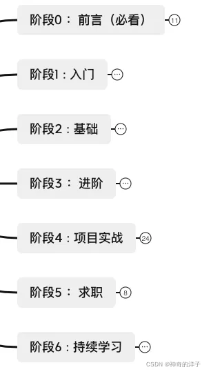
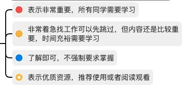

## 阶段0 : 前言

该学习路线一共是7个阶段，循序渐进，学习路线相对比较平缓

### **路线特点**

- 适用于想转行做功能测试与测试开发的同学
- 适用于想全面学习/ 快速求职的同学，可以根据标记符号来选择学习内容
- 给出目标、学习建议、关键知识点、最优资源以及各类资源推荐（视频、书籍、文档、项目、工具等）
- 完整的测试开发学习路线，划分阶段并给出持续学习的方向
- 我自己在百度 从事 测试开发工作 近2年，有自己的从业经历和思考

### **符号标记**

符号标记

### **学习建议**

- 了解清楚测试开发的就业前景和工作内容，该岗位的核心目的是做质量保障，也可能会涉及点点点的工作，也可能需要写代码，确定自己是否喜欢
- 在开始学习之前，确定你的学习目标。是想进大厂还是想找到一份工作就行
- 了解清楚后，你需要准备一款本地IDE软件（学习python 推荐Pycharm，学习Java 推荐 IDEA，学习Go 推荐 GoLand），或者能在线运行代码的网站，如菜鸟工具 https://c.runoob.com/compile/10，用来运行代码，进行代码练习
- 另外你还需要准备一款记笔记的软件，用来记录学习上遇到的问题，解决方案以及自己的心得体会，优质的资料等等，推荐笔记软件有`Typora、印象笔记、CSDN`，再次敲重点，不要太相信你的记性，一定要用笔记软件记录下来

## 阶段1 : 入门

### **目标**

该阶段是通过学习编程语言基础，能够了解编程语言的基本语法、使用规则，能编写出简单的程序，为后续学习自动化测试框架、Web开发框架做准备。在这个阶段你可以选择Java或者Python 任意一门编程语言进行学习，有计算机基础建议选择Java作为编程入门语言

### **Python**

**知识点**

- 函数
- 面向对象编程
- 模块
- 包
- 异常处理
- 文件操作
- 迭代器/装饰器/生成器
- 常用库（Requests、openpyxl）

**资源**

- 视频
  - 千锋教育 700 集零基础 Python 教程：https://www.bilibili.com/video/BV1R7411F7JV（非常全面，基础、web 开发、爬虫、数据分析、AI 基础都讲了，例子也很丰富）
  - 黑马 python 600集 https://www.bilibili.com/video/BV1ex411x7Em?p=1
- 书籍
  - 《Python编程：从入门到实践》：https://www.code-nav.cn/rd/?rid=cbddf0af6064484f002658102cdbba17
  - 《笨办法学Python3》：https://www.code-nav.cn/rd/?rid=b00064a760643bb90cbba72836995fd5

### **Java**

**知识点**

- 数据类型
  - 基本数据类型
  - 引用数据类型
  - 枚举
  - 数组
- 流程控制
  - 判断
  - 循环
- 面向对象
- 抽象类
- 接口
- 集合类
- 泛型
- 注解
- 多线程
- IO流
- 反射
- 异常处理

**学习资源**

- 视频
  - 黑马Java基础 ：https://www.bilibili.com/video/BV18J411W7cE?from=search&seid=9810978996250722293&spm_id_from=333.337.0.0（针对完全没有计算机基础的小白）
  - 韩顺平 - 零基础 30 天学会 Java：https://www.bilibili.com/video/BV1fh411y7R8（900 多集，顺序安排很合理，每个知识真正的打碎了，通俗、有示例、有实战、有思想）
- 文档
  - 菜鸟教程：https://www.runoob.com/java/java-tutorial.html（可以在线练习）
  - 廖雪峰 Java 教程：https://www.liaoxuefeng.com/wiki/1252599548343744
- 书籍
  - 《Head First Java》
  - 《JAVA核心技术(卷1)》

### **学习建议**

对于编程语言学习，需要持续、连续、系统的学习，并且需要根据视频教程或者书籍自己敲代码，这样才能加深印象，遇到问题自己先Debug尝试解决，实在不会可以百度或者请教别人

## 阶段2 : 基础

### **目标**

本阶段有两个部分，一个是掌握开发的基础知识，另一个是掌握测试的基础知识

在掌握了编程语言以后，还需要巩固计算机基础知识，比如数据结构与算法，基本上公司面试时都会重点考察。除此之外，操作系统、计算机网络、数据库、Linux这些计算机基础知识也是企业里常用到的知识 ，对你后面学习Web框架之类的知识都有帮助

对于测试基础，需要学会基础的用例设计方法、抓包等测试工具使用，这些都是做软件测试的必备技能

### **数据结构与算法**

**常用数据结构**

- 数组
- 字符串
- 队列
- 栈
- 链表
- 集合
- 哈希表
- 二叉树

**常用算法**

- 排序
- 双指针
- 查找
- 分治
- 动态规划
- 递归
- 回溯
- 贪心
- 位运算
- DFS
- BFS
- 图

**资源**

- 网站
  - LeetCode：https://leetcode-cn.com/
- 书籍
  - 《小灰的漫画算法》
  - 《剑指 Offer》
- 视频
  - 尚硅谷 Java 数据结构与算法：https://www.bilibili.com/video/BV1E4411H73v（难度比面试的要求大一些，适合希望更全面学习的朋友）

### **计算机网络**

**知识点**

- 网络分层模型
- HTTP / HTTPS 协议
- UDP / TCP 协议
- 网络安全
- DNS域名解析
- ARP 地址解析协议
- Socket

**资源**

- 视频
  - 《计算机网络微课堂》：https://www.bilibili.com/video/BV1c4411d7jb
- 书籍
  - 《图解 HTTP》
  - 《图解 TCP / IP》
- 课件
  - 浙大计算机网络基础：https://github.com/QSCTech/zju-icicles

### **操作系统**

**知识点**

- 进程、线程
- 进程 / 线程间通讯方式
- 进程调度算法
- 进程 / 线程状态
- 死锁
- 内存管理

**资源**

- 视频
  - 《清华操作系统原理》：https://www.bilibili.com/video/BV1uW411f72n
- 书籍
  - 《 自己动手写操作系统》
  - 《现代操作系统》（难度较大）
  - 《深入理解计算机系统》（难度较大）

### **MySQL数据库**

**知识点**

- MySQL 搭建
- SQL 语句（重点）
- 索引
- 事务
- 锁机制
- 设计数据库表

**资源**

- 视频
  - 老杜 - mysql入门基础 + 数据库实战：https://www.bilibili.com/video/BV1Vy4y1z7EX（较新、内容相对精炼，有习题）
  - 尚硅谷 - MySQL基础教程：https://www.bilibili.com/video/BV1xW411u7ax
- 网站
  - SQL 自学网：http://xuesql.cn/
  - SQL 在线运行：https://www.bejson.com/runcode/sql/
- 文档
  - SQL - 菜鸟教程：https://www.runoob.com/sql/sql-tutorial.html
  - MySQL - 菜鸟教程：https://www.runoob.com/mysql/mysql-tutorial.html

### **Linux**

**重点知识**

- 常用命令
- 常用环境搭建
- Shell 脚本编程
- VIM 的使用

**资源**

- 视频
  - 2021 韩顺平 一周学会Linux https://www.bilibili.com/video/BV1Sv411r7vd（基于 CentOS 7.6 版本较新）
- 书籍
  - 《鸟哥的 Linux 私房菜 —— 基础篇》http://cn.linux.vbird.org/linux_basic/linux_basic.php（经典） 文档
  - Linux 工具快速教程：https://linuxtools-rst.readthedocs.io（基础、工具进阶、工具参考）
  - 测试开发的常用linux命令  https://mp.weixin.qq.com/s/Yeuw1KHFeJknbE297UXfeg
- 工具
  - Linux 命令搜索：https://wangchujiang.com/linux-command
  - Linux 命令大全手册：https://www.linuxcool.com/
  - Linux 命令示例：http://linux-commands-examples.com/

### **功能测试基础**

**知识点**

- 测试用例设计
  - 等价类
  - 边界值
  - 错误推测
- 测试计划
- 测试报告

**资源**

- 视频
  - 默默成神10分钟教你设计测试用例https://www.bilibili.com/video/BV1b54y1m7qM?from=search&seid=3299626608307529422&spm_id_from=333.337.0.0

### **测试工具**

- 抓包工具
  - Charles
  - Fiddler
- 接口测试工具
  - Postman
- 用例编写工具
  - XMind
- 缺陷Bug管理工具
  - 禅道
  - Jira
- 接口管理工具
  - Yapi

**资源**

- 视频
  - Postman接口测试和接口自动化测试https://www.bilibili.com/video/BV11K4y1J7sh?p=1
  - 黑马postman教程https://www.bilibili.com/video/BV1h54y1L7kz?p=71
  - 黑马Charles抓包工具实战https://www.bilibili.com/video/BV1mQ4y1N7dn?from=search&seid=12963468550407300148&spm_id_from=333.337.0.0
- 文档
  - Charles入门到精通 https://mp.weixin.qq.com/s?__biz=MzAwMjE0Mzg0Nw==&mid=2650674015&idx=1&sn=9683e9234a894c2416eeecc84b0a69c4&chksm=82c45057b5b3d9410872b1a3930f2a8aa4abe7767e4c729464f81a49e15c1069dfa807432b5a&token=1002072809&lang=zh_CN#rd

## 阶段3 : 进阶

### **目标**

该阶段分为开发进阶与测试进阶两个部分，开发进阶主要为Web开发框架学习，代码管理工具Git以及Redis缓存，为后续能开发测试平台做准备。测试进阶则是包含了自动化测试部分，学完此部分应能利用自动化测试框架编写自动化case

### **Web开发框架**

- python web框架
  - Flask
  - Django
- javaweb
  - SSM框架（Spring、SpringMVC、MyBatis）
  - SpringBoot
  - Maven（项目管理）

**学习建议**

如果你选择的是Python编程语言作为入门，在这个阶段可以选择学习Flask或者Django Web框架。如果你选择的是Java编程 语言作为入门，则可以选择学习SSM框架，或者直接学习SpringBoot

**资源**

- 视频
  - 尚硅谷最新版 JavaWeb 全套教程：https://www.bilibili.com/video/BV1Y7411K7zz（前端部分最好也看下）
  - 尚硅谷 - Spring 5 框架最新版教程（idea版）：https://www.bilibili.com/video/BV1Vf4y127N5
  - 尚硅谷 - SpringMVC 2021 最新教程：https://www.bilibili.com/video/BV1Ry4y1574R
  - 尚硅谷 - MyBatis 实战教程全套完整版：https://www.bilibili.com/video/BV1mW411M737
  - 尚硅谷 - MyBatisPlus 教程：https://www.bilibili.com/video/BV1Ds411E76Y
  - Maven 零基础入门教程：https://www.bilibili.com/video/BV1TW411g7hP（搞不懂 Maven 可以看看）
  - 雷丰阳 2021 版 SpringBoot2 零基础入门：https://www.bilibili.com/video/BV19K4y1L7MT
  - Python Django 项目实战教程：https://www.bilibili.com/video/BV1pq4y1W7a1
  - Python + 微信小程序实战开发：https://www.bilibili.com/video/BV1Xy4y1s792（挺完整，后台用的 Django 框架）

### **Git**

**知识点**

- 工作区
- 分支
- 代码提交、推送、拉取、回退、重置
- 分支操作
- 代码合并、解决冲突

**资源**

- 视频
  - 【尚硅谷】5h打通Git全套教程丨2021最新IDEA版 https://www.bilibili.com/video/BV1vy4y1s7k6
- 书籍与文档
  - 猴子都能懂的 Git 入门 https://backlog.com/git-tutorial/cn/
  - GitHub 漫游指南 https://github.phodal.com/
  - GitHub 官方文档：https://docs.github.com/cn

### **Redis缓存**

**知识点**

- 数据类型
- 常用操作
- Java 操作 Redis
- 主从模型搭建
- 哨兵集群搭建
- 日志持久化

**资源**

- 视频
  - 尚硅谷 - 2021 最新 Redis 6 入门到精通教程：https://www.bilibili.com/video/BV1Rv41177Af（基于 Redis 6 的，推荐）
- 文档
  - Redis 命令参考：http://redisdoc.com/
- 书籍
  - 《Redis 实战》
- 工具
  - Redis 在线练习：https://try.redis.io/

### **自动化测试**

**知识点**

- 单元测试自动化
  - TestNG：Java 测试框架（https://github.com/cbeust/testng）
  - JUnit：Java 测试框架（https://github.com/junit-team/junit4）
  - Unittest：Python单元测试框架
- 接口自动化
  - Pytest（测试管理框架，可用来做接口自动化）
  - Robotframework（测试管理框架，可用来做单元/接口/UI自动化）
- UI自动化
  - Selenium
  - Appium

**资源**

- 视频
  - 廖雪峰Junit单元测试https://www.bilibili.com/video/BV1u4411T78k?p=1
  - 【unittest】自动化测试框架从入门到精通https://www.bilibili.com/video/BV1s5411A7aK?p=1
  - 白月黑羽Pytest自动化测试框架https://www.bilibili.com/video/BV1bV41167a4?p=1
  - 码尚教育pytest教程https://www.bilibili.com/video/BV14i4y1c7Jo?p=6
  - Pytest自动化测试-全套系统课程https://www.bilibili.com/video/BV1AD4y1Z7kb?p=1
  - 白月黑羽Python + Selenium Web自动化https://www.bilibili.com/video/BV1Z4411o7TA?p=1
  - 白月黑羽Appium 手机 App 自动化 https://www.bilibili.com/video/BV1tE411n7rV?p=1
  - 黑马程序员零基础入门移动自动化测试——Appium框架https://www.bilibili.com/video/BV1B441197rZ?p=1

## 阶段4: 项目实战

### **目标**

此阶段分为两个部分，开发实战和测试实战。对于开发实战，希望大家能把前面所学的编程语言，数据库，Linux等知识，开发出测试平台，或者利用自动化测试框架，实现case编写、case执行以及生成测试报告一系列操作。对于测试实战部分，可以通过利用测试工具，如Postman、Charles 完成接口测试，对于遇到的问题，能够通过日志分析，自主排查问题

### **学习建议**

对于测试开发岗位的实战学习，最好能在公司真实环境内部进行，因为只有在公司内部才能体验到完整的项目流程。如果说对于想转行做软件测试的同学实在没有项目经历，可以在阶段3 学习Web框架的时候，开发出一个平台，作为开发的项目经历（测试开发岗位有开发经历会更吃香）。也可以在测试者之家（TesterHome）寻找开源项目进行练习

### **知识点**

- 测试工具脚本（平台）开发

  - 集成信息查询
  - 环境自动部署
  - 测试数据构造、mock数据
  - 监控平台
  - 接口自动化测试平台
  - 压测平台
  - 业务测试中台

- 测试实战

  - 客户端测试

    - Web测试
    - App测试

  - 服务端测试

    - 接口测试
    - 白盒测试
    - Mock数据
    - 测试数据构造
    - HTTP返回数据分析

  - 日志分析与问题排查

    

    

    

### **资源**

- 测试者之家开源项目汇总https://testerhome.com/opensource_projects

## 阶段5 : 求职

### **目标**

找到一份好工作

### **求职建议**

- 精心准备一份简历
- 尽早做规划，可以通过大厂招聘官网的岗位描述来了解岗位的要求
- 多读牛客网面经，坚持刷Leetcode算法
- 多参加面试，面试完成后进行复盘总结

### **资源**

- 网站
  - 牛客网
  - Boss直聘
  - 拉勾网
  - 企业招聘官网
- 面试真题
  - 牛客网测试开发面试真题汇总https://www.nowcoder.com/discuss/experience?tagId=2678
  - 微信公众号：测试开发Guide 回复【面试】

## 阶段6 : 持续学习

### **目标**

持续学习，提升自己核心竞争力

### **学习方向**

- 测试效能提升
  - CI/CD
  - 容器化
  - 测试左移/测试右移
  - diff 测试
  - AI 测试
  - 流量回放
- 测试平台（工具）开发
- 性能测试
- 算法测试
- 大数据测试
- 专项测试
- 稳定性测试

## 结尾

在【测试开发Guide】公众号后台回复【学习路线】即可获取到学习路线图

以上就是洋子结合个人经验、并且参考了大量网上的文章和评论总结而成的学习路线，真的是非常不容易，如果大家觉得满意请务必 【赞】和【在看】支持下