## 常见面试题

### 集合框架

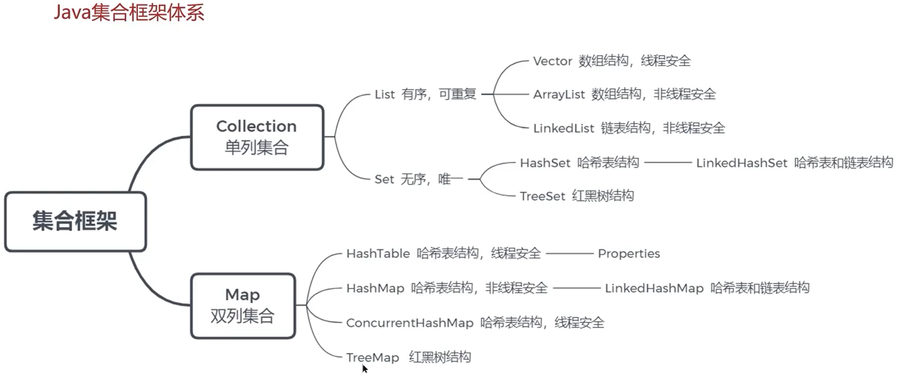

### ArrayList

#### ArrayList底层实现原理是什么？

sfd

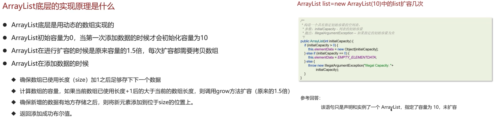

> #### 源码分析
>
> **add-扩容操作**
>
> > 1. 每次add,**先通过size+1确认明确容量**，如果element_data[]==默认数组则返回10，否则返回size+1
> > 2. 返回的明确容量并非是实际容量，**实际容量为element_data_len(只有扩容才会变化)**
> > 3. 当**明确容量比element_data之前分配的容量大时，触发扩容**
> > 4. 扩容增长为1.5倍，并**采用数组拷贝机制**进行扩容
>
> 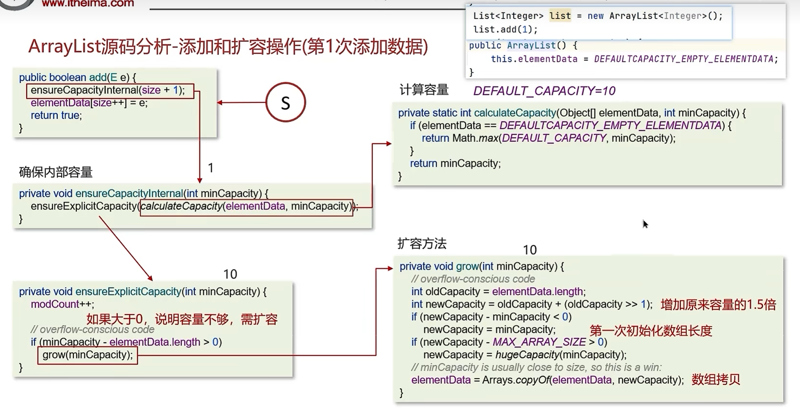	
>
> **构造器**
>
> 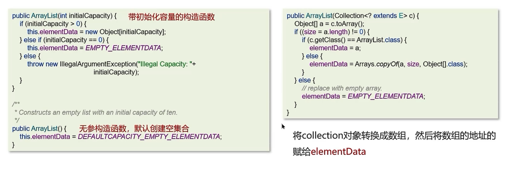
>
> **成员变量**
>
> 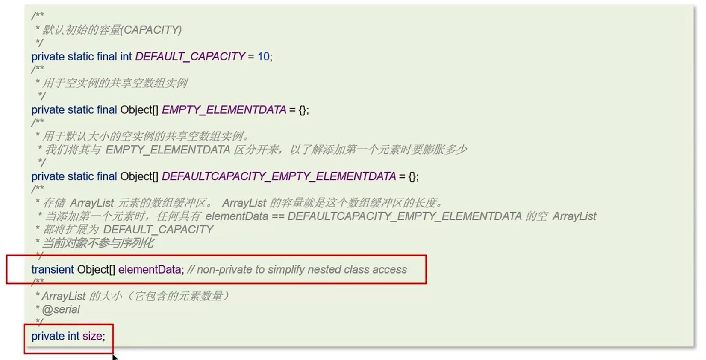

#### 如何实现数组和List之间的转换？

> 1. Array转List,**通过asList（）实现**，**不会对原Array拷贝**，List的element_data只对Array进行简单的引用
> 2. List转Array,**通过toArray（）实现**，**会对原List的element_data成员进行拷贝**，故不会影响

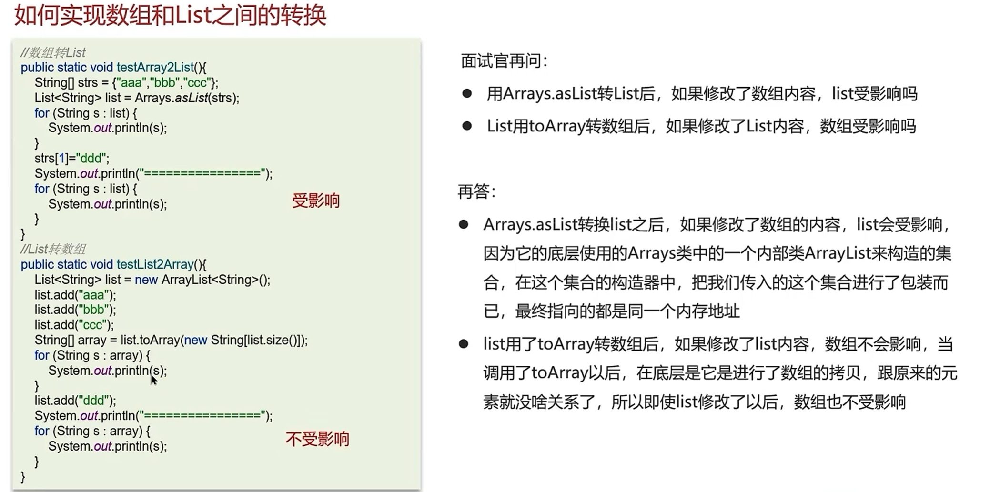

#### ArrayList和LinkedList的区别是什么？

> （01）底层数据结构；（02）效率；（03）空间；（04）线程是否安全；

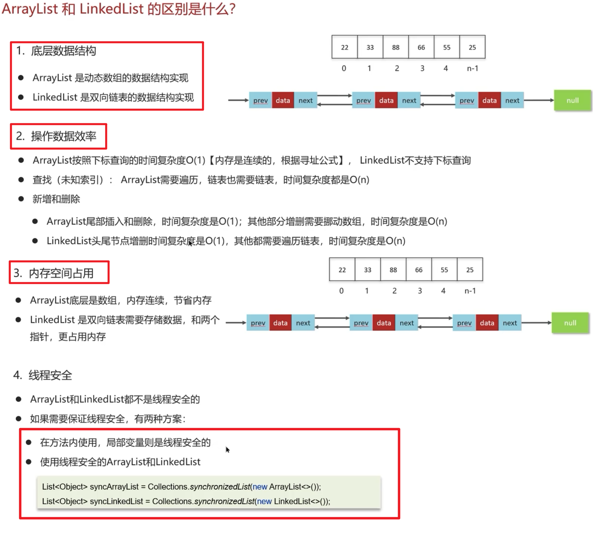

### HashMap

#### HashMap实现原理

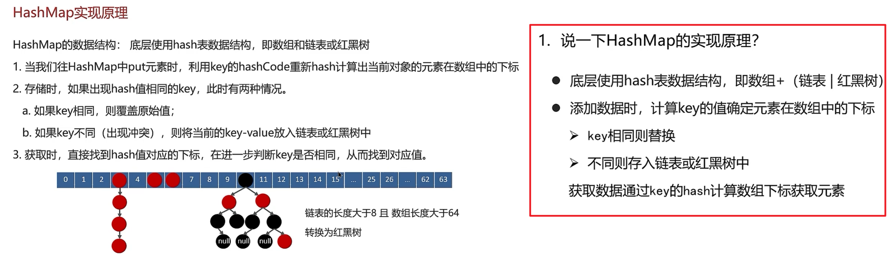

#### HashMap的jdk1.7和jdk1.8的区别

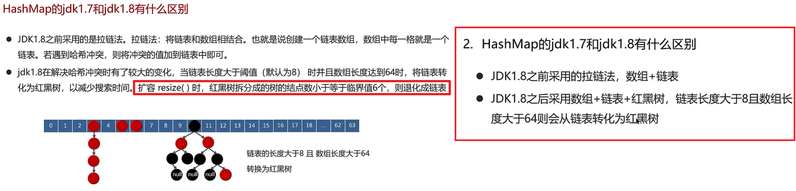

#### HashMap源码分析

##### **put添加数据**

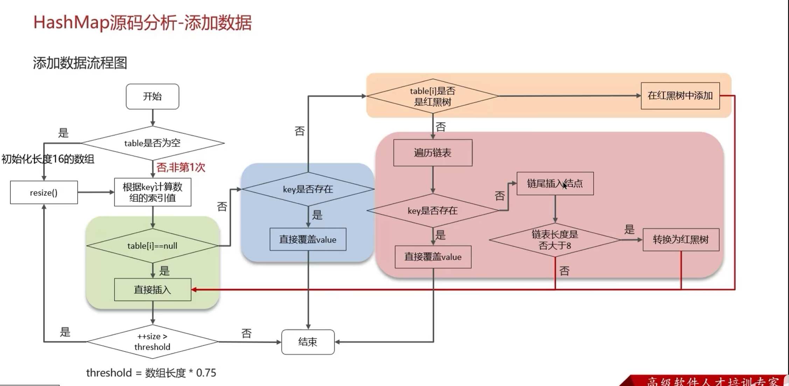

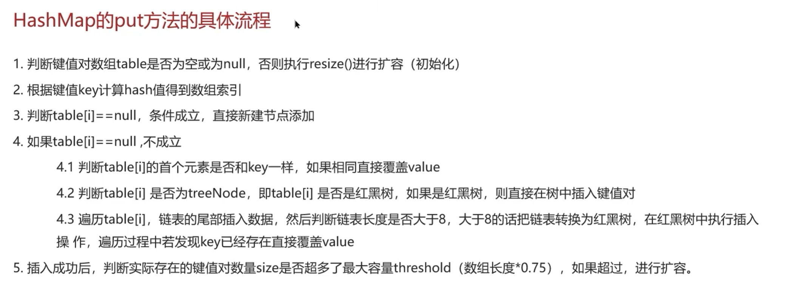

##### **扩容**

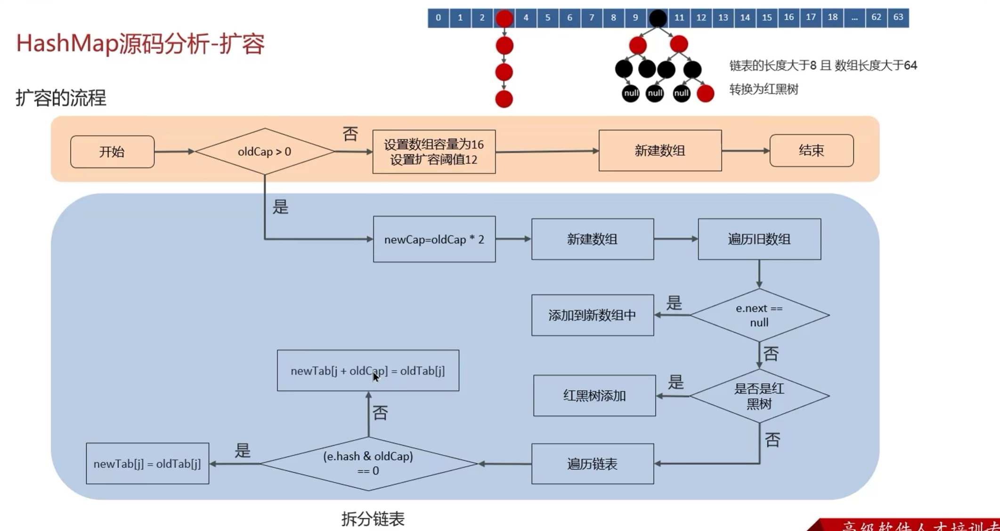

> 1. 每次扩容为oldCap的两倍
> 2. 没有hash冲突的节点（e.next==null），重新hash &运算求下标，
> 3. 遍历链表结点判断是否更换新下标，（e.hash & oldCap）==0，不更换下标，即newtab[i]=oldtab[i]
>    示例：hash=011 & oldCap=1000，说明：该hash在oldCap范围内，即无需变动

##### 讲一讲HashMap的扩容机制？

#### HashMap的寻址算法

> 扰动算法：让hash更均匀，减少hash冲突（h=key.hashCode()) ^ (h>>>16)

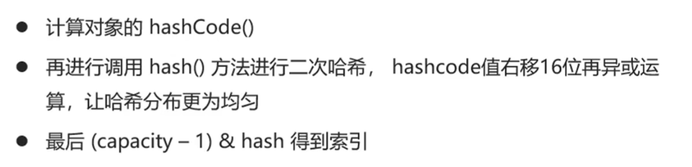

##### 为何HashMap的数组长度一定是2的次幂?

> (n-1)&hash：计算数组索引下标，&运算代替%运算，性能更好（前提：数组长度必须为2的倍数）
>
> hash & oldCap==0的元素留在原来位置

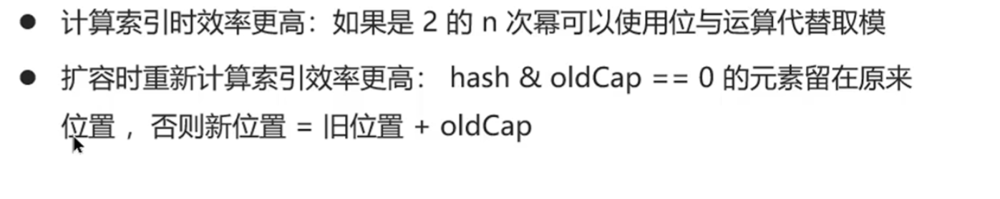

HashMap在1.7情况下的多线程死循环问题

> 1. 着实不懂，主要内容是扩容将oldArray迁移到newArray，由于没有产生对象，对象引用，采用头插法，故多线程读取是正序，插入倒叙，多个线程就会混乱死锁

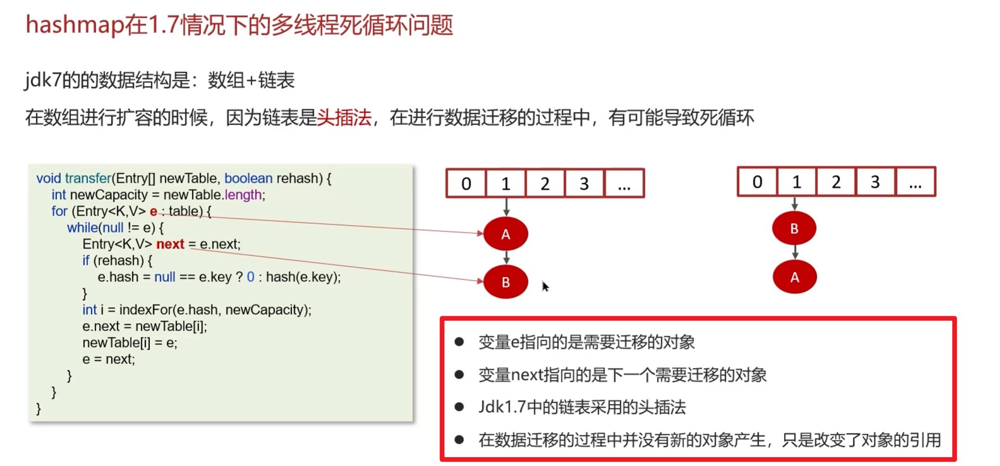
