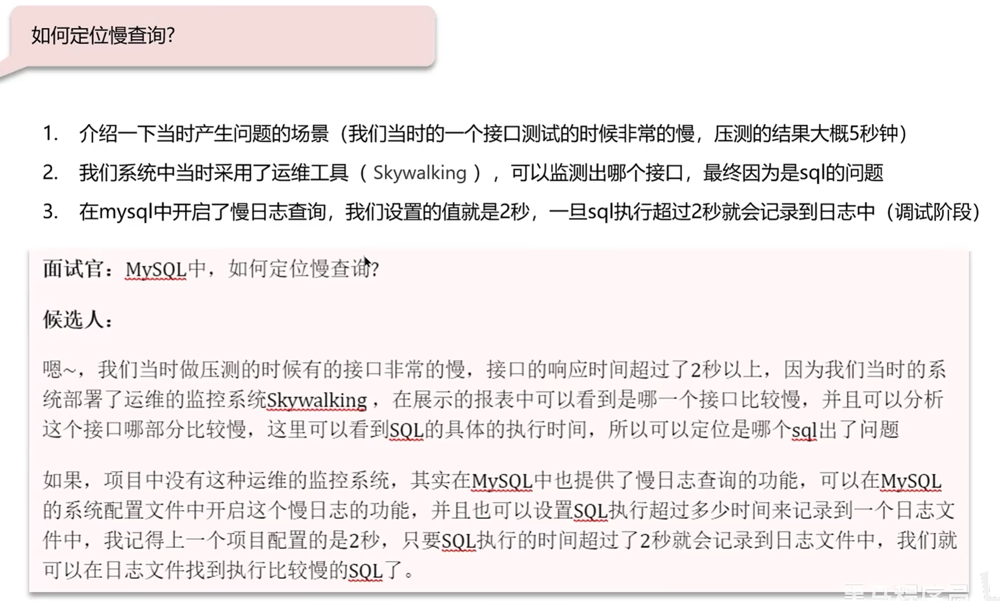
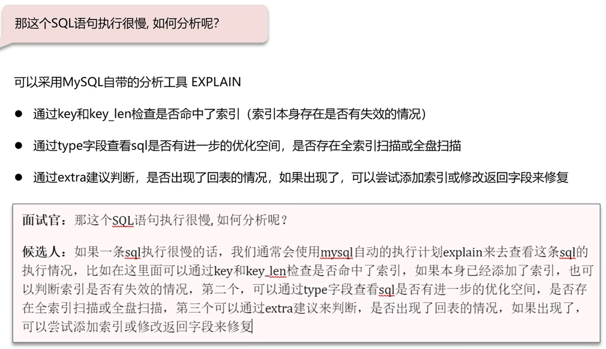
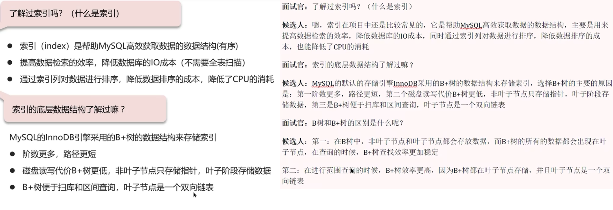
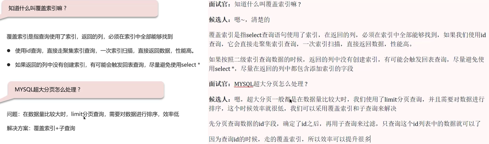
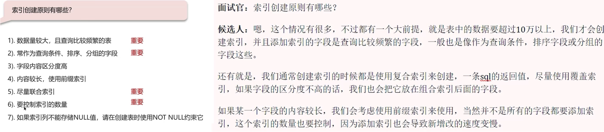
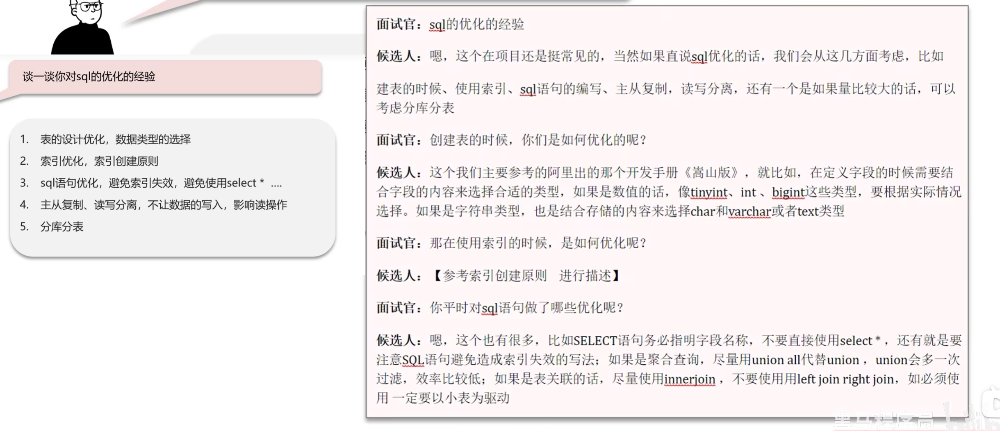
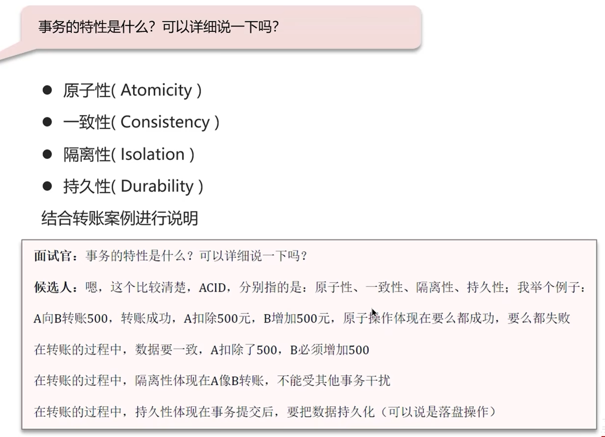
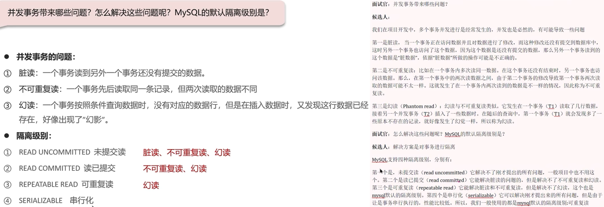
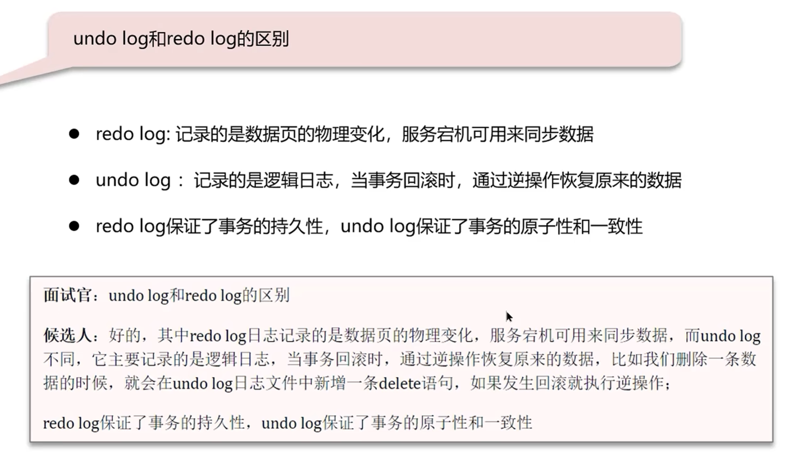
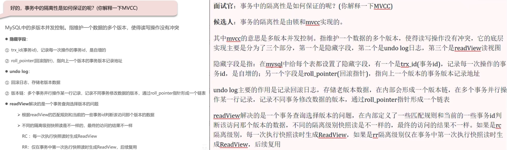

### 定位慢查询

### Sql执行计划分析

### 索引概念、底层数据结构

### 聚簇索引和非聚簇索引、回表查询

### 索引覆盖、超大分页优化

### 索引创建原则

### 索引失效

### Sql优化

## 事务

### 事务的特性

### 事务并发问题，隔离级别解决

### `undo log` 和 `redo log` 的区别

### MVCC（有点难，没懂）

### Mysql主从同步原理（待看）

### Mysql分库分表（待看）

