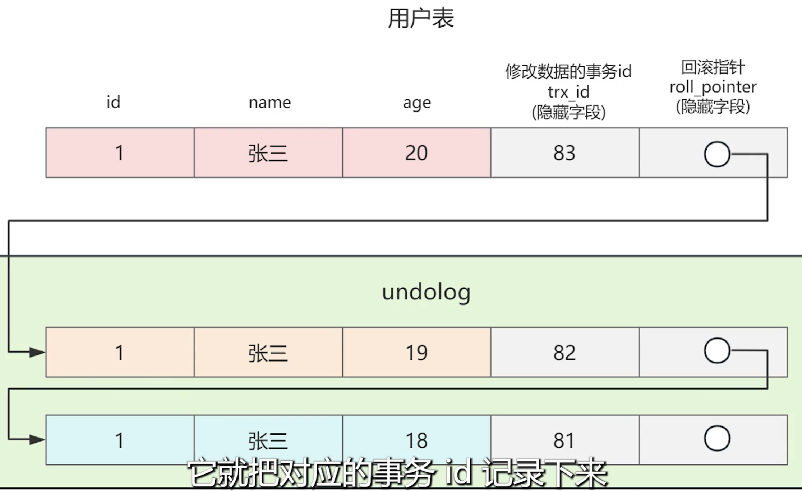
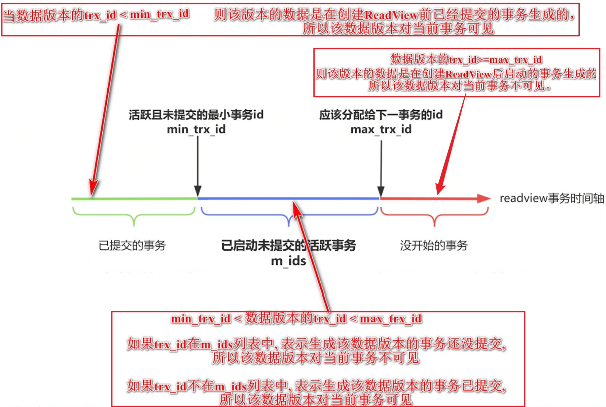

## [MVCC](https://v.douyin.com/-0VnMTZPIoM/)

### MVCC 核心原理与隔离级别实现

#### 一、MVCC 核心问题拆解

要搞懂 MVCC，无非就是要搞懂下面几个问题：

- 用来解决什么问题的？
- undo log 版本链
- readview 是怎么回事？
- 四种隔离级别是怎么实现的？
- 什么是当前读、什么是快照读？
- 可重复读的隔离级别，怎么去避免幻读问题？但如果不能避免，那举出反例。针对这种极端情况下的换毒场景，应该如何处理？

#### 二、MVCC 核心实现原理

### 0. 总结

- 每次修改数据，就记录修改的事务id到到隐藏字段，然后生成数据版本记录到`undo log`版本链当中，回滚指针指向版本链，通过对比redo view和数据版本的事务id，就能知道某个版本的数据对当前事务是否可见
- 一句话：**undo log记录数据版本**，**read view去判断这个数据版本对当前事务的可见性**

### 1. 数据版本管理

- 每个事务修改一次，就得生成一个新的版本，让不同的事务去读不同的版本。

- 把修改的数据版本记录到一个 undo log 日志中，然后给表增加一个隐藏字段，叫回滚指针。

- 使用回滚指针，把历史版本串联成一个链表。这样你想读哪个历史版本，沿着链表一直找就可以了。

- > **图示**
  >
  > 

### 2. Read View 关键作用

- 每个事务分配一个事务 id。事务 id 自增分配，通过对比事务 id 的大小，我就只能知道哪个事务创建的比较早，哪个事务创建的比较晚。

- 记录哪些事务提交了，哪些事务没提交。然后让提交的比较早的事物，不要看到提交的比较晚的数据就可以了。

- 表中新增隐藏字段，谁修改，它就把对应的事务 id 记录下来。

- `Read view` 本质就是描绘了创建当前事务时，各种`事务 id` 的一个数轴。通过对比数据版本的`trx_id`，在数轴的哪个位置，就能知道数据版本对当前事务是否是可见的。

- > **图示**
  >
  > 

#### 三、隔离级别实现机制

### 1. 读未提交（Read Uncommitted）

- 不用实现，根本就不用你管

  多个并发事务同时执行，它天然就是读未提交。

### 2. 读已提交（Read Committed）

- 每次 SELECT 生成新的 read view。
- 让事务去读已经提交的数据版本，这样就能避免脏读了。

### 3. 可重复读（Repeatable Read）

- 首次 SELECT 生成 read view 后复用。
- 通过 MVCC 机制保证每次读取同一批数据版本。
- 通过临键锁（Next-Key Lock）解决幻读问题。

### 4. 串行化（Serializable）

- 通过加锁实现事务串行执行。

#### 四、幻读问题处理方案

### 0.总结

- 在可重复的隔离级别下，通过MVCC快照读，再加上当前读加锁的方式，从而**避免大多数幻读问题**

### 1. 快照读（Snapshot Read）

- 普通 SELECT 操作通过 MVCC 读取历史版本。
- 无法感知其他事务新增数据，避免幻读。

### 2. 当前读（Current Read）

- 执行 SELECT FOR UPDATE / select … lock in share mode / INSERT / DELETE / UPDATE 时,必须要读到最新的数据，就是当前读
- 执行当前读，MySQL会加临键锁（Next-Key Lock），去锁定数据及数据之间的间隙。
- 阻止其他事务插入数据，避免幻读。
