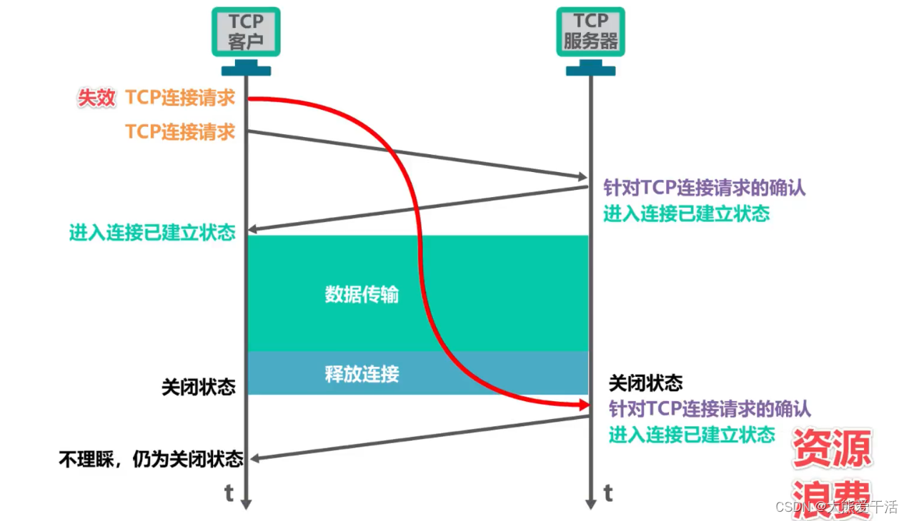
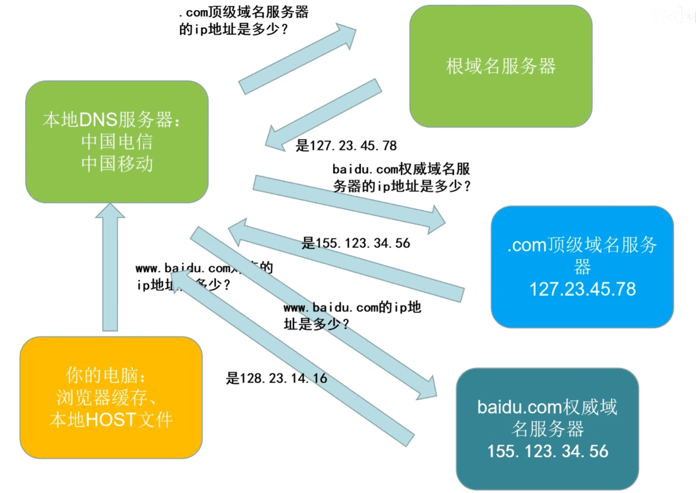

### TCP用3次握手建立连接的过程

1. **起初**客户端处于**关闭状态**，服务器处于**监听状态**
2. **第一次握手：**客户端主动发送建立连接的请求报文，进入同步已发送状态
   - 其中主要的字段为`SYN=1，seq=x....`等

3. **第二次握手：**服务器接收到报文后，如果**同意建立连接**，则**发送TCP连接请求的确认报文**，然后**进入同步已接收状态**
   - 其主要字段`SYN=1，ACK=1，seq=y，ack=x+1...`等

4. **第三次握手：**客户端接收到服务器的确认报文后，**给服务器再次发送确认报文**，然后**进入连接已建立状态**
   - 其中主要字段为`ACK=1，seq=x+1，ack=y+1...`

5. **服务器接收到来自客户端的报文**后，**也进入连接已建立**状态。至此连接建立成功，就可以进行数据传输了！
- 其中SYN=1表示这是一个**同步报文**；ACK=1表示这是一个**确认报文**；seq表示**数据序号**；ack表示对接收到报文序号**seq的确认**
  
- 对于**SYN=1**的报文，TCP规定其**不能携带数据**但**消耗一个序号**，也即**下一个报文seq要加1**
  
- 对于**SYN=0**的普通报文如果**不携带数据**，就**不消耗序号**

> **注意：TCP客户端主动建立连接，TCP服务端等待连接**
>
> 

### 可不可以将3次握手修改为2次握手？这么做是为了什么？

**不可以！**

1. 2次握手时，假设客户端的**TCP连接请求在网络中滞留导致客户端重发**，若当该连接通信成功后结束时第一次的TCP连接请求才到达服务器，此时服务器会认为这是一次新的请求。
2. 然后同意建立连接，**直接进入连接已建立状态，然后给客户端回复确认请求**。
3. 客户端此时仍处于关闭状态，不会理睬该报文，这将**导致服务器一直处于等待客户端传输数据的状态**，白白浪费资源

> 

### DNS解析过程

​	
